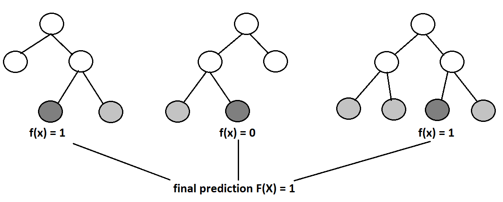
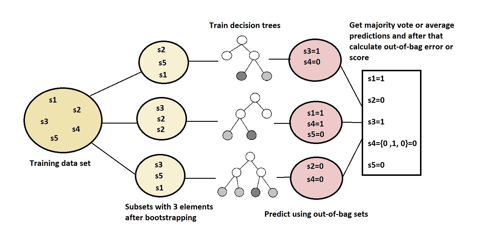

# [随机森林中的袋外误差](https://www.baeldung.com/cs/random-forests-out-of-bag-error)

1. 简介

    在本教程中，我们将探讨最流行的机器学习算法之一-随机森林以及袋外误差的含义。

    此外，我们还将简要解释一些与随机森林相关的术语，如决策树、套袋和引导。

2. 随机森林

    随机森林是一种用于分类和回归的集合学习方法。它依靠一组决策树来创建多样化的预测模型。这种算法是当今最流行的机器学习算法之一，因为它具有强大的准确性、快速的训练时间和易于解释的特点。

    首先，随机森林使用一种称为 "袋装" 的集合技术。袋集是一种在噪声数据集上训练模型时减少方差的技术，方法是创建多个模型，使每个模型都能补偿其他模型的误差。从根本上说，这意味着随机森林是由许多决策树构建而成的，而最终预测结果是以决策树的多数票或平均预测结果来计算的：

    

    随机森林利用了另一种引人注目的技术-引导。这是一种统计方法，我们可以用它来减少机器学习算法的方差。简而言之，它利用原始数据集，为每棵决策树创建一个子集。而且，这种方法会随机抽样子集，并可能进行替换。这意味着，我们可以多次选择一个样本或值。

    最后，为了推广这一方法，随机森林限制了用于构建决策树的变量数量。当我们想拆分决策树的节点时，它只考虑随机选择的变量（特征）子集。在名为 sci-kit-learn 的流行机器学习库中，随机森林的这个超参数被称为 "max_features"。通常，最佳做法是将其设置为

    - $k=\sqrt{n}$用于分类
    - 对于回归，$k = \frac{n}{3}$

    其中，n 是变量总数，k 是为特定节点拆分随机选择的变量数。

3. 随机森林中的袋外误差

    一般来说，在机器学习和数据科学中，创建一个可信赖的系统至关重要，它将能很好地处理新的、未见过的数据。总的来说，有很多不同的方法和途径可以实现这种泛化。袋外误差就是验证机器学习模型的方法之一。

    1. 定义

        这种方法在随机森林中使用了引导法（bootstrapping）。由于自举法对数据进行采样时，有可能多次选取一个样本，因此我们很可能无法从原始数据集中选取所有样本。因此，一个明智的决定是以某种方式利用这些未被选中的样本，即 "袋外样本"（out-of-bag samples）。

        相应地，在这些样本上取得的误差也被称为袋外误差。我们可以为每棵决策树使用袋外样本来衡量其性能。与其他验证技术（如训练-测试分割或交叉验证）相比，这种策略能提供可靠的结果。

    2. 袋外样本的概率

        从理论上讲，由于数据集和抽样次数都相当大，预计会有 36% 的训练集计算出袋外误差。为了证明这一点，假设我们的训练集有 n 个样本。那么，从训练集中选择一个特定样本的概率为 $\frac{1}{n}$。

        同样，不选择一个特定样本的概率是 $1-\frac{1}{n}$。由于我们是以替换的方式选择引导样本的，所以一个特定样本不被选中 n 次的概率等于 $(1-\frac{1}{n})^{n}$ 。现在，如果 n 非常大或趋于无穷大，我们就会得到下面的极限：

        (1) $$\begin{align*} \lim_{n \to \infty}(1-\frac{1}{n})^{n} = \lim_{n \to \infty}(1+\frac{-1}{n})^{n} = e^{-1} \approx 0.36 \end{align*}$$

    3. 伪代码

        因此，我们可以用下面的伪代码来描述整个过程：

        

        毕竟，更直观地说，我们可以用下面的图片来展示整个过程：

        

4. 结论

    在本文中，我们介绍了一种测量随机森林模型误差的有效方法。出袋法在许多论文中都进行了经验测试，它提供的模型性能测量结果与测试集大致相同。此外，这种方法可能比简单的训练-测试验证更方便，因为我们不需要将数据分为训练和测试。

    这样，对于较小的数据集，机器学习算法将有更多的数据用于训练。
