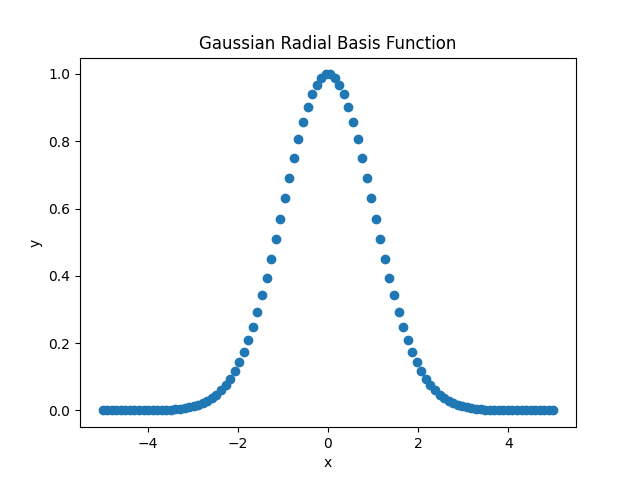
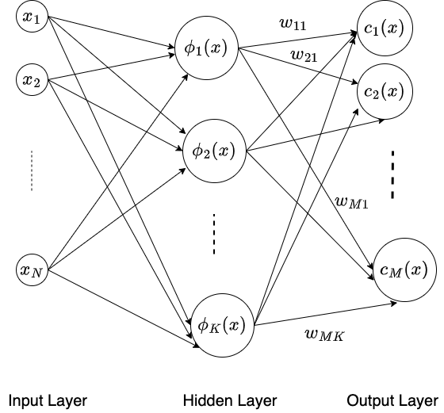

# 径向基函数

[机器学习](https://www.baeldung.com/cs/category/ai/ml)

[神经网络](https://www.baeldung.com/cs/tag/neural-networks) [训练](https://www.baeldung.com/cs/tag/training)

1. 简介

    在本教程中，我们将深入了解径向基函数（RBF）。

2. RBF

    在数学语境中，RBF 是一个实值函数，我们用它来计算变量与参考点之间的距离。在网络环境中，RBF 网络是一种人工神经网络，我们使用径向基函数作为神经元的激活函数。

    1. 定义

        RBF 是一个数学函数，例如 $\psi$，用于测量输入点（或矢量）x 与给定的感兴趣的固定点（或矢量）（中心或参考点）o 之间的距离 d。

        \[\psi(x) = d(||x-o||)\]

        这里，d 可以是任何距离函数，如欧氏距离。此外，函数 d() 取决于具体的应用和所需的属性集。对于向量，我们称之为 RBK（径向基核）函数。

        我们在数学、信号处理、计算机视觉和机器学习中使用 RBF。在这些领域中，我们使用径向函数来逼近那些缺乏闭合形式或过于复杂而无法求解的函数。在大多数情况下，这种近似函数是一种通用的神经网络。

    2. 类型

        RBF 测量给定数据点与约定参考点之间的相似性。然后，我们可以利用这个相似度得分来采取特定的行动，例如激活一个死亡的神经网络节点。在这里，相似度与数据点和参考点之间的距离直接相关。

        根据函数定义的不同，我们可以使用不同的 RBF。其中最常用的 RBF 是高斯 RBF。它的计算公式为：

        \[\psi(x)=exp(-\gamma||x-o||²)\]

        这里，参数 $\gamma$ 控制着高斯曲线的方差（扩散）。$\gamma$ 值越小，曲线越宽，而 $\gamma$ 值越大，曲线越窄：

        

        其他类型的 RBF 包括多四边形、反多四边形和薄板样条曲线。每种 RBF 都有自己的特点，适合特定的应用或任务。在神经网络领域，我们经常使用 RBF 作为网络隐层的激活函数。

        概括本节内容，RBF 代表一种基函数，用于测量输入数据与参考点之间的相似性，从而影响网络的输出。

3. RBF 神经网络架构

    在本节中，我们将探讨 RBF 神经网络。

    1. 直观理解

        径向基函数（RBF）网络是一种使用径向基函数作为激活函数的人工神经网络（ANN）。我们通常将 RBF 网络用于函数逼近、分类、时间序列预测和聚类任务。

    2. 网络结构

        现在，我们来介绍一下典型的 RBF 网络结构。

        RBF 网络由以下三层组成：

        - 输入层（通常为一层）
        - 隐藏层（严格来说只有一层）
        - 输出层（通常为一层）

        输入层接收输入数据。我们通常会对数据进行预处理、归一化和转换，以便网络能对其进行处理。接下来是隐藏层。这一层使用径向基函数作为激活函数。

        我们根据输入数据与其相关参考点之间的距离来计算该函数。

        隐藏层在处理来自输入层的输入向量时会产生一个信号。输出层接收该信号并进行最终计算，以产生所需的输出。因此，输出是针对特定任务的，[分类](https://www.baeldung.com/cs/k-means-for-classification)任务和[回归](https://www.baeldung.com/cs/linear-vs-logistic-regression)任务的输出是不同的。

    3. 模型

        现在，让我们来谈谈模型。

        我们在输入 X 上使用高斯 RBF，维数为 d=1：

        \[\phi(X)=exp(\frac{-||X-\mu||²}{\sigma^2})\]

        在这里，我们将整个特征向量空间划分为[高斯](https://www.baeldung.com/cs/gaussian-mixture-models)神经节点。接下来，每个节点接收一个输入向量，并产生一个信号，信号强度取决于其中心（参考点）与输入向量之间的距离。这里 $\mu$ 是神经元的中心，$\phi (X)$ 是[神经元](https://www.baeldung.com/cs/neural-networks-neurons)对输入 X 的响应：

        

        在上述 RBF 网络中，我们使用连接输入向量和隐藏神经元的权重来表示特定神经元的中心。此外，我们确定这些权重的方式是让隐藏神经元的感受野覆盖整个空间。这些都是通过训练以外的方式学习到的。我们通常使用对输入 X 的 K-means 聚类来确定隐藏神经元的权重（和中心）。

        另一方面，连接隐藏神经元和输出神经元的权重是通过训练网络确定的。

    4. 训练

        RBF 网络训练过程包括两个主要步骤：

        - 初始化网络
        - 应用梯度下降法学习模型参数（权重）

        初始化阶段包括对训练数据子集进行 K-means 聚类，以确定隐藏神经元的中心点。因此，我们在学习阶段使用梯度下降算法确定连接隐层和输出层的权重。此外，我们使用均方误差（MSE）损失来模拟模型输出与地面实况输出之间的误差。

        我们选择 $\sigma$ 使隐藏神经元的感受野覆盖输入向量 X 的整个域：

        \[\sigma = \frac{d}{\sqrt{2M}}\]

        在这个公式中，d 是两个隐藏神经元之间的最大距离，M 是隐藏神经元的总数。

4. RBF 与 MLP

    这两种类型的神经网络都属于前馈网络（FFN），但我们将它们用于不同的用例。

    1. MLP

        与 RBF 网络一样，多层感知器（[MLP](https://www.baeldung.com/cs/mlp-vs-dnn)）也是一种人工神经网络。更详细地说，它是一个至少有三层的全连接神经网络。第一层是输入层。接着是一个或多个隐藏层，最后是输出层。

        在内部，每个 MLP 神经元使用输入信号和连接权重之间的点积。然后，它应用 [sigmoid](https://www.baeldung.com/cs/sigmoid-vs-tanh-functions) 或 [ReLU](https://www.baeldung.com/cs/relu-vs-leakyrelu-vs-prelu) 激活函数生成响应。此外，MLP 网络通过反向传播对网络中的所有层进行训练。我们通常使用 MLP 和其他正则化技术（丢弃、批量归一化）来为高度复杂的任务建模。

    2. MLP 使用案例

        在底层特征集深深嵌入高维数据集的情况下，MLP 比 RBF 更胜一筹。

        例如，考虑图像分类任务。在这里，描述图像关键信息的特征图隐藏在数以万计的像素中。因此，这个网络需要训练，以便在图像通过网络时过滤掉所有冗余特征。因此，我们需要在 MLP 中堆叠隐藏层，以获得更好的性能。

        不过，这种网络的主要缺点是收敛时间较长，需要大量的计算和存储资源。

    3. RBF 用例

        另一方面，RBF 只有一个隐藏层。因此，它们的收敛速度比 MLP 快得多。这使得它们成为处理低维数据集的理想选择，因为我们不需要深度特征提取。此外，RBFs 很难逼近任何复杂函数，因为其闭合形式的计算非常繁琐。因此，在这种情况下，RBF 是一种稳健的学习模型。

5. 结论

    本文对 RBF 进行了研究。

    RBF 有几个优点。首先，它能以极高的精度逼近任何连续函数。其次，它的结构和训练过程都很简单。此外，它还能在相当高维的数据集上快速收敛。

    从阴影方面看，RBF 可能会出现过度拟合的问题。一个明显的缺点是，它对中心点的数量及其位置选择很敏感。

    RBF 网络为解决各种机器学习任务提供了一个灵活实用的框架。
