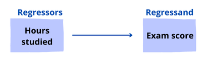

# 什么是回归器？

[机器学习](https://www.baeldung.com/cs/category/ai/ml)

[回归](https://www.baeldung.com/cs/tag/regression)

1. 概述

    在本教程中，我们将介绍回归器，并通过示例说明如何在不同的回归模型中解释回归器。此外，我们还将介绍什么是回归分析以及为什么需要它。

2. 回归因子

    回归因子是一个统计术语。它指的是回归模型中用于预测响应变量的任何变量。回归变量也被称为

    - 自变量 An independent variable
    - 解释变量 An explanatory variable
    - 预测变量 A predictor variable
    - 特征 A feature
    - 操纵变量 A manipulated variable

    我们使用所有这些术语，取决于我们工作的领域类型：机器学习、统计学、生物学和计量经济学。

3. 回归分析

    让我们来看看回归分析，以便更好地理解回归变量。

    回归分析允许我们根据一个或多个其他变量来推断或预测一个变量。比方说，我们想找出影响人们工资的因素：

    

    我们可以通过最高学历、每周工作时间和年龄来预测一个人的工资。我们要预测的变量称为因变量(dependent variable)、回归变量(regressand)或标准(criterion)变量。我们用于预测的变量称为回归变量(regressors)、自变量或预测因子(predictors)。

    回归分析可用于实现两个目标。让我们来看看这些目标。

    1. 测量变量的影响

        因此，第一个目标是测量一个或多个变量对另一个变量的影响：

        - 例 1：是什么影响了儿童集中注意力的能力？
        - 例 2：父母的教育水平和居住地是否会影响子女未来的教育程度

    2. 变量预测

        第二个目标是通过一个或多个其他变量来预测一个变量：

        - 例 1：一个病人在医院住了多长时间
        - 例 2：一个人最有可能从网上商店购买什么产品

4. 回归模型中的回归因子

    要构建回归模型，我们需要了解回归因子的变化如何导致回归变量（或"响应变量(response variable)"）的变化。

    这些模型可以有一个或多个回归因子。因此，当只有一个回归因子时，模型被称为简单线性回归模型。当存在多个回归因子时，我们将模型称为[多元线性回归](https://www.statology.org/multiple-linear-regression/)模型，以表示存在多个回归因子。

    1. 只有一个回归因素的线性回归

        简单线性回归是一种线性方法，它在数据点内绘制一条直线，以尽量减小直线与数据点之间的误差。它是机器学习回归中最基本、最直接的类型之一。因此，回归器和回归子之间的关系被认为是线性的。让我们来看看简单的线性回归模型：

        \[Y_{i} = \beta_{0} + \beta_{1}{X_i} + \epsilon_{i}\]

        其中

        - {i}：指数{i}覆盖观测值，${i= 1, ...., n}$
        - ${Y_{i}}$：回归变量，或简称为左手变量
        - ${X_{i}}$：回归变量，或简称右侧变量
        - ${Y=\beta_{0}+\beta_{1}{X}}$：人口回归线(population regression line)，也称为人口回归函数
        - ${\beta_{0}}$：群体的截距(intercept)
        - ${\beta_{1}}$：群体的斜率(slope)
        - ${\epsilon_{i}}$：误差项

        这种方法简单明了，因为它用于研究一个回归因子与回归子之间的关系。下图表示线性回归如何近似地表示{X}轴上的回归因子与{Y}轴上的回归子之间的关系：

        

    2. 例 1：考试成绩

        让我们来看看学习时数如何影响考试分数。因此，我们收集数据并建立回归模型：

        \[{\text{Exam Score} = 68.34 + 3.44 \times (\text{Hours Studied})}\]

        让我们来看看模型的分组表示：

        
        我们可以看到，我们的模型只有一个回归因子： $\text{Hours Studied}$。这个回归因子的系数表明，每增加一个 $\text{Hours Studied}$，$\text{Exam Score}$就会平均增加3.44分。

    3. 多重回归模型

        当有多个回归因子时，我们会使用多元线性回归方法。多项式回归就是多元线性回归方法的一个例子。因此，当涉及多个回归因子时，我们可以获得比简单线性回归更好的拟合效果。让我们来看看多元回归模型：

        \[{Y_{i} = \beta_{0} + \beta_{1}{X_{1i}} + \beta_{2}{X_{2i}}+ \beta_{3}{X_{3i}} + .... + \beta_{k}{X_{ki}} + \epsilon_{i}} \text{  , where i = 1, 2, ..., n}\]

        其中：

        - ${Y_{i}}$：回归因子中的第 ${i^th}$ 个观测值。${K}$回归因子的观测值用 ${X_{1i}, X_{2i}, ...., X_{ki}}$ 表示。
        - ${Y}$与回归因子之间的平均关系由population给出 \[{E(Y_{i}|X_{1i} = x_{1}, X_{2i} = x_{2}, X_{3i} = x_{3}, ...., X_{ki} = x_{k}) = \beta_{0} + \beta_{1}{x_{1}} + \beta_{2}{x_{2}}+ \beta_{3}{x_{3}} + .... + \beta_{k}{x_{k}}}\]
        - ${\beta_{0}}$：截距（是所有${X}$都等于${0}$时${Y}$的值）
        - ${\beta_{j} \text{  , where j=1, 2, ..., k}}$：${X_{j} \text{ , where j=1, 2, ..., k}}$上的系数 。${\beta_{1}}$计算在所有其他回归因子保持不变的情况下，${X_{1i}}$发生一个单位的变化所带来的${Y_{i}}$预期变化。
        - ${\epsilon_{i}}$：误差项

    4. 例 2：农作物产量

        让我们来看看哪些因素可能会影响农作物的总产量(Crop Yield)（以磅为单位）。因此，我们收集数据并建立回归模型：

        \[{\text{Crop Yield} = 154.34 + 3.56 \times (\text{Pounds of Fertilizer}) + 1.89 \times (\text{Pounds of Soil})}\]

        该模型有两个回归因子： 肥料和土壤。让我们来看看模型的分组表示：

        

        让我们来解释这两个回归因子：

        - 肥料：如果土壤量保持不变，每增加一磅肥料，作物产量平均增加 ${3.56}$ 磅
        - 土壤：如果化肥用量不变，每增加一磅土壤，作物产量平均增加 ${1.89}$ 磅

        下图展示了多元线性回归如何近似表示回归因子 ${肥料、土壤}$与回归系数 ${\text{Crop Yield}}$之间的关系：

        

5. 应用

    在机器学习中，训练回归模型是为了理解各种回归因子与回归子之间的关系。因此，模型可以理解可能导致所需回归结果的多个因素。

    让我们来看看机器学习回归模型的一些应用：

    - 预测连续结果，如销售额、股票价格或房价
    - 分析数据集，建立回归因子与回归子之间的关系
    - 预测用户趋势，如电子商务网站的用户趋势
    - 预测未来的零售业绩，确保资源得到有效利用
    - 创建时间序列可视化
6. 结论

    在本文中，我们探讨了回归器和回归带这两个术语。我们还介绍了回归分析及其类型。然后，我们用实例来揭示它们的机制。

[What Is a Regressor?](https://www.baeldung.com/cs/regressor)
