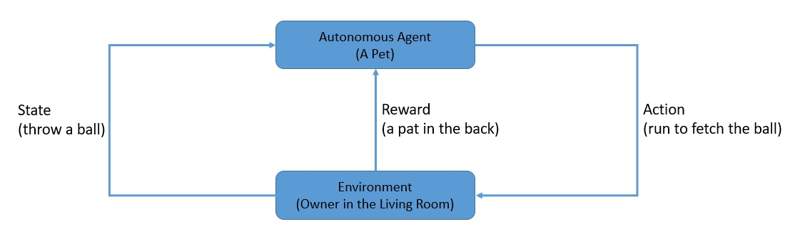
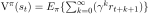
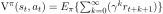
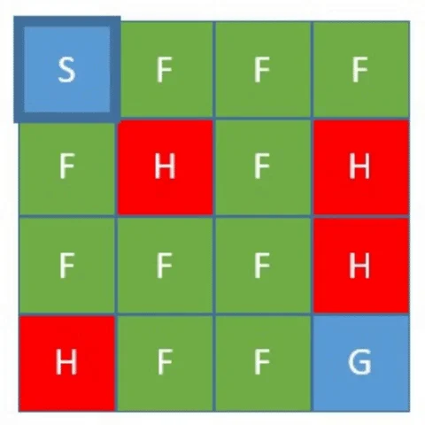
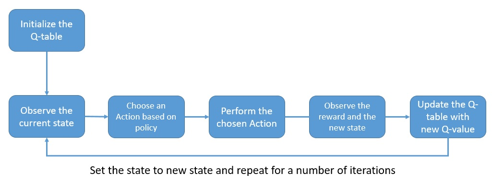
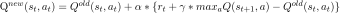
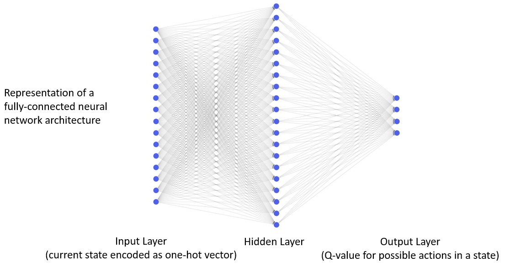
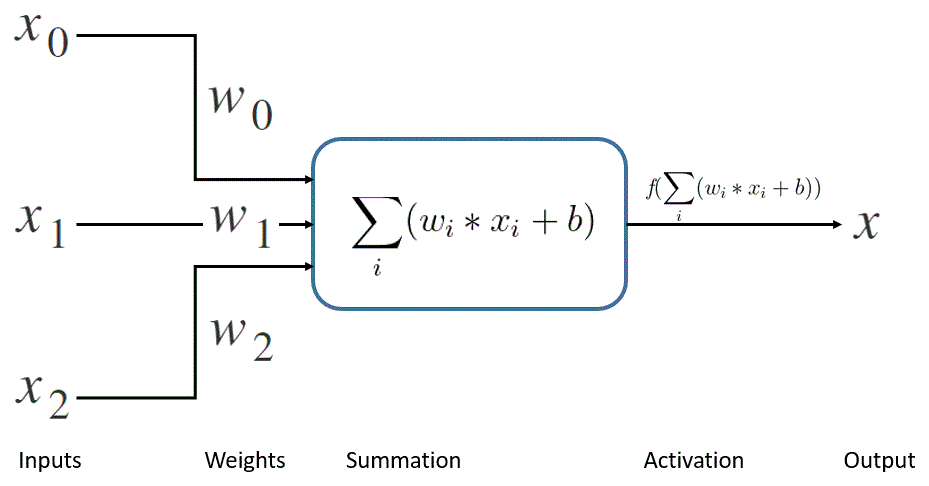
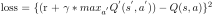

# [利用神经网络进行强化学习](https://www.baeldung.com/cs/reinforcement-learning-neural-network)

[机器学习](https://www.baeldung.com/cs/category/ai/ml)

[神经网络](https://www.baeldung.com/cs/tag/neural-networks) [强化学习](https://www.baeldung.com/cs/tag/reinforcement-learning)

1. 简介

    在本教程中，我们将探讨强化学习的基础知识以及如何在其中使用神经网络。此外，我们还将开发一个小型应用程序，以了解基本概念。

2. 一些基础知识

    在开始之前，我们先来了解一下强化学习和神经网络的含义。

    1. 机器学习和强化学习

        机器学习指的是一类有望根据经验自动改进的算法。更广泛地说，机器学习是人工智能的一部分，而人工智能是对智能代理的研究，[创立于1956年](https://en.wikipedia.org/wiki/Dartmouth_workshop)。

        根据算法随时间学习的反馈，我们可以将机器学习大致分为三类：

        - 监督学习： 有监督学习的目标是学习一个能将输入映射到输出的函数，利用一组标注的训练数据。
        - 无监督学习： 与此相反，无监督学习是通过探索数据中未检测到的模式，而无需任何预先存在的标签。
        - 强化学习： 最后，强化学习的目标是通过在环境中采取行动，在探索和利用之间取得平衡，从而使累积奖励最大化。
    2. 神经网络和深度学习

        现在，让我们来了解一下神经网络的含义。我们经常使用神经网络作为解决机器学习问题的一种技术，就像监督学习一样。

        神经网络由许多简单的处理节点组成，这些节点相互连接，松散地基于人脑的工作方式。我们通常将这些节点分层排列，并为它们之间的连接分配权重。我们的目标是通过网络中训练数据的前馈和后向传播的多次迭代来学习这些权重。

        那么，什么是深度学习，它与神经网络有什么关系呢？我们现在知道，神经网络由按层排列的处理节点组成。一个网络可以从几个节点和几层发展到由数百万个节点组成的数千层网络。

        我们通常构建这些网络来解决复杂的问题，并将其归类为深度学习。当我们在强化学习中应用深度学习时，我们通常称之为深度强化学习。

3. 强化学习入门

    强化学习是指一个自主代理在特定环境中采取适当行动，以获得最大回报。随着时间的推移，代理会从自己的经验中学习，并尝试采取最佳行为。

    在强化学习中，我们将人与人之间的互动限制在改变环境状态和奖惩制度上。这种设置被称为马尔可夫决策过程（[Markov Decision Process](https://www.cs.rice.edu/~vardi/dag01/givan1.pdf)）。

    1. 举例说明

        为了更好地理解这一点，让我们以训练宠物为例。我们可以将宠物视为一个自主代理。如果我们试图在客厅里训练宠物，那么客厅就可以被视为环境：

        
        我们可以扔一个球，让宠物跑过去捡球。在这里，扔球代表了环境呈现的一种状态，而跑去捡球则代表了宠物可能采取的一种行动。最后，我们可以拍拍宠物的背作为奖励，也可以不理它作为惩罚。

        我们可以立即给予奖励，也可以将奖励延迟到未来的某个时间点。当然，未来的奖励在当前往往价值较低，因此会打折扣。

    2. 环境类型

        强化学习主要包括两种环境：

        - 确定型：这是指状态转换模型和奖励模型都是确定函数的情况。简单地说，如果代理在某一特定状态下重复某一动作，它就能期望得到相同的奖励和下一状态。
        - 随机：随机指的是发生概率是随机的。在这种环境下，如果一个代理在某一状态下重复采取行动，就不能保证他们会得到相同的奖励或下一个状态。
    3. 强化学习的类型

        强化学习一般有两种类型：

        - 基于模型的： 在基于模型的算法中，代理利用经验构建环境中的过渡和直接结果的内部模型，并参考该模型选择适当的行动。代理可以从外部接收状态转换和奖励概率函数。
        -无模型算法：与之相反，在无模型算法中，代理利用经验直接学习策略或价值函数，而不使用环境模型。在这里，代理只知道环境中可能出现的状态和行动，而不知道状态转换和奖励概率函数。
    4. 价值函数和策略

        奖励是指代理在给定状态下采取的行动从环境中得到的即时反馈。此外，在与环境的交互过程中，代理会在不连续的时间步骤中获得一系列奖励。

        强化学习的目标就是最大化这种累积奖励，也就是我们常说的价值。[代理遵循的策略被称为策略](https://www.baeldung.com/cs/ml-policy-reinforcement-learning)，而使价值最大化的策略被称为最优策略。

        从形式上看，强化学习中的价值概念是一个价值函数：

        

        在这里，该函数考虑了在给定策略下，从某一状态开始的未来奖励折现。我们也将其称为该策略的状态价值函数。右边的方程就是我们所说的[贝尔曼方程](https://en.wikipedia.org/wiki/Bellman_equation)，它与动态程序设计中的最优条件有关。

    5. Q 值和 Q 学习

        Q 值是对处于某种状态的代理在某种政策下的长期收益的衡量，但它也考虑了代理在该状态下采取的行动。其基本思想是捕捉在不同状态下采取相同行动会带来不同回报的事实：

        

        在这里，函数创建了一个状态和行动对与奖励的映射。我们也将其称为策略的行动值函数。

        Q值是我们在Q-learning（Q-learning无模型强化学习的主要方法之一）中使用的一种衡量标准。Q-learning 强调的是在一个策略下，一个给定的行动对获得某个状态下的未来奖励有多大作用。

4. 实施强化学习

    既然我们已经介绍了足够多的基础知识，那么我们应该可以尝试实施强化学习了。在本教程中，我们将使用 q-learning 算法。

    1. 测试环境

        [OpenAI](https://openai.com/) 是一家为人工智能的标准化和广泛应用开发了多种工具和技术的公司。[gym](https://www.gymlibrary.dev/)是 OpenAI 的一个工具包，可以帮助我们评估和比较强化学习算法。

        从根本上说，gym是一系列测试环境的集合，具有用 Python 编写的共享界面。我们可以将这些环境视为一个游戏，例如 [FrozenLake 环境](https://www.gymlibrary.dev/environments/toy_text/frozen_lake/#frozen-lake)。冰冻湖是一个简单的游戏，控制代理在网格世界中的移动：

        

        游戏规则如下：

        - 网格由 16 块 4×4 的瓷砖组成
        - 有一个起始方格（S）和一个目标方格（G）
        - 有些方格可以行走（F），有些方格可以杀死代理（H）
        - 代理的移动在很大程度上是不可控的
        - 找到一条从起点瓦片到目标瓦片的可行走路径，代理将获得奖励

        我们将利用这个环境来测试我们在后续章节中将要开发的强化学习算法。
    2. Q 学习过程

        在开始实施 Q 学习算法之前，我们有必要了解一下典型的 Q 学习过程：

        
        q 值在一个 q 表中存储和更新，该表的维度与环境中行动和状态的数量相匹配。在流程开始时，该表的初始化值为零。

        从上图可以看出，q-learning（q-学习）流程的第一步是通过查询 q 表来选择行动。在执行选定的行动时，我们会从环境中获得奖励，并用新的 q 值更新 q 表。如此反复几次，就能得到一个合理的 q 表。

    3. 选择行动

        我们在前面已经看到，当进程开始时，q 表中的值都是零。因此，代理选择的行动不能基于 q 表，而必须是随机的。然而，随着 q 表开始更新，代理会根据某个状态的最大 q 值来选择行动。

        这就有可能使代理重复某些并非最佳的初始决策。从本质上讲，代理过早地从探索环境转向利用环境。因此，有必要引入一种称为 $\epsilon - greedy$ 的行动选择策略。

        在这里，我们对一个随机数进行采样，如果它恰好小于 \epsilon，则随机选择行动。这允许代理进行随机探索，尤其是在初始迭代中，这可能非常有用。当然，随着学习的成熟，我们会慢慢减弱这个参数的影响，使其偏向于利用。

    4. 更新 Q 值

        我们已经看到 Q 值的计算遵循贝尔曼方程，但它到底是如何工作的呢？让我们来更好地理解这个方程的各个部分：

        

        基本上，我们要不断为状态和行动对的当前 q 值添加时间差。这里有两个重要参数，我们必须明智选择：

        - 学习速度(Learning rate)： 这是一个参数，我们可以用它来控制算法的学习速度。我们将其设置在 o 和 1 之间，有效值为 0，即完全不学习。
        - 折扣系数(Discount factor)： 我们在前面已经看到，未来的奖励对现在的行动并不那么重要。我们使用折扣系数来模拟这种情况，折扣系数同样设置在 0 和 1 之间。
    5. 设置 Q 学习算法

        现在，让我们将迄今为止讨论过的所有步骤以程序的形式呈现出来，以完成 Q-learning 算法。我们将使用 Python 开发一个基本示例进行演示，这主要是因为 Python 拥有丰富的数据处理和机器学习库生态系统。

        首先，我们将进行必要的导入：

        ```py
        import gym
        import numpy as np
        ```

        接下来，让我们获取之前讨论过的测试环境 FrozenLake：

        `env = gym.make('FrozenLake-v0')`
        现在，我们需要设置一些学习参数，如折扣系数、ϵ 值及其衰减参数、学习率和运行集数：

        ```python
        discount_factor = 0.95
        eps = 0.5
        eps_decay_factor = 0.999
        learning_rate = 0.8
        num_episodes = 500
        ```

        我们在这里选择的值是根据经验得出的，必须作为超参数进行调整。最后，我们需要初始化 q 表：

        `q_table = np.zeros([env.observation_space.n,env.action_space.n])`
    6. 执行 Q 学习算法

        现在，我们可以开始让代理在选定的环境中进行学习了：

        ```python
        for i in range(num_episodes):
            state = env.reset()
            eps *= eps_decay_factor
            done = False
            while not done:
                if np.random.random() < eps or np.sum(q_table[state, :]) == 0:
                    action = np.random.randint(0, env.action_space.n)
                else:
                    action = np.argmax(q_table[state, :])
                new_state, reward, done,_ = env.step(action)
                q_table[state, action] +=
                reward +
                    learning_rate*
                    (discount_factor * np.max(q_table[new_state, :]) - q_table[state, action])
                state = new_state
        ```

        让我们来了解一下这段代码中发生了什么：

        - 我们正在循环选择迭代次数，并通过衰减参数减少ϵ值。
        - 在每一次迭代中，我们都会步进直到游戏结束（我们也可以选择步进固定次数）。
        - 我们按照 $\epsilon - greedy$ 行动选择策略选择随机行动或 q 表建议的行动
        - 我们采取行动并从环境中获得奖励和新状态
        - 最重要的是，我们使用贝尔曼方程更新 q 表中当前状态和所选行动的 q 值
        - 最后，我们将状态设置为从环境中接收到的新状态，并重复上述步骤
        按照上述算法操作足够多的次数后，我们就会得到一个 q 表，它能相当高效地预测游戏中的行动。这就是 q-learning 算法的目标，即通过每一步的反馈循环来丰富经验并从中受益。

5. 神经网络强化学习

    虽然在简单的环境中创建和使用 q 表是可行的，但在现实生活中的一些环境中却相当困难。现实环境中的动作和状态可能多达数千种，因此在表格中管理 q 值的效率极低。

    这时，我们可以使用神经网络来预测给定状态下行动的 q 值，而不是使用表格。在 q 学习过程中，我们将初始化和训练一个神经网络模型，而不是初始化和更新一个 q 表。

    1. 选择神经网络架构

        正如我们已经讨论过的，神经网络由多个处理节点组成，这些节点通常密集连接在多个层中。

        这些层包括以下部分：

        - 输入层： 输入层的节点数通常是固定的，与输入数据相对应，例如环境中的状态数。
        - 隐藏层： 神经网络架构中通常有一个或多个隐藏层。每一层的层数和节点数都是架构的超参数。
        - 输出层： 最后，输出层也有固定数量的节点，这些节点与所需的输出相对应，例如，环境中行动的数量。
        让我们来看一个简单的神经网络架构，用于我们之前在 q-learning 算法中使用的测试环境：

        
        输入层有 16 个节点，与环境中的状态数相对应。输入层接收单次编码的状态-输入向量。有一个由 20 个节点组成的全连接隐藏层。最后是一个由 4 个节点组成的输出层，与环境中的动作数量相对应。

    2. 选择激活函数

        神经网络中的处理节点根据从前面节点接收到的输入、权重和学习到的偏置来生成输出：

        
        正如我们在上面的处理节点中看到的，它也使用了激活函数。之所以必须使用激活函数，最重要的原因之一是它为输出提供了非线性，否则输出将是相当线性的。这种非线性使神经网络能够学习复杂的现实世界模式。

        神经网络中激活函数的选择是一个优化问题，因此属于超参数列表。不过，输入数据的性质和我们期望的输出可以帮助我们有一个良好的开端。我们将在隐层使用整流线性单元（ReLU）作为激活函数，在输出层使用线性激活函数。

    3. 损失函数和优化器

        神经网络通过迭代更新模型的权重和偏置来减少预测误差。因此，我们必须能够计算出模型在任何时间点的误差。损失函数使我们能够做到这一点。通常，我们会在神经网络模型中使用交叉熵(cross-entropy)和均方误差(mean-squared-error)等损失函数。

        均方误差损失函数测量的是预测值与目标值之差的平方值：

        

        计算损失函数的直观方法是通过网络向后获取反馈并更新权重。我们称之为反向传播，可以使用多种算法来实现，首先是经典的随机梯度下降算法。有些算法的计算效率更高，对内存的要求更低，比如 Adam（源自自适应矩估计(derived from Adaptive Moment Estimation)）。我们将在算法模型中使用这种算法。

    4. 使用神经网络设置 Q-learning

        [Keras](https://keras.io/) 是一个更高级的库，可在 [Tensorflow](https://www.tensorflow.org/) 或 [Theano](https://pypi.org/project/Theano/) 等数据流计算库上运行。我们将使用 Keras 与神经网络一起构建 Q-learning 算法。

        q-learning 算法的整体结构将与我们之前实现的算法保持一致。关键的变化在于使用神经网络模型而不是 q 表，以及我们如何每一步更新它。

        首先，让我们导入必要的例程：

        ```py
        import gym
        import numpy as np
        from keras.models import Sequential
        from keras.layers import InputLayer
        from keras.layers import Dense
        ```

        然后，我们将获得用于运行算法的测试环境 FrozenLake：

        `env = gym.make('FrozenLake-v0')`
        接下来，我们将使用合理的默认值设置一些必要的超参数：

        ```py
        discount_factor = 0.95
        eps = 0.5
        eps_decay_factor = 0.999
        num_episodes=500
        ```

        这里没有什么新内容；不过，下一步是在 Keras 中建立神经网络模型。我们还可以欣赏到 Keras 是如何简单地定义这样一个复杂模型的：

        ```py
        model = Sequential()
        model.add(InputLayer(batch_input_shape=(1, env.observation_space.n)))
        model.add(Dense(20, activation='relu'))
        model.add(Dense(env.action_space.n, activation='linear'))
        model.compile(loss='mse', optimizer='adam', metrics=['mae'])
        ```

        这正是我们之前讨论过的为此类工作选择神经网络架构。值得注意的是，我们使用了 Keras 类 Sequential，它允许我们在模型中一个接一个地堆叠层。

    5. 使用神经网络执行 Q-learning

        现在，我们已经完成了所有必要的设置，可以使用神经网络实现 Q-learning 算法了：

        ```py
        for i in range(num_episodes):
            state = env.reset()
            eps *= eps_decay_factor
            done = False
            while not done:
                if np.random.random() < eps:
                    action = np.random.randint(0, env.action_space.n)
                else:
                    action = np.argmax(
                    model.predict(np.identity(env.observation_space.n)[state:state + 1]))
                new_state, reward, done, _ = env.step(action)
                target = reward + 
                discount_factor * 
                    np.max(
                    model.predict(
                        np.identity(env.observation_space.n)[new_state:new_state + 1]))
                target_vector = model.predict(
                np.identity(env.observation_space.n)[state:state + 1])[0]
                target_vector[action] = target
                model.fit(
                np.identity(env.observation_space.n)[state:state + 1], 
                target_vec.reshape(-1, env.action_space.n), 
                epochs=1, verbose=0)
                state = new_state
        ```

        该算法与我们之前实现的算法非常相似；因此，我们只讨论神经网络带来的显著变化：

        - 请注意，我们选择行动的依据是之前的 \epsilon - greedy，但使用的是神经网络模型的预测。
        - 我们根据贝尔曼方程，利用模型对新状态的预测来计算目标值。
        - 最后，我们使用单次编码的当前状态和转换为向量的目标值，对模型进行单步训练。
        如果我们运行这种算法的迭代次数足够多，我们就能得到一个神经网络模型，它能更准确地预测游戏中给定状态下的行动。当然，神经网络模型识别复杂模式的能力要比简单的 q 表强得多。

6. 结论

    在本文中，我们讨论了强化学习的基础知识。我们特别详细地探讨了 q 学习算法。

    最后，我们探讨了神经网络及其在强化学习中的优势。
