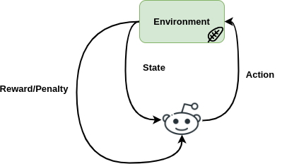
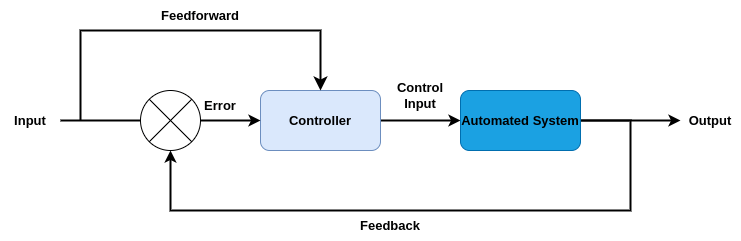

# 强化学习与最优控制的区别

[强化学习](https://www.baeldung.com/cs/tag/reinforcement-learning)

1. 简介

    在本教程中，我们将介绍用于动态系统决策的两种方法：强化学习（[RL](https://www.baeldung.com/cs/reinforcement-learning-neural-network)）和[最优控制](https://en.wikipedia.org/wiki/Optimal_control)。我们将介绍这两种方法，并分析它们的主要区别和用途。

2. 强化学习

    RL 是约翰-冯-诺依曼（[John von Neumann](https://en.wikipedia.org/wiki/John_von_Neumann)）和奥斯卡-摩根斯特恩（[Oskar Morgenstern](https://en.wikipedia.org/wiki/Oskar_Morgenstern)）于 20 世纪 50 年代在《博弈论与经济行为》（[The Theory of Games and Economic Behavior](https://en.wikipedia.org/wiki/Theory_of_Games_and_Economic_Behavior)）一文中首次提出的一种决策数学框架。

    在机器学习中，RL 学习通过让某些代理对某个概念做出决策来训练它们。然后，根据它们做出的决定，它们要么得到奖励，要么面临已定义的惩罚后果。

    因此，这些代理在特定的环境中就某个问题做出决策，采取行动，然后接收反馈以改进下一步行动的决策，并使累积奖励最大化。因此，强化学习是一种试错互动游戏，代理的目标是学习一种[策略](https://www.baeldung.com/cs/ml-policy-reinforcement-learning)，按照策略行事，并尝试根据自己的行动找到该策略的最优解：

    

    1. 数学方法

        强化学习问题可以形式化为马尔可夫决策过程（Markov Decision Process，[MDP](https://www.baeldung.com/cs/mdp-value-iteration)）。

        MDP 由一组状态 S、一组行动 A 和一个过渡函数 $T(s'|s,a)$ 定义，$T(s'|s,a)$ 定义了在状态 s 中采取行动 a 时过渡到新状态 $s'$ 的概率，还包括一个奖励函数 $R(s,a)$ ，它给出了在状态 s 中采取行动 a 的奖励。

        价值函数 $V_{\pi}(s)$ 被定义为从状态 s 开始并遵循策略 $\pi$ 的预期累积奖励：

        (1) \[\begin{equation*}\begin{aligned} V_{\pi}(s) = \mathbb{E}[R(s, \pi(s)) + \gamma  \cdot  \sum s'\in S \cdot T(s'|s, π(s)) \cdot V_{\pi}(s')] \end{aligned} \end{equation*}\]

        其中 $\gamma$ 是贴现因子，用于控制当前和未来回报之间的权衡。

        RL 代理的目标是找到最优策略，最大化价值函数 $V_{\pi}(s)$。

        有几种算法可以用来找到最优策略。这些算法在估计价值函数和更新策略的方式上有所不同。RL 算法可分为三大类：[基于价值的方法](https://www.baeldung.com/cs/q-learning-vs-sarsa)、[基于策略的方法](https://www.baeldung.com/cs/ml-policy-reinforcement-learning)和[基于模型的方法](https://www.baeldung.com/cs/ai-model-free-vs-model-based)。

3. 最优控制

    另一方面，最优控制主要用于物理和工程系统设计，侧重于系统的效率。

    其目标是在固定时间内以最优方式为某个系统建立最佳策略模型。通常情况下，这种策略是使数学成本函数最小化，而数学成本函数通常与系统的性能有关。

    因此，整个系统是通过描述系统行为的数学方程来建模的。通常，这些方程会考虑输入、输出、时间、一般成本函数以及已知的特定约束条件。下面的框图有助于理解最优控制的基本概念：

    

    1. 数学方法

        常见的最优控制方法有动态编程 ([DP](https://www.baeldung.com/cs/greedy-approach-vs-dynamic-programming))、庞特里亚金最小原理 ([PMP](https://en.wikipedia.org/wiki/Pontryagin%27s_maximum_principle)) 和汉密尔顿-雅各比-贝尔曼 ([HJB](https://en.wikipedia.org/wiki/Hamilton–Jacobi–Bellman_equation)) 方程。

        DP 在状态数量有限且动态已知的情况下非常有用。它将优化控制问题划分为更小的子问题，并递归解决每个子问题。

        PMP 是另一种最优控制方法，它利用系统的[哈密顿](https://www.baeldung.com/cs/hamiltonian-vs-euler-path)来寻找最优控制输入。涉及连续状态和控制输入的问题最能从中受益。

        另一种最优控制算法是 HJB 方程，它利用偏微分方程来找到系统的值函数。HJB 也适用于具有连续状态和控制输入的问题。

4. 主要区别

    RL 和最优控制都侧重于在动态系统中做出最优决策，但在处理问题的方式上略有不同。

    首先，RL 使用的代理会学习一定的策略，将状态与行动联系起来，试图随着时间的推移增加总回报。如果这些代理做出错误决定，它们就会受到惩罚。

    另一方面，最优控制在数学上更加简单明了，因为它的目标是找到一个能使成本函数最小化的最优输入。此外，在最优控制中，初始、最终和成本函数都是已知的。

5. 应用

    RL 和最优控制都被应用于不同的实际应用和任务中。RL 主要应用于机器人和游戏领域。在机器人学中，RL 被用于训练机器人执行任务。在游戏中，RL 被用于训练代理玩象棋等游戏。

    最优控制可用于航空航天、汽车和电力系统。在航空航天和汽车领域，最优控制被用于控制系统和制导的设计。此外，为发电站和电网设计控制系统也被用于电力系统。

6. 结论

    在本教程中，我们介绍了 RL 和最优控制。特别是，我们介绍了这两种方法，讨论了它们的数学方法，并强调了它们的主要区别和应用。
