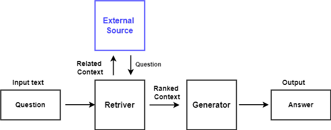

# 什么是检索增强世代（RAG）？

[机器学习](https://www.baeldung.com/cs/category/ai/ml)

[自然语言处理](https://www.baeldung.com/cs/tag/nlp)

1. 简介

    在本教程中，我们将探索检索增强生成（RAG）流程，并了解其工作原理。

2. 自然语言处理（NLP）概述

    自然语言处理（[NLP](https://www.baeldung.com/cs/natural-language-processing-understanding-generation)）作为人工智能的一个子集，可以帮助计算机掌握文本和语音的含义，包括意图、情感和上下文。它将语言分解为单词、短语和句子等组成部分，分析它们之间的关系。它可以创建类似人类的文本、翻译语言、撰写创意内容，以及非正式地回答问题。

    NLP 算法经过大量文本和语音数据的训练，能够掌握复杂的模式和语言规则。它们整合了语法、句法和语义学的见解，以理解语言结构和意义。

    NLP 研究可能会改变人们与计算机及其环境的交流方式，使之更加自然和直观。

3. 基于检索的模型和生成模型

    1. 基于检索的模型

        基于检索的模型是一类 NLP 模型，它通过从预先存在的应答库或知识库中选择和调整最相关的示例来生成应答。该知识库可以由预处理数据集组成，也可以从常见问题解答、客户支持日志或在线论坛等外部资源中提取。知识库中包含成对的输入查询及其相应的回复，用作模型的训练示例。

        这些模型通常用于问题解答系统、信息检索系统和[聊天机器人](https://www.baeldung.com/cs/smart-chatbots)等应用中，在这些应用中，基于用户查询的准确而相关的回复至关重要。对于相关信息已经存在于数据库或语料库中的任务，这些模型被证明是高效和有效的。

        基于检索的模型的一个例子是 OpenAI Generative Pre-Trained Transformer 3（[GPT-3](https://www.baeldung.com/cs/bert-vs-gpt-3-architecture)）模型。

    2. 生成模型

        [生成模型](https://www.baeldung.com/cs/applications-of-generative-models)旨在生成与训练数据相似的新数据样本。它从训练数据的结构中学习生成新样本，捕捉其基本特征，与基于检索的模型相比，需要更多的处理能力和训练时间。

        这些模型在图像生成、文本生成、语音合成和数据增强等多个领域都有大量应用。在生成能捕捉训练数据基本特征的新数据样本的任务中，生成模型起着至关重要的作用。

        常见的生成模型有生成对抗网络（[GANs](https://www.baeldung.com/cs/generative-adversarial-networks)）、变异自动编码器（[VAEs](https://www.baeldung.com/cs/vae-vs-gan-image-generation)）和自回归模型。

4. 什么是检索增强生成（RAG）？

    RAG 是自然语言处理（NLP）中的一种创新方法，它结合了基于检索的模型和生成模型的优势，以提高文本生成任务的准确性、相关性和可解释性。这种集成方法可促进对话式人工智能系统中的对话更加流畅、更加逼真，同时确保其准确性和相关性。

    在自然语言处理中使用 RAG 有几个好处，包括上下文相关性、提高内容质量、多样化回复、减少数据稀疏性和实时回复生成。这些优势使其成为广泛的 NLP 任务和应用的重要方法，提高了文本生成系统的质量和效率。

5. 架构

    RAG 的结构通常由两个主要部分组成：检索器和生成器。这些组件协同工作，将基于检索的方法和生成方法整合到问题解答和对话生成等 NLP 任务中。

    整个过程从初始输入开始，初始输入可以问题或提示的形式提供给检索系统。检索模块在知识数据库中搜索与输入相关的数据。这涉及到关键词匹配、[语义相似性](https://www.baeldung.com/cs/lexicon-vs-syntax-vs-semantics)评估或更复杂的检索方法的使用：

    

    检索模块认为相关，并返回一组检索到的文档或段落到初始输入。然后，我们根据检索到的段落与输入查询的相关性对其进行评分。这种评分机制有助于优先处理最有可能包含有用信息的段落，以便生成回复。

    这些检索到的信息将作为后续生成步骤的背景。生成模块通常包括一个基于转换器的语言模型，如生成预训练转换器（GPT）或转换器双向编码器表示法（BERT）。

    我们将检索到的文档或段落与初始输入一起编码成适合输入转换器模型的格式。这种编码可能涉及标记化和嵌入等技术。

    [转换器模型](https://www.baeldung.com/cs/attention-mechanism-transformers)根据编码后的输入生成响应或延续。RAG 模型的最终输出是生成模块生成的响应或延续。我们希望这个输出是连贯的，并且与初始输入和从数据库中检索到的上下文相关。

6. 使用 RAG 的优势

    RAG 使用真实世界的信息给出更准确的回复，避免了模型凭空创建回复时可能出现的捏造细节或个人观点。我们可以使用不同的信息集来改变 RAG，使其适用于不同的领域。这使得它可以灵活方便地用于多种不同用途。RAG 不需要像其他模型一样在庞大的数据集上进行大量调整。这使得训练速度更快，使用的计算机功率更低，总体上可以节省资金。

    当外部信息发生变化时，RAG 会自动学习，并随着时间的推移更好地给出有用的答案。RAG 还能在人工智能对话系统中提高用户满意度，提供准确、与上下文相关和多样的回答，从而带来更愉快的用户体验。

    通过使用检索到的相关段落，它能更好地处理词汇表外的标记，从而减少无意义或不相关的回答。

7. 挑战与局限

    RAG 依赖于外部资源，因此其质量和可靠性非常重要。错误或有偏见的信息会导致错误的回答。RAG 的检索过程可能会耗费大量计算资源，尤其是在使用大型知识库或网络搜索时，这可能会减慢响应时间。要将检索和生成两部分顺利结合起来，需要仔细规划和优化，这可能会在培训和部署过程中带来挑战。

    最后，RAG 注重事实的准确性。然而，创建想象性或虚构性内容可能具有挑战性，这限制了其在创意内容生成方面的适用性。

8. RAG 的未来

    未来的研究可能会提高其利用外部知识的效率，以改善 NLP 性能。进展可能集中在增强 RAG 模型的可扩展性，以处理更大的知识库和数据集。这包括改进检索策略和模型架构，以高效处理大量外部信息，提高 RAG 的响应质量。

    未来版本的 RAG 可以集成多模态能力，使模型能够利用文本、视觉和其他数据模态。这一进步可以带来更加细致入微的响应，尤其是在涉及不同分析和生成数据类型的任务中。

    未来的工作重点可能是减少偏差、改善隐私和提高 RAG 系统的透明度。

9. 结论

    本文讨论了检索增强生成（RAG）及其主要组成部分。RAG 融合了检索和生成方法，可在 NLP 中创建精确、多样且与上下文相适应的响应。
