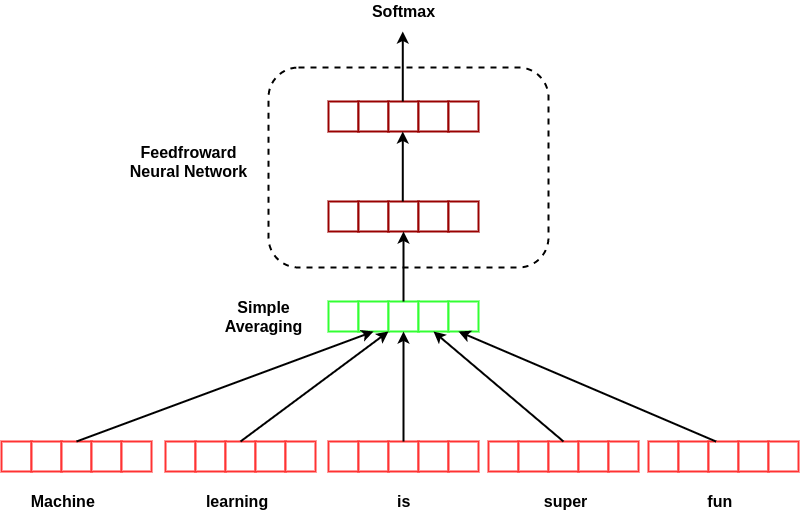
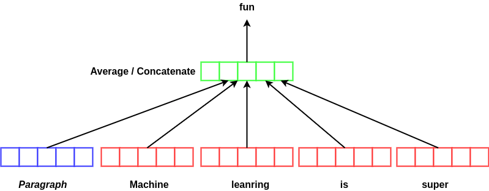
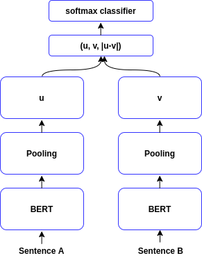
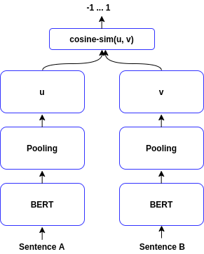
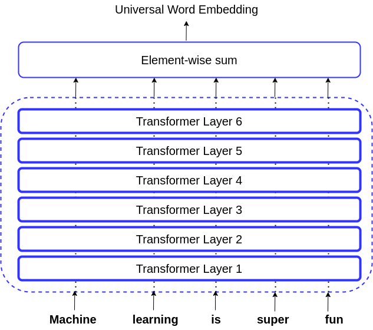
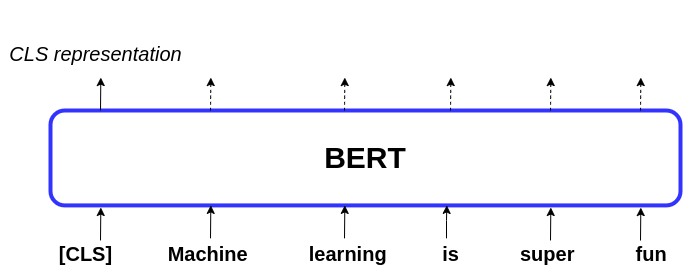

# 如何从标记词 Word2vec 中获取句子向量

[机器学习](https://www.baeldung.com/cs/category/ai/ml)

[word2vec](https://www.baeldung.com/cs/tag/word2vec)

1. 概述

    单词的向量表示有助于更好地分析文本内容的语义。对于某些应用，如[语音部分标记](https://en.wikipedia.org/wiki/Part-of-speech_tagging#:~:text=In%20corpus%20linguistics%2C%20part%2Dof,its%20definition%20and%20its%20context.)，我们可以使用单个词表示。而对于其他应用，如[主题建模](https://www.baeldung.com/cs/ml-word2vec-topic-modeling)和[情感分析](https://www.baeldung.com/cs/sentiment-analysis-practical#:~:text=Sentiment%20analysis%20refers%20to%20the,opinion%20mining%20or%20emotion%20analysis.)，我们则需要获得整个句子的表示。为此，我们可以使用多种方法。

    在本教程中，我们将介绍一些最著名的方法。其中一类方法基于单个标记的表示（简单平均法、加权平均法和 DAN）。相比之下，另一类方法（Doc2vec、SentenceBERT、Universal Sentence Encoder 和 BERT embeddings）可以直接计算句子嵌入。

2. 简单平均

    从单个词的表征中获取句子表征的最简单方法是求平均值。虽然这种方法的最大优点是简单，但它可能并不是最佳选择。问题之一是它忽略了句子中单词的顺序。从本质上讲，它类似于词袋模型。因此，它可能在某些情况下有效，但在另一些情况下却失效。

    另一个问题是，所有单词都被赋予了相同的权重。在某些应用中，例如情感分析，大多数词并不包含情感，句子的情感只隐藏在少数几个词中。因此，在情感分析中，这可能会导致误导或削弱表征。

    第三个问题是信息丢失。当句子中有一个常用词时，就会出现这种情况。如果句子中包含经常使用的词语，而这些词语通常并不表达情感，那么对这些词语进行平均处理就会产生类似的表征。

3. 加权平均

    解决简单平均法的一些问题的方法之一是对词语进行加权。加权的方式有很多种。术语频率-反向文档频率（TF-IDF）是一种常用的方法，尤其是在[文档相似性](https://www.baeldung.com/cs/ml-similarities-in-text)方面：

    \[ W_{ij} = TF_{ij} \times log \frac{N}{DF_{i}}\]

    这里，$TF_{ij}$ 是术语 i 在文档 j 中出现的次数，$DF_{i}$ 是包含术语 i 的文档数量，N 是文档总数。

    在我们的案例中，我们可以将每个句子视为一个文档。在大多数文档中出现的词不会有太大的信息量。因此，它的 TF-IDF 分数不应该太高。虽然这种方法在一定程度上解决了简单平均法的问题，但它仍然会因为没有考虑顺序而受到影响。此外，与简单平均法类似，它也没有捕捉到词与词之间的依赖关系，忽略了语义信息。

4. 深度平均网络（DAN）

    [深度平均网络](https://aclanthology.org/P15-1162.pdf)首先对单个词进行平均，这与简单平均法类似。然后，它对结果应用多层前馈神经网络。下图显示了 DAN 的架构：

    
    在该图中，我们展示了两层前馈网络，但它可以比这更深。模型越深，网络就越能提取出隐藏在句子中的微妙之处。

    虽然这种模型对句子中的语法和词序仍然一无所知，但它可以超越其他词袋模型。此外，与递归神经网络等语法感知模型相比，深度平均网络尽管简单轻便，但性能却不相上下。

5. 段落向量（Doc2vec）

    该模型基于 [word2vec](https://www.baeldung.com/cs/word-embeddings-cbow-vs-skip-gram) 算法，并深受其启发。事实上，它与 word2vec 只有细微差别。为了计算段落向量，我们训练模型通过使用前一个词和前一个段落来预测下一个词。这样，我们就可以平均或串联序列中单个词的呈现：

    
    这样训练模型将迫使段落向量存储段落的表述。在这里，段落可以是任何长度的序列。我们可以把段落向量看作一种存储器，它可以记住我们要预测的单词的上下文。因此，我们可以为该位置预测一个更相关的词。

    与将语序和语法考虑在内的 word2vec 相似，段落向量学习的是句子的语法。因此，它们克服了影响词袋模型的问题。此外，由于 doc2vec 是一种无监督模型，因此当我们没有大量的标注数据集，而只有许多未标注的示例时，它就能发挥优势。

6. SentenceBERT

    [SentenceBERT](https://arxiv.org/pdf/1908.10084.pdf) 是另一种我们可以用来获取句子表征的著名架构。为了训练它，我们将句子输入两个并行的 BERT 模型，然后使用池化从结果中提取句子表示。池化可以是 CLS 标记的表示，也可以是整个序列标记的平均值，还可以是输出向量的最大超过时间：

     
    我们可以用两个不同的目标来训练 SentenceBERT。一个是分类（上图左），另一个是回归（上图右）。SentenceBERT 的架构使某些任务的计算速度大大提高，例如在语料库中查找相似句子。

    如果我们想使用 BERT 找出语料库中最相似的句子对，就必须插入所有句子对，看看哪些句子对更相似。这可能需要花费大量时间（几十个小时）。然而，SentenceBERT 可以在几秒钟内完成同样的任务。

7. 通用句子编码器

    从这个模型的名称中，我们可以推断出它是一个用于情感分析和句子相似性等各种任务的模型。它使用 [Transformer](https://www.baeldung.com/cs/transformer-text-embeddings) 模型的编码器部分，学习一种通用嵌入，可用于执行各种下游任务：

    
    通用句子编码器（USE）的效果优于词袋和深度平均网络。不过，它的计算成本更高。前两种模型以线性顺序运行，而 USE 则以二次顺序运行。此外，值得注意的是，USE 与 SentenceBERT 相比[性能较差](https://arxiv.org/pdf/1908.10084.pdf)。

8. BERT 嵌入

    除了上述方法外，我们还可以使用 BERT 模型本身来提取单词嵌入以及句子的表示。这是因为我们希望 BERT 处理的输入序列具有特定的结构。我们可以从下图中看到这一点：

    
    我们可以看到，除了序列词之外，还有一个名为 CLS 的标记。这就是我们用来对句子进行分类的 "类标记"。因此，我们可以将存储在这个标记中的嵌入视为整个句子的表示。我们也可以将序列中单词的平均表示作为句子的表示。

9. 结论

    在本文中，我们讨论了使用标记表示法的句子向量表示法。然后，我们了解了一些可用来获取句子表示的现有方法。

- [ ] [How to Get Vector for A Sentence From Word2vec of Tokens](https://www.baeldung.com/cs/sentence-vectors-word2vec)
