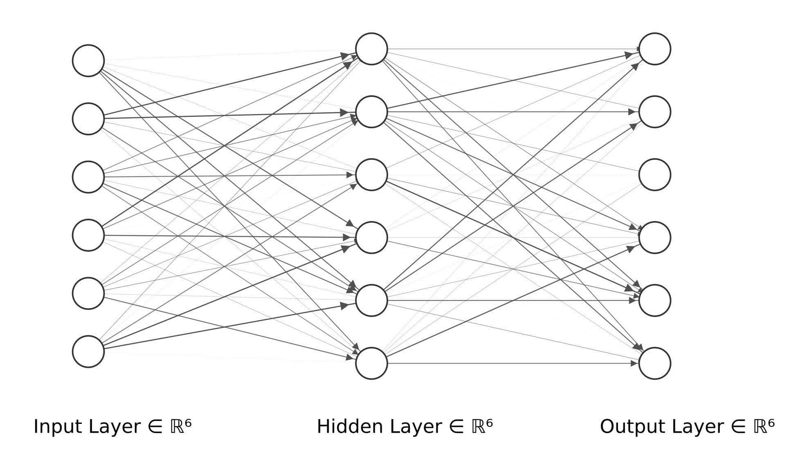

# 尖峰神经网络简介

[机器学习](https://www.baeldung.com/cs/category/ai/ml)

[神经网络](https://www.baeldung.com/cs/tag/neural-networks)

1. 简介

    尖峰神经网络是神经科学与人工智能的交叉学科。它为机器人领域开辟了广阔的前景。尖峰神经网络（SNN）是第三代神经网络模型，它采用专门的网络拓扑结构，重塑了整个计算过程。尖峰神经网络使其更智能、更节能。

    在本教程中，我们将了解它的工作原理、使用案例、优点和缺点。但在深入了解之前，我们先来定义一下尖峰神经网络。

2. 尖峰神经网络

    如今，神经网络分为三代。这些结构的第一代（感知器）由一个可以接受教育的人工神经细胞组成。当神经元越过指定的阈值（临界值），如 0 或 1 时，它就是感知器系统的输出。第二代神经网络是至今仍在使用的人工神经网络（ANN）结构。第三代人工神经网络是尖峰神经网络（SNN）结构，它试图完全模仿人脑的工作原理，通过尖峰进行通信。

    尖峰神经网络（SNN）采用特定的网络拓扑结构。由于尖峰的存在，它变得更智能、更节能，而尖峰是小巧的小工具发挥作用的必要条件。

3. 尖峰神经网络如何工作？

    尖峰神经网络（SNN）是计算神经科学为复制有机神经元的行为而开发的。该模型将神经元的活动描述为整合传入的尖峰和对环境的不良分散（泄漏）。

    尖峰神经网络缺乏一般的线性结构。在这方面，除了输入层和输出层之外，它缺少一个独特的层。它们使用更复杂的结构（如环路或多向连接）来传递神经元之间的数据，而不是简单的层。由于其复杂性，它们需要不同类型的训练和学习算法。为了适应尖峰行为，必须对反向传播等技术进行修改。

    典型的[尖峰神经网络](https://www.researchgate.net/post/I-want-to-implement-the-spiking-neural-network-for-classification-How-to-get-the-different-timingsinput-time-delay-time-etc)架构如下：

    

    让我们来总结一下尖峰神经网络的总体思路：

    - 每个神经元的值与生物神经元当前的电势相同
    - 根据其数学模型，神经元的值可能会波动。例如，如果一个神经元从上游神经元接收到一个尖峰，它的值可能会增加或减少
    - 神经元的值一旦越过某个阈值，就会降到其平均值以下，此时它就会向与原神经元相连的每个下游神经元发送一个脉冲。
    - 因此，神经元会有一个与生物神经元类似的折返期。神经元的值最终会恢复到平均值。

4. 尖峰神经网络的使用案例

    尖峰神经网络特定的网络拓扑结构为机器人和计算机视觉领域带来了广泛的可能性，引发了人工智能界的浓厚兴趣。它的主要优势在于利用神经形态硬件在尖峰神经网络中进行内存计算。

    尖峰神经网络可用于许多不同的行业，其中包括：计算机、机器人和计算机视觉：

    | 行业    | 说明                                                                                                                              |
    |-------|---------------------------------------------------------------------------------------------------------------------------------|
    | 假肢    | 现在，使用视觉和听觉神经义肢的患者可以恢复空间定向能力，这种义肢使用尖峰列车向视觉大脑传递信息。此外，研究人员正在开发采用相同方法的机械运动假肢。此外，帕金森病、肌张力障碍、慢性疼痛和精神分裂症状都可以通过植入电极向大脑提供尖峰列车来治疗。        |
    | 机器人   | 位于圣迭戈的大脑公司利用尖峰神经网络技术制造机器人，而SyNAPSE公司则制造神经形态系统和处理器。                                                                              |
    | 计算机视觉 | 计算机视觉是利用尖峰神经网络进行自动视频分析的最大受益领域。IBM TrueNorth 数字神经芯片利用 100 万个可编程神经元和 2.56 亿个可编程突触模拟视觉皮层中神经元的活动，在这方面非常有用。这款神经芯片经常被视为兼容尖峰神经网络的原始硬件。 |
    | 电信    | 高通公司目前正在研究将尖峰神经网络纳入通信设备的可行性。                                                                                                    |

5. 尖峰神经网络的优缺点

    下表列出了尖峰神经网络的优缺点：

    | 优势                                         | 缺点                  |
    |--------------------------------------------|---------------------|
    | 尖峰神经网络是一个动态系统。因此，它尤其擅长处理动态任务，如语音识别和动态图像识别。 | 尖峰神经网络的训练具有挑战性。     |
    | 即使在运行过程中，尖峰神经网络也能继续训练。                     | 目前还没有专门针对这一任务的学习算法。 |
    | 我们只需训练输出神经元即可训练尖峰神经网络。                     | 无法构建小型尖峰神经网络。       |

6. 结论

    尖峰神经网络无疑是机器人行业的一个里程碑。但另一方面，怀疑论者认为尖峰神经网络被高估了。在本文中，我们了解了尖峰神经网络的定义、工作原理、尖峰神经网络的使用案例以及尖峰神经网络的优缺点。最后，我们从两个角度了解了尖峰神经网络的未来。
