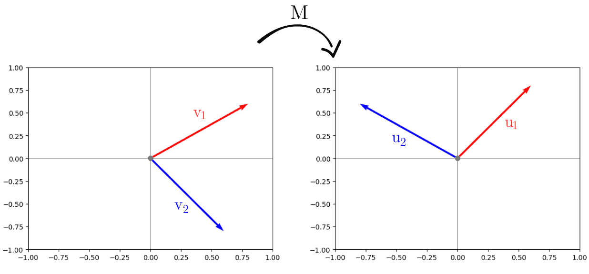
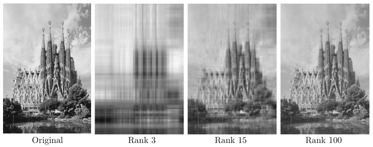
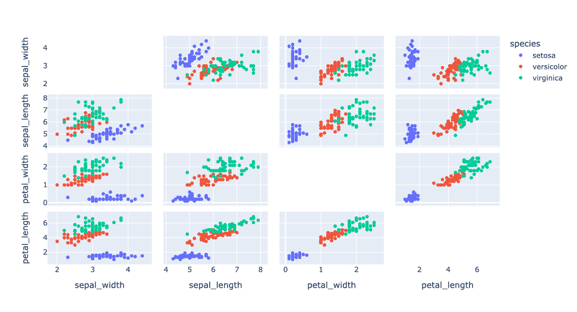
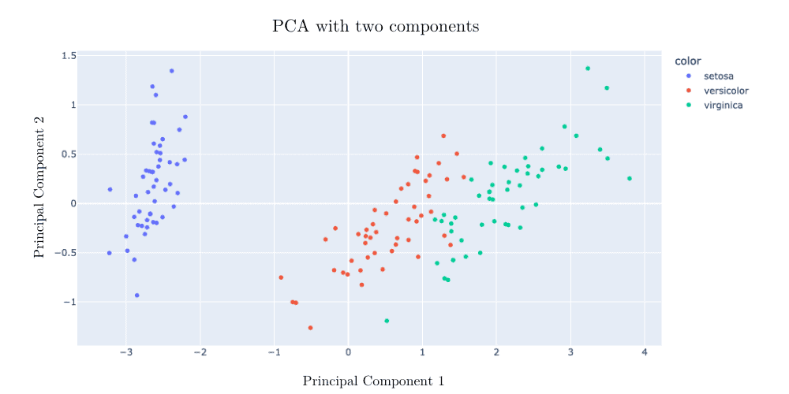

# 什么是奇异值分解？

[机器学习](README-zh.md) [数学与逻辑](https://www.baeldung.com/cs/category/core-concepts/math-logic)

[压缩](https://www.baeldung.com/cs/tag/compression) [矩阵](https://www.baeldung.com/cs/tag/matrix) [PCA](https://www.baeldung.com/cs/tag/pca)

1. 引言

    单值分解（SVD）是线性代数中的一个重要概念。利用这一技术，我们可以将一个矩阵分解成其他三个矩阵，这些矩阵易于操作并具有特殊属性。

    在本教程中，我们将讲解如何计算 SVD，以及为什么这种方法在数据分析和机器学习等许多领域如此重要。我们还将看到 SVD 如何用于压缩图像和降低数据集维度的实际示例。

2. 计算 SVD

    假设我们有一个矩阵 M，维数为 $m \times n$，我们想计算它的 SVD。我们希望得到以下表示：

    $M = U \Sigma V^{T}$

    其中：

    \[\begin{cases}  U, & \text{matrix of size } m \times m \text{ with the orthonormal eigenvectors of } MM^{T} \\  V^{T}, & \text{matrix of size } n \times n \text{ with the orthonormal eigenvectors of } M^{T}M \\  \Sigma, & \text{matrix of size } m \times n \text{ with the singular values of }M  \end{cases}\]

    有时我们也可以说 U 的列是 M 的左奇异向量，V 的列是 M 的右奇异向量。

    现在，我们来计算随机矩阵 M 的 SVD：

    \[\begin{bmatrix}  0.96 & 1.72 \\ 2.28& 0.96  \end{bmatrix}\]

    首先，我们需要找到 $M^{T}M$ 的特征值

    \[M^{T}M  = \begin{bmatrix}0.96& 1.72\\ 2.28 & 0.96\end{bmatrix} \begin{bmatrix}0.96 & 2.28 \\ 1.72 & 0.96 \end{bmatrix} = \begin{bmatrix}6.12 & 3.84 \\ 3.84& 3.88\end{bmatrix}\]

    现在我们来计算这个矩阵的特征方程：
    $det(M^{T}M-\lambda I) = \lambda^{2} - 10 \lambda + 9$

    然后我们可以表示为 $(\lambda -1) (\lambda - 9)$，我们的奇异值为 $\sigma_1 = \sqrt{1} = 1$ 和 $\sigma_2 = \sqrt{9} = 3$。然后我们定义第一个矩阵

    $\Sigma = \begin{bmatrix}3 & 0\\ 0 & 1 \end{bmatrix}$

    现在我们可以为每个特征值计算 $M^{T}M$ 的正交特征向量集。根据定义，它们是正交的，因为 $M^{T}M$ 是对称的。对于 $λ=9$ 我们有：

    \[M^{T} M  - 9 I = \begin{bmatrix}-2.88 & 3.84\\ 3.84 & -5.12 \end{bmatrix}\]

    我们需要把这个矩阵还原成梯形。我们分两步来做。首先，我们将第一行除以 -2.88：

    \[A = \begin{bmatrix}1 & -\frac{4}{3}\\ 3.84 & -5.12 \end{bmatrix}\]

    第二步，我们从第二行减去第一行乘以 3.84，最后得到：

    \[A = \begin{bmatrix}1 & -\frac{4}{3}\\ 0 & 0 \end{bmatrix}\]

    之后，我们计算一个单位长度的向量 $v_1$，使得 $A v_1 =0$ 在矩阵的内核中，我们发现：

    \[v_1 = \begin{bmatrix} 0.8 \\ 0.6 \end{bmatrix}\]

    类似地，对于 $\sigma_2 = 1$，我们得到：

    \[v_2 = \begin{bmatrix}0.6 \\ -0.8 \end{bmatrix}\]

    所以矩阵 V 表示为：

    \[V = \begin{bmatrix}0.8 & 0.6\\ 0.6 & -0.8 \end{bmatrix}\]

    为了计算矩阵 U，我们使用以下公式计算每一列：

    \[u_i = \frac{1}{\sigma_i}A v_i\]

    整个矩阵的计算公式为：

    \[U = \begin{bmatrix}0.6 & -0.8\\ 0.8 & 0.6 \end{bmatrix}\]

    最终的 SVD 分解结果为：

    \[A = U \Sigma V^T = \begin{bmatrix} 0.6 & -0.8 \\  0.8 & 0.6  \end{bmatrix} \begin{bmatrix} 3 & 0 \\  0 & 1  \end{bmatrix} \begin{bmatrix} 0.8 & 0.6 \\  0.6 & -0.8  \end{bmatrix}^T\]

3. 解释

    现在我们知道了如何计算 SVD，下面我们来讨论一下它的两种主要解释。

    由于这是线性代数中的一个基本概念，我们将从正交分析开始。矩阵 V 和 U 的列代表正交向量的集合，在对矩阵 M 进行变换后，这些向量仍保持正交：

    \[M v_1 =\begin{bmatrix} 0.96 & 1.72 \\ 2.28 & 0.96 \end{bmatrix} \begin{bmatrix}0.8 \\ 0.6  \end{bmatrix} =  \begin{bmatrix}0.6 \\ 0.8  \end{bmatrix} =  u_1\]

    \[M v_2 =\begin{bmatrix} 0.96 & 1.72 \\ 2.28 & 0.96 \end{bmatrix} \begin{bmatrix}0.6 \\ -0.8  \end{bmatrix} =  \begin{bmatrix}-0.8 \\ 0.6  \end{bmatrix} =  u_2\]

    通过绘制向量图，我们可以很容易地验证变换前后的正交性：

    

    SVD 的第二种解释是优化问题。如果我们需要找出一个矩阵在哪个方向上对单位向量的拉伸最大，我们可以求解：

    \[argmax \lVert Ax \rVert \text{ subject to } \lVert x \rVert =1\]

    为了简单起见，我们不在这里演示，但这个问题的解是由矩阵 $U(u_1)$ 的第一列给出的。

    现在让我们看看 SVD 在实际应用中是如何工作的。

4. 应用

    我们将讨论两个不同的应用。首先，我们将展示 SVD 如何压缩图像，然后我们将了解 SVD 如何用于分析高维数据集。

    1. 图像压缩

        考虑到我们提出的 SVD 模型 $M = U \Sigma V^{T}$，现在让我们来介绍 k-rank SVD 模型。

        在这个模型中，我们只考虑 U 的前 k 列、$\Sigma$ 的 k 个最重要奇异值和 $V^{T}$ 的前 k 行。为了在实践中了解这一点，让我们以巴塞罗那圣家堂大教堂的灰度图像为例，对不同的低秩近似值进行分析：

        

        对于压缩的定量指标，让我们考虑一下公式：

        \[\text{compression rate } = \frac{(\text{height } \times k) + k + (\text{width } \times k)}{\text{height} \times \text{width}}\]

        很明显，当 k=3 时，我们几乎看不到教堂，但压缩率却高得惊人，相当于 158。当等级增加到 15 时，我们的图像变得更加清晰。在这种情况下，压缩率为 31.79。当我们达到实验中的最高等级时，教堂得到了很好的表现，我们的压缩率为 4.76。

        这说明了 SVD 在图像[压缩](https://www.baeldung.com/cs/jpeg-compression)领域的潜力，尤其是当我们需要发现图像中的基本特征时。

        最后，我们来讨论一下 SVD 的第二种应用，即主成分分析 (PCA)。

    2. PCA

        PCA 的目的是找到矩阵 M 原始坐标的线性组合，其形式为

        \[p_i = \sum_{j=1}^{n} w_{ij} m_{j}\]

        对于 $i=1, \ldots n$，我们在此只强调分量必须是正交的，这也是 SVD 分解的情况。关于 PCA 的更详细介绍，我们可以参考之前的[文章](https://www.baeldung.com/cs/principal-component-analysis)。

        在这里，我们将了解 PCA 如何降低维度。我们将使用传统的鸢尾花[数据集](https://archive.ics.uci.edu/dataset/53/iris)，其中包含四个特征：萼片宽度、萼片长度、花瓣宽度和花瓣长度。

        如果我们将三种植物的所有特征绘制成二维图，就可以看出数据的复杂性：

        

        高维数据但是，一旦我们使用两个[分量](https://www.baeldung.com/cs/pca)进行 PCA 分析，就能成功地对植物进行分割：

        

5. 结论

    本文讨论了计算矩阵 SVD 的相关性和方法。许多应用都依赖于这种方法的实施。

    从洞察力和降维到线性代数证明，SVD 都发挥着至关重要的作用。我们应该牢记，在执行 SVD 之后，我们最终得到的矩阵将更易于操作，并具有更强的解释能力，正如我们在本文中所看到的那样。
