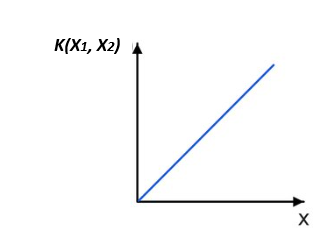
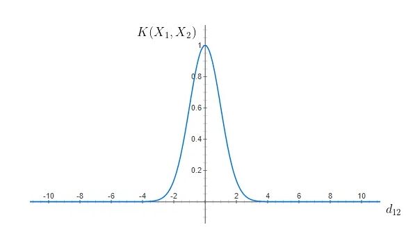
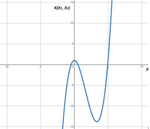
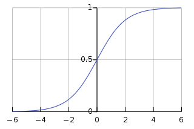

# 如何选择 SVM 的核类型？

[机器学习](https://www.baeldung.com/cs/category/ai/ml)

[SVM](https://www.baeldung.com/cs/tag/svm)

1. 简介

    在本教程中，我们将讨论 SVM 的内核类型。我们将介绍如何选择最合适的内核。我们将讨论每种内核类型的优缺点。

2. 什么是核函数？

    [SVM算法](https://www.baeldung.com/cs/ml-support-vector-machines)使用一组定义为内核的数学函数。核函数是一种将数据作为输入并将其转换为所需形式的方法。换句话说，核函数转换训练数据集，将非线性决策面转换为高维空间中的线性方程。

3. 选择内核时应考虑哪些因素？

    SVM 中核的选择取决于问题的类型。事实上，考虑到我们要解决的问题的性质，如线性或非线性分类、异常检测或回归，每种问题都可以选择不同的核。

    如果处理的是线性分类问题，线性内核可能是合适的，因为它能有效分离可以线性分离的数据。但是，当遇到非线性分类问题时，就有必要考虑使用非线性核，如径向基函数（[RBF](https://www.baeldung.com/cs/rbf-neural-networks#:~:text=RBF%20measures%20the%20similarity%20between,the%20data%20and%20reference%20points.)）、多项式或sigmoid核。这些核可以处理更加错综复杂的决策边界。

    此外，在处理[回归任务](https://www.baeldung.com/cs/linear-vs-logistic-regression)或[异常检测](https://www.baeldung.com/cs/ml-drift-anomaly-novelty)时，最重要的是要考虑核的选择。在回归任务中，决定使用哪个核会极大地影响模型理解输入和输出变量之间基本联系的能力。至于异常检测，该任务通常需要识别数据中的复杂模式，因此非线性内核是更合适的选择。

4. 如何选择正确的内核

    选择正确的内核对各种多线程算法都至关重要，尤其是 SVM。要在 SVM 中选择合适的核，我们必须考虑问题的类型、计算复杂度和数据的特征。本节将举例说明如何为 SVM 问题选择合适的核。

    1. 线性内核

        当特征数量与样本数量相比较大，或者数据是线性可分的，我们就会使用线性核。线性核适用于文本分类、文档分类和其他高维数据问题。线性核可以表示为

        \[k(x_{1},x_{2})=x_{1}.x_{2}\]

        线性核的形式如下：

        

    2. 径向基函数核（RBF）

        RBF核适用于非线性问题，是SVM的默认选择。在没有数据先验知识的情况下，它非常强大，我们可以捕捉数据点之间的复杂关系。RBF核可以表示为

        \[k(x_{1},x_{2})=exp(-\gamma(\Vert(x_{1}-x_{2})\Vert^2)\]

        RBF 内核的形式如下：

        

    3. 多项式核

        多项式核在处理显示多项式行为的问题时非常有用。它们常用于计算机视觉和图像识别任务。我们将多项式核表示为

        \[k(x_{1},x_{2})=(\gamma x_{1}.x_{2}+c)^d\]

        多项式核可以有多种形式。在此，我们介绍多项式核的一种形式：

        

    4. 西格玛核

        在处理神经网络应用时，当我们知道数据分布看起来像一个 sigmoid 函数时，我们就会使用 sigmoid 核。我们可以用以下方式来表示 sigmoid 核

        \[k(x_{1},x_{2})=tanh(\gamma x_{1}.x_{2}+c)\]

        sigmoid 核的形式如下：

        

    5. 定制内核

        有时，根据特定领域知识或问题特征定制的内核比标准内核更有优势。例如，根据特定领域的相似性度量设计内核可以提高性能。在这类内核中，我们没有通用形式的内核，因为这种内核是根据特定领域量身定制的。

        如今，[网格搜索](https://www.baeldung.com/cs/ml-svm-c-parameter)和[交叉验证技术](https://www.baeldung.com/cs/cross-validation-k-fold-loo#:~:text=In%20cross%2Dvalidation%2C%20we%20don,the%20performance%20in%20each%20group.)也能帮助确定特定数据集的最佳内核。

5. 每种内核类型的优缺点

    以下是每种内核类型的优缺点汇总表：

    | 内核类型        | 优势                       | 缺点                             |
    |-------------|--------------------------|--------------------------------|
    | 线性          | 计算效率高 - 适用于高维数据          | 仅限于线性可分离数据 - 可能无法捕捉非线性数据中的复杂关系 |
    | 径向基函数 (RBF) | 有效捕捉复杂的非线性关系             | 对过拟合敏感                         |
    | 多项式         | 适用于多项式行为问题，也可捕捉数据中的非线性关系 | 在高阶多项式中容易过度拟合，对阶数参数的选择很敏感      |
    | 梯形          | 在神经网络等特定应用中非常有效          | 与其他内核相比，适用性有限                  |
    | 自定义内核       | 针对特定领域知识或问题特征进行定制        | 设计定制内核需要领域专业知识和实验              |

6. 结论

    在本文中，我们讨论了 SVM 的内核类型。总的来说，在考虑 SVM 内核的选择时，我们需要了解所要解决的问题的性质，如线性或非线性分类、异常检测或回归。
