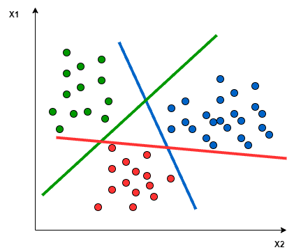

# [使用支持向量机进行多类分类](https://www.baeldung.com/cs/svm-multiclass-classification)

1. 简介

    在本教程中，我们将介绍使用支持向量机（SVM）进行多类分类。首先，我们将了解分类、多类分类和 SVM 的定义。然后，我们将讨论 SVM 如何应用于多类分类问题。最后，我们将看看使用 [Scikitlean SVM](https://scikit-learn.org/stable/modules/generated/sklearn.svm.SVC.html) 进行多类分类的 Python 代码。

2. 分类

    在人工智能和机器学习中，分类指的是机器将实例分配到正确组别的能力。

    例如，在计算机视觉中，机器可以判断图像中包含的是猫还是狗，或者图像中是否包含人体。在自然语言处理（NLP）中，机器可以判断给定文本的[情感](https://www.baeldung.com/cs/sentiment-analysis-practical)是积极的、消极的还是中性的。

    为了让机器能够决定如何将一个实例分配到它的组中，它必须从标注的训练数据集中的训练特征中学习分配模式。

    我们有两种类型的分类：二元分类和多分类。

    1. 二元分类

        在这种类型中，机器只需将实例分类为两个类别之一：是/否、1/0 或真/假。

        这种类型的分类问题总是以是/否的形式出现。例如，这张图片中是否有人？这段文字是否具有正面情绪？某只股票的价格在下个月会上涨吗？

    2. 多类分类

        在这种类型中，机器只需将一个实例分类为三个或更多类别中的一个。

        以下是多类分类的示例：

        - 将文本分类为正向、负向或中性
        - 确定图像中狗的品种
        - 将一篇新闻分为体育、政治、经济或社会类；

3. 支持向量机（SVM）

    [SVM](https://www.baeldung.com/cs/ml-support-vector-machines) 是一种有监督的机器学习算法，有助于解决分类或回归问题。它的目标是在可能的输出之间找到最佳边界。

    简单地说，SVM 会根据所选的核函数进行复杂的数据变换，并在此变换的基础上，根据所定义的标签或类别，尝试最大化数据点之间的分离边界。

    1. 它是如何工作的？

        SVM 的基本形式是线性分离，它试图找到一条线，使二维空间点的两类数据集之间的分离最大化。概括地说，SVM 的目标是在 n 维空间中找到一个超平面，使数据点与其潜在类别之间的分离最大化。与超平面距离最小的数据点（最近的点）称为支持向量。

        在下图中，支持向量是位于散线上的 3 个点（2 个蓝色点和 1 个绿色点），分离超平面是红色实线：

        

        数据点分离的计算取决于核函数。核函数有多种： 线性、多项式、高斯、径向基函数 (RBF) 和 Sigmoid。简单地说，这些函数决定了类分离的平滑度和效率，而随意使用它们的超参数可能会导致过拟合或欠拟合。

4. 使用 SVM 进行多类分类

    在最简单的类型中，SVM 本身并不支持多类分类。它支持二元分类并将数据点分成两类。对于多类分类，在将多类问题分解为多个二元分类问题后，就可以利用相同的原理。

    其原理是将数据点映射到高维空间，以获得每两个类别之间的相互线性分离。这就是所谓的[一对一方法](https://machinelearningmastery.com/one-vs-rest-and-one-vs-one-for-multi-class-classification/)，它将多类问题分解为多个二元分类问题。每一对类别对应一个二元分类器。

    另一种方法是 [One-to-Rest](https://machinelearningmastery.com/one-vs-rest-and-one-vs-one-for-multi-class-classification/) 方法。在这种方法中，细分为每类一个二元分类器。

    一个 SVM 进行二元分类，可以区分两个类别。因此，根据这两种分类方法，可以对来自 m 类数据集的数据点进行分类：

    - 在 One-to-Rest 方法中，分类器可以使用 $\pmb{m}$ 个 SVM。每个 SVM 将预测 $\pmb{m}$ 个类别中的一个类别。
    - 在一对一方法中，分类器可以使用 $\pmb{\frac{m(m-1)}{2}}$SVMs。

    让我们以绿色、红色和蓝色三类分类问题为例，如下图所示：

    

    将这两种方法应用于该数据集的结果如下：

    在 "一对一 "方法中，我们需要一个超平面来分离每两个类别，而忽略第三个类别的点。这意味着分离时只考虑当前分离的两个类别的点。例如，红蓝线只试图最大化蓝色和红色点之间的分离。与绿色点无关：

    

    在 "一对一" 方法中，我们需要一个超平面来同时分离一个类别和所有其他类别。这意味着分离时要考虑到所有点，将它们分为两组：一组是类别点，另一组是所有其他点。例如，绿线试图最大化绿色点与所有其他点之间的分离：

    

    使用 SVM 进行多类分类最常见的实际问题之一是文本分类。例如，对新闻文章、推特或科学论文进行分类。

5. 用 Python 进行 SVM 多分类

    下面的 Python 代码展示了使用 Python 3.7 和 Scikitlean 库构建（训练和测试）多类分类器（3 类）的实现。

    我们开发了两种不同的分类器，以展示两种不同内核函数（多项式和 RBF）的用法。该代码还计算了准确率和 f1 分数，以显示在相同数据集上所选两种核函数的性能差异。

    在本代码中，我们使用的是鸢尾花数据集。该数据集包含三个类，每个类有 50 个实例，每个实例指一种鸢尾花植物。

    首先，我们将导入所需的类：

    ```python
    from sklearn import svm, datasets
    import sklearn.model_selection as model_selection
    from sklearn.metrics import accuracy_score
    from sklearn.metrics import f1_score
    ```

    从 Scikitlearn 加载虹膜数据集，无需单独下载：

    `iris = datasets.load_iris()`

    现在，我们需要将特征集 X 与目标列（类别标签）y 分开，并将数据集划分为 80% 用于训练，20% 用于测试：

    ```python
    X = iris.data[:, :2]
    y = iris.target
    X_train, X_test, y_train, y_test = model_selection.train_test_split(X, y, train_size=0.80, test_size=0.20, random_state=101)
    ```

    我们将从 SVM 创建两个对象，以创建两个不同的分类器：一个是多项式核，另一个是 RBF 核：

    ```python
    rbf = svm.SVC(kernel='rbf', gamma=0.5, C=0.1).fit(X_train, y_train)
    poly = svm.SVC(kernel='poly', degree=3, C=1).fit(X_train, y_train)
    ```

    为了计算两个模型的效率，我们将使用测试数据集测试这两个分类器：

    ```python
    poly_pred = poly.predict(X_test)
    rbf_pred = rbf.predict(X_test)
    ```

    最后，我们将计算使用多项式核的 SVM 的准确率和 f1 分数：

    ```python
    poly_accuracy = accuracy_score(y_test, poly_pred)
    poly_f1 = f1_score(y_test, poly_pred, average='weighted')
    print('Accuracy (Polynomial Kernel): ', "%.2f" % (poly_accuracy*100))
    print('F1 (Polynomial Kernel): ', "%.2f" % (poly_f1*100))
    ```

    用同样的方法计算使用 RBF 内核的 SVM 的准确率和 F1 分数：

    ```python
    rbf_accuracy = accuracy_score(y_test, rbf_pred)
    rbf_f1 = f1_score(y_test, rbf_pred, average='weighted')
    print('Accuracy (RBF Kernel): ', "%.2f" % (rbf_accuracy*100))
    print('F1 (RBF Kernel): ', "%.2f" % (rbf_f1*100))
    ```

    这段代码将打印出以下结果：

    ```log
    Accuracy (Polynomial Kernel): 70.00
    F1 (Polynomial Kernel): 69.67
    Accuracy (RBF Kernel): 76.67
    F1 (RBF Kernel): 76.36
    ```

    在验证机器学习模型的已知指标中，我们选择了准确率和 F1，因为它们是监督机器学习中最常用的指标。

    准确率得分显示了所有数据点中真阳性和真阴性的百分比。因此，它在数据集平衡时非常有用。

    对于 f1 分数，它计算的是精确度和召回率之间的调和平均值，两者都取决于假阳性和假阴性。因此，当数据集不平衡时，计算 f1 分数非常有用。

    在前面的代码片段中，对 SVM 的超参数（如 C、gamma 和度）进行调整会得到不同的结果。我们可以看到，在这个问题中，使用 RBF 核函数的 SVM 优于使用多项式核函数的 SVM。

6. 结论

    在本教程中，我们介绍了机器学习中分类的一般定义以及二元分类和多分类的区别。然后，我们展示了支持向量机算法、其工作原理以及如何将其应用于多类分类问题。最后，我们用 Python 代码为两个 SVM 分类器实现了两种不同的内核：多项式和 RBF。
