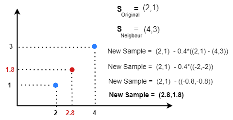
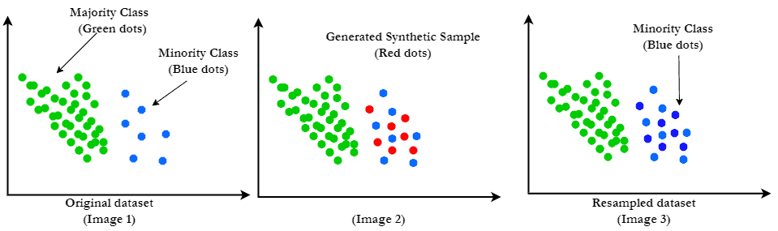

# 如何使用SMOTE处理不平衡数据？

[机器学习](README-zh.md)

[训练](https://www.baeldung.com/cs/tag/training)

1. 简介

    在本教程中，我们将讨论合成少数群体过度取样技术（SMOTE）及其优缺点。

    我们将提供有用的提示并分享最佳实践。

2. 为什么需要 SMOTE？

    在[机器学习](https://www.baeldung.com/cs/machine-learning-vs-deep-learning)中，分类是一项旨在为数据点分配类别或标签的任务。这项任务可能涉及将电子邮件分类为垃圾邮件或非垃圾邮件，或将医学图像分类为显示疾病或未显示疾病，它围绕着根据数据特征进行预测（决策）。

    理想情况下，在分类问题中，数据集是平衡的。这意味着每个类别中的数据点数量大致相同。这种比例代表有助于算法更有效地学习和归纳，因为它们可以获得每个类别中数量相似的示例。

    1. 不平衡数据

        然而，在现实世界中，我们通常会遇到不平衡数据。一个或多个类别的实例/数据点明显少于其他类别。

        出现这种类不平衡的原因有很多，例如某一类代表罕见事件。例如，医疗诊断分类任务就是这种情况。在这类数据集中

        - 0 类代表没有罕见疾病的患者。
        - 第 1 类代表患有罕见疾病的患者。
        这种罕见疾病在人群中并不常见，因此患有这种疾病的患者明显少于没有这种疾病的患者。这就导致了类别不平衡问题。

    2. 不平衡数据带来的挑战

        在不平衡数据上训练分类算法会导致模型偏向多数类，因为有更多这样的样本可供学习。这就会导致模型在多数类上表现出色，而在少数类上表现平平。

        如果多数类在数据集中占主导地位，即使是性能较差的模型也能获得较高的总体准确率。但是，这种准确率可能会产生误导，因为模型在少数人类别上的表现可能很差。

        在我们的医疗示例中，99% 的人口可能没有病症。因此，大约 1%的患者记录属于第 1 类。如果一个模型将所有患者都归入 0 类，其准确率将达到 99%，但却无法检测到所有 1 类患者。

        在处理不平衡数据时，有多种技术可供选择，其中一种方法是 SMOTE（合成少数群体过度取样技术）。

3. 什么是 SMOTE？

    这是一种数据增强技术，通过生成少数群体的合成示例来减轻类不平衡的影响。最终，这将提高机器学习模型的性能和可靠性。

    研究人员通常在训练分类模型（包括逻辑回归、[决策树、随机森林](https://www.baeldung.com/cs/decision-trees-vs-random-forests)和支持向量机）之前使用 SMOTE 对数据进行预处理。

    这种技术在欺诈检测、医疗诊断等应用中具有特殊价值，因为在这些应用中，一类的数量明显多于另一类。

    SMOTE 有许多变体和扩展： [Borderline-SMOTE](https://www.mdpi.com/1996-1073/15/13/4751)、[ADASYN](https://ieeexplore.ieee.org/document/4633969)（自适应合成采样）、[SMOTE-NC](https://www.jair.org/index.php/jair/article/view/10302)（用于标称和连续特性的 SMOTE）和 [SVM-SMOTE](https://notebook.community/Meena-Mani/SECOM_class_imbalance/secomdata_svm_smote)。

    1. 算法

        让我们来看看原始算法（在最近的一篇研究[论文](https://link.springer.com/article/10.1007/s10994-022-06296-4)中提出）：

        

        SMOTE 通过在随机选取的少数类实例与随机选取的少数类[近邻](https://www.baeldung.com/cs/k-nearest-neighbors)实例之间进行插值来生成新数据。

    2. 插值

        插值过程是随机的。一旦我们选择了一个真实数据实例和它的一个近邻，我们就会从[0, 1]中随机抽取一个数字，在它们之间生成一个点：

        

        我们可以通过添加所需数量的合成数据来获得更均衡的数据集：

        

4. 优缺点

    SMOTE 有利也有弊。

    1. 优点

        SMOTE 的一个主要优点是能够提高机器学习模型的性能。它通过生成少数类的合成示例来实现这一点，从而有助于更有效地学习基本模式和决策边界。

        它有助于减少不平衡数据集中的过拟合现象，在不平衡数据集中，模型在训练数据中表现出色，但在未见数据中却举步维艰。通过生成新数据，SMOTE 可帮助创建更具通用性的模型。

        SMOTE 支持多种分类器，包括决策树、[支持向量机](https://www.baeldung.com/cs/ml-support-vector-machines)、最近邻和神经网络。

        这种灵活的技术允许调整超采样水平和合成样本的特征，使其适用于各种情况和数据集大小。

        该技术的实现相对简单，可在 Python 和 R 等不同编程语言的各种库和软件包中使用。

    2. 缺点

        SMOTE 的缺点是在创建合成样本时不考虑多数类。

        此外，它还会在样本之间创建代表噪声的合成样本。因此，增强数据集的噪声会比原始数据集更大，从而影响性能。

        在高维特征空间中效果较差。由于 SMOTE 通过在相邻样本之间插值来生成合成样本，因此可能无法捕捉到更复杂的模式。

    3. 总结

        下面是对 SMOTE 优缺点的快速总结。

        | 优点             | 缺点              |
        |----------------|-----------------|
        | 提高性能。          | 增加计算复杂性。        |
        | 平衡数据集。         | 不适合所有数据集。       |
        | 不局限于特定的机器学习算法。 | 与回归问题不兼容。       |
        | 易于实施。          | 可能会丢失原始数据的微妙之处。 |

5. 总结

    在本文中，我们讨论了机器学习中的一种数据增强技术--SMOTE。它的主要目标是通过生成少数类的合成实例来减轻类不平衡的影响，从而增强机器学习模型的学习和泛化能力。
