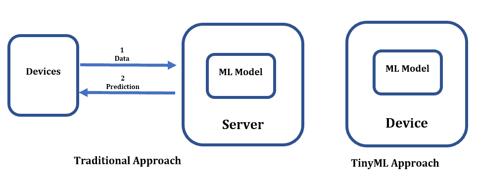
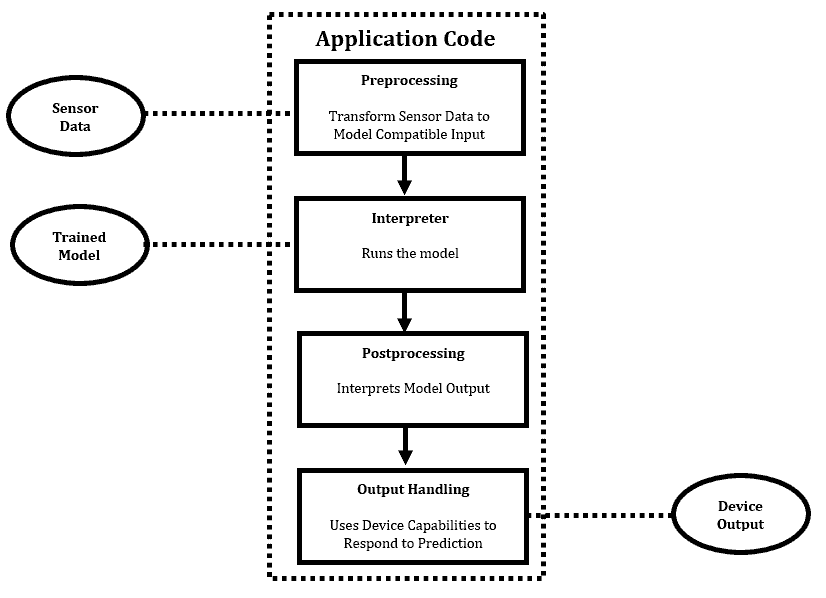

# [什么是TinyML？](https://www.baeldung.com/cs/tinyml)

[机器学习](README-zh.md)

[训练](https://www.baeldung.com/cs/tag/training)

1. 简介

    在本教程中，我们将讨论 TinyML。我们将展示它的工作原理，介绍它的优势、挑战和未来。

2. 我们为什么需要 TinyML？

    TinyML 可以在传感器和微控制器等小型、低功耗设备上部署机器学习（ML）和深度学习（DL）模型。这一点非常重要，因为它允许开发可在本地处理数据的[智能边缘设备](https://www.baeldung.com/cs/edge-computing)，而无需连接到云或功能强大的服务器：

    

    在 TinyML 方法中，传统方法中描述的所有步骤都在设备上完成。这可以加快响应速度，减少延迟，提高隐私性和安全性：

    此外，由于传统 ML 方法的局限性，TinyML 还能开发以前不可能实现的新应用和用例。例如，TinyML 可用于工业环境中的预测性维护、实时健康监测和智能农业。

3. TinyML：它是如何工作的？

    TinyML 使用专门的算法和技术，旨在小型、低功耗设备上高效运行。这些算法通常基于神经网络或[决策树](https://www.baeldung.com/cs/decision-trees-vs-random-forests)等传统 ML 模型的简化版本，可针对微控制器和传感器有限的处理能力和内存进行优化。

    创建 TinyML 模型与拟合传统 ML 模型类似。首先，我们从传感器或其他来源收集数据，并使用专门的软件工具进行处理。然后，我们使用这些数据来训练模型。

    最后，我们将模型部署到目标设备上，让它实时分析数据，并做出预测（决策），设备通过编程做出反应：

    

    这样就能实现从检测制造设备异常到监测病人生命体征等各种应用。

    1. 技术

        制作 tinyML 模型的技术有很多。我们将介绍两种。

        例如，要创建一个 TinyML 版本的神经网络，我们可以按照传统方法，在现有数据上对其进行训练。然后，我们可以将其参数四舍五入为最接近的 8 位整数，从而减小其大小。这种技术称为训练后整数量化。

        剪枝技术可以识别并删除对输出影响较小的连接和神经元。在模型训练过程中，如果某个权重接近于零，我们就会将其从模型中删除，而不会对准确性产生重大影响。此外，如果某个神经元持续输出接近零的值，我们也会将其从模型中删除。因此，我们减少了神经网络的规模和复杂性。

4. 优势

    1. 低延迟和实时处理

        TinyML 可以在小型微控制器上运行，从而实现边缘计算，减少对云连接的需求。

        如果低功耗设备无法提供足够的处理能力或内存，那么就需要用模型连接到云。

    2. 能源效率

        TinyML 可以实现低功耗和高能效的数据处理，从而降低设备功耗。

        我们设计的 TinyML 算法轻便高效，需要的计算能力更低，消耗的能源更少。

    3. 安全性

        TinyML 使边缘设备能够进行实时分析和决策，而不是将敏感数据传送到云端，使设备面临黑客攻击和侵犯隐私等可能的网络风险。

        因此，如果设备足够安全，网络攻击的风险就会降低。

5. 挑战

    1. 有限的内存和处理能力

        TinyML 面临的最大挑战之一是微型设备的内存和处理能力有限。这使得复杂的机器学习算法和模型难以实现。

        因此，开发人员必须优化他们的模型和算法，以适应这些设备的限制，这可能是一个巨大的挑战。

    2. 优化和压缩机器学习模型

        这就要求开发人员想方设法在不牺牲性能或准确性的前提下减少模型的大小和复杂性。

        [剪枝和量化](https://www.sciencedirect.com/science/article/abs/pii/S0925231221010894)等技术可用于实现这一目标。不过，这些方法需要仔细考虑和实验，以找到适合特定应用的最佳方法。

    3. 安全风险

        TinyML 也可能面临安全风险。事实上，如果设备没有足够的安全保护，在设备上保留 ML 模型可能会增加安全漏洞的风险。例如，如果设备被盗或丢失，黑客就可能访问并恶意使用 ML 模型。

        此外，如果我们不定期为设备更新安全补丁，黑客还可能利用软件漏洞访问 ML 模型。

6. 应用

    硬件的改进，如低功耗和高性能微控制器的开发，使得更复杂的模型可以在微型设备上运行。

    TinyML 的应用范围非常广泛：

    - 医疗监控和诊断系统： 我们在医疗设备中使用 TinyML 来诊断疾病、监测病人健康状况并提供个性化治疗建议。
    - 自动驾驶汽车： 在自动驾驶汽车中，我们使用 TynyML 来提高感知和决策能力。
    - 无人机视觉： 如今，TinyML 模型可以通过训练来检测无人机镜头中的动物、人、车辆或障碍物等物体，从而实现高效、安全的导航。
    - 边缘计算： TinyML 为相机、智能手机和无人机等边缘设备带来了机器学习功能，无需依赖云服务即可实现实时决策。

7. 优缺点简述

    以下是 TinyML 的优缺点简表：

    | 优点           | 缺点               |
    |--------------|------------------|
    | 耗电量低         | 处理能力有限           |
    | 体积小          | 内存有限             |
    | 实时处理         | 模型复杂性有限          |
    | 成本效益高        | 与某些软件和硬件平台的兼容性有限 |
    | 无需外部服务器和网络连接 | 设备上的模型可能被盗或损坏    |

8. 总结

    本文介绍了 TinyML。总的来说，TinyML 可以在小型和资源有限的设备上部署机器学习模型，实现实时决策并减少延迟。

    然而，这些设备有限的处理能力和内存可能会导致模型准确性下降。
