# [转换器文本嵌入](https://www.baeldung.com/cs/transformer-text-embeddings)

[机器学习](https://www.baeldung.com/cs/category/ai/ml)

[关注](https://www.baeldung.com/cs/tag/attention) [自然语言处理](https://www.baeldung.com/cs/tag/nlp)

1. 概述

    在本教程中，我们将剖析变换器，以获得一些关于变换器如何表示文本的直观知识。接下来，我们将了解由它衍生出的一个名为 BERT 的超酷模型，以及如何使用它为文本获取更丰富的向量表示。

    要理解下面的内容，我们需要了解一些有关深度学习和递归神经网络的基础知识。

2. 什么是变换器？

    变换器是一种大型编码器-解码器模型，能够通过复杂的注意机制处理整个序列。

    在变压器之前，最先进的架构是带有 [LSTM/GRU 的递归神经网络](https://www.baeldung.com/cs/nlp-encoder-decoder-models)。

    然而，这些架构存在以下问题：

    - 尽管使用了 LSTM 和 GRU 单元，它们在处理真正的长序列时仍很吃力
    - 速度相当慢，因为它们的序列特性不允许任何形式的并行计算

    变换器的工作方式不同：

    - 它们在整个序列上工作，这使它们能够学习长程依赖关系
    - 架构的某些部分可以并行处理，从而使训练速度大大加快

    注意力就是一切（Attention Is All You Need）这篇脍炙人口的论文中介绍了它们，之所以这样命名，是因为论文中提出了新的注意力模型。

3. 剖析变换器

    1. 整体架构

        假设我们想把 "我的裁缝很有钱"从英语翻译成西班牙语。可通过转换器将完成。

        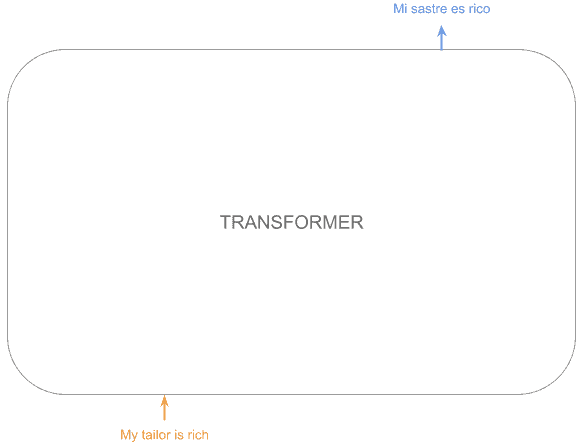

        本质上这是一个大的编码器-解码器模型，输入序列进入一个大的编码块，为每个标记获取丰富的嵌入，然后输入解码块以获得输出。

        因此，转换器的图看起来是这样的：

        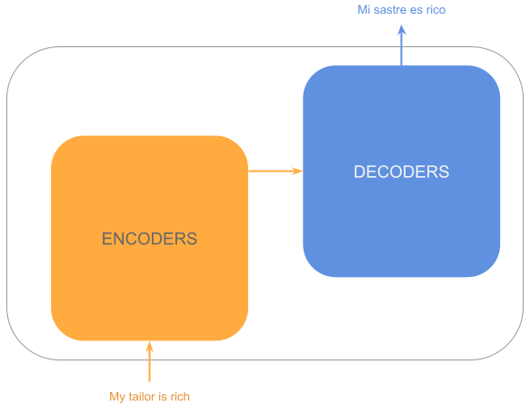

        现在，每个编码/解码块实际上都包含许多堆叠的编码器/解码器。这样，最初的几层可以捕捉到更基本的模式，而最后几层则可以检测到更复杂的模式，类似于卷积网络：

        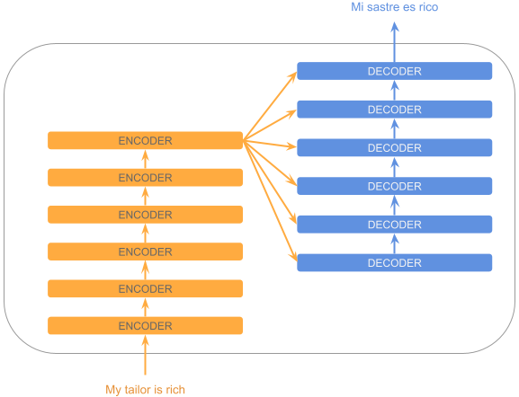

        我们可以看到，每个解码器都会使用最后一个编码器的输出。

    2. 输入

        编码器不能直接处理文本，而是处理向量。那么我们如何获得这些向量呢？

        必须将文本转换成属于固定词汇的标记。

        然后，使用固定的表示法（如 word2vec 或[其他表示法](https://www.baeldung.com/cs/convert-word-to-vector)）将词组转换为嵌入向量。

        但是，由于我们是一次性处理序列，我们如何知道标记在序列中的位置呢？为了解决这个问题，转换器为每个标记嵌入添加了一个位置编码矢量，从而得到一个带有位置信息的特殊嵌入。

        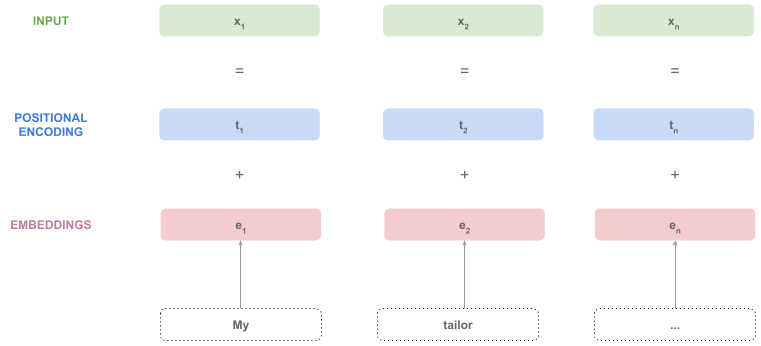

        这些向量可供编码器使用。

    3. 编码器栈

        编码器接收序列 $\{\vec{x}_1,\vec{x}_2,\dots,\vec{x}_n\}$ 中每个标记的一个向量，并返回与输入序列 $\{\vec{x'}_1,\vec{x'}_2,\dots,\vec{x'}_n\}$ 形状相同的新向量。

        直观地说，编码器返回的是相同的输入向量，但 "富含"了更复杂的信息。

        因此，现在我们有一个黑盒子，每个标记接收一个向量，每个标记返回一个向量：

        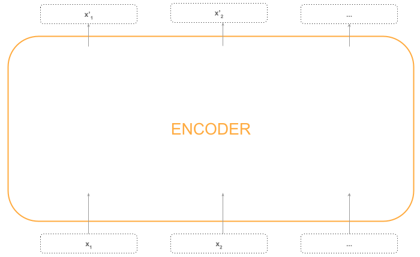

        让我们打开这个盒子，看看里面有什么。

        编码器的第一层是自我注意(self-attention)层，这是编码器最重要的部分。这一层可以检测出同一序列中的相关标记，无论它们距离多远。

        例如，在句子中 "猫在垫子上。它吃了很多食物"中，"它"指的是猫，而不是垫子，因此注意机制在处理标记 "它"时会权衡标记 "猫"。

        由于注意力层需要整个序列，因此这部分过程是顺序进行的：

        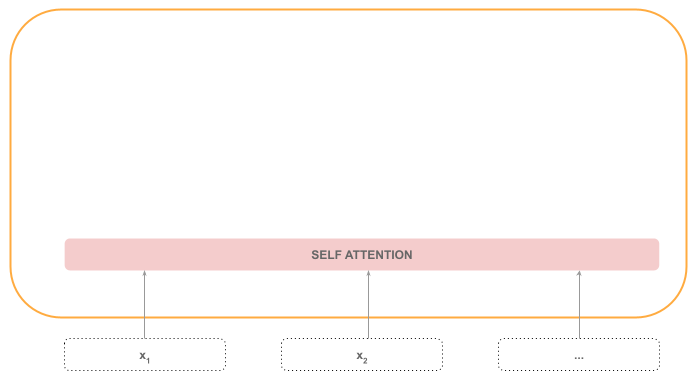

        接下来，我们会发现一个 "Add & Normalize"层，它将自我注意输出与输入序列相加，然后将其归一化。这部分处理也是顺序进行的，因为归一化步骤需要整个序列。

        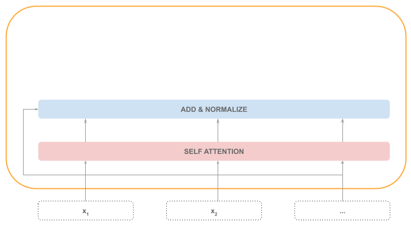

        之后，每个标记由前馈(feed-forward)神经网络处理，这一步骤可以并行处理：

        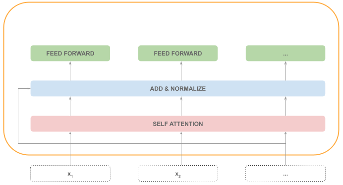

        最后，使用前馈步骤的输入和输出执行另一个添加和归一化(Add & Normalize)步骤：

        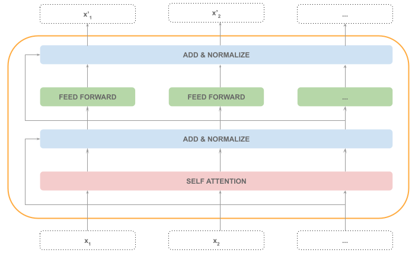

        在下图中，我们可以看到编码器内部顺序（灰色）和并行（橙色）步骤的分布：

        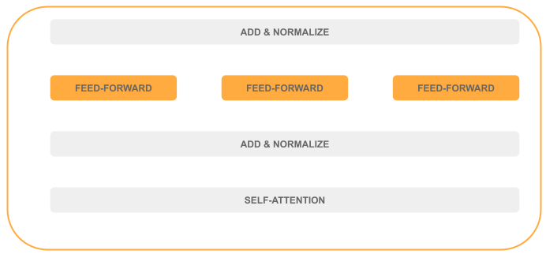

        当前的编码器输入 $\{\vec{x}_1,\vec{x}_2,\dots,\vec{x}_n\}$ 将被处理并产生下一个输入：$\{\vec{x'}_1,\vec{x'}_2,\dots,\vec{x'}_n\}$除了最后一个编码器，它的输出将被视为整个编码堆栈的输出。

        下面的动画演示了这一过程：

        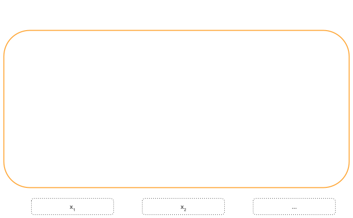

    4. 解码器堆栈

        解码器与编码器相似，但多了一个编码器-解码器关注层。

        每个解码器的输入为：

        - 先前生成的序列
        - 编码器的输出

        将其视为一个黑盒子，看起来就像这样：

        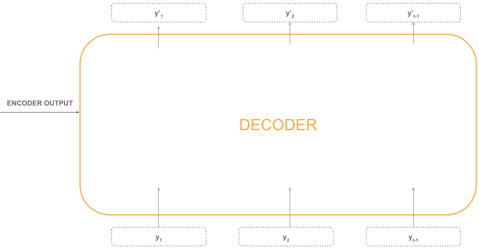

        让我们来分析一下解码器的内部结构。

        第一层还是自注意层，因此执行是有顺序的。解码器的自我注意层与编码器的自我注意层不同，因为我们没有整个序列。

        输出序列是逐个令牌创建的，所以当我们处理位置为 "t"的令牌时，我们只有从开始到前一个位置的序列： $\{\vec{y}_1, \vec{y}_2, \dots, \vec{y}_{t-1}\}$。

        之后，我们就有了已经很熟悉的：添加和归一化(Add & Normalize)层。

        下一步是解码器的关键步骤：编码器-解码器注意(encoder-decoder attention)层。

        这种注意力机制能让我们深入了解输入序列中哪些标记与当前输出标记更相关。

        这一步骤是连续的，之后是 "添加和归一化(Add & Normalize)"层。

        最后，我们还有一个前馈层（可并行化(parallelizable)），之后是一个 "添加和归一化(Add & Normalize)"层。

        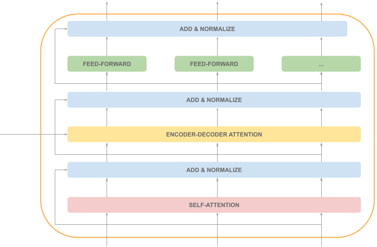

        我们可以看到，大部分解码器处理都是顺序进行的（灰色），只有一层可以并行处理（橙色）：

        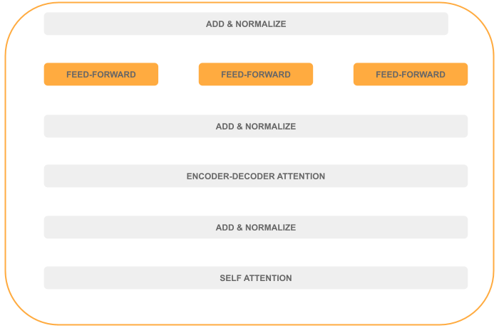

        当前的解码器输入 $\{\vec{y}_1,\vec{y}_2,\dots,\vec{y}_{t-1}\}$ 将被处理并产生输出： $\{\vec{y'}_1,\vec{y'}_2,\dots,\vec{y'}_{t-1}\}$, 这将为下一个解码器提供信息。

        最后一个解码器连接到输出层（我们很快就会讲到），生成下一个输出标记。这个过程一直持续到生成的标记是一个特殊的标记，表示 "句子结束"。

        这段动画总结了解码器的过程：

        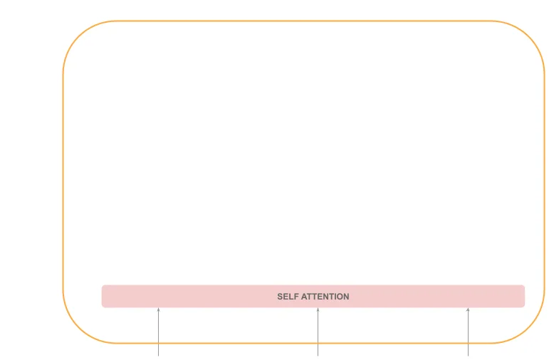

    5. 输出

        我们了解到，解码器会为正在处理的位置之前的标记生成一个输出向量列表。因此，$\{\vec{y}_1,\vec{y}_2,\dots,\vec{y}_{t-1}\}$将被处理，产生一个类似的序列： $\{\vec{y'}_1,\vec{y'}_2,\dots,\vec{y'}_{t-1}\}$ 但是从语义上来说，这个序列更加丰富。

        如果这些标记代表已经生成的序列，那么我们如何生成下一个标记呢？

        解码器堆栈会输出一个浮点数向量。该向量连接到线性层，这是一个全连接的神经网络，将输出向量投射到一个与词汇量大小相同的大向量中。该向量被命名为"logits"向量，包含词汇表中每个标记的得分。

        最后，该层连接到 Softmax 层，从而将分数转换为概率。这样，我们就有了一个包含每个标记成为序列中下一个标记的概率的向量。我们要做的就是选取概率向量中概率最高的标记。

        让我们用图表来表示：

        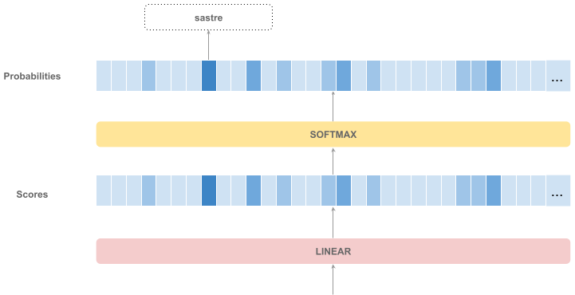

4. BERT

    1. 说明

        BERT 只是一个预训练的变换器编码器栈。

        它是 NLP 领域最大的成就之一，因为它只需少量训练，就能针对我们的特定任务对模型进行微调。

        这相当于图像处理中的预训练模型，我们无需太多训练就能对新对象进行分类，因为已经提供了学习更多基本特征的最大训练工作量。

        同样，我们可以在 BERT 输出的基础上添加几个密集层，创建一个不同语言领域的分类器。这需要一些时间来适应词汇、语法、语言模型等方面的差异，但基本的学习已经包含在模型中了。

    2. BERT 如何运行

        要使用 BERT，我们需要一个包含两个特殊标记的词汇表：[CLS] 和 [SEP]。

        第一个输入标记必须是代表 "分类"的特殊 [CLS] 标记，而序列必须以代表 "分隔符"的 [SEP] 标记结束。

        请注意，BERT 总是接收固定的向量序列（一般大小为 512），因此如果序列较短，我们需要指明序列的结束位置。

        请看下图示例：

        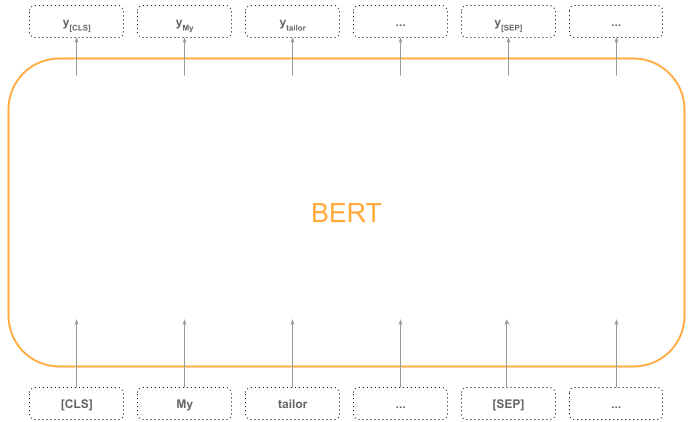

    3. 文本嵌入

        如果我们需要一个代表每个标记的向量，可以直接使用编码堆栈模块产生的相应输出向量（上图中的"y"向量）。

        如果我们需要一个代表整个序列的向量，有三种策略可供选择：

        - 使用 [CLS] 标记输出向量
        - 在标记向量之间应用均值池化
        - 在标记向量之间应用最大池化

        默认策略是第一种，但有些论文认为[其他两种策略对其他任务最有效](https://arxiv.org/abs/1908.10084)。

5. 结论

    在本教程中，我们了解了什么是变换器、变换器的构建模块，以及为什么变换器能如此出色地工作，这都要归功于变换器先进的注意力模型。

    最后，我们简要了解了什么是 BERT，以及如何使用它获取文本嵌入向量。
