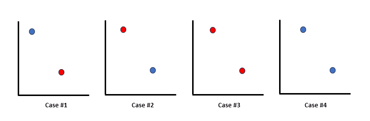
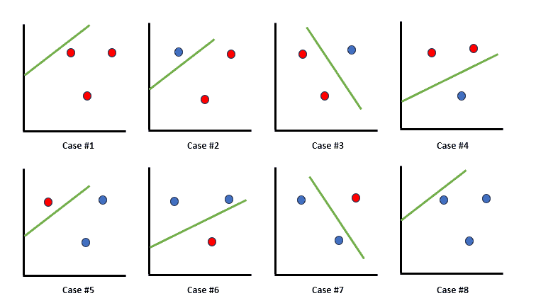
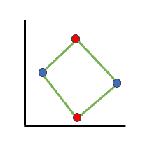
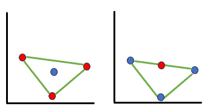

# 如何计算分类器的 VC-维度？

[机器学习](https://www.baeldung.com/cs/category/ai/ml)

[决策树](https://www.baeldung.com/cs/tag/decision-trees) [神经网络](https://www.baeldung.com/cs/tag/neural-networks) [SVM](https://www.baeldung.com/cs/tag/svm)

1. 简介

    在[机器学习]和统计学领域，VC 维度是一个关键概念，它衡量了学习算法在不过度拟合的情况下适应各种数据模式的能力。

    在本教程中，我们将深入探讨 VC 维度的基本原理。

2. VC 维度的基本原理

    VC 维度是 Vapnik-Chervonenkis 维度的缩写，我们可以用它来衡量算法粉碎点集的能力。从本质上讲，它量化了假设空间的复杂度，表示算法能以所有可能方式分离的最大点数。

    这一概念围绕着分类器无差错地适应任何数据点二分法的能力这一概念展开。例如，如果一个分类器可以准确地分离任何标记点的排列，将它们归入正分类或负分类而不会出现分类错误，那么该分类器和数据集的 VC 维度就很高。

3. 分类器系列和假设空间

    不同系列的分类器具有不同的 VC 维度。此外，支持向量机（[SVMs](https://www.baeldung.com/cs/ml-support-vector-machines)）、决策树（[DTs](https://www.baeldung.com/cs/decision-trees-vs-random-forests)）和神经网络（[NNs](https://www.baeldung.com/cs/ai-convolutional-neural-networks)）等分类器具有不同的假设空间，对复杂模式的建模能力也不同，因此表现出不同的 VC 维度。

    此外，假设空间是指学习算法所能代表的所有可能分类器的集合。假设空间越大、越复杂，VC 维度就越高，表明其具有更强的过拟合或拟合数据中更复杂模式的能力。

4. 计算 VC 维度

    VC 维度评估二元分类器的能力。此外，它还决定了分类器可以粉碎的点的最大数量，这意味着它可以正确标注该点集合的所有可能的 $2^n$ 标签。

    值得注意的是，如果一组 n 个点可以被粉碎，而没有一组 n+1 个点可以被粉碎，那么 VC 维度就是 n。

    1. 两点判定

        假设有两点 $x_1$ 和 $x_2$，其中 $x_1 < x_2$。因此，有 $2^2 = 4$ 种可能的标注如下：

        - 两点都标为 1：$x_11,x_21$
        - 两个点都标为 0： $x_1:0,x_2:0$
        - 第一个点标记为 1，第二个点标记为 0：$x_1:1,x_2:0$
        - 第一个点标记为 1，第二个点标记为 0： $x_1:0,x_2:1$

        

        所有这些标签都可以通过分类器假设 H 来实现，方法是设置参数 $a < b\in\mathbb{R}$ 以正确分类以下排列的标签：

        - $a < x_1 < x_2 <b$
        - $x_1 < x_2 < a < b$
        - $a < x_1 < b < x_2$
        - $x_1 < a < x_2 < b$

        现在，$x_1<x_2$ 的假设可以不失一般性，但只要找到一个可以被打破的集合就足以建立 VC 维度。

    2. 三点的确定

        对于三个任意点 $x_1、x_2$ 和 $x_3$（假设 $x_1 < x_2 < x_3$），无法实现标注 (1, 0, 1)。此外，当 $x_1 : 1, x_2 : 0$ 时，意味着 $a< x_1 < b < x_2$，随后意味着 $x_3 > b$，要求 $x_3$ 的标注为 0。

        考虑到超平面（2D 中的线），情况就更清楚了。有了超平面，无论标注如何，一组三个点总能被正确分类：

        

    3. 四点判定

        对于 3 点的所有 8 种可能的标注，超平面都能完美地将它们分开。但是，对于 4 个点，不可能找到一个可以正确分类所有 16 种可能标签的集合。

        现在假设这 4 个点组成了一个有四条边的图形。那么，如果我们给对角贴上相同的标签，就不可能找到一个超平面能正确地将这些点分开：

        

        如果这些点组成了一个有四条边的图形，那么同样标注对角也无法正确分开。因此，三角形的形成或线段的形成，展示了超平面无法实现某些标注的情况：

        

        总之，涵盖二维中 4 个点的所有可能形式表明，任何 4 个点的集合都不可能被打破。因此，在这种情况下，VC 维度必须是 3。

5. 应用与挑战

    VC 维度在生物信息学、金融、[自然语言处理](https://www.baeldung.com/cs/nlps-word2vec-negative-sampling)和[计算机视觉](https://www.baeldung.com/cs/cv-compute-distance-from-object-video)等各个领域都有很多应用。

    生物信息学在基因表达数据分析中受益匪浅，金融学在预测市场趋势中找到了帮助，而计算机视觉则利用它增强了物体识别能力。

    尽管 VC 维度应用广泛，但它也有局限性。计算复杂模型的 VC 维度可能很困难，而且所提供的理论界限并不总是与现实世界的性能相一致。此外，在高维空间中，计算 VC 维度的计算成本也很高。

6. 结论

    在本文中，我们探讨了作为理解学习算法复杂性及其泛化能力的基本概念的 VC 维度。

    通过量化分类器拟合不同模式的能力，它可以指导模型选择，揭示过拟合风险，并有助于在机器学习应用中做出明智的选择。
