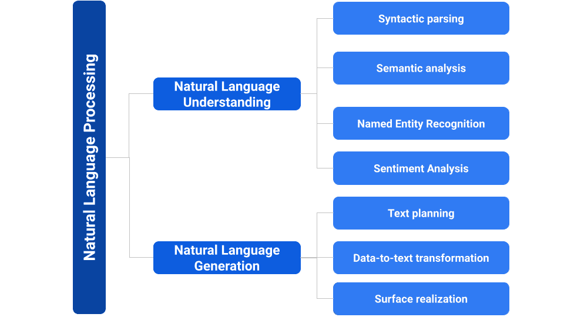

# [NLP vs. NLU vs. NLG](https://www.baeldung.com/cs/natural-language-processing-understanding-generation)

人工智能

自然语言处理

1. 概述

    自然语言理解（Natural Language Understanding, NLU）和自然语言生成（Natural Language Generation, NLG）都是自然语言处理（Natural Language Processing, NLP）领域的重要研究课题。不过，NLU 的目的是从给定的语句中提取核心语义，而 NLG 则相反，其目标是根据给定的语义构建相应的句子。此外，NLP 允许计算机使用和理解人类语言。

    在本教程中，我们将通过一些例子来介绍 NLP、NLU 和 NLG 之间的区别。

2. 什么是 NLP？

    NLP 是指涉及计算机与人类语言之间交互的研究领域。它侧重于开发算法和模型，使计算机能够理解、解释和处理自然语言数据。

    现在让我们来介绍一下 NLP、[NLG](https://www.marketingaiinstitute.com/blog/the-beginners-guide-to-using-natural-language-generation-to-scale-content-marketing) 和 [NLU](https://www.ibm.com/cloud/watson-natural-language-understanding) 之间的关系以及各自的基本要素：

    

    1. 文本分类

        文本分类是将文本数据归入预定义类别的过程。下面是一些例子：

        - 根据文本中表达的情感，将客户评论分类为正面情感或负面情感
        - 根据内容将新闻文章分为体育、政治或娱乐类
        - 确定特定文本所使用的语言，如英语、西班牙语或法语

    2. 信息提取

        信息提取是从非结构化文本中识别和提取结构化信息的任务。下面是一些例子：

        - 提取姓名、日期和地点，创建结构化的事件数据库
        - 从简历中提取电话号码、电子邮件地址和地址，以填充求职申请表
        - 提取文本中提到的特定事件或事故的信息

    3. 机器翻译

        机器翻译是利用计算算法将文本从一种语言自动翻译成另一种语言的过程。下面是一个例子：

        Input: “I’m going to the cinema”
        Output: “Je vais au cinéma”

    4. 问题解答系统

        问题解答系统旨在根据现有信息自动为用户的询问提供答案。下面是一个例子：回答 “What is the capital of France?” 这样的问题，得到的回答是 “Paris”。

        然而，NLP 技术旨在缩小人类语言与机器语言之间的差距，使计算机能够以有意义的方式处理和分析文本数据。

3. 什么是 NLU？

    NLU 是 NLP 的一个子领域。它关注计算机从人类语言中理解和提取意义的能力。它涉及开发能够准确解释和理解文本或语音中表达的意图、实体、上下文和情感的系统和模型。然而，NLU 技术采用的方法包括语法分析、语义分析、命名实体识别和情感分析。

    1. 句法分析

        句法分析是对句子的语法结构进行分析，以确定单词之间的关系及其在句子中的作用的过程：

        例如，确定在句子 “The cat chased the mouse,” 中，“cat” 是主语，“chased” 是动词。
        例如，确定句子 “John eats an apple” 中的主语、动词和宾语。
        输入： “The cat chased the mouse.”
        输出： 根：chased, 从属关系： $\text{det(cat, The)}, \text{nsubj(chased, cat)}, \text{det(mouse, the)}, \text{dobj(chased, mouse)}$

    2. 语义分析

        语义分析是通过考虑上下文和词语之间的关系来理解和解释文本含义的过程。它指的是理解文本字面解释之外的含义的过程。下面是一些例子：

        解释 “She loves dogs” 意味着对狗的好感
        理解 “hot as fire” 这个短语意味着极端的热而不是真正的火焰
        输入： “John eats an apple.”
        输出： Output: Predicate: “eat”, Arguments: Agent: “John”, Patient: “apple”

    3. 命名实体识别（NER）

        命名实体识别（NER）是对文本中的命名实体（如人名、组织名称、地点、日期和其他特定实体）进行识别和分类的任务。下面是一些例子：

        在句子 “Apple Inc. is a technology company.” 中识别出 “Apple” 是一个组织。
        识别句子 “I visited New York last summer.” 中的地点 “New York”。

        输入： “I live in San Francisco and work for Google."
        输出：[LOCATION: San Francisco], [ORGANIZATION: Google]

    4. 情感分析

        情感分析是确定一段文字所表达的情感基调或情绪的过程：

        - 确定一条推文表达的是喜悦、悲伤还是愤怒
        - 确定一篇影评表达的是正面意见还是负面意见
        - 通过分析客户对新产品、活动或市场趋势的意见来协助市场调研，帮助公司做出明智的商业决策
        - 输入：“I absolutely loved the movie! The acting was superb, and the plot kept me engaged throughout."
        - 输出：Positive sentiment

4. 什么是 NLG？

    NLG 是 NLP 的一个子领域，主要研究计算机如何生成类似人类的语言。NLG 系统将结构化数据或信息作为输入，并生成连贯且与上下文相关的自然语言输出。NLG 被广泛应用于聊天机器人、自动报告生成、摘要系统和内容创建等领域。NLG 算法采用各种技术，将结构化数据转换为自然语言叙述。

    1. 文本规划

        文本规划是 NLG 的一个阶段，在这一阶段要确定生成文本的结构、顺序和连贯性。下面是一些例子：

        - 组织一篇劝说性文章的引言、要点和结论，以创建结构合理、连贯的叙述
        - 按清晰的顺序排列食谱中的步骤，引导读者完成烹饪过程

    2. 数据到文本的转换

        数据到文本的转换涉及将结构化数据转换为自然语言叙述。下面是一些例子：

        - 通过将温度、湿度和降水量等天气数据转换为人类可读的当前天气状况描述，生成天气报告
        - 将销售数字、趋势和分析转化为对公司业绩的叙述性总结，从而生成销售报告

    3. 表面实现

        表面实现是生成文本最终形式的过程，包括语法、选词和语言变化。让我们来看几个例子：

        将 “I will go to the store” 这样的结构表述转换成表面形式 “I’m going to the store.”
        将 “John eats apples” 这样的逻辑形式转换成表面形式 “John is eating apples.”

5. NLP vs. NLU vs. NLG

    让我们来看看 NLP、NLU 和 NLG 之间的区别：

    - NLP 在缩小人类语言与机器之间的差距方面发挥着至关重要的作用
    - 其重要性在于使机器能够理解、解释和生成人类语言，从而促进与用户的有效沟通和互动
    - 自然语言理解涉及对语言输入的理解，使机器能够理解和解释文本或语音背后的含义和意图
    - 自然语言理解侧重于生成类似人类的语言，使计算机能够生成连贯且与上下文相适应的文本或语音输出。
    - 这三个组成部分构成了开发基于语言的智能系统（如聊天机器人、虚拟助手和自动内容生成工具）的基本构件
    - 因此，NLU 可实现有意义的解释，NLP 可处理和分析语言数据，NLG 可促进语言输出的生成。

    在本表中，我们将根据 NLP、NLG 和 NLU 各自的重点和目标来介绍它们之间的区别：

    | 特点 | NLP             | NLU       | NLG          |
    |----|-----------------|--------------|--------------------|
    | 介绍 | NLP 是计算机阅读语言    | NLU 是计算机理解语言 | NLG 是计算机写作语言       |
    | 重点 | 处理和分析语言数据       | 解释和理解语言输入。   | 生成连贯且与上下文相符的文本或语音。 |
    | 输入 | 文本或语音数据         | 文本或语音数据      | 结构化数据或指令           |
    | 输出 | 将非结构化数据转换为结构化数据 | 可读取数据和结构化数据  | 无纸化学习是计算机书写语言      |
    | 应用 | 智能辅助\语言翻译\文本分析  | 语音识别\情感分析    | 聊天机器人\语音助手         |

6. 结论

    总之，NLP、NLU 和 NLG 在人工智能和语言应用领域发挥着重要作用。因此，NLP 包括 NLU 和 NLG，侧重于计算机与人类语言之间的交互。
