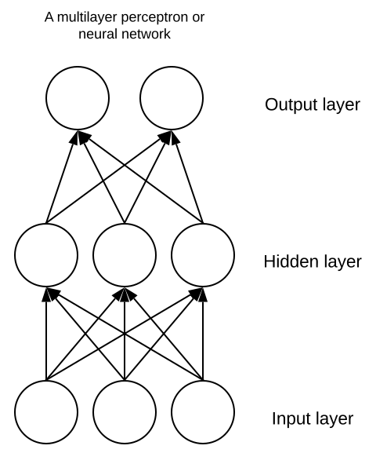
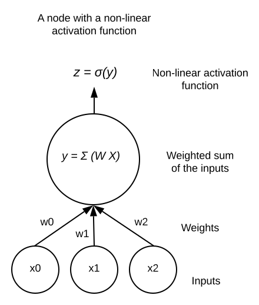
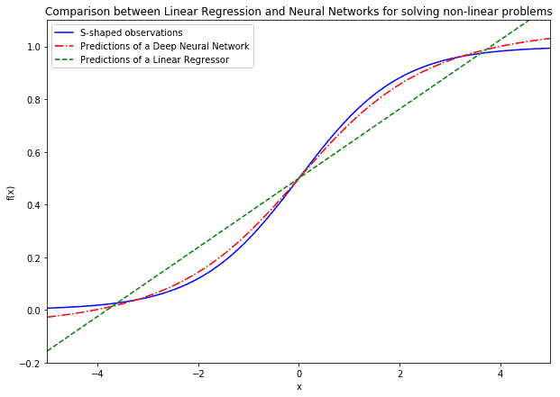
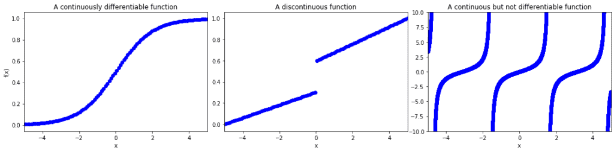
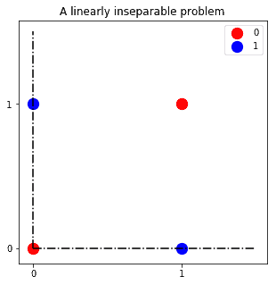
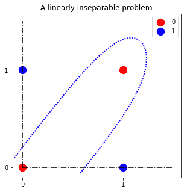
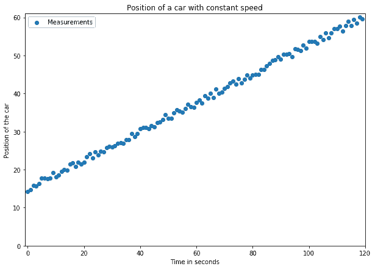
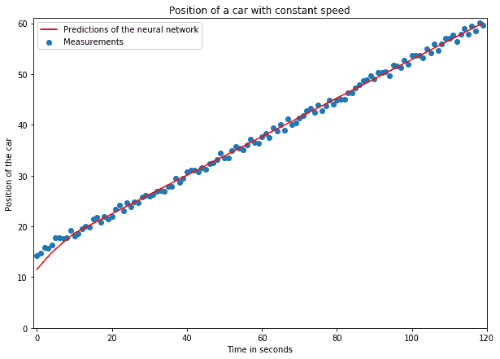

# [神经网络的优缺点](https://www.baeldung.com/cs/neural-net-advantages-disadvantages)

1. 概述

    在本文中，我们将了解在机器学习任务中使用神经网络的主要优缺点。在本文结束时，我们将知道什么时候以及在什么情况下使用神经网络来解决问题是明智之举。我们还将知道，同样重要的是，什么时候应该避免使用神经网络，而改用其他技术。

2. 神经网络

    我们在此讨论的神经网络类型是前馈单层神经网络和深度神经网络。这些类型的网络最初是为了解决线性回归方法失效的问题而开发的。在神经网络的祖先--所谓的感知器--被开发出来的时候，回归模型已经存在，可以提取变量之间的线性关系。

    非线性关系的表示问题一般无法解决。多层感知器，也就是我们今天所说的神经网络，应运而生并提供了解决方案：

    

    前馈神经网络是由节点组成的网络，它们将输入的线性组合从一层传递到另一层。在传递过程中，节点利用给定的激活函数决定如何修改其输入。神经元的激活函数是关键所在。通过选择非线性激活函数，例如下图所示的 logistic 函数 $\sigma(x)$，神经网络可以在其运行中嵌入非线性：

    

    虽然线性回归可以学习线性问题的表示，但对于非线性类问题，则需要具有非线性激活函数的神经网络。因此，神经网络的第一个优势就是可以灵活地处理非线性问题：

    

    这意味着，即使其他类型的机器学习算法已经失败，神经网络通常也可以针对未知形状的问题进行测试。

3. 通用逼近定理及其局限性

    神经网络的第二个优势与其逼近未知函数的能力有关。神经网络的基础定理指出，具有一个隐藏层的足够大的神经网络可以近似任何连续可微函数。如果我们知道某个问题可以用连续函数来建模，那么使用神经网络来解决这个问题就有了意义。

    如果函数的输入和输出都是连续变量，而且函数本身对其域的所有值都定义明确，那么该函数就是连续函数。如果函数的导数是定义好的，并且在函数的所有域中只有一个值，那么这个函数就是连续可微的：

    

    如果我们研究的函数满足连续可微的条件，那么神经网络就可以通过计算其泰勒展开来逼近它。不过，虽然神经网络可以近似任何连续可微分函数，但并不能保证特定网络可以学会这种近似方法。

    鉴于权重的特定初始化，使用损失函数最小化和误差反向传播可能无法学习该近似值。网络最终可能会停留在局部最小值，其准确率可能永远无法提高到某个阈值以上。这就导致了神经网络的一个显著缺点：它们对权重矩阵的初始随机化非常敏感。

4. 没有免费午餐定理

    机器学习中的另一个重要定理指出，任何给定的算法都能很好地解决某些类别的问题，但却完全不能解决其他一些类别的问题。这意味着，对于任何给定的问题，一种特定的神经网络架构可能是有效的，而另一种架构则无法很好地发挥作用。让我们通过比较感知器和深度神经网络对同一问题的处理情况，来了解这意味着什么。

    神经网络擅长解决的主要问题类型是所谓的线性不可分割问题。鉴于感知器的同类产品在这一意义上的失败，最早的神经网络就是明确为了解决其中一个问题而开发的。这个问题就是学习二进制变量的 XOR 函数，其图形表示为："......"：

    

    元神经网络可以学习一个分离超平面来对红蓝观测数据进行分类，而感知器却做不到。图中的超平面就是这样一个超平面：

    

    从另一个角度来看，如果我们不能将问题投射到一个解是线性可分离的超平面上，那么感知器（一种退化的神经网络）就无法解决这个问题。与此同时，深度神经网络（另一种神经网络）却能解决这个问题。

    这是一个更普遍规则的具体案例。如果一种机器学习算法能有效解决一类问题，那么它在解决所有其他问题时就会失效。因此，解决这一问题的方法是，从理论上充分理解机器学习的一般规律，并了解与解决任何特定任务相关的启发式方法。

5. 数据和计算能力

    与其他机器学习算法相比，神经网络的训练需要大量的数据集。神经网络的训练也需要强大的计算能力。例如，著名的用于图像分类的 CNN AlexNet 需要在两台 GPU 上进行六天的训练。

    当数据集或神经网络的规模变得过大时，问题就出现了。随着数据量或神经网络层数和神经元数量的增加，神经网络通常不能很好地扩展。造成这种现象的因素有几个：

    - 神经网络通常具有非线性激活函数。在误差的反向传播过程中，非线性激活函数的梯度计算代价高昂。
    - 向神经网络提交训练数据的顺序会影响结果。神经网络往往会陷入损失函数的局部最小值。解决这个问题的方法是在随机批次的训练数据集上对网络进行多次训练，但这需要将训练尝试次数增加数倍。
    - 另一个问题与网络的权重有关。随着神经网络规模的增大，权重矩阵的扩展速度会超过线性扩展速度。
    - 最后，神经网络架构也不尽相同。不同的架构在解决同一问题时可能会有相当的准确性，但所需的计算量却大相径庭。这就意味着，我们经常会通过反复试验来寻找最有效的架构，但我们却很少从理论上理解它为什么能发挥作用。

    最后，我们可以提到神经网络是典型的黑盒系统。虽然它们可以学习数据集的抽象表征，但人类分析师很难解读这些表征。这意味着，虽然神经网络原则上可以进行准确的预测，但我们不太可能通过它们获得关于数据集结构的见解。

6. 寻找问题的分析解决方案

    1. 我们对问题有哪些背景知识？

        使用神经网络还有另一个主要缺点。这一次，问题更多地与人类程序员的偏见有关，而不是严格意义上的信息论。对于许多常见任务来说，机器学习是过度的，也是不必要的。这与神经网络没有特别的关系，但它是影响数据科学界的一个普遍问题，并导致神经网络的过度使用。

        当我们可以用分析方法来解决问题时，神经网络就会被滥用，这种情况屡见不鲜。这个问题在当今的机器学习行业非常普遍，但却经常被忽视。因此，我们在此强调这一点至关重要。让我们以下面的问题为例：

        

        在这个问题中，一辆汽车以恒定的速度在街道上行驶。我们的目标是预测它在稍后时间 $t_F$ 的位置。为此，我们首先要在多个时间间隔内测量汽车的位置，并获得上图所示的测量结果。

        这样就得到了一个足够大的数据集，然后我们就可以在这个数据集上应用神经网络进行线性回归。上图中的数据集包含测量误差，与现实世界中的任何数据集一样。

        然后，我们将数据集分为训练数据集和测试数据集。在训练数据集上，我们训练一个深度神经网络，并根据测试数据集测量其准确性。经过数千次历时训练后，该网络学会了输入时间 t 和输出位置 x 之间存在以下关系：

        

        乍一看，这似乎是一个不错的结果，但如果我们对工作过程进行更深入的分析，结果可能并非如此。

    2. 尽可能寻找分析解决方案

        在机器学习任务中，我们可以测量系统的准确性。如果这样做，我们就能测出非常高的准确率，并称之为非常了不起的结果。不过，这也会非常琐碎。基本的物理学领域知识会建议我们简单地分析解决问题。既然速度是恒定的，那么 $\frac{\delta x}{\delta t} = v$ 和 $x_F = x_0 + v \cdot t_F$，我们可以用手计算出来。

        像这样的情况在实践中并不少见，我们应该牢记。在处理新问题时，我们不应该直接尝试使用机器学习。在此之前，我们应该查阅文献，看看是否已经有了分析解决方案。如果没有，我们应该首先考虑自己开发，然后再尝试使用机器学习。

        因此，一般来说，我们不应该首先应用神经网络来解决问题。如果分析解决方案未知，我们才应该考虑首先应用较简单的机器学习算法，其次才是神经网络。

7. 结论

    在本文中，我们已经了解了应该或不应该在任务中应用神经网络的一些原因。

    根据通用逼近定理，我们知道神经网络可以逼近任何连续可微函数。这并非对所有机器学习算法都有效，尤其是神经网络的一个重要优势。然而，我们并不能保证神经网络能够学会这种近似方法。

    无免费午餐定理告诉我们，某种网络架构将是解决特定问题的最佳方案。我们也知道，同样的架构也会是其他问题的错误解决方案。

    由于当今的数据量和计算能力过大，神经网络变得越来越普遍。如果数据或计算能力不足，我们应该使用其他机器学习算法。

    有些问题可以用分析方法解决，不需要机器学习。在这种情况下，如果我们能找到分析解决方案，就不应该使用神经网络。