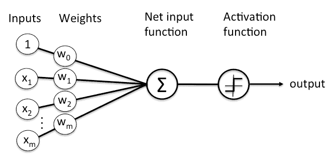
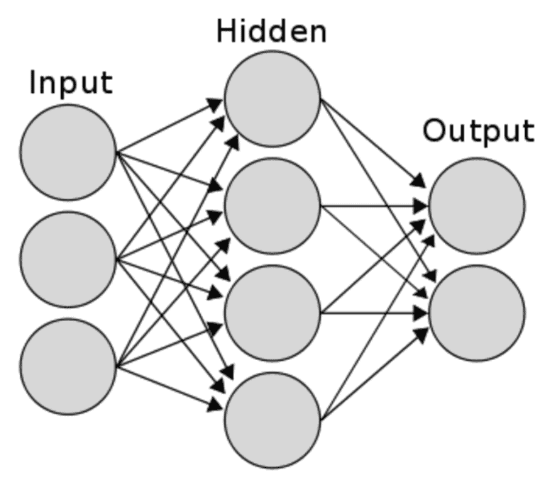

# [神经网络中纪元与迭代的区别](https://www.baeldung.com/cs/neural-networks-epoch-vs-iteration)

1. 简介

    在本教程中，我们将简单解释神经网络及其类型。然后，我们将讨论 epoch、迭代和其他一些术语之间的区别。

2. 什么是神经网络？

    1. 定义

        让我们从一个简单的例子开始。我们有一组狗和猫的图像。我们需要一个计算机应用程序，它能从这些图像中学习何时判断图像是狗还是猫。因此，当我们出现一个应用程序从未见过的新图片时，它就能分辨出图片上是狗还是猫。

        在前面的例子中，我们模拟了教孩子如何区分猫狗的过程。这只是一个分类问题，也是神经网络最常见的任务之一。

        神经网络是一组分层的算法，用于识别输入数据中的基本模式。它们所识别的模式是数字模式，包含在向量中，所有现实世界的数据，无论是图像、声音、文本还是时间序列，都被纳入其中。

        神经网络是深度学习的大脑。深度学习是一个科学的、最复杂的术语，它概括了我们开始提到的“猫狗”例子。

        神经网络和深度学习的应用与图像处理、自然语言处理、语音识别、自动驾驶汽车和机器人技术密切相关。

        与其他事物一样，神经网络也有其利弊。

    2. 结构

        神经网络由若干层组成，每层由一组节点组成，节点是进行计算的地方。

        任何节点都会接收一个输入矢量以及矢量值的权重，然后应用某些函数并将输出发送到下一层。下图显示了一个简单的节点：

        

        一组节点构成一个层，基本的神经网络由三层相互连接的节点组成：输入层、隐藏层和输出层。下图显示了一个简单神经网络的外观：

        

    3. 类型

        根据各层节点的连接方式、数据在网络中的传播方式、网络学习模式的方式以及网络对所学知识的记忆程度，神经网络的名称和类型会发生变化。

        神经网络有多种类型。其中一些类型包括：前馈（FF）、循环神经网络（RNN）、长短期记忆（LSTM）和卷积神经网络（CNN）。

3. 基本神经网络术语

    1. 时程

        神经网络通过读取输入数据集并对其进行不同的计算来学习输入数据的模式。但是，神经网络并不是只学习一次，而是一次又一次地利用输入数据集和前几次试验的结果进行学习。

        从输入数据集学习的每一次跟踪都称为一个纪元。

        因此，一个历元指的是整个训练数据集的一个循环。通常情况下，训练一个神经网络需要几个历元以上的时间。增加epoch次数并不总是意味着网络会得到更好的结果。

        因此，我们基本上是通过试错来选择几个在几个周期后结果仍然相同的历元。

    2. 迭代

        对于每个完整的 epoch，我们都会进行多次迭代。迭代是指完成一个 epoch 所需的训练数据包的批次或步数。

    3. 批次

        批次是指一次迭代中训练样本或示例的数量。批量越大，我们需要的内存空间就越大。

4. 通过示例进行区分

    总而言之，让我们回到“猫狗”的例子。如果我们有一个总计 100 万张图片的训练集，那么一次将它们全部输入网络就是一个很大的数据集。在训练网络时，内存中的数据量会不断增加。因此，我们要将数据集分成若干部分或批次。

    如果我们将批次大小设置为 50K，这意味着网络需要 20 (1M/50K) 次迭代才能完成一个 epoch。

5. 结论

    在本教程中，我们介绍了神经网络的定义、基本结构和几类名称。然后，我们介绍了epoch、迭代和批量大小之间的区别。
