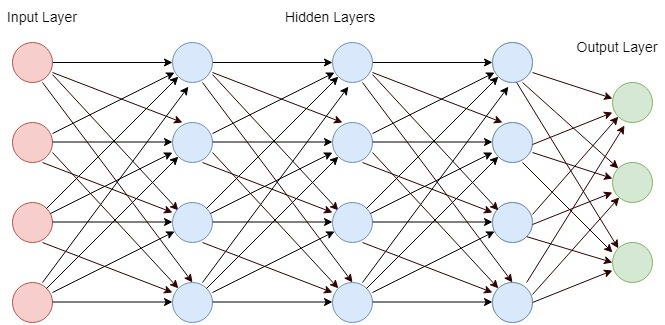
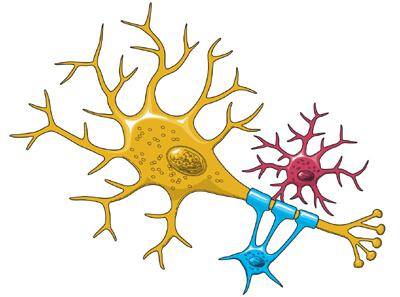
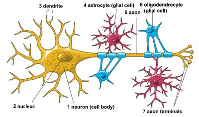
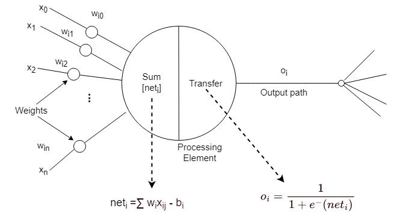
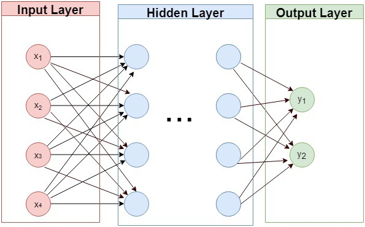
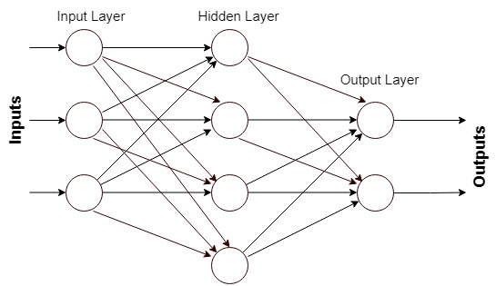
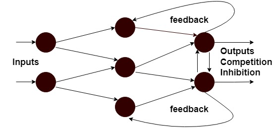

# 神经网络中的神经元

[人工智能](https://www.baeldung.com/cs/category/ai)

[神经网络](https://www.baeldung.com/cs/tag/neural-networks)

1. 引言

    在神经网络中，神经元是最基本的处理单元。它也被称为感知器。神经网络以人脑的工作方式为基础。因此，我们可以说，它模拟了生物神经元之间相互发出信号的方式。

    在本教程中，我们将从生物和人工神经网络两个方面来研究神经元。

2. 神经网络术语

    通常，从生物学的角度来看，我们发现神经元是中枢神经系统和人脑的一部分。

    除了生物界，在计算机科学的人工神经网络领域，神经元是一组输入、一组权重和一个激活函数的集合。它将这些输入转化为一个输出。另一层神经元将该输出作为其输入，如此循环往复。从本质上讲，我们可以说每个神经元都是一个数学函数，它密切模拟了生物神经元的功能。

    下图显示了一个典型的神经网络：

    

3. 了解神经元

    有了这些背景知识，我们现在开始深入研究生物神经元和人工神经元。

    1. 生物神经元

        我们可以将神经元定义为利用电脉冲和化学信号传递信息的信息载体。神经元在以下两个方面传递信息：

        - 大脑的不同部分
        - 大脑和神经系统

        因此，我们所想、所感以及后来所做的一切都要归功于神经元的工作。

        下[图](https://www.ninds.nih.gov/health-information/patient-caregiver-education/brain-basics-life-and-death-neuron)显示了一个典型的生物神经元：

        

        让我们简要回顾一下神经元的结构。神经元由以下三个基本部分组成：

        - 细胞体
        - 细胞延伸 轴突
        - 细胞延伸 树突

        下[图](https://www.ninds.nih.gov/health-information/patient-caregiver-education/brain-basics-life-and-death-neuron)显示了生物神经元的结构：

        

        细胞体中的细胞核控制细胞的功能。轴突延长线（有长长的尾巴）从细胞中传递信息。树突延伸部分（像树枝一样）为细胞接收信息。

        因此，我们可以概括地说，生物神经元之间的通信是通过相邻神经元的轴突和树突之间的微小空间（称为突触）发送化学物质（称为神经递质）来实现的。

    2. 人工神经网络中的神经元

        在了解了生物神经元之后，让我们来看看人工神经元。

        人工神经元或神经节点是一个数学模型。在大多数情况下，它会计算其输入的加权平均值，然后对其进行偏置。之后，它将结果项通过一个激活函数。该激活函数是一个[非线性函数](https://www.baeldung.com/cs/ml-nonlinear-activation-functions)，如 sigmoid 函数，它接受线性输入并给出非线性输出。

        下图显示了一个典型的人工神经元：

        

4. 神经元和神经网络

    典型的神经网络由称为神经节点的神经元层组成。这些层有以下三种类型：

    - 输入层（单一）
    - 隐藏层（一个或多个）
    - 输出层（单一）

    每个神经节点都与另一个神经节点相连，并以其权重和阈值为特征。它获取一个输入，并对其进行一些转换，然后发送一个输出。如果任何单个节点的输出高于指定的阈值，该节点就会被激活。然后，它向下一层网络发送数据。否则，它将保持休眠状态，因此不会向下一层网络传输任何数据。

    下图标出了所有三种类型的层：

    

    现在，让我们来看看神经网络的每一层类型。

    1. 输入层

        这是典型神经网络的第一层。输入层神经元接收输入信息，通过数学函数（激活函数）对其进行处理，并根据与预设阈值的比较将输出传送给下一层神经元。我们通常只在网络中设置一个输入层。

        我们对文本、图像、音频、视频和其他类型的数据进行预处理，得出它们的数字表示。之后，我们将这些数字表示作为信息传递给每个输入层神经元。然后，每个神经元应用预定义的非线性数学函数计算输出。

        最后，我们通过与输出层神经元和输入层神经元之间的边缘相连的预设权重来缩放输出。

    2. 隐藏层

        然后是[隐藏层](/ai/ml/deep-learning/hidden-layers-neural-network-zh.md)。神经网络中可以有一个或多个隐藏层。隐藏层中的神经元从输入层的神经元或前一个隐藏层的神经元接收输入。然后，每个神经元将输入传递给另一个非线性激活函数，之后将输出发送给下一层神经元。

        在将数据传输到下一层时，我们还会将数据乘以边缘权重。

    3. 输出层

        最后是输出层。网络中只有一个输出层，它标志着神经网络的逻辑终点。

        与之前描述的层类似，输出层的神经元接收来自前几层的输入。然后，它们通过新的激活函数进行处理，并输出预期结果。根据人工神经网络的不同类型，我们既可以将输出结果作为最终结果，也可以将其作为同一神经网络（回环）或另一神经网络（级联）的输入。

        现在，让我们来谈谈输出层的结果。我们可以将最终结果作为简单的二元分类，表示两类中的一类，也可以进行[多类分类](https://www.baeldung.com/cs/svm-multiclass-classification)。我们也可以将最终结果用作预测值。

        此外，根据人工神经网络的类型，最终输出可以用作最终结果，也可以用作同一神经网络或另一神经网络新循环的输出。

5. 神经网络的类型

    在这里，我们将根据信息流的方向研究不同类型的神经网络。

    1. 前馈神经网络

        我们首先来讨论[前馈神经网络](https://www.baeldung.com/cs/neural-networks-backprop-vs-feedforward)。

        在这里，我们会发现信号或信息只以一种方式传播。在前馈神经网络中，信息流从输入层开始到隐藏层，最后到达输出层。其中没有反馈或循环。

        换句话说，我们可以说，在这种网络中，l 层的输出不会对 l 产生任何影响。但是，l 的输出会影响其前面各层的输出。前馈神经网络是一种简单直接的网络。它们在输入和输出之间具有一一对应的映射关系。

        下图显示了一个典型的前馈神经网络：

        

        我们通常将其用于模式生成、模式识别和分类。

    2. 反馈神经网络

        介绍完前馈神经网络后，我们再来看看反馈神经网络。

        在这类网络中，信号或信息是双向流动的，即向前和向后。这使得它们比前馈神经网络更强大、更复杂。

        反馈神经网络是动态的，因为网络状态会不断变化，直到达到平衡点。在输入保持不变之前，它们一直处于平衡点。一旦输入发生变化，这一过程就会继续下去，直到找到新的平衡点。

        由于其动态架构，我们也称这些网络为交互式网络或递归网络。此外，我们还能在这些网络中发现反馈回路。

        下图显示了一个典型的反馈神经网络：

        

        我们通常将它们用于语音识别、文本预测和图像识别。

6. 神经网络的优势

    在本节中，我们将列举神经网络的优势。

    神经网络具有从复杂或不精确的数据中获取量化意义的独特能力。我们可以利用结构良好的神经网络来提取模式，并检测其他计算机技术无法发现和理解的复杂趋势。

    一旦我们为特定问题设计了一个网络，并用[精心收集的数据集](https://www.baeldung.com/cs/ml-labeled-vs-unlabeled-data)对其进行训练，那么我们就可以用它来分析复杂的信息。通过对所有可能发生的情况进行预测，这将有助于做出最高级别的决策。

    神经网络的最大优势在于它具有[自适应学习](https://www.baeldung.com/cs/ensemble-learning)能力。我们可以将其理解为，神经网络能够根据训练数据学习如何完成任务，并在获得越来越多的数据后不断改进其性能。

7. 结论

    在本文中，我们研究了人工神经元的结构和功能。此外，我们还了解了神经网络的结构、层和类型，并讨论了它们的几个重要优点。

    我们可以得出这样的结论：就像生物神经元一样，人工神经元是底层神经网络的电池，使其能够完美运行。
