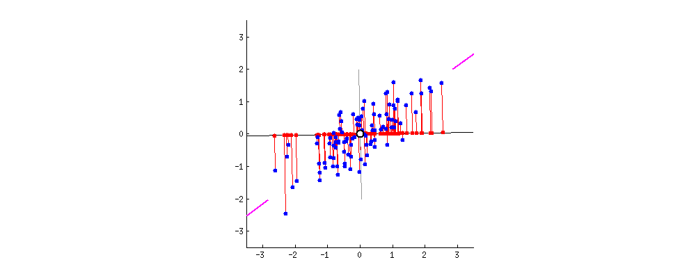

# [PCA：主成分分析](https://www.baeldung.com/cs/principal-component-analysis)

1. 引言

    顾名思义，主成分分析（PCA）就是找出模型的主要方面。

    在本教程中，我们将从三个不同层面介绍 PCA。首先，PCA 给了我们什么样的答案和信息，我们该如何使用它们？其次，我们将简要介绍如何对 PCA 进行编程以及执行 PCA 所需的算法。第三，我们将深入探讨 PCA 方法背后的直觉和技术。

2. PCA 概述

    假设我们有大量数据，这些数据由大量参数组成，这些参数描述了模型中的某些内容。从直观上讲，我们知道有些参数会对问题产生影响，而有些参数则完全没有影响。

    例如，在预测天气时，星期可能没有意义，但日期可能有意义。不过，也许月份甚至季节才是更好的参数。当然，我们还有其他参数，如温度、气压、风向、昨天的天气等。

    总之，我们有很多参数可供选择。凭直觉，我们会选择 "合理(reasonable)" 的参数。但是，更好的方法是采用一种方法，定量地为我们选择最佳参数。

    这就是主成分分析发挥作用的地方。这是一种定量方法，可以用来找到描述我们系统的最佳参数。

3. 奥卡姆剃刀、PCA 和简单模型

    [奥卡姆剃刀](https://www.sciencedirect.com/topics/mathematics/occams-razor)的原则是[简单](https://plato.stanford.edu/entries/simplicity/)。就建模而言，奥卡姆剃刀的原则是：既然简单的模型就足够了，为什么还要使用复杂的模型呢？

    这正是 PCA 所倡导的。它能帮助我们找到一组 "足够好" 的坐标来解释我们正在建模的数据。

    简单原则不仅在美学上是可取的，而且在数据分析中也有优势。在几乎所有数据分析技术中，专注于关键参数（如 PCA 提供的参数）将会提高效率和结果质量。加入对模型行为无益的参数只会降低计算效率，而其他参数只会给问题带来噪音。

    让我们来仔细分析一下这一切意味着什么。

4. 主成分

    主成分是什么意思？让我们以[二维数据为例](https://stats.stackexchange.com/questions/2691/making-sense-of-principal-component-analysis-eigenvectors-eigenvalues)：

    

    直观地看，我们会发现图形中的点集合呈长圆形。这意味着我们所掌握的 x 坐标和 y 坐标有一定的联系。随着 x 值的增加，在大多数情况下（关键句），y 值也会增加。

    我们可以通过在长圆形的点之间画一条线来了解这两个坐标之间的关系。这就是主成分。因此，我们可以定性地说，y 值随 x 值的增加而增加。

    1. 主成分是否足够？

        然后，我们可以提出一个定量问题："主成分是否足够？与主成分垂直的成分（或[线性代数](https://www.math.ucdavis.edu/~linear/linear-guest.pdf)中的[正交成分](https://www.ucl.ac.uk/~ucahmdl/LessonPlans/Lesson10.pdf)）给出了如果只用主成分来描述关系所产生的误差。

        假设我们的答案是："是的，主成分足够了"。那么我们就建立了一个更简单的模型，只有一个参数，而不是两个参数。这样奥卡姆就满意了。但是，除此之外，如果我们使用这种关系，我们还可以对预期误差进行量化估计。

        例如，我们可以取误差绝对值的平均值。例如，垂直坐标可以得出误差。但是，主成分分析也给出了参数，这些参数表明了各成分对整个空间的描述程度。

        假设我们的答案是 "不，主成分不够充分"。至少在这里，我们有具体的量化标准，即主成分的误差，来说明为什么我们选择保留两个参数。

    2. 我们是如何找到主成分的？

        从上图我们可以看出，首先我们要找到点集合的中间点。这是两个坐标的[平均值](https://www.statisticshowto.com/probability-and-statistics/statistics-definitions/mean-median-mode/)。我们将其作为新坐标系的[原点](https://www.mathplanet.com/education/pre-algebra/introducing-algebra/coordinate-system-and-ordered-pairs)。接着，我们旋转这些新坐标，直到误差（由主成分的红线表示）最小。

        当主分量穿过长方形点集的长边中间时，误差最小，我们就找到了主分量的位置。

    3. 新坐标系

        如上所述，PCA 的结果--即找到主成分--涉及到以数据点的平均值为中心找到一个新的旋转坐标系。在二维示例中，新的 x 轴是沿着各点的主轴旋转的，即通过点集绘制的 "最佳" 直线：

        

        从图中我们可以看到，每个点的精确坐标既可以用原始的 x 坐标和 y 坐标表示，也可以用旋转后的 x 坐标和 y 坐标表示。我们可以说，点是相同的，但用来表示点的位置的数字会发生变化，这取决于我们使用的参照系--原始坐标系还是新坐标系。

    4. 坐标的旋转

        当我们从[一个坐标系旋转到另一个坐标系时](https://doubleroot.in/iit-jee-math-lessons/coordinate-geometry-basics/rotation-of-axes/)，两个坐标系之间会发生精确的变换。不会丢失任何信息，只是代表坐标的两个数字发生了变化。

        让我们再以二维坐标系为例，Y 坐标的增长速度几乎与 X 坐标相同。这意味着主成分与原始坐标成 45 度角（想想[直角三角形](https://www.mathplanet.com/education/pre-algebra/right-triangles-and-algebra/the-pythagorean-theorem)：两个垂直边相等，角度为 45 度）。

        现在我们可以旋转图形，使新坐标水平放置，而旧坐标倾斜：

        

        在这里我们再次看到，我们没有丢失任何信息。如果我们查看原始图形中的点，会发现其 x 和 y 值完全相同或几乎相同，如点 (1,1)。这说明 x 坐标和 y 坐标是相关的。

        但是，如果我们旋转坐标系，就会得到一个新的坐标系。在这个坐标系中，x 值可以很大，但 y 值为零或接近零。例如，原坐标系中的点 (1,1) 在新坐标系中是 $(√2, 0.0)$（稍后我们将看到如何计算）。

    5. 结果 PCA 分量向量

        PCA 算法的结果是一组[正交](https://onlinemschool.com/math/library/vector/orthogonality/)（在二维空间中垂直）的单位向量，沿每个分量指向。

        在图中，这些向量沿着蓝线指向。每个分量都是[单位向量](https://www.mathsisfun.com/algebra/vector-unit.html)，即长度为一。如果我们将 PCA 分量单位向量集合设置为矩阵 T 的行，就得到了将原始坐标转换为新坐标的[转换矩阵](http://sites.millersville.edu/bikenaga/linear-algebra/transform/transform.html)。

        在上面的二维例子中，PCA 算法给出了两个单位向量：

        $$\begin{equation*} (\frac{\sqrt{2}}{2},\frac{\sqrt{2}}{2}), \; \; (-\frac{\sqrt{2}}{2},\frac{\sqrt{2}}{2}) \end{equation*}$$

        第一个向量沿着主成分的方向指向，第二个向量沿着与主成分垂直的方向指向。

        如果我们将这两个向量设为矩阵的行，就得到了变换矩阵。将变换矩阵与原始坐标相乘，就能得到新坐标下的相同点：

        $$\begin{equation*} T \begin{pmatrix} x\\ y \end{pmatrix} = \begin{pmatrix} \frac{\sqrt{2}}{2} & \frac{\sqrt{2}}{2}\\ -\frac{\sqrt{2}} {2}& \frac{\sqrt{2}}{2} \end{pmatrix} \begin{pmatrix} x\\ y \end{pmatrix} = \begin{pmatrix} x \frac{\sqrt{2}}{2} + y \frac{\sqrt{2}}{2}\\ - x \frac{\sqrt{2}}{2} + y \frac{\sqrt{2}}{2} \end{pmatrix} \end{equation*}$$

        稍后我们将进一步了解变换矩阵是如何形成的。

    6. 降维

        如何利用这些 PCA 分量单位向量来降低问题的维度？

        在 n 维空间中使用 PCA 将在 "优化(optimized)" 后的旋转坐标中产生另一组同样在 n 维空间中的分量单位向量。但是，与每个 PCA 分量向量 $vi$ 相关联的是一个值 $λi$，它给出了该分量对数据集解释程度的量化指标。

        第一主成分的 $λ$ 值最高。如果这足以描述我们的数据，比如在我们的例子中，我们就可以说我们已经把问题从 n 维减少到了 1 维。

        但是，如果这还不够，我们可以陆续添加其他分量，每个分量的 $λ$ 值依次降低，直到我们认为由 m 个分量组成的集合足以描述我们的系统。这样，我们就将系统从 n 维系统简化为 m 维系统，其中 m < n。

        虽然上述更直观的方法也行得通，但我们能不能这样做，以便定量地说明我们对数据的描述程度呢？幸运的是，答案是 "可以"。与每个 PCA 向量分量相关联的 PCA 分量 λ 值可以量化衡量该分量向量的重要程度。

        如果我们认为所有向量完全描述了所有数据，那么 PCA 分量 λ 值的总和就代表了数据集的 100%。要确定某个分量解释了多少数据，我们只需将其除以总和即可：

        $$\begin{equation*} portion \: of \: data \: explained \: by \: component \: i \:= \: \frac{\lambda_{i}}{\Sigma_j^{n}\lambda_j} \end{equation*}$$

        因此，如果我们将分量值 λ 从高到低排序，那么前 m 个分量所描述的数据部分就是：

        $$\begin{equation*} portion \: of \: data \: explained \: = \: \frac{\Sigma_k^{m}\lambda_k}{\Sigma_j^{n}\lambda_j} \end{equation*}$$

        这个总和是一个量化指标，1.0 表示数据 100% 被描述，即我们的降维空间有多好。

5. 计算 PCA

    计算主成分分析算法基本上有四个步骤：

    1. 将数据设置为矩阵，每一行为一个对象，每一列为参数值--不能有缺失数据
    2. 根据数据矩阵计算协方差(covariance)矩阵
    3. 计算协方差矩阵的特征值和特征向量(eigenvalues and eigenvectors)
    4. 利用特征值降低数据维度

    除了计算特征向量和特征值这一核心步骤外，该算法的编程相对简单。不过幸运的是，大多数编程语言都包含计算特征向量和特征值的数值例程。

    在下一节中，我们将详细介绍 PCA 算法的各个步骤。

    1. 数据作为矩阵

        PCA 有助于找到源自一组对象的数据的最佳表示方法。

        为了使用 PCA，数据中的每个对象都需要用一组数字描述参数来表示。这种表示类型的典型例子可以在机器学习的一些标准测试数据集中找到（有关示例，请参阅 [UCI机器学习资料库](https://archive.ics.uci.edu/)或 [Kaggle](https://www.kaggle.com/datasets)）。

        当我们对参数集进行排序时，每个对象的相应数值都可以放入一个向量中。例如，在 UCI 机器学习资料库的[鸢尾花数据集](https://archive.ics.uci.edu/ml/datasets/Iris)中，有五个属性：

        - 萼片长度（厘米
        - 萼片宽度（厘米
        - 花瓣长度（厘米
        - 花瓣宽度（厘米
        - 类别（Setos、Versicolour、Virginica）

        我们可以看到，前四个是数字属性，可以直接使用。但是，我们也看到第五类是三个非数字类中的一个。不过，我们可以通过给每个类别分配一个数字来轻松解决这个问题：

        - Setosa 1
        - Versicolour 2
        - Virginica 3

        现在，我们可以用一个向量来表示数据集中的每个虹膜对象--例如，数据集中的第一个对象是

        `5.1, 3.5, 1.4, 0.2, 1`

        数据集中包含 150 个对象，每个类别 50 个（属性 5）。如果我们将每个对象向量作为数据集矩阵的一行，那么最终就会得到一个有 5 列（与属性相对应）和 150 行（与每个数据对象相对应）的矩阵。该图总结了整个过程：

        

        我们还应该注意，PCA 所需的数据必须根据每列的平均值进行调整。在我们的数据中，各参数的平均值分别为

        `5.84, 3.05 , 3.76 , 1.20, 2`

        这意味着第一个对象的值为

        `-0.74, 0.45, 2.36, -1, -1`

        在下一节的算法中，这种调整将作为算法的一部分。

    2. 编程概述

        为了对 PCA 方法进行编程，我们需要一套数值例程。比较简单的可以轻松编程，比较复杂的可以在标准软件包或库中找到。我们在此列出 PCA 伪代码中会用到的伪函数：

        - FormDataAsMatrix(original, matrix)： 根据原始数据结构形成数据矩阵（取决于编程语言和数据）。矩阵的每一行都是每个数据点的向量。
        - AdjustMatrixToMean(A)： 找到各列的平均值，然后将各列的值调整为平均值。这意味着我们应从每列值中减去列均值。这种调整是 PCA 算法的要求。
        - Mult(A,B,C)： 将矩阵 A（m 行 x k 列）与矩阵 B（k 行 x n 列）相乘，并将结果放入 C（m 行 x n 列）中。
        - TransposeMatrix(A, T)： 将矩阵 A（m 行 x n 列）反转，并将结果放入 T（n 行 x m 列）。
        - EigenvectorsAndEigenvalues(A, E, V)： 给定一个正方形矩阵 A（n 行 n 列），计算 n 个特征向量和各自的特征值，并将其分别放入矩阵 E（n 行 n 列）和向量 V（n 个值）中。这就是 PCA 算法的核心。

    3. PCA 算法

        PCA 算法基本上是使用上一节所列函数进行的一系列操作（无循环或优化）。所示算法将某种表示形式的建模数据作为输入。这可以是一种数据结构，例如 Java 或 C++ 中的类，或者 C 语言中的结构体。

        算法的关键步骤是创建参数之间的相关矩阵，然后找出该矩阵的特征向量和特征值。

        这里列出的算法会返回一组新坐标作为输出。利用特征值信息，最终矩阵中只给出 "基本(essential)"坐标。

        全特征值矩阵的大小为 n 乘 n，其中 n 为参数个数。最终矩阵的大小为 m 行，其中 k 小于 m：

        

6. 方法背后的原则

    1. 矢量基集

        PCA 算法的核心涉及[坐标变换](https://ocw.mit.edu/courses/electrical-engineering-and-computer-science/6-837-computer-graphics-fall-2012/lecture-notes/MIT6_837F12_Lec03.pdf)。这是[线性代数](https://machinelearningmastery.com/gentle-introduction-linear-algebra/)的基本原理，同一向量可以表示为[不同基本向量](https://mathworld.wolfram.com/VectorBasis.html)、不同基向量的不同线性组合。所需基向量的数量决定了向量系统的维度。

        在我们最初的例子中使用的原始坐标系中，基向量有

        (1) $$\begin{equation*} (1,0),\;\; (0,1) \end{equation*}$$

        因此，图形上的一个点，如（2,2），可以表示为这两个点的线性组合：

        $$\begin{equation*} (2,2) = 2 ^{.} (1,0) + 2 ^{.} (0,1) \end{equation*}$$

        指向(2,2)的矢量是沿着(1,0)和(0,1)方向各走两圈得到的：

        

        当我们将坐标系旋转 45 度时，基向量就会发生变化。在旋转后的坐标系中，我们仍然需要两个矢量，但现在它们是

        $$\begin{equation*} (\frac{\sqrt{2}}{2},\frac{\sqrt{2}}{2}), \; \; (-\frac{\sqrt{2}}{2},\frac{\sqrt{2}}{2}) \end{equation*}$$

        因此，原坐标中的点（2,2）在新坐标中是：

        $$\begin{equation*} (2\sqrt{2}, \; \; 0) \end{equation*}$$

        因为，当与基向量相乘时：

        $$(2\sqrt{2}) ^{.}(\frac{\sqrt{2}}{2},\frac{\sqrt{2}}{2}) + (0) ^{.} (-\frac{\sqrt{2}}{2},\frac{\sqrt{2}}{2})$$

        在这张图中，我们可以看到粗线中的基向量，以及原点（2,2）是如何变换的：

        

    2. 降维

        在上一节中，我们看到 n 维空间（本例中 n 为 2）中的坐标可以用不同的基向量以不同的方式表示。在原始空间或变换后的空间中，我们仍然需要 n 个向量（例子中为 2）来精确描述所有空间。

        然而，如果我们遇到空间中的所有点都沿着一条直线分布的特殊情况呢？

        

        我们可以用一个参数 c 和一个向量 (1,1) 来描述所有的点：

        $$\begin{equation*} (x,y) = c ^{.}  (1,1) \end{equation*}$$

        在这种情况下，我们不需要任何点的第二个向量。尽管直线是在二维空间中绘制的，但信息可以在一维空间中描述。在我们的例子中，这是一个单一的向量，如 (1,1)。或者，如果我们旋转坐标系，也可以在一维空间中绘制点：

        

        这个例子展示了从二维到一维的降维过程。PCA 的目的就是找到这组最佳的缩减坐标。

        如果我们再看一下最初的示例，就会发现二维空间被缩减到了一维空间：

        

        与主成分垂直的坐标可以看作是只使用一维空间时的误差。

    3. 一点几何和坐标投影

        这些分量单位向量用于将旧坐标[转换](http://sites.millersville.edu/bikenaga/linear-algebra/transform/transform.html)为新的旋转坐标。具体方法是将旧坐标投影到新坐标上。换句话说，如果我们沿着原来的方向移动到 x 点，我们要沿着新坐标轴移动多远：

        

        从数学角度讲，一个向量在另一个向量上的投影就是两个向量的[点积](https://betterexplained.com/articles/vector-calculus-understanding-the-dot-product/)。

        本图给出了点积投影的三种情况：精确投影、有点相关投影和不相关投影：

        

        第一种是向量相同，点积为 1.0。最后一种是矢量正交（垂直），一个矢量对另一个矢量没有投影，所以点积为 0。中间的矢量介于两者之间。

    4. 变换矩阵

        PCA 算法产生的一组 PCA 分量单位向量构成了[变换矩阵](http://sites.millersville.edu/bikenaga/linear-algebra/transform/transform.html)。

        [直角三角形的斜边](https://en.wikibooks.org/wiki/Geometry/Right_Triangles_and_Pythagorean_Theorem)是原始坐标的投影，成为新的 x'坐标。没有 y'分量，所以为零。

        利用这些参数，当我们将坐标旋转 θ（在我们的例子中为-45 度（顺时针旋转））时，我们可以创建一个从原始坐标（x,y）到旋转后坐标（x',y'）的一般变换矩阵 T：

        $$\begin{equation*} \theta = -45^{\circ} = \frac{\pi}{4} \end{equation*}$$

        $$\begin{equation*} T = \begin{pmatrix} cos( \theta) & - sin( \theta)  \\ sin( \theta) & cos( \theta) \end{pmatrix} \end{equation*}$$

        $$\begin{equation*} T = \begin{pmatrix} \frac{\sqrt{2}}{2} & \frac{\sqrt{2}}{2}\\ -\frac{\sqrt{2}}{2} & \frac{\sqrt{2}}{2} \end{pmatrix} \end{equation*}$$

        这个变换矩阵正是在本例中执行 PCA 后的结果。

        将此变换矩阵乘以原始坐标，就得到了新坐标：

        $$\begin{equation*} T \begin{pmatrix} x\\ y \end{pmatrix} = \begin{pmatrix} \frac{\sqrt{2}}{2} & \frac{\sqrt{2}}{2}\\ -\frac{\sqrt{2}} {2}& \frac{\sqrt{2}}{2} \end{pmatrix} \begin{pmatrix} x\\ y \end{pmatrix} = \begin{pmatrix} x \frac{\sqrt{2}}{2} + y \frac{\sqrt{2}}{2}\\ - x \frac{\sqrt{2}}{2} + y \frac{\sqrt{2}}{2} \end{pmatrix} \end{equation*}$$

        因此，要得到例如 (1,1) 的新坐标，我们只需乘以变换矩阵即可：

        $$\begin{equation*} \begin{pmatrix} \frac{\sqrt{2}}{2} & \frac{\sqrt{2}}{2}\\ -\frac{\sqrt{2}}{2} & \frac{\sqrt{2}}{2} \end{pmatrix} \begin{pmatrix} 1.0\\ 1.0 \end{pmatrix} = \begin{pmatrix} (1.0) (\frac{\sqrt{2}}{2} )+ (1.0 )(\frac{\sqrt{2}}{2})\\ (1.0)( -\frac{\sqrt{2}}{2}) + (1.0) \frac{\sqrt{2}}{2}} \end{pmatrix} = \begin{pmatrix} \sqrt{2}\\ 0 \end{pmatrix} \end{equation*}$$

        

        但是矢量中的√2/2这样的数字是怎么来的呢？为了定量地理解这个问题，我们可以看一些非常简单的三角形。我们可以看到旧坐标在新坐标上的投影是如何形成的。

        我们首先要注意的是，旋转后的主坐标相对于原始坐标的角度为 θ。新坐标 x' 相对于原坐标 x 的长度通过余弦函数计算，即 x´= x/cos(θ)。

        

        我们可以看到，在 θ 为 45 度的特殊情况下，坐标（1,1）会被平移到：

        $$\begin{equation*} (\frac{\sqrt{2}}{2}, 0) \end{equation*}$$

    5. 协方差矩阵

        单个参数的[方差](https://www.statisticshowto.com/population-variance/)是该参数值分布的度量。一组 N 个参数 Xi 的方差计算公式为

        $Var(X) = Σ ( Xi – mx )2 / N$

        其中，mx 是所有值 Xi 的平均值。

        两个参数的协方差衡量两个参数一起移动的程度。各点的分布情况如何？要计算两个变量 X 和 Y 之间的协方差，我们可以使用以下公式：

        $Cov(X, Y) = Σ ( Xi - mx ) ( Yi - my ) / N$

        直观地说，我们可以理解为什么协方差对 PCA 方法很重要。PCA 的目标是将一起移动的变量集合在一起。换句话说，如果它们的协方差值很大，那么它们就应该在同一个分量中。

        如果我们想收集所有参数之间的协方差组合，那么我们就可以形成[协方差矩阵](https://stattrek.com/matrix-algebra/covariance-matrix.aspx)。协方差矩阵的每个元素 cij 都表示 Xi 和 Xj 之间的协方差。

        利用矩阵，计算协方差矩阵非常简单。基本上有三个步骤

        - 计算所有 N 个对象 i 的每个参数 j 的平均值 mj： mj = (∑i xij)/N
        - 从每个对象 i 的相应参数 j 中减去该平均值，形成平均值调整后的数据矩阵 A：aij=xij-mj。
        - 计算协方差矩阵 V，方法是将 A 的转置乘以自身，即 V=ATA。

        PCA 方法通过找到协方差矩阵 V 的特征向量和特征值来确定成分集。

    6. 特征值和特征向量

        计算协方差矩阵的[特征值和特征向量](https://medium.com/fintechexplained/what-are-eigenvalues-and-eigenvectors-a-must-know-concept-for-machine-learning-80d0fd330e47)是找到一组数据主成分的关键。

        当我们用任意变换矩阵 M 变换给定向量 x 时，通常会得到另一个指向不同方向的向量 y。然而，有一组向量 xi，当与 M 相乘时，向量的比例仅为系数 λi：

        M x = λx

        我们可以看到，结果不是指向另一个方向的向量 y，而是指向相同的方向 xi，但只是缩放了参数 λi。

        那么任意向量 y 的变换呢？我们可以用特征值 xi 的集合来表示向量 y，因为特征向量只是表示不同的基础：

        y = ∑i ai xi

        因此，当我们进行变换时，就会得到一个新的特征向量线性组合：

        M y = M(∑i ai xi)
        = ∑i M (ai xi) = ∑i ai M xi
        = ∑i ai λi xi

        现在，正如我们前面所看到的，特征值的大小反映了特征向量对数据的解释力度。由于总和中的每个项都乘以特征值，因此该项的贡献取决于特征向量的强度。

        因此，特征值小的项对矢量 y 的贡献不大，如果足够小，可以忽略。

7. 结论

    在本教程中，我们从三个基本层面讲解了主成分分析（PCA）的基本原理。

    首先，我们概述了 PCA 为何有助于理解数据，以及如何用于降低数据维度。然后，我们介绍了如何对 PCA 进行编程的基础知识。最后，我们进一步深入探讨了 PCA 背后的基本概念。
