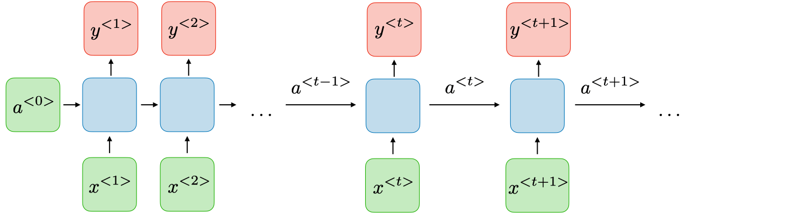
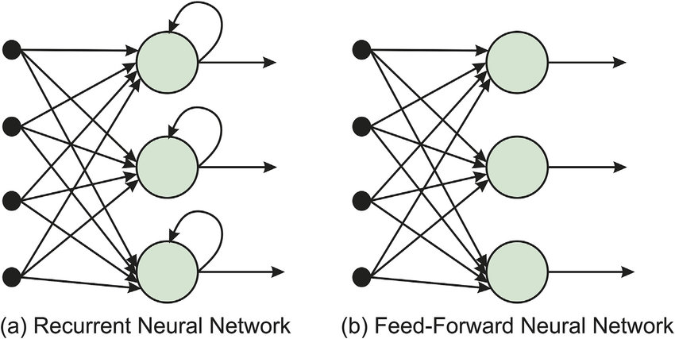

# [递归神经网络](https://www.baeldung.com/cs/recurrent-neural-networks)

1. 概述

    在本教程中，我们将讨论递归神经网络（RNN），它是处理序列数据最成功的架构之一。首先，我们将介绍其基本架构以及与传统前馈神经网络的区别。然后，我们将介绍几种 RNN，最后，我们将进入它们的应用。

2. 基本架构

    首先，让我们讨论RNN的基本架构，以更深入地了解为什么这些网络在序列数据上表现如此出色。

    每个 RNN 都由一系列重复模块组成，这些模块被称为单元，按顺序处理输入数据。也就是说，第一个单元接收序列的第一个样本作为输入，第二个单元接收第二个样本，以此类推。每个单元 i 接收输入向量$x^{<i>}$，经过处理后生成一个称为隐藏状态$a^{<i>}$的向量，并将其传递给下一个单元$i+1$。这意味着每次隐藏状态$a^{<i>}$都会捕捉到迄今为止给出的所有信息，从而使网络具有一定的记忆能力。

    在下图中，我们可以看到一个基本图，它说明了RNN的基本架构：

    

3. 与传统网络的区别

    为了更好地理解 RNN 架构，我们应该研究一下它与传统前馈神经网络的主要区别。

    这两种架构的主要区别在于，RNN 在网络中包含一个连续的环路，可使输入序列多次流经网络各层。这一特性使 RNN 能够非常有效地处理序列数据，其中一个重要部分就是利用一些记忆来跟踪序列的"过去"。必要的记忆块由隐藏状态表示，这些隐藏状态用于处理下一个输入。

    在下图中，我们可以看到我们比较过的两种架构，RNN 的 "循环" 就在其中：

    

4. RNN 的类型

    多年来，人们提出了多种类型的 RNN，以应对 RNN 面临的挑战。现在，让我们来讨论两种最常用的 RNN 变体。

    1. LSTM

        当 RNN 处理很长的序列时，就会出现梯度消失的问题，即损失函数的梯度趋近于零，从而使网络难以训练。

        长短期记忆网络（LSTM）是 RNN 的一种变体，专门用于解决梯度消失问题。它使用的记忆单元能够在不显著降低网络梯度的情况下长期保持有用信息。

    2. 门控恢复单元

        另一种常见的架构是门控递归单元（GRU），它与 LSTM 类似，但结构要简单得多，而且计算输出时速度要快得多。

5. 应用

    既然我们已经了解了 RNN 的架构，下面我们就来谈谈它们最常见的应用。

    1. 自然语言处理

        RNN 最常见的应用是处理文本序列。例如，我们可以使用 RNN 每次预测文本序列的下一个单词来生成文本。事实证明，这项任务有助于聊天机器人应用和在线语言翻译。

    2. 序列预测

        RNN 的另一个有用应用是时间序列预测(Series Forecasting)，我们的目标是根据之前的结果预测未来的结果。例如，在天气预报中，我们可以使用 RNN 探索以往天气数据的历史模式，并利用它们更好地预测未来的天气。

    3. 视频处理

        视频可视为另一种序列，因为它们是图像帧的序列。因此，RNN 也可用于视频处理任务，如视频分类，我们的目标是将给定视频归入一个类别。

    4. 强化学习

        最后，RNN 还可用于我们希望在动态环境中做出决策的情况，如强化学习(reinforcement learning)。具体来说，我们可以使用 RNN 控制机器人，RNN 存储器中会保留环境的当前状态。

6. 结论

    本文介绍了 RNN。首先，我们介绍了 RNN 的架构及其与传统网络的区别。然后，我们简要讨论了两种 RNN 及其一些应用。
