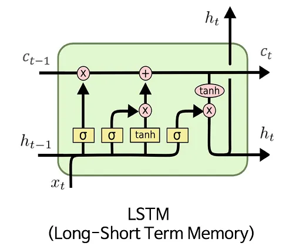
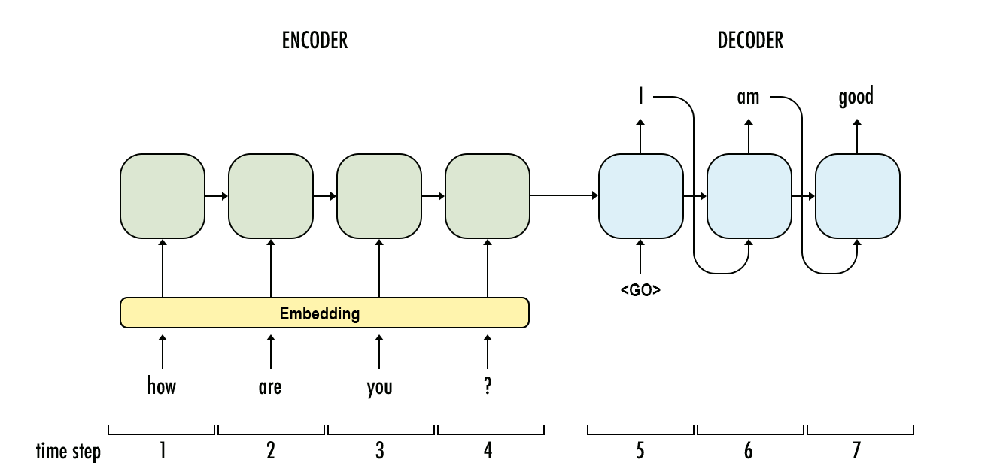

# 从 RNN 到 Transformers

1. 简介

    在自然语言处理（NLP）和序列建模领域，循环神经网络（RNN）和长短期记忆（LSTM）网络长期以来一直占据主导地位。然而，随着 2017 年 Transformer 架构的推出，我们处理基于序列任务的方式发生了范式转变。

    本教程旨在概述 RNN/LSTM 和 Transformer 模型，强调它们之间的差异，并讨论这些进步的影响。

2. 什么是 RNN 和 LSTM？

    RNN 是一类神经网络，它能够通过整合之前输入的信息来处理连续数据。RNN 是一种包含隐藏状态的神经网络，它允许神经网络保留之前时间步骤的信息。它们通过一次处理一个输入来处理顺序数据，并根据当前和之前的隐藏状态更新隐藏状态。

    下图显示了 RNN 的基本结构：

    

    其中，x、h、o 分别是输入序列、隐藏状态和输出序列。U、V 和 W 是训练权重。

    RNN 在捕捉序列中的短期依赖性方面尤为有效。然而，它们也存在梯度消失问题，即随着序列的发展，早期输入的影响会以指数形式减小，从而难以捕捉长期依赖关系。

    [LSTM](https://www.baeldung.com/cs/nlp-encoder-decoder-models#3-lstm) 是一种特殊的 RNN 架构，可解决训练深度神经网络时出现的梯度消失问题。LSTM 利用存储单元和门选择性地存储和检索长序列信息，从而有效捕捉长期依赖关系。

    下图展示了一个 LSTM 单元：

    

    其中，ht 是时间步长 t 时的隐藏状态，c 是单元状态。

    1. 序列到序列模型

        将 RNN/LSTM 应用于机器翻译和文本摘要等 NLP 任务时，我们会利用一种称为序列到序列模型（也称为[编码器-解码器模型](https://www.baeldung.com/cs/nlp-encoder-decoder-models)）的结构。顾名思义，它由两个主要部分组成：编码器和解码器。

        编码器处理输入序列并将其编码为固定长度的表示，也称为上下文向量或潜空间表示。通常，网络的最终隐藏状态就是上下文向量，它概括了输入信息。

        一旦模型对输入序列进行编码，解码器就会接手，并根据编码后的表示生成输出序列。解码器通常使用与编码器类似的结构。不过，解码器的隐藏状态是用编码器的上下文向量初始化的。

        解码器使用这个初始隐藏状态生成输出序列的第一个标记。然后，解码器根据之前生成的标记和上下文向量进行预测，生成后续标记。这一过程一直持续到生成序列末端标记或达到最大序列长度为止。

        下图举例说明了编码器-解码器模型的工作原理：

        

        尽管序列到序列模型是总结输入序列的有用模型，但当输入序列相当长且包含大量信息时，序列到序列模型就会出现问题。并非所有文本制作活动的每个解码阶段都需要输入序列的每条上下文。例如，机器翻译模型在翻译 "A boy is eating the banana"（一个男孩在吃香蕉）中的 "boy" 时，并不需要知道句子中的其他单词。

        因此，人们开始使用采用[特殊关注机制](https://www.baeldung.com/cs/nlp-encoder-decoder-models#attention-mechanism)的 Transformer。Transformer 是一种最先进的模型，被广泛应用于 NLP 和计算机视觉领域。

3. 什么是变形金刚？

    [Transformer](https://www.baeldung.com/cs/large-language-models#5-arrival-of-transformer-model) 是 Vaswani 等人在开创性论文《[注意力就是你所需要的一切](https://arxiv.org/abs/1706.03762)》中提出的一种神经网络架构。与 RNN 不同，Transformer 不依赖于递归，而是依靠自我注意来运行。

    自我注意允许模型在进行预测时权衡不同输入标记的重要性，使其能够捕捉长程依赖关系，而无需进行顺序处理。变压器由编码器层和解码器层组成，采用多头自注意机制和前馈神经网络。

    下图显示了变形器网络的结构：

    

    [变形器](https://www.baeldung.com/cs/chatgpt-model#1-types-of-transformers)有多种类型。在 NLP 领域出现了两种有影响力的模型：[BERT](https://www.baeldung.com/cs/transformer-text-embeddings#bert)（来自变换器的双向编码器表示）和 [GPT](https://www.baeldung.com/cs/chatgpt-model)（生成式预训练变换器）。BERT 应用了变换器的编码器。与变换器类似，GPT 由编码器和解码器组成。这些模型突破了语言理解和生成的界限，展示了大规模预训练和迁移学习的威力。

4. RNN 与变压器的区别

    1. 结构

        RNN 是一种顺序模型，每次处理一个元素的数据，并保持一个内部隐藏状态，该状态在每一步都会更新。它们以递归方式运行，每一步的输出都取决于之前的隐藏状态和当前的输入。

        变换器是并行处理数据的非序列模型。它们依靠自我注意机制来捕捉输入序列中不同元素之间的依赖关系。变换器没有循环连接或隐藏状态。

    2. 处理序列长度

        RNN 可以处理不同长度的序列，因为它们按顺序处理数据。但是，长序列会导致梯度消失或爆炸，从而使 RNN 在捕捉长期依赖关系方面面临挑战。

        变换器具有并行处理的特性，因此可以高效地处理短序列和长序列。无论序列长度如何，自注意功能都能让它们捕捉到依赖关系。

    3. 依赖关系建模

        RNN 非常适合建立序列依赖关系模型。它们可以捕捉过去的上下文信息，因此在语言建模、语音识别和情感分析等任务中非常有效。

        变换器擅长对元素之间的依赖关系进行建模，而与它们在序列中的位置无关。对于涉及长距离依赖关系的任务，如机器翻译、文档分类和图像字幕，它们的作用尤为强大。

    4. 模型大小

        RNN 的大小主要取决于递归单元（如 LSTM 单元或 GRU 单元）的数量以及每个单元内参数的数量。RNN 结构紧凑，因为它们主要依靠递归连接和相对较小的隐藏状态维度。RNN 中的参数数量与递归单元的数量以及输入和隐藏状态维度的大小成正比。

        变压器因其架构而往往具有较大的模型尺寸。自注意层、前馈层和位置编码是影响变换器模型大小的主要因素。变换器的设计更易于并行化，可以在 GPU 或 TPU 上进行高效计算。不过，这种并行处理能力的代价是参数数量增加。

    5. 训练和并行化

        对于 RNN，我们大多采用顺序方法进行训练，因为隐藏状态依赖于之前的步骤。这使得并行化更具挑战性，导致训练时间较慢。

        另一方面，我们采用并行方式训练变换器，因为它们同时处理数据。这种并行化能力加快了训练速度，并能使用更大的批量，从而提高训练效率。

    6. 可解释性

        RNN 具有清晰的时间流，这使得解释其决策和理解信息如何在序列中流动变得更加容易。

        变换器依赖于自我注意机制，这可能使解释其决策更具挑战性。不过，注意力可视化等技术可以让我们深入了解模型的关注点。

    7. 预训练和迁移学习

        由于 RNN 的连续性，对其进行预训练更具挑战性。迁移学习通常仅限于特定任务或相关领域。

        我们可以使用无监督目标，如语言建模或掩码语言建模，在大规模语料库上对 Transformer 模型进行预训练。在预训练之后，我们可以在各种下游任务上对模型进行微调，从而实现有效的迁移学习。

5. 结论

    在本文中，我们解释了 RNN/LSTM 和 Transformer 背后的基本思想。此外，我们还从多个方面对这两类网络进行了比较。

    RNN 和 LSTM 曾是顺序任务的首选，而 Transformer 则因其并行处理能力、捕捉长距离依赖关系的能力以及更高的硬件利用率而被证明是一种可行的替代方案。不过，在处理时间依赖性起关键作用的任务时，RNNs 仍然有其价值。

    总之，在 RNN/LSTM 和 Transformer 模型之间做出选择，最终取决于手头任务的具体要求，并在效率、准确性和可解释性之间取得平衡。

## 相关文章

- [ ] [From RNNs to Transformers](https://www.baeldung.com/cs/rnns-transformers-nlp)
