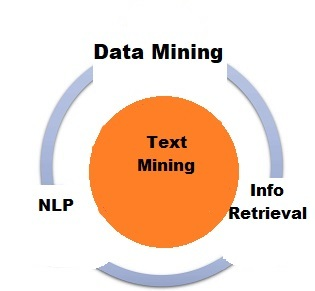
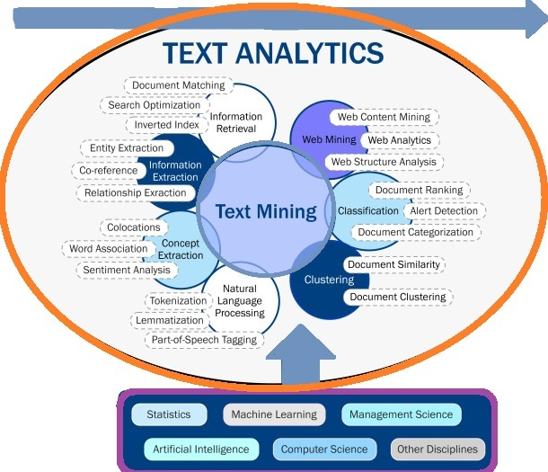
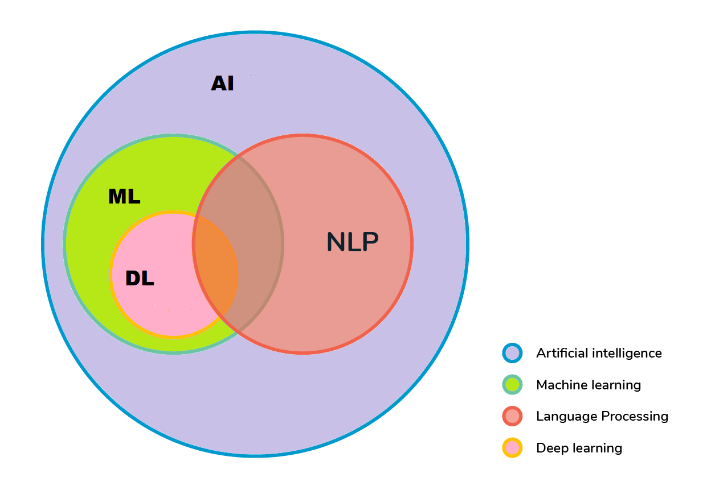

# 了解文本挖掘

[人工智能](https://www.baeldung.com/cs/category/ai)

[自然语言处理](https://www.baeldung.com/cs/tag/nlp)

1. 概述

    文本挖掘也称为文本分析，它将非结构化文本转换为结构化数据，以便进行分析。

    在本教程中，我们将学习文本挖掘。但在此之前，让我们先快速了解一下文本数据的组织。

2. 文本数据的组织

    文本是数据库中最常见的数据类型之一。根据数据库的不同，这些数据可能会有不同的组织方式：

    - 结构化数据：因为这些数据已被标准化为具有许多行和列的表格格式，所以更易于存储和用于分析和机器学习技术。结构化数据包含姓名、地址和电话号码等输入信息。
    - 非结构化数据：这种数据没有确定的数据格式。它可能包括来自产品评论或社交媒体平台的文本，以及音频和视频文件等富媒体格式
    - 半结构化数据：顾名思义，这种数据结合了结构化和非结构化数据类型。它具有一定的组织性，但结构不足以满足关系数据库的要求。半结构化数据包括 XML、JSON 和 HTML 文件。
    文本挖掘对企业大有裨益，因为世界上几乎 80% 的数据都是非结构化数据。

    我们可以利用文本挖掘工具和[自然语言处理](https://www.baeldung.com/java-nlp-libraries#:~:text=Natural%20Language%20Processing%20(NLP)%20is,era%20of%20the%20AI%20revolution.)方法（如信息提取）将非结构化文本转换为结构化格式，从而进行分析并产生高质量的见解。

    这可以改善组织决策，从而提高业务成果。

3. 什么是文本挖掘？

    文本挖掘中自动使用自然语言处理，从非结构化材料中提取有洞察力的信息。文本挖掘通过将数据转化为计算机可以理解的知识，自动完成按情感、主题和意图对文本进行分类的过程。

    得益于文本挖掘技术，企业现在可以快速、高效地检查复杂的大型数据集。公司还利用这种有效的技术将耗时的重复性操作自动化，为员工节省了大量时间，使客户服务代表能够专注于他们最擅长的工作。

    文本挖掘也称为文本数据挖掘，它将非结构化信息转化为结构化格式，以发现重要模式和新见解。自然语言处理（NLP）是一种文本挖掘技术，可帮助计算机自动理解和分析人类对话。文本挖掘、数据挖掘、自然语言处理和信息检索之间的关系如下图所示。

    
    企业可以使用 [Naive Bayes]、支持向量机 ([SVM](https://www.baeldung.com/cs/ml-support-vector-machines)) 和其他深度学习算法等先进的分析方法来检查和发现非结构化数据中隐藏的相关性。总之，文本挖掘使企业能够最大限度地发挥数据的价值，从而提高数据驱动型业务选择的质量。

    "文本挖掘是如何实现这一切的？"人们可能会提出这样的问题。这个回答一下子就把我们引入了机器学习的概念。

    机器学习是人工智能的一个分支，其重点是开发算法，让计算机从实例中学习如何执行特定任务。机器学习模型必须先通过数据进行学习，然后才能以特定的准确度进行自动预测。文本挖掘与机器学习的结合使自动文本分析成为可能。

4. 文本挖掘是如何工作的？

    文本挖掘有助于研究大量原始数据，从而发现有意义的见解。它可以与机器学习相结合，创建文本分析模型，根据先前的训练学习分类或提取特定信息。

    文本挖掘看似是一个复杂的话题，但实际上学习起来非常简单。

    开始学习文本挖掘的第一步是收集数据。假设我们想调查用户与即时聊天系统的交互情况。第一步是将这些信息生成文档。

    可以是内部数据（通过聊天、电子邮件、调查、电子表格、数据库等进行的交互）或外部数据（从社交媒体、评论网站、新闻媒体等收集的信息）。

    第二步是准备数据。文本挖掘系统使用标记化、解析、词法化、词干化和停顿删除等 NLP 技术为机器学习模型生成输入。现在就可以进行文本分析了。

5. 文本挖掘与文本分析

    虽然 "文本挖掘" 和 "文本分析" 在日常对话中经常交替使用，但它们也有不同的含义。文本挖掘和文本分析整合了机器学习、统计和语言学，以发现非结构化数据中的语言和文本模式及趋势。

    通过文本挖掘和文本分析将数据转化为更有条理的格式，可以利用文本分析找到更多量化的见解。然后，我们可以利用数据可视化技术与更多人分享我们的发现。

    因此，文本挖掘和文本分析之间的区别可以得到相应的解释。从本质上讲，它们都试图采用不同的方法来处理同一个问题（自动分析原始文本输入）。文本挖掘能发现文本中的相关信息，从而获得高质量的结果。

    文本分析则侧重于发现海量数据集中的模式和趋势，从而获得更多量化结果。文本分析通常用于生成图形、表格和其他可视化输出。文本挖掘和文本分析之间的关系如下图所示。并给出了相关概念。

    
    文本挖掘使用统计学、语言学和机器学习技术来建立模型，这些模型从训练数据中学习，并能根据先前的经验预测新信息的结果。

    而文本分析则使用文本挖掘模型研究的结果来生成图表和其他类型的数据可视化。

    必须根据所呈现的信息类型来决定最佳行动方案。在每次分析中，这两种方法经常被混合使用，从而产生更有说服力的结果。

6. 文本挖掘技术

    文本挖掘是一种由多个步骤组成的方法，可让我们从非结构化文本数据中推断信息。清理文本数据并将其转换为可用格式的过程称为文本预处理，我们在使用各种文本挖掘技术之前必须进行预处理。

    自然语言处理（NLP）是这一过程的关键组成部分，为了正确准备分析数据，它通常使用的方法包括语言识别、标记化、语音部分标记、分块和语法分析。

    完成文本预处理后，就可以使用文本挖掘技术从数据中提取见解。下文将对这些广泛应用的文本挖掘方法进行说明。

    1. 基本方法

        在本小节中，我们将学习一些基本方法，如词频、搭配和一致。

        词频可用于查找数据集中最常用的术语或观点。在评估客户评论、社交媒体互动或消费者反馈时，发现非结构化文本中使用频率最高的词语非常有用。

        如果客户评论中经常出现 "离谱"、"价格过高" 和 "评价过高" 等词语，这可能会提示我们有必要改变价格或目标市场。

        搭配是一组经常出现在一起的词语。最常见的两类搭配是[大词组](https://www.baeldung.com/cs/n-gram)（可能搭配在一起的一对词，如 get started、 save time 或 decision making）和三词组（三个词的组合，如 within walking distance 或 keep in touch）。搭配词应作为单个词来识别和计算，以增加文本的粒度，更好地把握其语义结构，最终产生更准确的文本挖掘结果。

        同义词用于识别一个词或一组词出现的具体语境或实例。我们知道，人类语言可能存在歧义：同一个词可以在不同的语境中使用。分析一个词的对仗可能有助于我们根据上下文把握其确切含义。

    2. 信息检索

        信息检索是根据一组预定义的查询或短语来检索相关信息或文档。信息检索系统使用算法监控用户活动并识别相关信息。

        图书馆目录系统和谷歌等著名搜索引擎就是典型的信息检索应用实例。下面是一些常见信息检索子任务的例子：

        标记化是将长篇文本划分为句子和单词"标记"的技术。然后，在文本聚类和文档匹配任务的模型中使用这些标记，就像词袋一样。

        词根法是消除单词前缀和后缀以确定基本词汇形式和含义的过程。这种方法可以使索引文件更小，从而改进信息检索。

    3. 自然语言处理

        自然语言处理是从计算语言学发展而来的，它采用了计算机科学、人工智能、语言学和数据科学等不同领域的技术，帮助计算机理解书面和口头形式的人类语言。如下图所示：

        
        计算机可以通过使用自然语言处理子任务检查语法和句子结构来 "阅读 "文本。以下是一些典型子任务的例子：

        摘要技术利用对冗长文本的摘要，快速、全面地概述文档的关键主题。

        语篇（PoS）标记技术根据文档中每个标记所代表的语篇（如名词、动词、形容词等）为其分配一个标记。这一层可以对非结构化文本进行语义分析。

        文本分类或文本分类是评估文本文档并根据预设主题或类别对其进行分类的过程。该子任务简化了同义词和缩略词的分类过程。

        [情感分析](https://www.baeldung.com/cs/sentiment-analysis-practical)通过检测来自内部或外部数据源的正面或负面情感，使我们能够监控消费者态度随时间的变化。它常用于展示消费者对名称、商品和服务的看法。这些洞察力可以激励公司与客户互动，改进工作流程，提升用户体验。

    4. 信息提取

        在阅读大量文件时，信息提取可以提取相关信息。它还强调从自由文本中提取结构化数据，并在数据库中存储提取的实体、属性和关系数据。

        下面举例说明常见的信息提取子任务：

        - [特征选择](https://www.baeldung.com/cs/feature-selection)或属性选择是指选择对预测分析模型输出贡献最大的重要特征（维度）的过程。
        - 特征提取方法用于选择特征子集，以提高分类任务的准确性。这对于降低维度非常重要。
        - 命名实体识别，也称为实体识别或实体提取，旨在对文本中的特定实体（如名称或地点）进行定位和分类。
        - 例如，命名实体识别可将 "安娜"识别为女性姓名，将 "布加勒斯特"识别为一个地点。
    5. 数据挖掘

        数据挖掘是在海量数据集合中发现模式和有意义见解的过程。这种评估结构化和非结构化数据以揭示新信息的策略通常用于市场营销和销售领域，以调查消费者行为。

        文本挖掘是数据挖掘的一个分支，因为它侧重于提供非结构化数据结构并对其进行分析，从而提供独特的见解。文本数据分析包含了前面列出的所有数据挖掘方法。

7. 文本挖掘使用案例

    文本分析软件改变了许多行业的工作方式，使他们能够改善产品用户体验，做出更快、更明智的业务选择。以下是一些使用案例：

    - 客户服务：我们可以通过各种方式征求客户的反馈意见。当企业将文本分析工具与聊天机器人、客户调查、NPS（净推销员评分）、在线评论、支持请求和社交网络资料等反馈系统结合使用时，可以迅速改善客户体验。
    - 文本挖掘和情感分析可帮助企业识别最关键的消费者痛点，使其能够快速应对紧迫问题，提高客户满意度。
    - 风险管理：文本挖掘在[风险管理](https://www.baeldung.com/cs/risk-analysis-assessment-management)中也有应用。它可以通过跟踪情感变化以及从分析师报告和白皮书中提取数据，深入了解市场趋势和行业进步。这些信息对银行机构尤其有用，因为在分析各行业的业务投资时，这些信息能提高他们的信任度。
    - 维护：文本挖掘提供了关于设备和物品如何工作的全面完整的信息。文本挖掘通过逐步揭示与关注问题以及主动和被动维护策略相关的模式，实现决策自动化。使用文本分析技术，维护人员可以更快地找出错误和故障的根本原因。
    - 医疗保健：生物医学研究人员发现，以数据聚类为主的文本挖掘方法更为有益。人工医学研究既费钱又费时；文本挖掘提供了一种从医学期刊中获取重要数据的自动化方法。
    -垃圾邮件过滤：垃圾邮件经常被黑客用来用恶意软件感染计算机。文本挖掘可以通过筛选和消除收件箱中的某些电子邮件，改善用户体验，降低终端用户遭受网络攻击的风险。
8. 文本挖掘的重要性

    每天，人们和企业都会产生大量数据。大约 80% 的文本数据都是非结构化的，这意味着它们缺乏固定的结构，无法进行搜索，而且极难管理。换一种说法，就是完全无效。

    对于企业来说，从原始数据中组织、分类和提取相关信息是一个重大问题。为此，文本挖掘是必不可少的。

    公司环境中的非结构化文本数据包括电子邮件、社交媒体上的评论、对话、支持单、调查等。手动整理所有这些信息经常会失败。这种方法成本高、耗时长，而且不精确、不实用。

    然而，文本挖掘已被证明是实现准确性、可扩展性和快速反应的可靠而经济的方法。更具体地说，以下是它的一些主要优势：

    - 可扩展性：文本挖掘可以快速检查大量数据。通过自动化特定流程，企业可以节省大量时间，集中精力做其他事情。企业因此变得更加成功
    - 实时分析：文本挖掘使企业能够实时优先处理重要问题，包括洞察潜在危机、发现产品缺陷或负面评论。为什么这么重要？因为它能让企业迅速采取行动
    - 一致的标准：在执行人工重复性任务时，人类更容易出错。同时，他们也会受到一致性和无偏见数据分析的影响。
    以标记为例。为电子邮件或支持单据添加类别对大多数团队来说都是一项工作，经常会导致错误和不一致。将这一流程自动化可产生更准确的结果，并确保对每张票单都采用一套一致的规则，从而节省大量时间。

9. 总结

    在本教程中，我们学习了文本挖掘。在此背景下，我们讨论了文本挖掘的描述、工作原理、文本挖掘方法、文本挖掘用例以及文本挖掘的实用性。

[Understanding Text Mining](https://www.baeldung.com/cs/text-mining)
