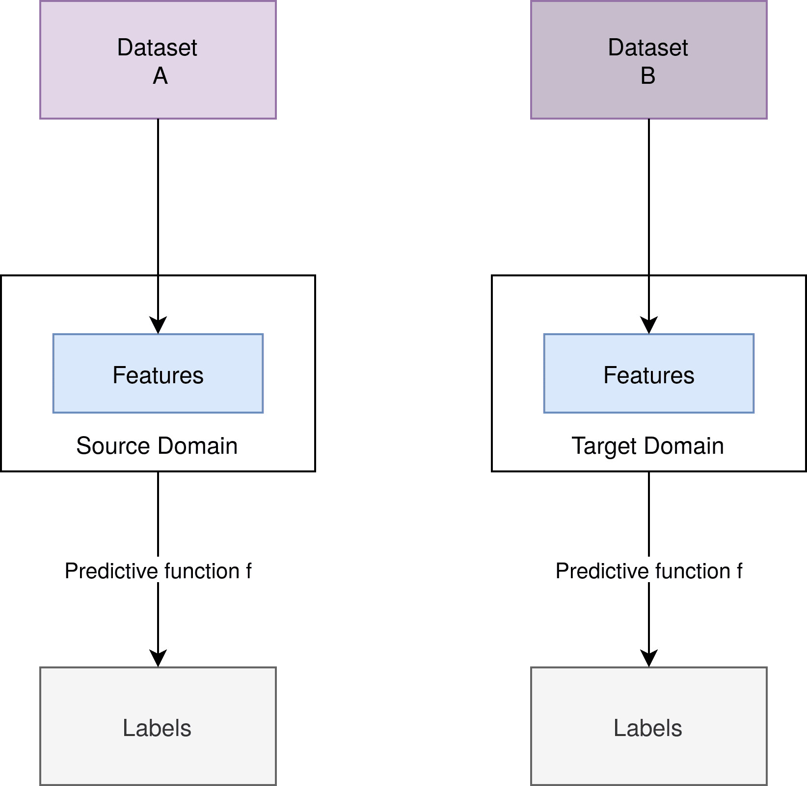
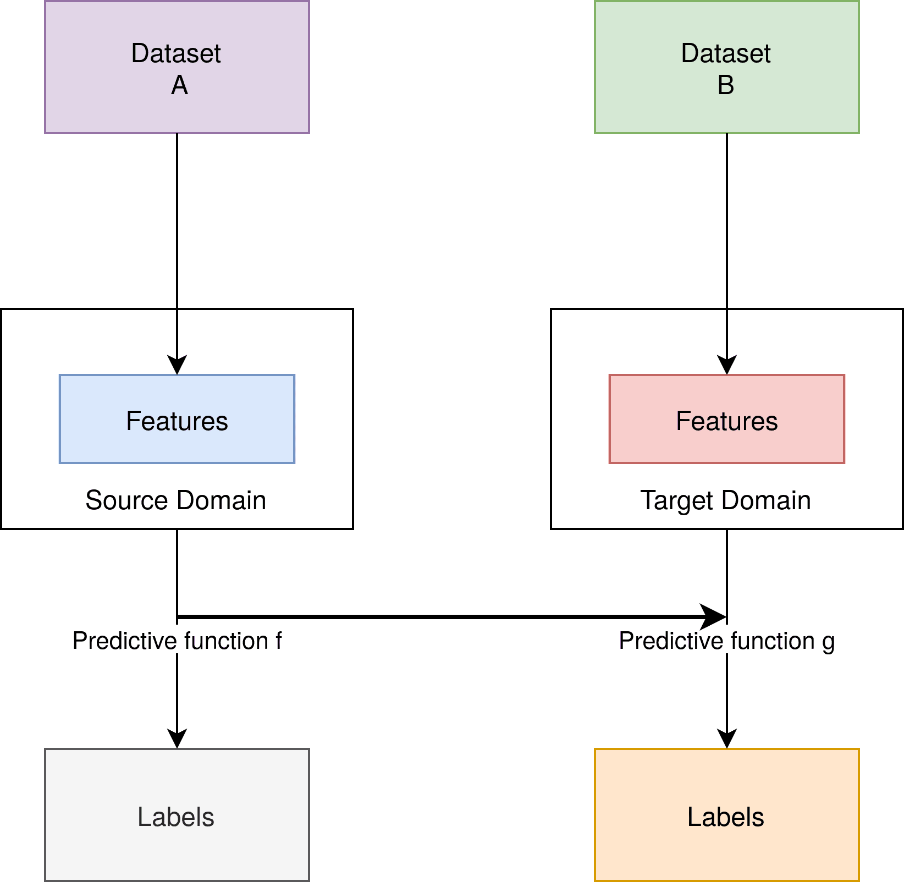
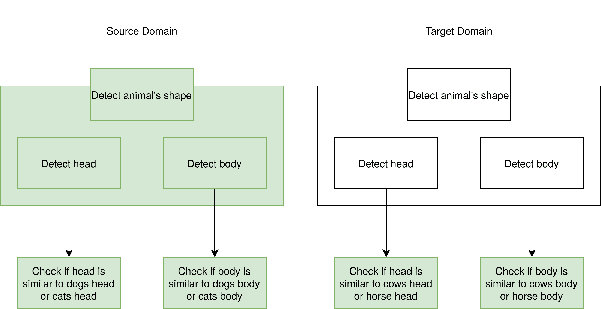
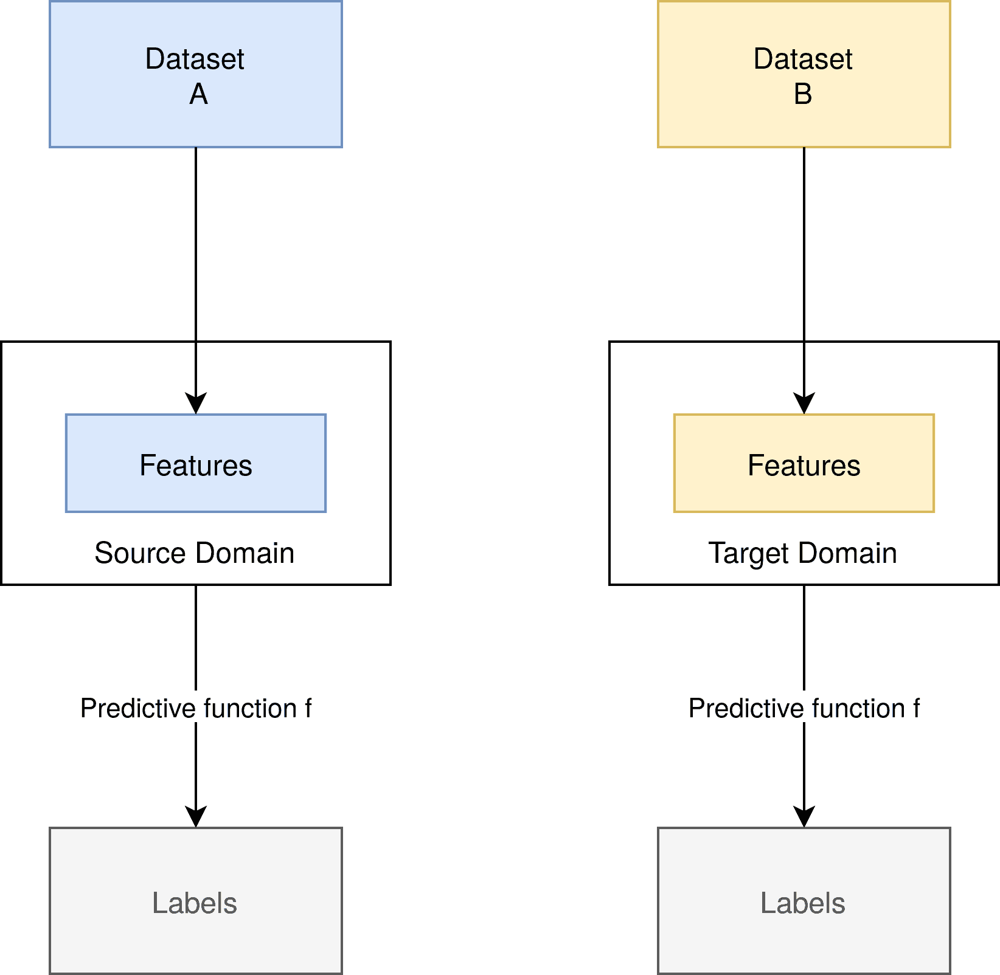

# [迁移学习与领域适应](https://www.baeldung.com/cs/transfer-learning-vs-domain-adaptation)

1. 简介

    在本教程中，我们将探讨迁移学习和领域适应的区别和细微差别。迁移学习是一个广义的术语，指将从一个机器学习问题中获得的知识用于另一个问题。领域适应是迁移学习的一种特例，只涉及数据领域的变化。

2. 经典监督学习

    为了澄清迁移学习，我们将其与经典的监督机器学习问题进行比较。为了更好地理解，我们使用了猫狗图片的样本数据集。

    1. 结构

        对于这些特征，我们需要标签 Y，例如，一张图片具有高级特征：狗的脚、狗的脸和狗的身体，我们就给它贴上狗的标签。这样，我们就有了一个将集合特征值赋值给集合标签的函数。

        当我们在生产中使用该模型时，我们有一个不同但类似的数据集，它仍然显示狗和猫。它仍然将这些图片分配给相同的标签“狗”和“猫”。

        在这张图片中，我们可以看到两个不同但相似的数据集 A 和 B：

        

        我们从数据集中提取特征。对于一组特定的特征，我们会分配一个或多个标签。特征、预测函数 f 和标签保持不变。

3. 迁移学习

    迁移学习（Transfer Learning）描述了一系列机器学习技术，其工作结构与经典的监督式学习类似。相比之下，它也可以处理差异巨大的数据集和特征。

    1. 迁移学习蓝图

        让我们来看看迁移学习过程的结构。我们可以看到，标签和预测函数是可以改变的：

        

        此外，我们还拥有与监督学习类似的结构。但与此形成鲜明对比的是，在迁移学习中，所有的构件都不一定相同。两种机器学习设置之间的联系在于预测函数 f 的使用，它被用于创建第二个预测函数 g。

        需要注意的是，在这种情况下，源和目标的步骤是不同的。迁移学习还包括其他情况，例如只有标签不同而特征相同。

        标签相同、数据集差异巨大但相似的情况也属于迁移学习的一种。我们将在“领域适应”一节中讨论这个问题。

    2. 迁移学习示例

        让我们将这一概念应用到猫狗图片的例子中。现在想象一下，我们有第二个数据集，其中显示的是牛和马的图片。牛和马与猫有很大不同。

        不过，它们都是哺乳动物，都有四只脚，而且形状相似。作为一种解决方案，我们可以将描述我们想要检测的对象（无论是狗、牛还是马）形状的图层提取出来，然后将其[冻结](https://keras.io/guides/transfer_learning/#freezing-layers-understanding-the-trainable-attribute)。冻结意味着我们将它们从预测函数 f 中剪切出来，放入预测函数 g 中，然后训练函数 g，而不训练被冻结的图层：

        

        我们可以看到右侧的图层是绿色的，这表明我们在创建源域的预测函数时必须对它们进行训练。另一方面，预测 g 是使用源域中已有的冻结层创建的。冻结层在训练过程中保持不变。

4. 域适应

    如前所述，领域适应是迁移学习的一种特殊情况。

    1. 蓝图

        在领域适应中，我们只需改变基础数据集，从而改变机器学习模型的特征。但是，特征空间保持不变。预测函数 f 保持不变：

        

    2. 应用

        将领域适应应用到我们的示例中，我们可以想到一个明显不同、但在某种程度上相似的数据集。这个数据集可能仍然包含猫狗图片，但与源数据集中的图片大不相同。例如，在源数据集中，我们只有贵宾犬和黑猫。而在我们的目标数据集中，可能有雪纳瑞犬和白猫。

        现在，我们如何才能确保我们的预测函数仍能为我们的数据集预测正确的标签呢？领域自适应为我们提供了答案。

    3. 领域适应类型

        我们考虑了三种类型的领域适应。这三种类型是根据基础领域中标注示例的数量来定义的：

        - 无监督领域适应的源领域既有标注示例，也有未标注示例。目标域只有未标记的示例。
        - 半监督域适配希望目标域中的部分示例是有标签的。
        - 监督域表示所有示例都有标签。

5. 领域适应的方法

    在领域适应方面，我们可以更仔细地研究实用方法。这是因为，只需改变数据集，就能更容易地根据新的机器学习过程调整我们的模型。

    1. 基于发散的领域适应

        [基于发散的领域](https://arxiv.org/abs/1603.06432v2)适应是一种测试两个样本是否来自相同分布的方法。正如我们在蓝图图解中看到的，从数据集中提取的特征存在巨大差异。这种差异会导致我们的预测功能无法正常工作。如果我们的预测功能使用了未经训练的特征，那么它就会失灵。这也是我们接受不同特征但要求相同特征空间的原因。

        因此，基于发散的领域适应可以创建与两个数据集 “同样接近” 的特征。这可以通过应用各种算法来实现，包括最大均值差、相关性对齐、对比域差或瓦瑟斯坦度量。

    2. 迭代法

        在[迭代法](https://arxiv.org/abs/2001.04129)中，我们使用预测函数 f 来标注目标域中我们有很高信心的样本。这样，我们就能重新训练函数 f。因此，当我们将预测函数应用于置信度较低的样本时，它就会越来越适合我们的目标领域。

6. 结论

    正如我们所看到的，迁移学习提供了一系列在新环境中使用已有机器学习模型的方法。在领域适应的特例中，我们遇到了一个在现实世界中经常遇到的问题，即不同的数据集。

    在这种情况下，基于发散的域和域适应以及迭代方法提供了解决方案。此外，这些解决方案也是当代机器学习领域研究的重要组成部分。
