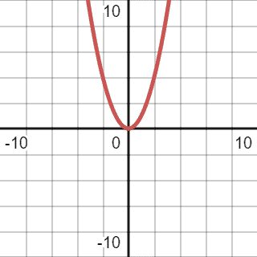

# [渐近符号理论导论](https://www.baeldung.com/cs/big-o-notation)

1. 一览表

    在本教程中，我们将介绍渐近符号，并展示每个符号的示例。我们将讨论大$\mathbf \Theta (Theta)$，大$\mathbf \Omega (Omega)$，以及大O符号。

2. 评估算法

    在计算机科学和编程领域，开发人员经常面临代码效率问题。渐近符号，特别是大O符号，有助于预测和推理算法的效率。这种知识也会影响基于其目标和理想性能的算法设计。

    想象一下，我们有一些代码可以在一小部分数据上工作。在不久的将来，我们预计数据会增加，我们需要分析我们的算法是否足够性能。让我们想象一下该算法在伪代码中可能是什么样子：

    ```java
    algorithm FindElement(list, element):
        // INPUT
        //   list = A list of elements
        //   element = The element to search for in the list
        // OUTPUT
        //   true if the element is in the list, false otherwise
        for listElement in list:
            if listElement = element:
                return true
        return false
    ```

    这段代码相当简单。它只是检查列表中是否有元素。让我们试着评估一下它的性能。为此，我们需要找出如果我们改变输入的大小，这个算法将如何变化。

    我们如何测量该算法的效率和性能？我们可以利用时间，这可以让我们对表演有一些了解。然而，时间将取决于数据量、我们运行的机器以及实现细节。因此，这对我们没有帮助。

    我们可以计算完成此代码所需的步骤数，并尝试根据此做出判断。这种方法将更好地向我们展示算法的复杂性。然而，计算所有步骤将在很大程度上取决于实施情况。如果我们添加一个步骤，它将改变对算法复杂性的测量。

    最好的方法是考虑所有元素都有相同的处理时间。让我们假设我们在一个基本单元中处理此列表中的元素。因此，如果我们在列表中间有一个元素在寻找，我们将花费n/2时间单位。

    在最好的情况下，我们正在寻找的元素将是第一个，我们只会检查第一个。在最坏的情况下——这个元素不会在那里，我们必须检查列表中的所有元素。如果元素是随机分布的，平均而言，我们需要浏览一半的列表才能找到所需的元素。

3. Big $\mathbf O$ 符号

    在上面的例子中，我们花在搜索上的时间将取决于我们正在寻找的元素的位置。然而，我们可以确切地知道我们需要检查多少个元素来检查最坏的情况。大O符号代表了这种最坏的情况。

    1. 正式定义

        从本质上讲，大O符号定义了一个函数，该函数总是大于其边界函数的结果。由于我们只对算法的复杂性感兴趣，我们可以扩展G(x)通过任何常数。

        定义：f(x) = O(g(x))意味着存在两个常数$x_1$和C，使得 $0 \leq f(x) \leq cg(x)$ 适用于所有 $x \geq x_1$。

    2. 示例：

        让我们假设我们有一段代码，可以对一些列表进行排序，打印，然后将其写入文件。

        ```java
        algorithm SortAndPrint(list):
            // INPUT
            //   list = A list of elements
            // OUTPUT
            //   Sorts the list, prints each element, and then writes the list to a file
            bubbleSort(list)
            for element in list:
                print(element)
            writeToFile(list)
        ```

        我们可以定义这个算法的复杂性。在我们的案例中，这将是代码的几个部分的总和。气泡分类有$n^{2}$复杂性。打印所有元素将有n.写入文件，我们可以假设是一个恒定的时间操作。我们可以假设这将是3。因此，这一段代码的整体复杂性将是：

        \[y = n^{2} + n + 3\]

        从视觉上看，它由下面的图表表示：

        

        首先，我们应该简化功能。我们应该删除所有低阶组件，因为当n接近大值时，它们不会发生重大变化。例如，如果我们假设n是$10^{10}$，方程将如下：

        \[y = 10^{20} + 10^{10} + 3\]

        第二个和第三个组成部分将构成整体结果的极小部分。因此，我们可以放弃他们。有时，很难在更复杂的函数中定义高阶组件。如有疑问，请参考[此表](https://en.wikipedia.org/wiki/Computational_complexity_of_mathematical_operations)。

        简化后，我们可以将函数简化为$\mathbf y = n^{2}$.因此，之前的图表将略有变化，最终版本将是：

        

    3. Big $\mathbf O$ 图形表示

        正如我们已经定义的，大 O 符号代表最坏的情况。从特定的 x 到无穷大，它将是一个比我们的函数更高的函数。

        让我们做一个错误的假设，决定使用线性函数来表示大 O 符号：

        

        我们将二次函数与几种线性函数进行了比较：x、2x、3x 和 4x。然而，由于二次函数的增长率大于线性，因此不可能将其与线性相提并论。另外，我们使用常数乘数来表示函数，是因为我们对增长率感兴趣，而增长率取决于输入。在这种情况下，常数不会产生任何影响。

        在检查正确的解决方案之前，我们可以尝试另一种行不通的解决方案。我们可以尝试将当前的二次函数换成三次函数：

        \[Y = x^{3}\]

        我们可以在下面看到重叠的图表：

        

        我们可以看到，从 1 到无穷大，三次函数盖过了二次函数。在这种情况下，当 $\mathbf x < 1$ 时，我们并不关心二次函数是否总是具有更高的值。因此，三次函数完全符合定义。然而，我们还应该考虑函数的紧密性，在这种情况下，三次函数的超调很大。比较函数应尽可能接近给定函数。尽管符合所有要求，但我们不能用它来定义复杂性。

        让我们试着用二次函数给这个函数加个上限：

        \[y = x^{2} * 1.2\]

        红色图形代表我们的初始函数，蓝色图形代表比较函数：

        

        从图中可以看出，代表比较函数的蓝线始终高于初始函数。这就是为什么我们可以用这个函数来表示大 O 的原因。我们应该去掉常数乘数，因为我们只对增长率感兴趣，而不是某个特定值。

        因此，我们初始代码块的 Big O 将是$\mathbf O(n^{2})$。在大多数情况下，方程的大 O 将是去掉所有常数乘数后的最高阶分量。

        值得重申的是，比较函数应尽可能与我们要估计的函数紧密相关。

4. Big $\mathbf \Omega (Omega)$

    在学习了Big O符号后，$\mathbf \Omega$应该更容易掌握。这个渐近符号表示给定函数的下限。它意味着函数或算法的最佳场景。然而，考虑到该功能应该尽可能紧凑，我们不能过于乐观。

    让我们从头开始考虑这个例子：

    ```java
    algorithm SortAndPrint(list):
        // INPUT
        //   list = A list of elements
        // OUTPUT
        //   Sorts the list, prints each element, and writes the list to a file
        bubbleSort(list)
        for element in list:
            print(element)
        writeToFile(list)
    ```

    该函数的复杂性是二次的，简化后，看起来与第一个例子相同：

    

    最好的情况是，当所有元素都已排序时，气泡排序只会通过列表一次。因此，我们可以假设，从理论上讲，最佳情况将具有线性复杂性：

    

    然而，如前所述，尽管这个比较功能符合所有标准，但它还不够严格。我们不能假设给定列表中的所有元素都会在现实生活中的所有情况下进行排序。这就是为什么我们需要找到一个尽可能与当前功能紧密的函数：

    

    正确的大$\Omega$对于给定的代码将是二次复杂性的，$\Omega(n)$.

5. Big $\mathbf \Theta (Theta)$

    Big $\mathbf \Theta$ 符号是上述两者的组合。为了Big $\mathbf \Theta$，我们需要使用完全符合给定功能的函数。为了简化，Big $\mathbf \Theta$ 可以被描述为一些函数，通过使用常数乘数，可以表示 Big $\mathbf O$ 和 Big $\mathbf \Omega$ 同时：

    

    给定函数中包含两个具有不同常数乘数（分别为0.8和1.2）的二次函数。因此，Big $\mathbf \Theta$ 也将是二次复杂性。

6. 结论

    这篇文章教会了我们渐近符号，以及为什么它们在计算机科学中必不可少和有价值。即使对它们的使用有基本的了解，也有助于创建更好的软件。

    这些符号还有助于从效率和复杂性的角度思考算法。尽管现代机器的硬件和计算能力急剧增加，但这些机器操作的数据集也大幅提高。在大多数情况下，专注于访问算法的Big O符号就足够了。

    我们也可以对[Java中实现](https://www.baeldung.com/java-algorithm-complexity)的这个主题进行更实际的了解。
