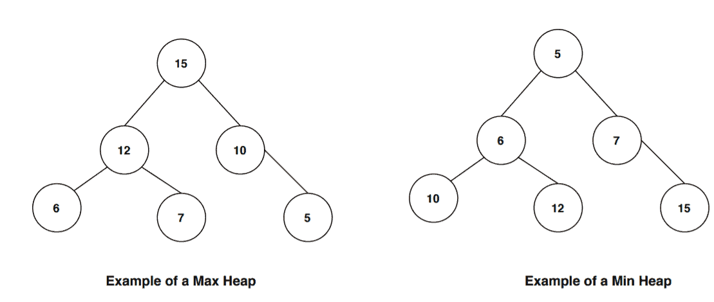
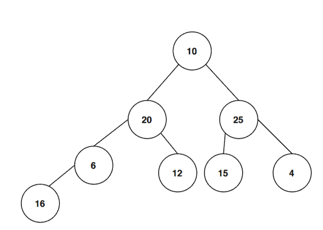
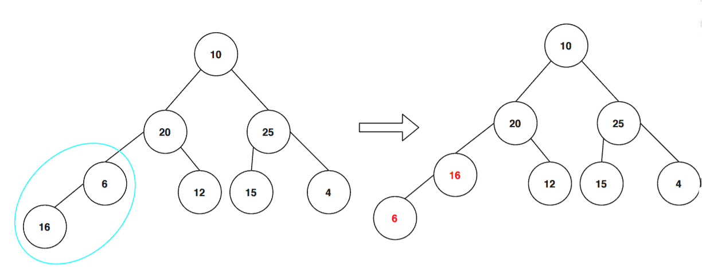
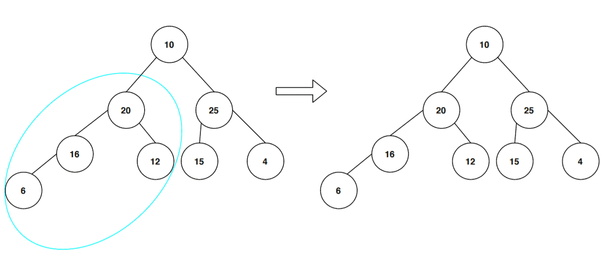
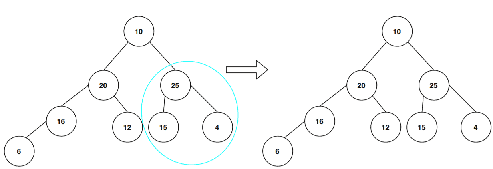
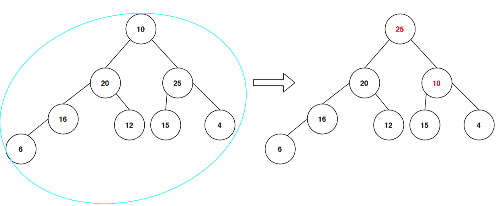
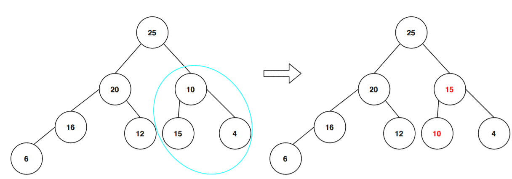
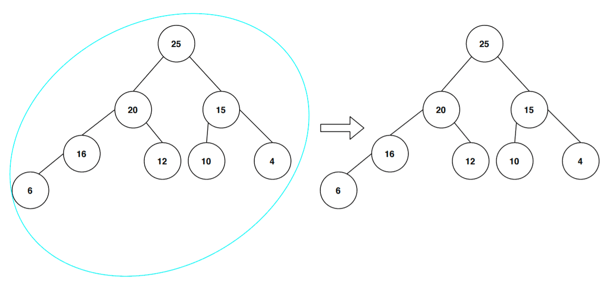

# 对二叉树进行最大堆化

[算法](README-zh.md)

1. 概述

    [堆](https://www.baeldung.com/cs/heap-vs-binary-search-tree)是一种特殊的平衡二叉树数据结构。对堆进行的一种非常常见的操作是堆化(heapify)，它可以重新排列堆以保持其属性。

    在本教程中，我们将讨论堆化操作的一种变体：最大堆化(max-heapify)。我们将通过一些示例详细讨论如何在二叉树中执行最大堆化操作。

2. 堆的定义

    堆或二叉堆是一棵完整的二叉树，具有一些额外的属性，即堆属性。在介绍堆属性之前，请注意堆有两种变体：最大堆和最小堆。每种变体的堆属性都会有一些变化。

    让我们先讨论最大堆的堆属性。根据堆属性，堆中每个节点的键或值总是大于其子节点，根节点的键或值总是堆树中最大的。

    最小堆的堆属性是：每个子节点的值或键总是大于其父节点，根节点的值总是堆中最小的。

    我们来看几个例子：

    

    在第一棵树中，根节点是树中所有其他节点中价值最高的关键节点。此外，在所有[子树](https://en.wikipedia.org/wiki/Tree_(data_structure))中，每个父节点的键值都比子节点大。因此，它遵循最大堆属性。

    在第二个例子中，根节点是树中所有其他节点中最小的。我们还可以看到，在这个堆中，子树的每个父节点的值都比子节点的值小。因此，它满足最小堆属性。

3. 最大堆化操作

    最大堆化是将节点按照正确的顺序排列，使其符合最大堆属性的过程。让我们先看看伪代码，然后再详细讨论每个步骤：

    

    我们将数组 B 和节点 s 的索引作为输入。变量 left 和 right 表示起始节点 s 的左子节点和右子节点。

    然后，我们将节点 s 及其子树从输入数组 B 中排列出来，使其满足最大堆属性。

    我们使用 $Max\!-\!Heapify()$ 构造一个最大堆。我们从一个处于树的最低层并有子节点的节点开始我们的算法。然后，我们根据最大堆属性排列当前节点及其子节点。

    完成这一步后，我们继续这个过程，确保所有子树都遵循最大堆属性。像这样，我们递归地调用 $Max\!-\!Heapify()$ 并迭代回根节点，确保树遵守最大堆属性。

    接下来让我们看看如何从输入数组建立堆。当输入数组不服从堆属性时，我们调用 $Max\!-\!Heap\!-\!Building()$ 来构建一个堆，然后在构建的堆树上运行 $Max\!-\!Heapify()$ ：

    

4. 最大堆化示例

    输入数组 B = [10, 20, 25, 6, 12, 15, 4, 16]。第一步是从数组中创建一棵二叉树：

    

    现在我们选取最底层的子树，开始检查它是否遵循最大堆属性：

    

    我们可以看到，该子树并不遵循 max-heap 属性。在这里，父节点应该比子节点包含更大的值。因此，为了确保子树遵循最大堆属性，我们交换了子节点和父节点之间的键值。

    让我们继续检查从最低层到最高层的所有子树：

    
    这棵子树遵循最大堆属性，我们不需要在这里做任何改动。接下来，我们查看右侧分支：

    
    子树再次遵循最大堆属性。让我们继续这个过程：

    
    在这里，我们又可以看到根节点的键值不是树中所有节点中最大的。因此，我们将根节点的键值与其右侧子节点的键值对调，以符合最大堆属性。

    现在，在交换后，我们需要检查根节点的右侧子树，以确定它是否遵循最大堆属性：

    
    最后，我们要检查整棵树，看它是否满足 max-heapify 属性，这样就得到了最终的最大堆树：

    

5. 结论

    在本教程中，我们讨论了二进制堆中的 max-heapify 过程。我们还举例说明了如何从输入数组创建 max-heap。
