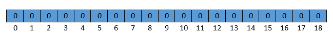
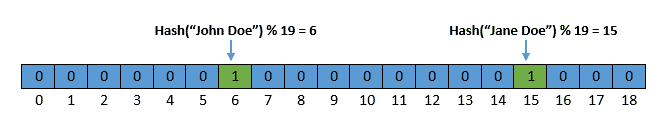
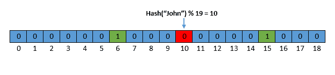
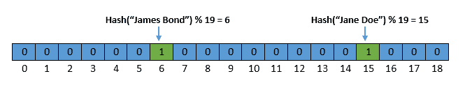

# 布鲁姆过滤器简介

[算法](README-zh.md)

[哈希算法](https://www.baeldung.com/cs/tag/hashing)

1. 概述

    相信很多人都看到过这样的警告信息--用户名或电子邮件已被占用。如果我们仔细观察，警告信息会在几秒钟内出现。所有网站都会在注册过程中进行这种验证。

    我们有没有想过，网站是如何在几秒钟内验证数百万条记录的？解决方案之一就是使用 Bloom 过滤器。

    在本教程中，我们将讨论什么是 Bloom 过滤器、其支持的操作、用法和限制。

2. 什么是 Bloom 过滤器？

    Bloom 过滤器是一种概率数据结构。它用于测试一个元素是否是一个集合的成员。当然，使用其他数据结构也可以获得相同的结果。不过，布卢姆过滤器能以节省空间和时间的方式做到这一点。

    让我们来了解一下 Bloom 过滤器是如何实现的。在其内部结构中，布鲁姆过滤器只是一个比特数组，所有比特最初都被设置为零。下图描述了大小为 19 的 Bloom 过滤器：

    

3. 布鲁姆过滤器操作

    Bloom 过滤器只支持两种操作：插入（Insert）和查找（Lookup）。让我们通过示例来了解它们：

    1. 插入

        我们可以在空间和时间复杂度不变的情况下执行插入操作。 Bloom 过滤器执行以下插入操作步骤：

        - 对输入值进行散列
        - 用数组的长度对结果进行修改
        - 将相应位设置为 1

        让我们通过在 Bloom 过滤器中插入 John Doe 和 Jane Doe 这两个字符串来说明这一点。假设这两个字符串的哈希值分别为 1355 和 8337。现在，让我们执行取模运算，以获得位数组边界内的索引： 1355%19 = 6 和 8337%19 = 15。

        插入数值后的 Bloom 过滤器将如下所示：

        

    2. 查找

        我们可以在时间复杂度不变的情况下执行查找操作。Bloom 过滤器执行以下步骤作为查找操作的一部分：

        - 对输入值进行散列
        - 用数组的长度对结果进行修改
        - 检查相应位是 0 还是 1

        如果位为 0，则该输入值肯定不在集合中。但如果该位为 1，则该输入可能是集合的成员。因此，我们来检查 Bloom 过滤器中是否存在字符串 John：

        

        在本例中，第 10 个索引的位是 0，这表明给定的字符串不在布鲁姆过滤器中。

4. 假阳性分析

    布鲁姆过滤器是一种节省空间和时间的数据结构。然而，这种效率的代价是它的概率性质。这意味着搜索一个不存在的元素可能会得到一个错误的答案。在本节中，我们将了解一种假阳性情况，以及减少其发生频率的可能解决方案。

    让我们检查 Bloom 过滤器中是否存在字符串 James Bond。假设输入字符串的哈希值为 1355，与 John Doe 相同。

    

    在本例中，查找操作返回的结果为真。但是，我们从未在 Bloom 过滤器中插入詹姆斯-邦德（James Bond）字符串。

    出现假阳性的原因是[哈希碰撞](https://www.baeldung.com/cs/hashing)。我们可以使用多个哈希函数来降低哈希碰撞频率。因此，一个输入将设置多个比特，而不是只设置一个比特。

5. 布鲁姆过滤器的应用

    布鲁姆滤波器因其高效而被广泛应用。下面我们就来讨论其中的一些应用案例：

    - 拼写检查器：早期，拼写检查器是通过 Bloom 过滤器实现的。
    - 数据库： 许多流行的数据库都使用 Bloom 过滤器来减少对不存在的行或列进行磁盘查找的高昂成本。[PostgreSQL](https://www.postgresql.org/)、[Apache Cassandra](https://cassandra.apache.org/_/index.html)、[Cloud Bigtable](https://cloud.google.com/bigtable) 等都使用了这种技术。
    - 搜索引擎： [BitFunnel](https://en.wikipedia.org/wiki/BitFunnel) 是一种搜索引擎索引算法。它的搜索索引使用 Bloom 过滤器
    - 安全性： Bloom 过滤器用于检测弱密码、恶意 URL 等。

6. 布鲁姆过滤器的局限性

    尽管 Bloom 过滤器是一种节省空间和时间的数据结构，但它也有一些局限性：

    - 布鲁姆过滤器的原始（naive）实现不支持删除操作
    - 误判率可以降低，但无法降为零
7. 结论

    在本文中，我们讨论了什么是布鲁姆过滤器及其支持的操作。然后，我们看到了 Bloom 过滤器的误报性质，以及使其减少错误的可能解决方案。我们还讨论了一些流行软件如何利用布鲁姆过滤器来提高效率。最后，我们了解了布鲁姆过滤器的局限性。
