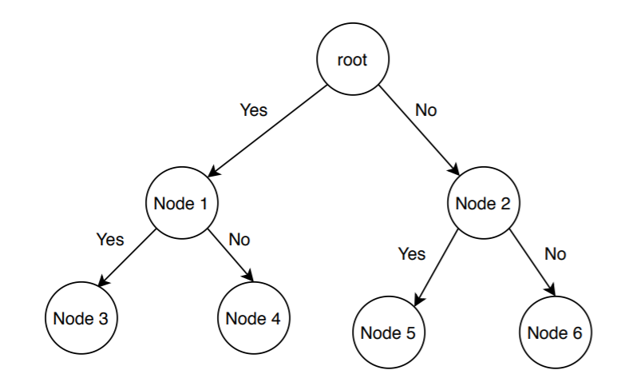
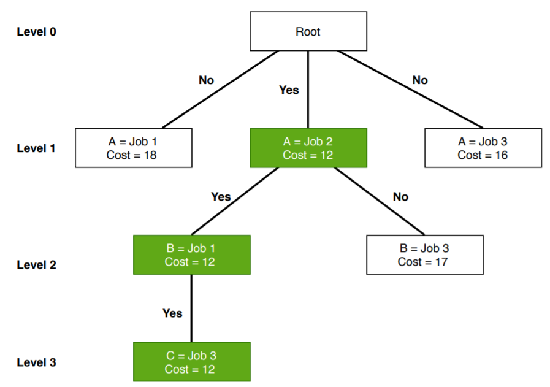

# 分支与边界算法

[算法](README-zh.md)

1. 概述

    在计算机科学中，有大量优化问题的可行解数量有限但范围广泛。其中，有些问题，如[寻找图中最短路径](https://www.baeldung.com/cs/bellman-ford)或[最小生成树](https://www.baeldung.com/cs/minimum-spanning-vs-shortest-path-trees)，可以在[多项式时间内求解](https://www.baeldung.com/cs/p-np-np-complete-np-hard)。

    [生产计划](https://personal.utdallas.edu/~scniu/OPRE-6201/documents/LP01-Production-Planning.pdf)、[人员调度](https://en.wikipedia.org/wiki/Crew_scheduling)等大量优化问题无法在多项式时间内求解，它们属于 [NP-Hard](https://www.baeldung.com/cs/p-np-np-complete-np-hard) 类问题。这些问题就是 NP-Hard [组合优化问题](https://en.wikipedia.org/wiki/Combinatorial_optimization)的例子。

    分支与边界（B&B）是一种广泛用于解决此类问题的算法范式。

    在本教程中，我们将详细讨论分支与边界法。

2. 基本思想

    分支与边界算法用于寻找组合、离散和一般数学优化问题的最优解。一般来说，给定一个 NP 难问题，分支与边界算法会探索整个可能解的[搜索空间](https://en.wikipedia.org/wiki/Search_space)，并提供一个最优解。

    分支与边界算法包括通过探索整个搜索空间来逐步枚举可能的候选解。有了所有可能的解决方案，我们首先要建立一棵有根的决策树。根节点代表整个搜索空间：

    
    在这里，每个子节点都是部分解决方案和解决方案集的一部分。在构建有根决策树之前，我们要根据最优解为给定问题[设定上下限](https://www.baeldung.com/cs/space-complexity)。在每一层，我们都需要决定将哪个节点纳入解集。在每一级，我们都要探索具有最佳边界的节点。这样，我们就能快速找到最佳和最优解。

    在这种情况下，找到一个好的上限和下限至关重要。我们可以使用任何[局部优化方法](https://en.wikipedia.org/wiki/Local_search_(optimization))或在搜索空间中任意选取一个点来找到上限。另一方面，我们可以通过[凸松弛](https://cs.uwaterloo.ca/~yboykov/miccai14_MIS/daniel_variational_methods9.pdf)或[二元性](https://en.wikipedia.org/wiki/Boolean_algebra#Duality_principle)得到下限。

    一般来说，我们希望将解集划分为更小的解子集。然后，我们构建一棵有根的决策树，最后在每一级选择可能的最佳子集（节点），从而找到可能的最佳解集。

3. 什么情况下分支与约束是好选择？

    我们已经提到过一些问题，在这些问题中，分支与边界算法比其他算法更有效。在本节中，我们将列出所有分支与边界算法是不错选择的情况。

    如果给定问题是离散优化问题，那么分支与边界算法就是一个不错的选择。离散优化是优化的一个分支，问题中的变量应属于离散集合。这类问题的例子有 [0-1 整数编程](https://en.wikipedia.org/wiki/Integer_programming)或[网络流问题](https://en.wikipedia.org/wiki/Network_flow_problem)。

    分支与边界对组合优化问题有效。给定优化问题的目标函数后，组合优化就是寻找目标函数最大值或最小值的过程。目标函数的域应该是离散的、大的。[布尔可满足性](https://www.baeldung.com/cs/cook-levin-theorem-3sat)、[整数线性规划](https://en.wikipedia.org/wiki/Integer_programming)都是组合优化问题的例子。

4. 分支与边界算法示例

    在本节中，我们将讨论如何使用分支与边界算法解决工作分配问题。

    1. 问题陈述

        首先，让我们定义一下工作分配问题。在工作分配问题的标准版本中，可能有 N 个工作和 N 个工人。为了简单起见，我们以 3 份工作和 3 名工人为例：

        | / | Job 1 | Job 2 | Job 3 |
        |---|-------|-------|-------|
        | A | 9     | 3     | 4     |
        | B | 7     | 8     | 4     |
        | C | 10    | 5     | 2     |

        我们可以将任意一个工作分配给任意一个工人，条件是如果一个工作分配给了某个工人，其他工人就不能接受该工作。我们还应该注意到，每项工作都会产生一定的成本，而且不同工人的成本也不同。

        这里的主要目的是通过为每个工人分配一项工作来完成所有工作，从而使所有工作的成本总和最小。

    2. 分支与边界算法伪代码

        现在我们来讨论如何使用分支和边界算法解决工作分配问题。

        让我们先看看伪代码：

        

        这里，M[][]是输入成本矩阵，包含可用工作数量、可用工人列表和每个工作的相关成本等信息。函数 MinCost() 维护活动节点列表。函数 LeastCost() 会计算树中每一级活动节点的最低成本。找到成本最低的节点后，我们会从活动节点列表中删除该节点并返回。

        在伪代码中，我们使用 Add() 函数计算特定节点的成本，并将其添加到活动节点列表中。

        在搜索空间树中，每个节点都包含一些信息，如成本、作业总数以及工人总数。

        现在，让我们在创建的示例中运行该算法：

        
        最初，我们有 3 个工作岗位。工人 A 可以选择接受其中任何一份工作。因此，在层级 \mathsf{1}，我们把所有可用的工作都分配给了工人 A，并计算了成本。我们可以看到，当我们把工作 2 分配给工人 A 时，它在搜索空间树的层 1 中给出了最低的成本。因此，我们将工作 2 分配给工人 A，并继续算法。"是" 表示这是当前的最优成本。

        将工作 2 分配给工人 A 后，我们仍有两个未完成的工作。现在让我们考虑一下工人 B。我们试图将工作 1 或 3 分配给工人 B，以获得最佳成本。

        我们可以将工作 1或 3 分配给工人 B。我们再次检查成本，将工作 1 分配给工人 B，因为它是 2 级别中最低的。

        最后，我们将工作 3 分配给工人 C，最优成本为 12。

5. 优势

    在分支与边界算法中，我们不会探索树中的所有节点。这就是分支与边界算法的时间复杂度比其他算法低的原因。

    如果问题不大，如果我们能在合理的时间内完成分支，它就能为给定的问题找到最优解。

    分支与边界算法会为给定问题找到一条达到最优解的最小路径。在探索树的过程中，它不会重复节点。

6. 缺点

    分支与边界算法耗时较长。根据给定问题的大小，树中节点的数量在最坏情况下可能会过多。

    此外，分支和边界算法的[并行化](https://www.baeldung.com/java-parallel-collectors)也非常困难。

7. 结论

    分支与边界算法是优化问题中最常用的算法之一。我们在本教程中对其进行了深入讨论。

    我们解释了什么情况下分支与边界算法是用户的正确选择。此外，我们还介绍了一种基于分支和边界的算法，用于解决工作分配问题。

    最后，我们提到了分支与边界算法的一些优缺点。

[Branch and Bound Algorithm](https://www.baeldung.com/cs/branch-and-bound)
