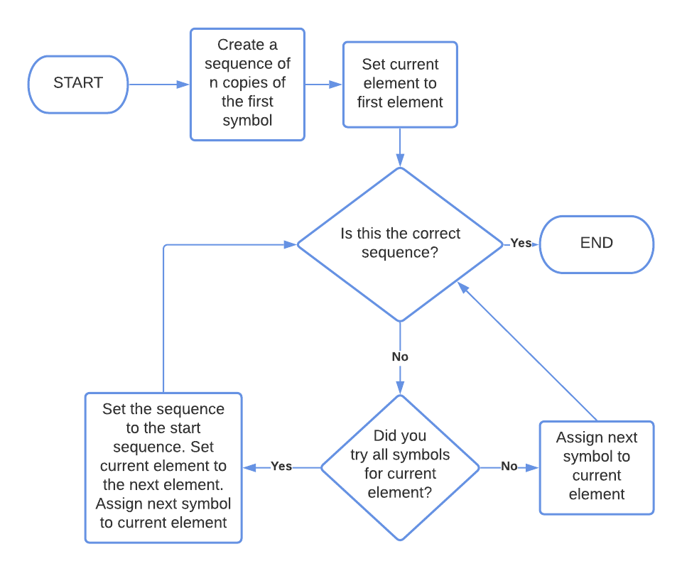
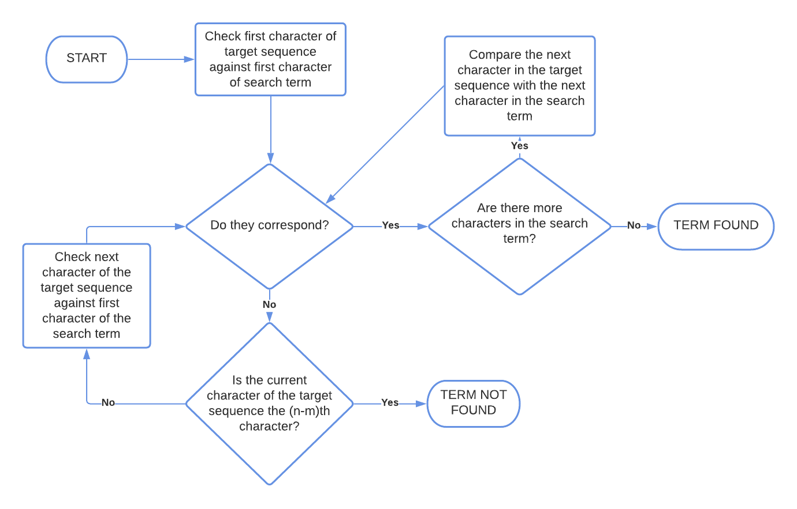

# [网络安全和字符串搜索中的暴力算法](https://www.baeldung.com/cs/brute-force-cybersecurity-string-search)

[算法]

1. 概述

    在本教程中，我们将研究暴力算法及其特点。

    首先，我们将从组合学的角度来定义本文的一般表述。然后，我们将看到它在字符串搜索中的应用。

    在本教程的最后，我们将了解暴力搜索的工作原理以及如何在实践中实现它。

2. 蛮力

    暴力搜索是一种通过测试问题的所有可能解决方案来穷举问题的算法，或者就字符串搜索而言，是一种通过检查子串的所有可能位置来[查找子串](https://www.baeldung.com/java-full-text-search-algorithms)的算法。[网络安全](https://www.baeldung.com/java-security-overview)领域通常会对其进行研究，因为在未经授权的身份验证中经常会遇到[暴力尝试](https://www.baeldung.com/spring-security-block-brute-force-authentication-attempts)。

    该算法之所以叫 "蛮力"，是因为它按顺序尝试所有可能的解决方案，没有任何特别的偏好。从这个意义上说，该算法不包含对问题的任何了解，因此要么枯燥乏味，要么简单粗暴。

    在这里，我们首先分析更一般的序列匹配问题的蛮力算法。然后，我们可以推导出其简化版本，用于字符串中的子串匹配。

    1. 已知长度序列的蛮力搜索

        如果我们知道目标序列可能包含的 k 个符号 $S = \{s_1，s_2，...，s_k\}$，那么就可以进行暴力搜索。如果我们还知道该序列的长度 n，那么我们就可以按照以下顺序进行搜索：

        - 首先，我们尝试由 s_1 的 k 次重复组成的序列 a
        - 然后，如果序列失败，我们将 a 的第一个元素改为 s_2
        - 如果也失败，我们依次将 a 的第一个元素改为 S 中所有可能的符号
        - 如果也失败，我们将 a 的第二个元素改为 s_2，然后从头开始重复操作
        - 最后，我们依次测试 S 中作为 a 的第二个元素的所有可能符号，如果测试失败，我们继续测试 a 的所有其他元素，直到找到解为止。

        这就是算法的流程图：

        

    2. 计算时间

        该算法要求在最坏情况下测试所有 $k^n$ 种可能的组合。因此，在 $\boldsymbol{k}$ 和 $\boldsymbol{n}$ 逐渐变大的情况下，其计算时间为 $\boldsymbol{O(k^n)}$。

        请注意，随着参数 k 和 n 的增加，这个值增长得非常快。举例来说，如果序列长度为 2，可能的符号为 2，那么算法最多会测试 $2^2 =4$ 种可能的组合：

        

        然而，如果序列长度为 n=8，使用的符号为字母表中的 k=26 个字符（如某些基本密码），那么我们就有 $k^n = 26^8 = 208,827,064,576$ 种可能的组合：

        

        最后，如果符号集是 128 个 ASCII 字符，目标序列的长度为 10，那么 $128^10$ 的可能组合数接近 $10^21$。如果我们每秒进行 $10^9$ 次尝试，那么测试所有可能的组合需要大约 $10^5 - 10^6$ 年的时间。

        实际计算时间也有很大的可变性。由于我们没有任何理由相信目标序列位于搜索空间的某一特定区域，因此预计完成时间为 $O(\frac{k^n} {2}) = O(k^n)$。相反，如果尝试的第一个值就是目标值，则最佳情况下的时间为 $O(1)$。

    3. 未知长度序列

        如果我们不知道目标序列的长度 $\boldsymbol{n}$，但我们知道它是有限的，那么我们需要测试所有可能的长度，直到找到正确的长度。这意味着我们首先要测试长度为 1 的序列，这只需要 $O(k^1)$ 的时间。

        第二次迭代需要 $O(k^2)$ 时间，明显大于 $O(k)$。因此，对于渐近大的 k，前两次迭代需要 $O(k^2)$ 时间。

        如果我们重复这一论证，对于 n 和 k 的渐近大值，计算时间仍然是 $\boldsymbol{O(k^n)}$，与固定长度序列的情况一样。

3. 强行搜索字符串

    在字符串中进行强制搜索的算法与前一种算法基于相同的基本原理。在这种情况下，我们要搜索的是长度为 n 的字符串是否包含长度为 m 的子串。

    我们先来看一个使用示例，然后再看它的形式化。

    1. 搜索真值

        在这个例子中，我们要搜索简-奥斯汀名言中的 "truth" 一词：

        

        在算法的第一步，我们将字符串的第一个字符与搜索词进行比较：

        

        由于比较失败，我们将比较转移到目标序列的第二个元素，以及搜索词的第一个字符：

        

        由于比较成功，我们可以尝试用目标序列的下一个元素来测试搜索词的第二个元素：

        

        这次我们就没那么幸运了。不过，我们可以继续前进，不断重复比较。直到找到索引为 8 的元素：

        

        从索引 8 开始，将搜索词的所有元素与目标序列的所有元素进行顺序比较，在这里取得了成功。这意味着我们将搜索词识别为目标序列中 8 至 8+m 之间的字符子串。

    2. 算法流程图

        这是暴力字符串搜索的流程图：

        

    3. 计算时间

        在最佳情况下，算法将目标序列识别为 0 至 m 之间的子串，从而结束比较。在最坏的情况下，它能找到 n-m 和 n 之间的子串，或者根本找不到。

        其时间复杂度为 O(nm)，在字符间平均执行 2n 次比较。

4. 结论

    本文研究了针对组合问题和固定长度字符串的暴力搜索定义。
