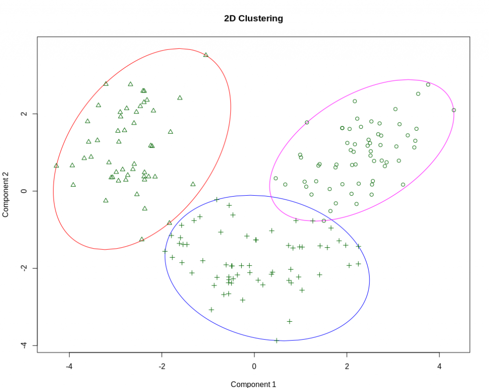
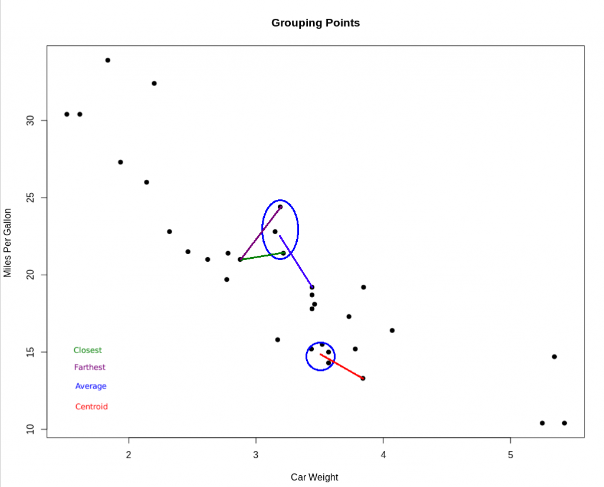
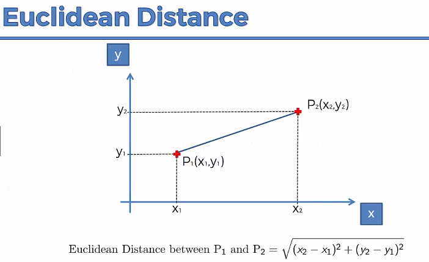
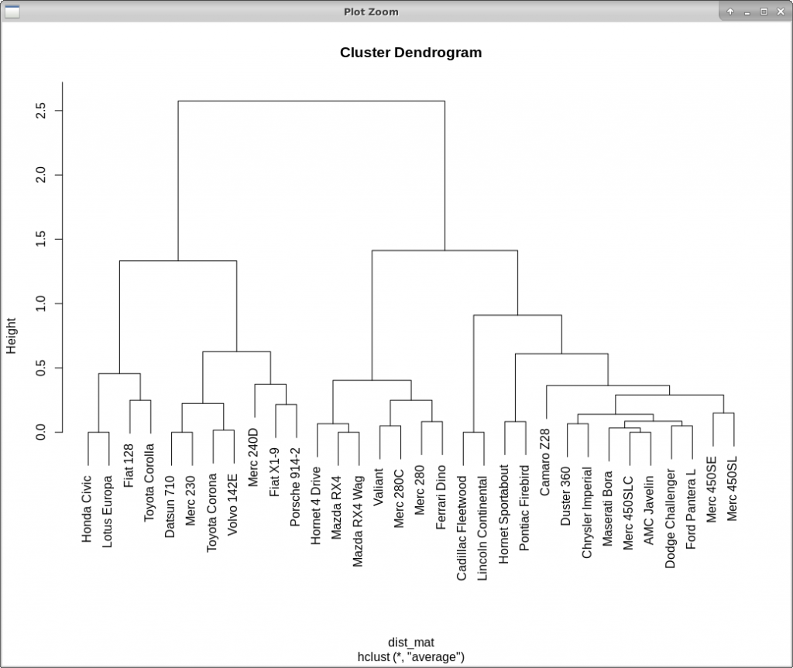
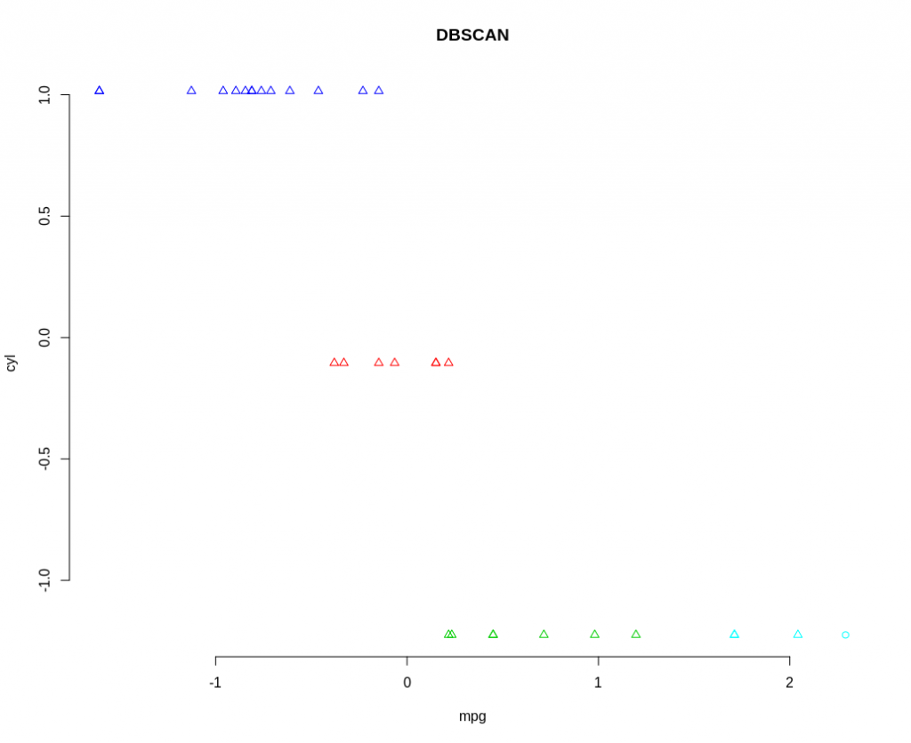
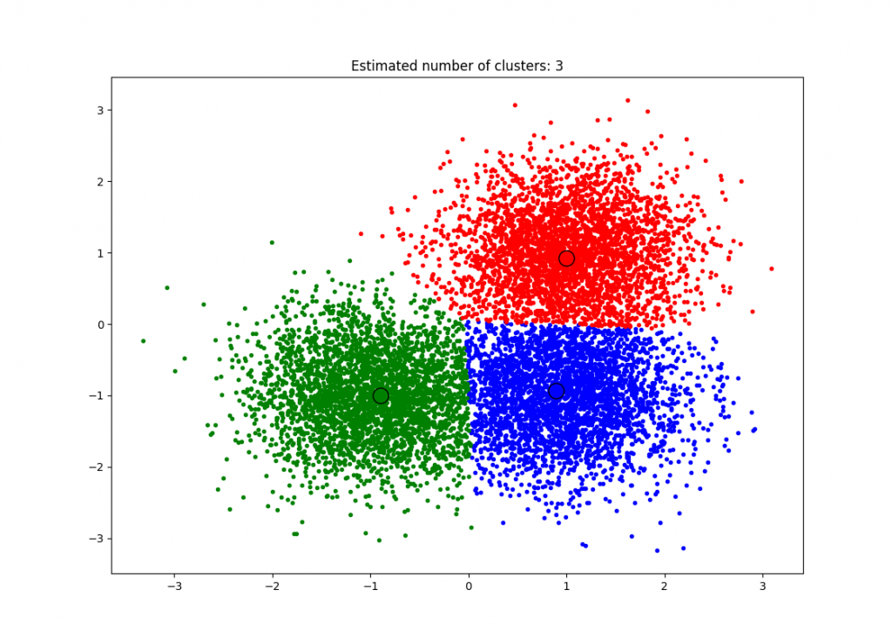
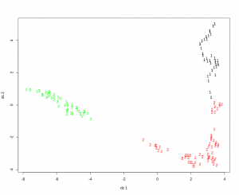

# [向未知数量的群集聚类](https://www.baeldung.com/cs/clustering-unknown-number)

[算法](README-zh.md) [数据科学](https://www.baeldung.com/cs/category/ai/data-science)

[聚类](https://www.baeldung.com/cs/tag/clustering)

1. 概述

    在数据科学中，发现的第一阶段之一是确定数据中的内容。我们对数据的了解越少，就越需要能帮助我们发现更多数据的算法。如果我们绘制了数据图，并能看到定义明确的聚类，那么我们就有了算法，只需自己提供聚类的数量即可。

    但是，如果我们有大量参数或不太明确的聚类，那么就很难使用需要预先提供聚类数量的算法。幸运的是，有许多算法并不需要我们事先了解这些知识。在本教程中，我们将讨论其中的一些算法。

2. 聚类概念

    聚类与分类类似。要进行分类，我们需要知道要将数据归入哪些类别。但是，当我们不确定这些分类可能是什么时，我们可以使用聚类。在这种情况下，就需要算法来找到模式并创建聚类。不同的算法会产生不同的聚类。因此，使用不止一种算法，并从每种算法中找到不同模式或聚类的情况并不少见。

    我们之所以使用聚类这个术语，是因为我们可以想象在[图形](https://www.baeldung.com/java-graphs)上做这件事，我们可以看到聚类在一起的点。什么是聚类？它是一组彼此接近的点：

    
    图例
    但我们如何确定它们"接近(close)"呢？我们[测量它们之间的距离](https://www.baeldung.com/java-distance-between-two-points)。

3. 计算距离或相似度

    简而言之，我们可以使用四种方法来判断一个聚类和附近的点 "有多接近"：

    - 第一种，我们查看群组中与外部点最接近的点。
    - 第二种方法是查看群组中距离外部点最远的点。
    - 第三种方法要求我们确定簇中所有点与外部点之间的平均距离。
    - 最后一种方法是计算集群的中心点或质心，并测量该假想点到外部点的距离。

    

    确定"多近"的不同方法
    确定了要测量的距离后，我们该如何测量呢？在基础几何中，我们学习了欧氏距离公式：

    $\sqrt{x^2 - y^2}$

    
    摘自：《Machine Learning A-Z: Hands-On Python and R in Data Science by Super Data Science》
    这似乎是最常用的方法，但也有[很多其他选择](https://elki-project.github.io/algorithms/distances)。

    在决定了如何定义距离以及使用什么公式后，我们就可以选择聚类算法了。

4. 算法

    实现聚类的方法有很多：

    - 紧凑性需要一个代表点及其参数。聚类中的其他点越相似，聚类就越紧凑。
    - 连接性的原理是，邻近的物体比远处的物体更相关。
    - 线性是指使用的函数类型，线性或非线性，以及
    - 硬聚类与软聚类-在硬聚类算法中，数据只分配给一个聚类。在软聚类算法中，数据可能会被分配到一个以上的聚类中。

    聚类算法有多种分类方法：分层算法 vs. 分区算法 vs. 基于模型的算法、中心点算法 vs. 分布算法 vs. 连接性算法 vs. 密度算法等。每种算法都会确定一个数据点是否更 "像" 一个数据点，而不是更 "像" 另一个数据点。但如何确定这种"相似性"因所采用的算法而异。让我们快速浏览一下现有的一些算法，重点关注那些不需要我们预先定义聚类数量的算法。

    1. 分层聚类

        分层聚类是一种使用连接性的分层算法。有两种实现方式：聚合式和分割式。

        在聚合聚类中，我们将每个点作为一个单点聚类。然后，我们选取两个最接近的点，使它们成为一个聚类。重复这一过程，直到只有一个聚类为止。

        分割法是从一个聚类开始，然后使用平面聚类算法分割该聚类。我们重复这个过程，直到每个聚类只有一个元素。

        算法会保留聚类形成或划分的记忆。这些信息被用来创建树枝图。树枝图用于设置阈值，以确定应创建多少个聚类。

        
        层次聚类树枝图

        我们可以通过在树枝图中找到最长的未中断线，在该点创建一条垂直线，然后计算交叉线的数量，从而找到最佳的聚类数量。在上面的例子中，我们找到了 2 个聚类。

    2. DBSCAN（基于密度的有噪声应用空间聚类算法）

        DBSCAN 是一种基于密度的聚类算法。它使用最小点数阈值将距离测量范围内的点聚在一起。

        $EPS(epsilon)$是邻域的最大半径。它定义了各点之间相距多远才能被视为聚类的一部分。我们不希望该值太小，因为在给定区域内很难找到最小点数。如果该值过大，则大部分对象都会集中在一个簇中。

        MinPts 是形成密集区域的最小点数。我们可以根据数据集的维数计算出这个值。经验法则是：

        $minPts \geq D + 1$

        允许的最小值是 3。但对于较大的数据集或有大量噪声的数据集来说，数值越大越好。

        
    3. 均值移动

        均值移动是一种基于中心点的算法。它的工作原理是将候选中心点更新为给定区域内各点的平均值。也就是说，它是在寻找最密集的区域并找到其中心点。

        要实现均值平移，我们需要初始化一个随机种子和一个窗口（W）。然后，我们计算 W 的重心（平均值）。我们将搜索窗口移至平均值，然后重复计算直到收敛：

        
        最终的均值移动聚类，已定义中心点和聚类。
    4. 光谱聚类

        在频谱聚类中，数据点被视为图形上的节点。节点被映射到低维空间，可以很容易地分离形成聚类。与其他假设规律模式的算法不同，频谱聚类不假设聚类的形状或形式。

        为了找到聚类，我们首先要创建一个图。这个图可以用邻接矩阵来表示，其中行和列指数代表节点，条目代表节点之间是否存在边。然后，我们将这些数据投影到低维空间，并创建聚类：

        
        葡萄酒数据集的光谱聚类
5. 结论

    在本文中，我们展示了聚类算法的定义和区别。

    我们举例说明了在不知道有多少个聚类的情况下可以使用的算法类型。一旦确定有多少个聚类，我们就可以使用[K-Means聚类算法](https://www.baeldung.com/java-k-means-clustering-algorithm)来更深入地了解我们的数据。

    聚类只是数据分析的一种探索性算法。数据探索只是数据科学过程中的一个步骤。要深入了解有助于整个过程的工具，请查看我们的 [Spark MLlib](https://www.baeldung.com/spark-mlib-machine-learning) 指南。
