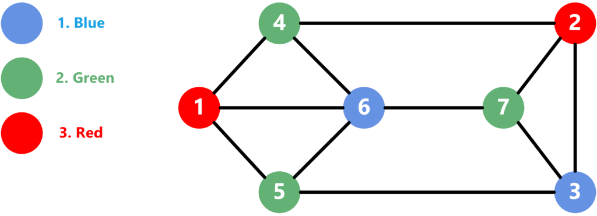
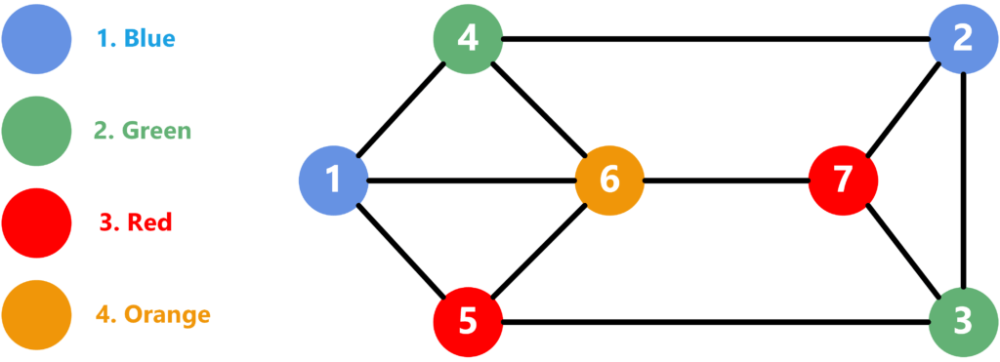
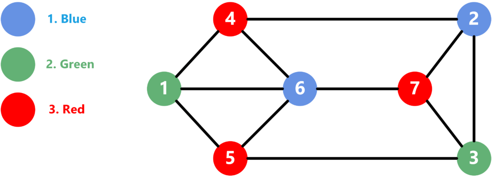

# 图形着色的建设性算法

1. 概述

    在本教程中，我们将介绍解决图形[着色问题](https://www.baeldung.com/cs/graphs-vertex-colouring)的著名算法。首先，我们将定义该问题并举例说明。然后，我们将展示贪婪方法和 DSatur 方法，并讨论它们的最优性。

2. 定义问题

    我们给定了一个由 V 个顶点和连接它们的 E 条边组成的[图](https://www.baeldung.com/cs/graphs) G。我们需要为图中的每个顶点分配一种颜色，以满足以下条件：

    - 没有两个相邻顶点的颜色相同。请记住，如果有一条边连接两个顶点，那么这两个顶点就被认为是相邻的。
    - 使用的颜色数量尽可能少。

    例如，我们来看看下面的图形：

    

    我们可以看到，该图由 V=7 个顶点和连接它们的 E=11 条边组成。我们将顶点从 1 到 7 编号，将颜色从 1 到 3 编号。请注意，相邻的顶点没有相同的颜色。另外，我们的方案是最优方案，因为没有办法用更少的颜色来解决问题。

    由于该问题被认为是 [NP-Complete](https://www.baeldung.com/cs/p-np-np-complete-np-hard)，因此没有一种高效算法可以解决所有类型的图。不过，我们将介绍两种接近最优解的方法。

3. 贪婪法

    让我们通过一个例子来讨论理论观点，然后直接进入实现。

    1. 理论思想

        在贪婪法中，我们为图形顶点找到一个随机排序。然后，我们逐个遍历顶点，并为每个顶点分配数字最小的可行颜色。

        让我们来看看第 2 节中介绍的同一个图。假设我们使用以下顶点排序：

        \[\{ 1, 2, 3, 4, 5, 6, 7 \}\]

        那么，我们会得到下面的解：

        

        解决问题的步骤如下：

        - 从顶点 1 开始，使用第一种颜色。
        - 顶点 2 没有任何相邻颜色。因此，我们也使用第一种颜色。
        - 顶点 3 旁边有一个蓝色顶点。因此，我们使用第二种颜色。
        - 同样，顶点 4 有两个蓝色顶点与之相邻，因此我们也使用第二个颜色。
        - 顶点 5 有蓝色和绿色相邻。因此，我们必须使用第三种颜色。
        - 顶点 6 现在有蓝色、绿色和红色顶点与之相邻。因此，我们必须使用新的第四种颜色。
        - 最后，顶点 7 与蓝色、绿色和橙色顶点相邻。由于第三种颜色（红色）不相邻，我们可以使用它。

        因此，我们使用了 4 种颜色来解决这个问题，这并不是最佳方案。不过，它仍然接近实际的最优结果。

    2. 执行

        来看看贪婪法的实现：

        

        我们定义了一个函数，它以应用着色的顺序接收图形 G 和顶点数组 V。首先，我们定义一个名为 color 的数组，数组中填充 0，表示我们最初没有为顶点分配任何颜色。

        然后，我们遍历所有顶点。对于每个顶点，我们遍历其所有边，并将子顶点的颜色添加到 usedColors 集合中。然后，我们开始为当前顶点分配正确的颜色。

        我们将 currentColor 从 0 开始，并为此进行多次迭代。在每次迭代中，我们都会将 currentColor 增加一个，并检查它是否不在 userColors 中。如果是，我们就将其赋值给当前顶点。

        最后，我们将返回包含问题解决方案的颜色数组。

    3. 时间复杂性

        在整个算法中，我们对每个节点都会遍历一次。我们会遍历每个顶点的所有边，并将颜色添加到一个集合中。因此，每条边都要检查两次；从每个顶点检查一次，连接一次。然后，我们遍历所有颜色，找出颜色数最小的那条。由于每条边最多只能使一种颜色无效，因此在为顶点找到有效解决方案之前，我们将执行 E 个步骤。

        因此，假设我们使用一个添加元素复杂度恒定的 [HashSet](https://www.baeldung.com/java-hashset)，那么总体时间复杂度将是$\mathbf{O(V + E)}$。

4. DSatur 方法

    让我们先讨论理论上的想法，然后跳转到实现。

    1. 理论思想

        DSatur 是 Saturation Degree 的缩写。这种方法与贪婪方法类似。不过，它使用了一种更复杂的启发式来确定应用着色的顶点顺序。它使用以下标准来选择下一个顶点：

        1. 选择相邻不同颜色数量最多的未着色顶点。因此，它会选择饱和度最高的顶点。
        2. 如果出现平局，则选择饱和度最高的顶点。请记住，顶点的度数就是它的边数。
        3. 如果仍然存在平局，则从满足条件的顶点中随机选择一个。

        让我们考虑与第 2 节中介绍的相同的图：

        

        通过以下步骤找到解决方案：

        1. 由于所有顶点都尚未着色，我们选择度数最高的顶点。因此，我们选择顶点 6 并为其涂抹蓝色。
        2. 现在饱和度最高的顶点是{1, 4, 5, 7}。由于它们的饱和度都是 3，我们随机选择顶点 1 并使用第二种颜色。
        3. 现在，顶点 4 和 5 的饱和度为 2，边缘度为 3。我们随机选择顶点 4，并使用第三种颜色。
        4. 顶点 5 是唯一一个饱和度为 3 的顶点。因此，我们可以使用第三种颜色，因为蓝色和绿色已经是相邻颜色。
        5. 其余所有顶点的饱和度相同，边缘度均为 3，因此我们随机选择顶点 2。唯一相邻的颜色是第三种颜色，因此我们可以使用第一种颜色（蓝色）。
        6. 由于所有顶点的饱和度和边度都相同，我们随机选择顶点 3。相邻的颜色是第一种和第三种。因此，我们可以使用第二种颜色（绿色）。
        7. 剩下的唯一顶点是 7，它与第一和第二种颜色相邻。因此，我们选择第三种颜色（红色）。

        请注意，这种方法比贪婪方法产生了更好的解决方案。在这种情况下，使用三种颜色是最优解。不过，这种算法并不能保证给出最优解，但通常会比贪婪法给出更好的解。

        此外，DSatur 方法还能给出[双叉图](https://www.baeldung.com/cs/graphs-bipartite)的最优解。这是因为无论从哪个顶点开始，我们总是选择饱和度最高的顶点。由于二叉图中没有同侧的边，所以下一个选择的顶点将位于另一侧，并分配不同的颜色。这个过程会一直持续下去，直到我们找到所有顶点的解决方案。

    2. 执行

        来看看算法的实现：

        

        我们定义了一个名为 dSaturColoring 的函数，它将图形和顶点作为输入。与贪婪方法类似，我们定义了数组 color，用于保存每个顶点的颜色。此外，我们还定义了 satur 数组和[优先级队列](https://www.baeldung.com/cs/priority-queue) Q，前者用于保存每个顶点的相邻颜色集，后者用于保存按饱和度（最初为零）和边缘度排序的顶点。

        接下来，我们将执行多个步骤。我们每一步都会从队列中提取一个节点，并得到它的顶点。如果顶点已经着色，我们就会跳出一个顶点相同但饱和度更高的节点。

        如果该顶点尚未着色，我们将使用与贪婪法相同的方法为其找到解决方案。然后，我们遍历当前节点的所有子节点，更新它们的饱和度，并向队列中推送一个带有子节点和新饱和度的新节点。请注意，即使我们为同一个顶点推送了一个节点，它的饱和度也会更低。因此，它将被拉到该节点之后并被忽略。

        最后，我们将返回颜色数组，其中包含每个顶点的答案。

    3. 时间复杂性

        该算法执行多个步骤，直到队列为空。但是，步骤数不能超过边的数量，因为每条边最多只能向队列添加一个新节点。此外，从队列中取出节点后，我们只对每个顶点处理一次。在这个过程中，我们会遍历节点的所有子节点。因此，总体而言，我们只遍历了边的总数。

        请注意，我们会执行多个步骤，直到为顶点找到合适的颜色。不过，这些步骤不会超过我们在贪婪方法中描述的边的数量。唯一增加的复杂度是在优先级队列中添加新节点。

        鉴于上述事实，总体复杂度为 $\mathbf{O((V + E) \cdot log(E))}$。

5. 比较

    贪婪方法的时间复杂度低于 DSatur 方法。因此，在时间复杂度是一个非常关键的因素的情况下，贪婪法更受青睐。尽管如此，DSatur 方法比贪婪方法更有可能找到最优解。另外，时间复杂度也只比贪婪法略高。

    因此，与贪婪法相比，我们更倾向于使用 DSatur 法。

6. 结论

    在本教程中，我们介绍了一些图着色的构造性算法。我们定义了问题，并用一个例子进行了解释。然后，我们定义了两种解决问题的方法。我们讨论了每种方法的理论思想、实现方法和时间复杂度。最后，我们对这两种方法进行了比较，并总结了何时使用这两种方法。

## 相关文章

- [ ] [Constructive Algorithms for Graph Colouring](https://www.baeldung.com/cs/graph-coloring-constructive-methods)
