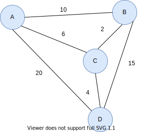
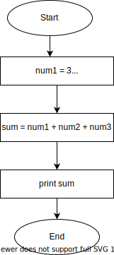

# [启发式与算法的区别](https://www.baeldung.com/cs/heuristic-vs-algorithm)

1. 简介

    在本教程中，我们将讨论启发式算法和算法，它们是用于解决问题、学习和决策的计算机科学概念。首先，我们将给出每个术语的详细定义。然后，我们将举例说明。最后，我们将强调它们之间的主要区别。

2. 什么是启发式？

    [启发式](https://en.wikipedia.org/wiki/Heuristic_(computer_science))通常是指解决问题的技巧。当传统方法耗时较长，或者传统方法无法找到合适的解决方案时，我们就会使用启发式方法。换句话说，启发式方法可以让我们通过探索、直觉，有时甚至是有根据的猜测，[快速获得问题的适当解决方案](https://www.baeldung.com/cs/greedy-vs-heuristic-algorithm#fundamentals-of-heuristic-algorithm)。

    因此，启发式方法从探索问题的可能解决方案开始。第一步是搜索解决方案空间，找到解决方案可能所在的区域。然后集中在这一区域寻找解决方案。

    这样做的目的是及时获得可接受的解决方案。因此，获得的解决方案不一定是最佳或最精确的解决方案。这就是所谓的精度与速度之间的权衡。

    除了精度和速度之间的权衡之外，还需要考虑其他因素，例如

    - 完整性 - 是否找到了所有可能的解决方案？
    - 最优性 - 解决方案是否是最佳解决方案？

    此外，启发式方法无法用数学方法证明，因为解决问题的方法通常基于直觉和探索。因此，其他用户无法复制启发式方法，也不会总是得到相同的结果。

3. 启发式方法的应用

    启发法的吸引力在于它能及时找到解决方案。因此，它们适用于优化问题和算法。为了更好地理解这一点，我们来讨论一些例子：

    1. 旅行推销员问题

        旅行推销员问题（[TSP](https://www.baeldung.com/java-simulated-annealing-for-traveling-salesman#overview-2)）是一个优化问题，其目标是找到一组节点之间的最优路线。问题是，给定一组城市（节点）和这些城市之间的距离，那么访问每个城市的最短路线是什么：

        

        TSP 问题很难解决，通常被归类为 NP 难。换句话说，它既复杂又难以验证。不过，启发式方法可以帮助我们近似找到一条通往所有城市的最优路线。

    2. 贪婪算法

        [贪婪算法](https://www.baeldung.com/cs/greedy-vs-heuristic-algorithm#theoretic-idea-of-greedy-algorithm)试图在解决问题的每个阶段找到局部最优解。要说明的是，其假设是一组局部最优解最终可能会导致一个全局最优解。因此，它们经常被应用于我们刚刚讨论过的 TSP 问题。

    3. 杀毒软件

        在扫描病毒时，启发式方法用于搜索文件中与病毒相似的代码样本。这大大减少了需要搜索病毒的文件数量。

        启发式方法的其他一些应用包括搜索、[模拟退火](https://www.baeldung.com/java-simulated-annealing-for-traveling-salesman#overview-1)和[爬山](https://www.baeldung.com/java-hill-climbing-algorithm)。

4. 什么是算法？

    相反，算法是解决问题或完成特定任务的一套精确规则或程序。算法不依赖直觉或猜测，而是提供获得解决方案的指令。因此，算法保证了给定的规则集最终会引导我们找到正确的答案。

    算法通常由一系列有起点和已知终点的步骤组成。例如，考虑一个三数相加的算法。首先，我们先在三个数字上应用加法运算符。结果，我们会得到一个三数之和的值：

    

    算法通常有三种表示方法：编程语言、伪代码或流程图。此外，它们还可以通过数学证明来展示如何生成答案。基于这一特点，大多数算法都可以被其他用户复制。

5. 算法的应用

    算法是精确的，因此适用于计算机科学的各个领域。它们用于从一组给定的输入中产生输出。让我们回顾一下其中的一些应用。

    1. 搜索

        搜索算法用于检索数据元素，通常是从数据结构或搜索空间中检索。值得注意的是，它们在搜索方法上有所不同。例如，[线性搜索](https://www.baeldung.com/cs/linear-search-vs-binary-search#linear-search)一次扫描每个元素，而[二进制搜索](https://www.baeldung.com/cs/linear-search-vs-binary-search#overview)将搜索范围一分为二，从中间值开始。

    2. 排序

        排序算法用于对元素进行排序或排列。例如，元素可以按升序或降序排列。具体来说，如果输入一个未排序的元素列表，排序算法就会按照指定的顺序排列元素并返回一个排序列表。一些例子包括 [quicksort](https://www.baeldung.com/java-quicksort)、[selection sort](https://www.baeldung.com/java-selection-sort) 和 heapsort。

    3. 密码学

        在密码学中，算法用于信息的验证、加密和解密。它们可防止未经授权访问数据和资源。[对称](https://www.baeldung.com/java-secret-key-to-string#overview-1)和非对称密钥算法就是其中的一些例子。

    4. 人工智能

        在人工智能领域，算法用于训练计算机程序，以及教会机器如何自主学习和运行。人工智能的一些算法类别包括监督算法、无监督算法和强化学习算法。

6. 了解启发式算法和算法的区别？

    需要注意的是，启发式也可以是算法，因为它描述了如何解决问题。不过，两者的主要区别可归纳如下：

    | 启发式                   | 算法                 |
    |-----------------------|--------------------|
    | 基于直觉、猜测或探索            | 基于有限的指令集           |
    | 通常会产生次优结果；但也有可能产生最优结果 | 保证产生最优结果           |
    | 无法用数学方法证明；但情况并非总是如此   | 可以用数学方法证明          |
    | 不会每次都得出相同的答案，因此不可复制   | 总能得到相同的答案，因此具有可重复性 |

7. 结论

    在本文中，我们讨论了启发式和算法。我们探讨了它们的工作原理，并列举了它们的使用实例。最后，我们强调了这两个概念之间的主要区别。
