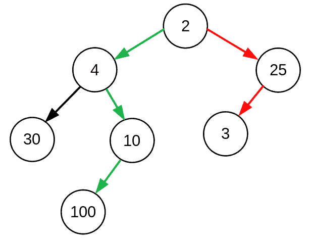
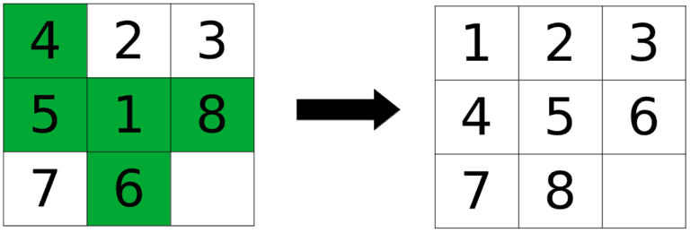
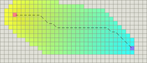

# [什么是启发式函数？](https://www.baeldung.com/cs/heuristics)

1. 概述

    在这个简短的教程中，我们将介绍启发式函数的定义、利弊以及一些著名的例子。

2. 启发式函数

    1. 启发式函数的定义

        启发式函数（算法）或简称启发式，是在没有精确解或求解时间过长的情况下解决问题的捷径。

    2. 速度与准确性

        从定义中我们可以得出结论，启发式的目标是找到更快的解或近似解，即使它不是最优解。换句话说，在使用启发式算法时，我们需要用准确性来换取解的速度。

        例如，[贪婪算法](https://www.baeldung.com/cs/greedy-approach-vs-dynamic-programming)通常会产生快速但次优的解决方案。在下面这棵树里，如果用贪心算法求最大和，就会选择红色路径，而最优路径是绿色路径：

        

    3. 可接受的启发式

        启发式并不总是能降低成本。然而，那些不会高估解决方案的真实成本或可能的最低成本的启发式方法被称为可接受的启发式方法。这一特性可以保证解决方案的最优性。可以通过简化原始问题的约束条件，将其简化为约束条件较少的问题，从而找到可接受的启发式。举例来说，我们来看看八巧板问题：

        

        我们从左边的状态开始，想要到达右边的目标状态。作为这个谜题的启发式解法，我们可以考虑两个状态之间的[汉明距离](https://www.baeldung.com/cs/string-similarity-edit-distance#:~:text=Hamming%20Distance,transform%20one%20string%20into%20another.)，也就是用绿色标出的放错位置的瓷砖数量。在这里，我们放宽了问题的限制，假设我们只需拾起一块瓦片并将其放到正确的位置即可。

        这个解决方案是可接受的（即它是一个下限），因为最优解决方案的步骤不会比它少。

3. 启发式算法实例

    有许多问题我们都可以用启发式算法来解决。

    让我们讨论其中三个著名的问题。

    1. $A^*$ 搜索

        $A^*$ [寻路算法](https://www.baeldung.com/cs/a-star-algorithm)使用启发式来寻找图中的最短路径。每个节点 n 都有一个代价 f(n)，计算公式为 $f(n) = g(n) + h(n)$。在这个公式中，g(n) 是节点从路径起点出发的实际成本，$h(n)$ 是节点到达目标的启发式成本。$A^*$ 是可容许的，这意味着它总能找到最优 $f(n)$ 的解。

    2. 旅行推销员问题（TSP）

        在 TSP 中，给定一个城市列表，我们希望找到一条最短的路线，能恰好访问每个城市一次，然后返回起始城市。这被称为 NP 难问题，意味着很难找到最优解。因此，我们使用一种贪婪算法，它可能不会给出最短路径，但至少能快速给出答案。

        贪心算法可以说是一种启发式算法，虽然它是次优解，但效果还算不错。

    3. 网格图上的距离

        在网格图上搜索路径时，可以根据移动方向的限制条件，将若干距离函数视为启发式算法。然后在 $A^*$ 算法中使用这种启发式来寻找最短路径。在下面的图片中，我们想从橙色方格移动到紫色方格，彩色方格就是搜索空间。如果任何方向都有可能，我们可以使用[欧氏距离](https://www.baeldung.com/cs/euclidean-distance-vs-cosine-similarity)：

        

        如果只允许四个方向，则可以使用[曼哈顿距离](https://xlinux.nist.gov/dads/HTML/manhattanDistance.html)：

        

4. 结论

    在本文中，我们了解了启发式函数、它的优点和缺陷，以及一些可以使用启发式函数的例子。
