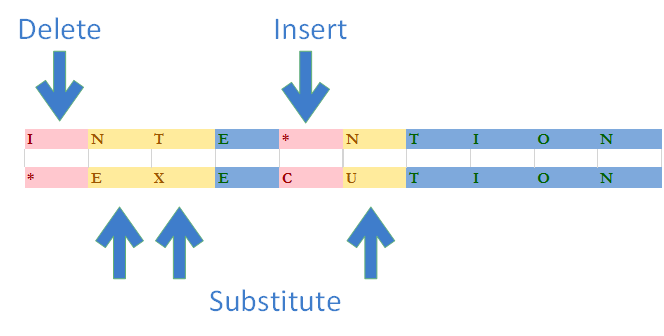
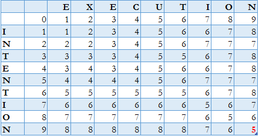
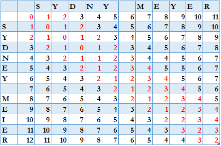

# 莱文斯坦距离计算

[算法](README-zh.md) [数据科学](https://www.baeldung.com/cs/category/ai/data-science)

1. 简介

    在本教程中，我们将学习计算两个字符串之间莱文斯坦(Levenshtein)距离的不同选项。我们将考虑基本实现的复杂性，并讨论改进的方法。

    但在此之前，我们先温习一下列氏距离的一些基本知识。

2. 非正式定义

    莱文斯坦距离是将一个字符串转换成另一个字符串所需的最小编辑操作数。编辑操作包括插入、删除和替换。

    在下面的示例中，我们需要执行 5 次操作才能将单词 "INTENTION（意图）"转换为单词 "EXECUTION（执行）"，因此这两个单词之间的莱文斯坦距离为 5：

    
    莱文斯坦距离是被称为编辑距离的一系列距离度量中最常用的度量。这些同类距离度量在执行转换时允许的基本操作集上有所不同，例如，汉明距离只允许替换。Damerau-Levenshtein 距离除了莱文斯坦距离定义的字符集外，还允许字符转置。它常用来代替同名的经典列文士坦距离。

    在经典莱文斯坦距离中，每个操作都有一个单位成本。专业版本可能会为操作分配不同的成本，甚至成本取决于字符。我们可能需要定义这样一个复杂的运算成本函数来表示字符的视觉或语音相似性。

3. 形式定义和属性

    两个字符串 a、b 之间的莱文斯坦距离由 $lev_{a,b} (|a|, |b|)$给出，其中

    \[\operatorname{lev}_{a,b}(i,j)= \begin{cases} \max(i,j) & \text{ if } \min(i,j)=0, \\ \min \begin{cases} \operatorname{lev}_{a,b}(i-1,j) + 1 \\ \operatorname{lev}_{a,b}(i,j-1) + 1 \\ \operatorname{lev}_{a,b}(i-1,j-1) + 1_{(a_i \neq b_j)} \\ \end{cases} & \text{ otherwise.} \end{cases}\]

    在这个等式中，$1$ 是指标函数，如果 $a_{i} == b_{j}$，则等于 0，否则等于 1。我们用 |a| 表示字符串 a 的长度。

    $lev_{a,b} (i, j)$ 是字符串前缀（a 的前 i 个字符和 b 的前 j 个字符）之间的距离。

    该公式的第一部分表示将前缀转换为空字符串或反之亦然的插入或删除步骤数。

    第二部分是一个递归表达式，第一行表示删除，第二行表示插入。最后一行负责替换。

    莱文斯坦距离具有以下特性：

    - 当且仅当两个字符串相等时，它为零
    $dist(a, b) = 0 \iff a = b$
    - 它是对称的：
    $dist(a, b) = dist (b, a)$
    - 这个值最多是较长字符串的长度：
    $dist(a, b) \leq max(|a|, |b|)$
    - 值至少是字符串的大小差：
    $abs(|a| - |b|) \leq dist(a, b)$
    - 三角形不等式--两个字符串之间的距离不大于它们与另一个字符串的距离之和：
    $dist(a, b) \leq dist(a, c) + dist(b, c)$

    牢记这些性质对于理解计算算法的工作原理和在应用中使用它们都很有用。

    三角不等式属性对特定任务非常有益，因为它是构建公度空间的主要要求。反过来，公元空间也可以通过公元树结构进行高效索引。其中包括 BK 树和 VP 树。

4. 算法

    既然我们已经知道了什么是列文斯泰因距离及其基本特性，那么现在就该看看计算它的方法了。我们先从最琐碎、最低效的算法开始，然后再看看有哪些改进方案。

    下面定义的每种算法都使用基于零的字符串索引。

    1. 定义递归

        利用定义，我们可以写出一个直接的递归算法：

        

        $x.substr(n)$ 函数从元素 n 开始返回 x 的子串。

        这种实现方式会多次重新计算相同前缀的距离，因此效率非常低。

    2. 全矩阵迭代

        由于我们知道列文士坦顿距离的特性，因此可以构建大小为 (|a| + 1) \times (|b| +1 ]) 的矩阵，其中包含 i, j 位置上的值 lev_{a,b} (i, j)。

        现在，我们可以使用[动态编程方法](https://www.baeldung.com/cs/greedy-approach-vs-dynamic-programming)，对该矩阵进行洪泛填充(flood fill)，得到最后的右下角元素，作为我们的结果距离。这种算法被称为瓦格纳-费舍尔算法：

        

        在"INTENTION"到"EXECUTION"的转换样本上运行该算法，可以得到前缀距离的结果矩阵：

        
        该矩阵右下方的元素正是我们之前观察到的 5 次运算。

    3. 两行迭代

        假设我们只想获得最终值，我们可以很容易地修改上面的实现，以避免整个矩阵的分配。要向前移动，我们只需要两行--当前正在更新的一行和上一行：

        

        这种优化使得我们无法读取实际的一系列编辑操作。赫希伯格算法通过使用动态编程和分而治之来解决这一问题。

    4. 单行迭代

        此外，我们还可以发现，要计算特定行位置上的值，我们只需要三个值--左边的、正上方的和对角线上的最后一个。

        因此，我们可以修改函数，只分配一行和两个变量，而不是两行。这样修改后，对内存的要求会更加宽松：

        

5. 复杂性与优化

    上面介绍的所有迭代算法的时间复杂度都是$\mathcal{O}( |a| \times |b| )$。全矩阵实现的空间复杂度为 $\mathcal{O}( |a| \times |b| )$，这通常使其不实用。双行和单行实现的线性空间复杂度都是$\mathcal{O}( max(|a|,|b|) )$。交换源和目标以减少计算行长将进一步降低到 $\mathcal{O}( min(|a|,|b|) )$ 。

    已经证明，除非强指数(exponential)时间假设是假的，否则莱文斯坦距离无法在亚二次(subquadratic)方时间内计算出来。

    幸运的是，这只适用于最坏情况(worst-case)下的复杂性(complexity)。

    在实际应用中，我们可能会引入一些优化方法，这些方法对于在相关数据集上进行距离计算至关重要。

    在上一个单行实现中，我们已经开始研究减少空间分配的方法。现在，让我们看看能否进一步缩短实际运行时间。

    1. 常用前缀和后缀

        通过观察 "INTENTION"到 "EXECUTION"的转换示例，我们可能会注意到这两个词都有共同的后缀-TION。很明显，这个后缀不会影响列文斯泰因距离。

        获取第一个不匹配字符位置的函数通常非常高效，因此我们可以去掉最长的公共后缀和前缀，以减少字符串部分的二次计算量。

        下面的实现还包括上文提到的源代码和目标代码交换，以提供上文提到的 $\mathcal{O}( min(|a|,|b|) )$ 空间复杂度：

        

    2. 上限和最小距离

        假设我们有相对较长的字符串，而且我们只对比较相似的字符串感兴趣，例如拼写错误的名字。在这种情况下，完整的莱文斯坦计算必须遍历整个矩阵，包括右上角和左下角的高值，而我们实际上并不需要这些值。这就为我们提供了使用阈值进行优化的可能性，所有超过某个边界的距离都会被简单地报告为超出范围。因此，对于有界距离，我们只需要计算宽度为 2K + 1 的对角线条纹中的值，其中 K 是距离阈值。

        假设我们要比较字符串"SYDNEY MEIER"和"SYDNY MEYER"，阈值为 2，我们需要计算对角线单元格两侧跨度为 K 的条纹中单元格的值，红色突出显示：

        
        换句话说，如果莱文斯坦距离超过边界，执行过程就会失败。

        这种方法的时间复杂度为 $\mathcal{O}( min(|a|,|b|) \times K )$，对于较长但相似的字符串，执行时间是可以接受的。

        此外，由于我们知道距离至少是字符串的长度差，因此如果距离超过我们选择的阈值，我们就可以跳过计算。

        现在，我们可以用边界来实现对两行算法的修改：

        

        在实际应用中，我们可以使用该函数先计算阈值为 1 的距离，然后每次将阈值加倍，直到达到实际极限或找到距离为止。

    3. 组合技术

        根据我们的具体应用，我们可能会对上述优化技术取得的结果感到满意。不过，由于我们最终可能需要进行二次计算，因此我们必须注意运行时间，尤其是对于相似度较低的长字符串。

        除列文斯泰因距离外，还有许多具有线性运行时间的度量方法，如袋距离、Jaro-Winkler 距离或 q-grams 等。我们可以使用这些技术中的任何一种来过滤掉超出可接受相似度范围的匹配。一旦我们根据所选的近似度量找到了一小部分匹配，我们就可以运行真正的莱文斯坦距离对这些匹配进行排序。

6. 自动机

    另一种可以在给定字典上执行模糊文本搜索的方法是使用莱文斯坦自动机。其基本思想是，我们可以为字符串 W 和数字 N 构造一个有限状态自动机，该自动机接受的字符串集合恰好是与字符串 W 的列文斯坦因距离不大于 N 的字符串。

    通过向构建的自动机输入任何单词，我们可以根据自动机是否接受或拒绝该单词来定义该单词与目标字符串的距离是否大于指定阈值。

    由于 FSA 的性质，运行时间与被测单词的长度呈线性关系。

    虽然自动机构造本身的计算成本可能很高，但已经证明它可以在 $\mathcal{O}(|W|)$内完成。

7. 应用

    莱文斯坦距离及其编辑距离家族的同类产品应用广泛。

    近似字符串匹配（也称为模糊文本搜索）通常是基于列文斯坦因距离实现的，而列文斯坦因距离又被广泛应用于拼写检查、光学字符识别校正系统、语音识别、垃圾邮件过滤、记录链接、重复检测、自然语言翻译辅助、计算生物学中的 RNA/DNA 测序以及剽窃检测等领域。

    一些 Java 框架以这样或那样的形式实现了这些功能，包括 [Hibernate Search](https://www.baeldung.com/hibernate-search)、[Solr](https://www.baeldung.com/full-text-search-with-solr)和[Elasticsearch](https://www.baeldung.com/elasticsearch-full-text-search-rest-api)。

    此外，在语言学中，我们可以使用莱文斯坦距离（Levenshtein distance）来确定语言距离，即语言或方言之间的差异度量。

8. 总结

    在本教程中，我们讨论了实现莱文斯坦距离的不同算法。

    我们看到，最坏情况下的复杂度是四次方的，因此，可能的优化问题对于我们提供可用的实现至关重要。

    最后，我们注意到，除了一些直接降低计算成本的技术外，还可以使用不同的方法来解决议程上的任务。
