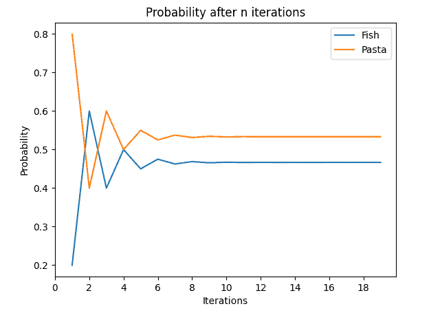
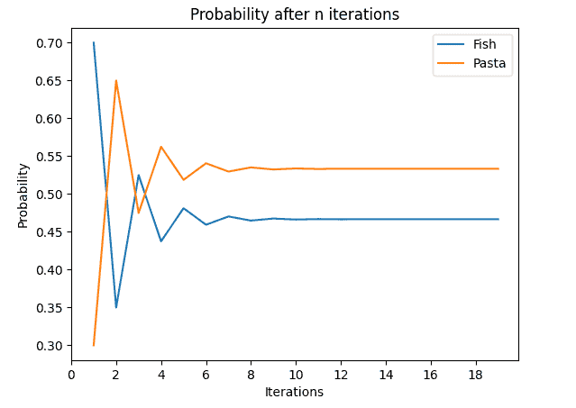
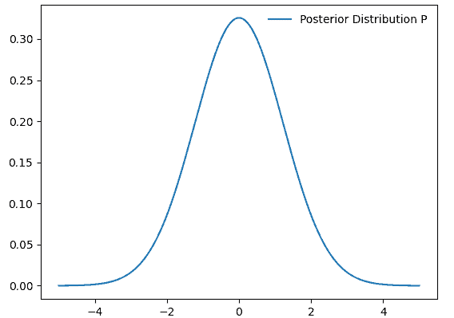
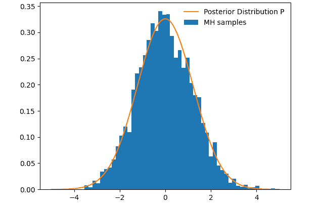
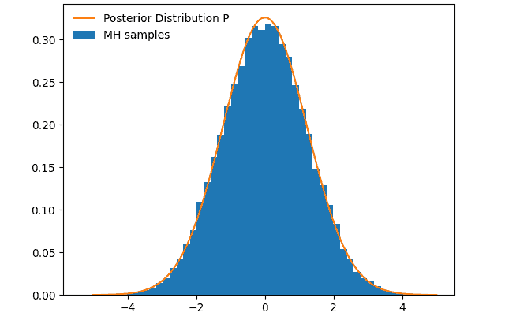

# [什么是马尔可夫链蒙特卡洛？](https://www.baeldung.com/cs/markov-chain-monte-carlo)

1. 简介

    在本教程中，我们将探讨马尔可夫链蒙特卡罗算法（MCMC）。这是一种从随机样本中逼近分布的方法。它特别使用了一种称为马尔科夫链的概率模型。我们具体来看一下所谓的 Metropolis-Hastings 算法，它是 MCMC 的一种。

2. 什么是马尔可夫链？

    马尔可夫链描述了从一个状态转移到另一个状态的概率。这种转移的概率仅取决于前一个状态。需要注意的是，这些转移概率应该是已知的，否则[隐马尔可夫模型](https://www.baeldung.com/cs/markov-chains-vs-hidden-markov-models)可能是正确的选择。为了说明马尔可夫链的工作原理，让我们来看一个例子。

    1. 示例

        我们有一家餐厅，每天都会更换菜单。厨师是个非常简单的人，所以他做的菜要么是鱼，要么是意大利面。他对食物的选择可以用下面的概率来描述：

        \[P(\text{Fish}\,\vert \, \text{Fish}) = 0.2\\
        P(\text{Fish} \,\vert \, \text{Pasta}) = 0.7\\
        P(\text{Pasta} \,\vert \, \text{Fish}) = 0.8\\
        P(\text{Pasta} \,\vert \, \text{Pasta}) = 0.3\]

        $\textbf{P(A} | \textbf{B)}$表示 A 是今天的食物，而 B 是昨天的食物。
        例如，考虑到昨天已经烹饪过鱼，厨师烹饪鱼的概率为 20%。

    2. 均衡状态

        马尔可夫链语言中的另一个重要术语是平衡态。当我们看到马尔可夫链的定义时，我们可能会问，一周后甚至更远的未来，鱼的概率会有多高。为了计算这个概率，我们把表格转换成矩阵：

        \[   T =   \left[ {\begin{array}{cc}     0.2  & 0.8 \\     0.7 & 0.3 \\   \end{array} } \right] \]

        现在我们根据前一天的菜肴来计算一周内出现鱼的概率。我们只需将矩阵乘以自身的 7 倍就可以了：

        \[ T_{7} = \left[ {\begin{array}{cc} 0.2 & 0.8 \\ 0.7 & 0.3 \\ \end{array} } \right]^{7}  = \left[ {\begin{array}{cc} 0.4625 & 0.5375 \\ 0.4703125 & 0.5296875 \\ \end{array} } \right] \]

        我们现在可以问自己，在未来更远的地方，这个矩阵会有什么表现？答案是，这个矩阵在与自身相乘足够多的次数之后，就会达到所谓的平衡状态。因此，矩阵在自乘之后不会再发生变化。在下图中，我们可以看到假设前一天有鱼的概率：

        

        前一天供应意大利面的图看起来非常相似：

        

        原因是它有相同的均衡概率，我们可以从均衡矩阵中看到：

        \[E = \left[ {\begin{array}{cc} 0.466 & 0.533 \\ 0.466 & 0.533 \\ \end{array} } \right]\]

        我们可以注意到，并不是每条马尔可夫链都有静止状态。我们稍后将看到如何构建一个始终满足这一条件的马尔可夫链。

3. 马尔可夫链蒙特卡洛

    下面我们将介绍所谓的 Metropolis-Hasting 算法，这是一种 MCMC 算法。我们的目标是找到一个分布 P，它与我们从中抽取样本的分布（我们称之为 f）成正比。

    为此，我们利用马尔科夫链来模拟在我们之前抽取样本的情况下，其中一个样本的概率有多大。正如我们在马尔可夫链的解释中所看到的，我们可以将这种概率形式化为

    $P(x' = p' | x = p)$，p 是上一个样本，p' 是当前样本。让我们来详细探讨一下这个算法。

    1. Metropolis-Hasting

        

        让我们一步一步地了解该算法。

        如前所述，我们所需要的只是样本函数 f 和我们希望算法迭代的步数 N。MCMC 的构造方式是，在经过足够多的步数后，它总能收敛到目标分布。

        我们从算法中得到的是一个接受率，它告诉我们马尔科夫链与其静态分布的接近程度，以及一个状态数组。状态描述了在上一个样本的基础上获得当前样本的概率。之后，我们可以从状态数组中创建一个直方图，以获得我们的目标分布。

        首先，我们生成一个随机数作为起点，我们称之为 x。

        之后，我们每次都要执行以下循环步骤：

        - 从先验分布中生成一个新样本，将 x 放入其中
        - 根据旧样本，检查新样本的可能性有多大。正如我们所见，我们使用了 $\frac{f(x)}{f(x')}$，这意味着我们从分布中提取的比例并不重要。因此得出 $\frac{f(x)}{f(x')} = \frac{P(x)}{P(x')}$，这样就可以在不知道后验的情况下进行计算了。
        - 我们会检查该条件概率是否足够高，以便将该状态添加到马尔科夫链 ss 中。如果不够，我们就将旧状态添加到链中。然后，我们使用新的当前状态生成新的样本。这一过程也称为[随机漫步](https://www.baeldung.com/cs/random-walk)。

        这种算法允许我们停留在高概率区域，因为每次从高概率区域转换到低概率区域时，我们都会得到一个低接受概率 $\textbf{R}$。

    2. 接受概率

        Metropolis-Hastings 算法的核心是接受概率 R。更重要的是 如何确保它收敛于后验分布？

        回到一开始的马尔可夫例子，我们要提醒自己，我们的链有一个均衡状态。这种状态也被称为静止状态。将此应用于算法中的马尔可夫链，我们会注意到，当马尔可夫链收敛到静止状态时，它会向目标分布收敛。

        我们的马尔可夫链要收敛到静止状态，需要满足以下平衡条件：

        \[P(x'| x)P(x) = P(x | x') P(x')\]

        可以写成

        \[\frac{P(x')}{P(x)} = \frac{P(x' | x)}{P(x | x')}\]

        据此，我们可以定义所谓的接受分布 A(x's,x)。它描述了接受状态 x' 的概率，可以用下面的形式表示

        \[A(x',x) = P(x',x)g(x' | x)\]

        它描述了在给定 x 的情况下接受状态 x' 的概率：

        \[\frac{A(x,x')}{A(x',x)} = \frac{P(x)}{P(x') } \frac{g(x'|x)}{g(x' | x)}\]

        最后一步，我们只需要选择一个接受样本的标准。我们选择 Metropolis 接受标准：

        \[R = min(1, \frac{P(x')}{P(x)} \cdot \frac{g(x' | x)} {g(x | x ')})\]

    3. 玩具示例

        为了看看我们能用得到的马尔可夫链做些什么，并对 Metropolis-Hastings 算法的应用有一个展望，我们来看一个例子。在这个例子中，我们使用方差为 3 的正态分布样本：

        

        在图中，我们可以看到后验分布 P 的概率密度函数。我们并不直接知道这个分布，只知道一个与之成正比的数值函数 f，我们就是从这个函数中采样。

        下一步，我们将从该分布中采样，并绘制出马尔科夫链的直方图：

        

        经过 5000 步之后，我们可以看到样本开始向后验分布 P 收敛。

        

        100 000 步后，我们可以看到样本的收敛情况：

        其他有趣的例子还包括[信息解密](https://citeseerx.ist.psu.edu/pdf/bb6cd4a5c0b2bf1dd17e51ed388351adc0f34487)和[蒙特卡罗树](https://www.baeldung.com/java-monte-carlo-tree-search)搜索。

4. 与其他取样算法的比较

    虽然我们使用 MCMC 算法从一维分布中采样，但它的主要用途在于多维问题的分布分析。它在一维情况下的核心缺点在于其样本是相关的。因此，它的采样分辨率较低。我们可以通过其他类型的采样算法（如自适应拒绝采样）来解决这个问题。

    MCMC 算法面临的另一个挑战是马尔可夫链向目标分布收敛的速度。这一特性在很大程度上取决于参数的数量和 MCMC 算法的配置。[哈密尔顿蒙特卡洛算法](https://www.researchgate.net/publication/319396021_A_Comparison_of_MCMC_Algorithms_for_the_Bayesian_Calibration_of_Building_Energy_Models/link/59a7f6e70f7e9b41b78b4299/download)通过在样本间产生更大的步长来解决这一难题，并进一步降低样本间的相关性。

5. 结论

    本文逐步介绍了 MCMC 算法，特别是 Metropolis-Hastings 变体。我们看到了如何通过从分布中选择样本来创建马尔可夫链。此外，我们还证明了这条链会向我们的后验分布收敛。随后，我们研究了如何在一个具体例子中应用该算法，以及如何将其与其他方法进行比较。
