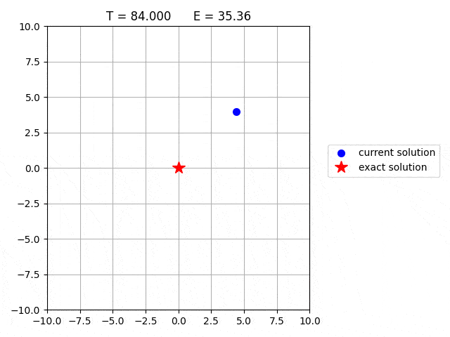

# [模拟退火解析](https://www.baeldung.com/cs/simulated-annealing)

1. 概述

    在本教程中，我们将回顾模拟退火（SA），这是一种元启发式算法，常用于搜索空间较大的优化问题。然后，我们将说明 SA 的优化过程，并展示如何最小化一个函数。

2. 算法背后的物理原理

    SA 是 [Kirkpatrick 等人](https://www.dcs.gla.ac.uk/~pat/ads2/java/TxSxP/papers/sa.pdf)于 1983 年提出的一种元启发式优化技术，用于解决旅行推销员问题（[TSP](https://www.baeldung.com/java-simulated-annealing-for-traveling-salesman#overview-2)）。

    SA 算法基于冶金学中的[退火过程](https://en.wikipedia.org/wiki/Annealing_(materials_science))，即将金属快速加热至高温，然后逐渐冷却。在高温下，原子快速移动，当温度降低时，原子的动能也随之降低。在退火过程结束时，原子会进入更有序的状态，材料的韧性更强，更容易加工。

    同样，在 SA 中，搜索过程从高能状态（初始解）开始，逐渐降低温度（控制参数），直到达到最小能量状态（最优解）。

    SA 已成功应用于多种优化问题，如 TSP、[蛋白质折叠](https://en.wikipedia.org/wiki/Protein_structure_prediction)、图分割和[作业调度](https://en.wikipedia.org/wiki/Job-shop_scheduling)。SA 的主要优势在于它能摆脱局部最小值，并收敛到全局最小值。此外，SA 比较容易实现，不需要搜索空间的先验知识。

3. 算法

    模拟退火过程从初始解开始，然后通过随机扰动迭代改进当前解，并以一定概率接受扰动。接受较差解的概率最初较高，随着迭代次数的增加而逐渐降低。

    SA 算法非常简单，可以如下所述直接实现。

    1. 定义问题

        首先，我们需要定义要优化的问题。这包括定义能量函数，即最小化或最大化函数。例如，如果我们要最小化两个变量的实值函数，如 $f(x,y) = x^2 + y^2$，那么能量就对应于函数 $f(x,y)$ 本身。就 TSP 而言，与城市序列相关的能量由旅行总长度表示。

        一旦定义了能量函数，我们就需要设置初始温度值和初始候选解。后者可以随机生成，也可以使用其他启发式方法生成。然后计算初始候选解的能量。

    2. 定义扰动函数

        定义扰动函数是为了生成新的候选解。该函数生成的解应该与当前解接近，但又不能过于相似。例如，如果我们想最小化一个函数 f(x,y)，我们可以随机扰动当前解，在 x 和 y 之间添加一个介于-0.1 和 0.1 之间的随机值。

    3. 接受准则

        接受准则决定新方案是被接受还是被拒绝。是否接受取决于新方案与当前方案之间的能量差以及当前温度。SA 的经典接受准则来自统计力学，它基于[波尔兹曼概率分布](https://en.wikipedia.org/wiki/Boltzmann_distribution)。在温度 T 下处于热平衡状态的系统，其能量 E 的概率与 $\exp (-E / k T)$ 成正比。

        (1) $$\operatorname{Prob}(E) \sim \exp (-E / k T)$$

        其中，k 是波尔兹曼常数。因此，在低温条件下，系统处于高能状态的几率很小。这在 SA 中起着至关重要的作用，因为能量的增加可以摆脱局部最小值，找到全局最小值。

        基于玻尔兹曼分布，以下算法定义了在温度 T 时接受能量变化 $\Delta E$ 的标准。

        

        能量较低的候选解总是被接受。相反，能量较高的候选方案会被随机接受，概率为 $\exp (- \Delta E / T)$（为了我们的目的，我们可以设置 k=1）。后一种情况可以通过将概率与[0, 1]范围内生成的随机值进行比较来实现。

    4. 温度时间表

        温度时间表决定了系统温度随时间的变化情况。刚开始时，温度较高，这样算法可以探索多种解决方案，即使这些解决方案比当前解决方案差。随着迭代次数的增加，温度逐渐降低，因此算法变得更具选择性，更有可能接受更好的解决方案。将当前温度除以小于 1 的系数 $\alpha$ 可以得到一个简单的调度。

    5. 运行 SA 算法

        最后，通过对当前解决方案迭代应用扰动函数和接受准则来运行算法。当温度冷却到一定程度 $T_{min}$ 或当前解的能量低于固定阈值 $E_{th}$ 时，算法终止。

        下面是 SA 的伪代码：

        

4. SA 流程图

    在此，我们提供了一张详细的流程图，它代表了 SA 的所有步骤：

    

5. 示例

    为了更好地理解算法，我们用 SA 来说明函数 $f(x,y) = x^2 + y^2$ 的最小化。我们使用大小为 101 的网格作为搜索空间，网格放置在 $(x,y) \in [-10, 10] \times [-10, 10]$ 所定义的正方形区域内。我们设定冷却率 $\alpha=0.84$ 和初始解 $(x,y)=(4,4)$ 。在每一步中，通过在 x 和 y 方向上随机移动当前解 0.2 来生成一个新的解。

    下面的动画展示了候选解、其能量以及每一步的温度：

    

    我们可以观察到，当温度较高时，较差的解决方案经常被接受。相反，当温度较低时（例如，T<1），算法的选择性更强，更好的解决方案被接受的概率更高。

6. 结论

    本文概述了 SA 算法。我们说明了优化程序，并提供了一个实际应用实例。
