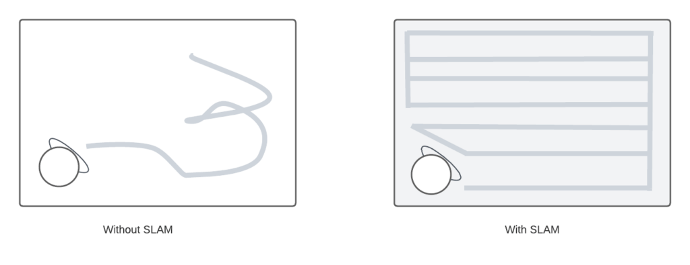
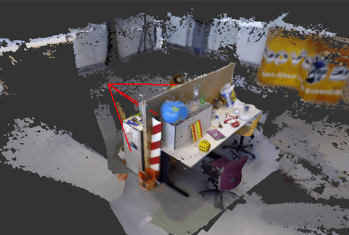
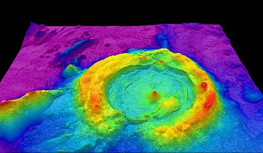

# 同时定位和绘图

[算法](README-zh.md) [数据科学](https://www.baeldung.com/cs/category/ai/data-science)

1. 概述

    在本教程中，我们将解释什么是同步定位和映射（SLAM），以及为什么我们需要它。这是一个相当有趣的课题，因为它包括[计算机视觉](https://www.baeldung.com/cs/computer-vision-popular-datasets)和传感器等不同的研究领域。它在自动驾驶汽车研究领域很受欢迎。我们还将简要介绍它的工作原理，以及可用于实现它的技术。

2. SLAM 简介

    SLAM 是一种估算环境地图的技术，同时将我们的传感器和机器人定位在我们的机器人正在构建的地图上。这是移动机器人在未知或部分未知环境中移动时所需的基本要素之一。SLAM 算法为绘制未知环境的地图铺平了道路。这样，工程师就可以利用地图信息来完成其他任务，如避开障碍物和路线规划。

    在机器人学领域，自 20 世纪 90 年代初以来就一直在研究 SLAM。因为我们可以认为，要让机器人做某件事情，首先要让它们弄清楚自己在哪里，以及它们的局限性是什么。因此，SLAM 在这方面发挥了重要作用。

    
    单独的测绘和定位技术也是其他解决方案，但同时完成这两项任务会给 SLAM 带来困难。在 SLAM 研究之初，研究人员认为在机器人游走的地方构建地图，同时进行定位是不可能的。因此，他们称其为 "鸡-蛋 "问题。然而，如今重要的近似解决方案可以解决这一复杂的算法问题。

    在这种情况下，关键是要记住，SLAM 实际上并不只是一种技术进步或一种系统。另一方面，SLAM 是一种更为普遍的想法，实际上有着无穷无尽的变化。如上图所示，它既可用于机器人清洁器，也可用于自动驾驶汽车。重要的是，可以使用各种软件程序和算法来构建基于撞击的系统。所有这些方面都取决于周围环境、使用案例和其他技术。

3. 我们为什么需要它？

    如前所述，研究人员多年来一直致力于 SLAM 的研究。随着计算能力的提高以及摄像头和激光测距仪等低成本传感器的出现，SLAM 在不同领域的许多应用中变得更加实用。

    当我们在购买吸尘器机器人前查看它们的评价时，会发现其中一些机器人无法绘制环境地图，因此无法在该环境中执行正确的清洁操作。其实，这正是 SLAM 和光探测与测距（LiDAR）的用武之地。吸尘器之间的性能差异主要取决于它们的传感器和 SLAM 技术。

    当机器人不具备 SLAM 技术时，它们就无法绘制环境地图和进行自我定位，完整的清洁任务可能会因此而中止。当然，其他传感器和摄像头在定位和绘图方面也发挥着重要作用。我们可以从下图中看到不使用 SLAM 和使用 SLAM 的机器人的区别：

    
    工程师还将 SLAM 应用于不同的领域，例如在仓库中为移动机器人导航、将自动驾驶汽车停放在空地上，或在未知环境中通过导航机器人运送包裹。此外，物体跟踪、路径规划和查找也可以与 SLAM 算法一起在应用中实现。

4. SLAM 的工作原理

    让我们来看看 SLAM 的工作原理。我们可以将 SLAM 分成两个部分，即前端技术和后端技术。前端部分主要取决于所使用的传感器，如摄像头、距离传感器和激光雷达传感器。另一方面，后端包括姿态图优化。

    我们也可以将前端部分分为两部分：

    1. 视觉 SLAM

        视觉 SLAM 或 vSLAM 利用摄像头和其他图像传感器捕获的图像，正如我们从其名称中可以猜到的那样。它可以利用简单的摄像头、RGB-D 摄像头和复眼摄像头。利用相对廉价的摄像头可以以较低的成本实现视觉 SLAM。

        由于摄像头可以提供大量信息，因此还可以利用它们来识别地标。此外，地标检测和基于图的优化相结合，可以灵活地实现 SLAM。我们可以通过[非营利性机器人和人工智能协会 JdeRobot](https://jderobot.github.io/)生成的 vSLAM 3D 点云图查看示例：

        
    2. 激光雷达 SLAM

        光探测与测距（LiDAR）是一种通常利用激光或距离传感器的技术。激光传感器通常比照相机传感器更加精确。例如，带有激光雷达的吸尘器机器人通常能更成功地绘制地图。不仅是吸尘器，研究人员和工程师在设计自动驾驶汽车和无人机时也会使用这种技术。

        激光传感器通常提供二维或三维格式的点云矢量。为了使用 SLAM 绘制地图，激光传感器点云可提供高度精确的距离测量。原则上，移动是通过按顺序匹配点云来计算的。机器人利用计算出的运动来确定自己的位置。

        [迭代最邻近点](https://en.wikipedia.org/wiki/Iterative_closest_point)和鲁棒点匹配等注册算法开始计算云点之间的距离。之后，研究人员一般会选择使用抓握图和体素图来表示点云图。我们可以看看使用装有激光雷达传感器的无人机生成三维点云图的示例：

        
5. 结论

    在本文中，我们解释了 SLAM 以及我们需要它的原因。它的应用范围非常广泛，从吸尘器到自动驾驶汽车，从医学到无人机。随着传感器成本的降低，未来 SLAM 的实际应用可能会继续增加。在文章的范围内，我们还提到了它的工作原理以及研究人员使用哪些方法来实现它。

[Simultaneous Localization and Mapping](https://www.baeldung.com/cs/slam)
