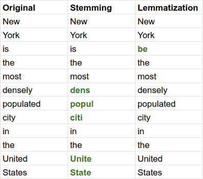

# [词干与词素化](https://www.baeldung.com/cs/stemming-vs-lemmatization)

1. 简介

    在本文中，我们将讨论词干化和词素化这两种在自然语言处理和信息检索中广泛使用的技术。虽然它们的作用相似，但各有利弊，我们将讨论何时最好使用其中一种。

2. 词干化和词素化的原因

    词干化和词素化都是词语规范化技术。在使用搜索引擎时，它们经常被用来正确处理同一个词的变体。

    例如，如果用户搜索 "dog foods"，我们很可能希望检索到的结果中也提到单数词 "food"，这意味着我们需要将 "foods" 的复数形式规范化为 "food"。同样，我们需要处理动词和形容词的类似变化。

    这时，词干化或词素化就派上用场了。

3. 词干化

    词干法是一种直接的规范化技术，最常见的实现方式是将一系列规则逐步应用于一个词，以产生一种规范化的形式。

    这些规则因语言而异，它们反映了当前语言的词形结构。例如，对于英语，可能的规则是去掉词尾的 "s"，将其转化为单数形式。

    关于词干化，有一点需要牢记，那就是并不要求规范化后的单词是有效的，而只要求同一单词的变体映射到同一词干上。

    波特词干处理法是一种广泛使用的英语词干处理算法，我们可以通过实验了解这一现象。在 "engine"或 "engines"这两个词上使用该算法，结果会是 "engin"。虽然这不是一个有效的英语单词，但我们只关心这两个词是否映射到同一个词干。

    虽然一开始看起来有违直觉，但这并不代表什么问题。词干处理主要用于在搜索引擎中为文档编制索引，因此这些可能是无效词的词干只会在搜索文档时进行内部处理，而不会显示给用户。

4. 词法化

    我们可以把词素化看作是词干处理的更复杂版本。它将每个词还原为其适当的基本形式，即我们可以在词典中找到的词。

    要做到这一点，词法化算法依赖于输入词的语音部分信息，因为无论该词是名词、动词、形容词还是其他词，都可能需要应用不同的规范化规则。

    举例来说，我们来看看 "following" 这个词。根据上下文，它可以是名词（如 "he has a huge following"）、动词（如 "he started following the rabbit"）或形容词（如 "the following day"）。如果是形容词或动词，词素化将返回 "following"，而如果是动词，则返回 "follow"。词干识别算法不会注意到这一点，在任何情况下都会去掉 "ing" 后缀，返回 "follow"。

    搜索引擎可以使用词法化来编制文档索引，其方式与词干法类似。不过，由于词法化的准确性更高，它被用于各种必须使用有效单词的 NLP 任务中，例如词义消歧（Word Sense Disambiguation）。

    下面是在一个真实的英语句子中词干化和词素化的区别：

    

5. 利与弊

    使用词干化还是词库化在很大程度上取决于我们的具体要求。

    一般来说，词干化的优点是实施简单、运行快速。但这样做的代价是，输出结果可能包含不准确之处，尽管这些不准确之处可能与文本索引等某些任务无关。

    相反，词素化可以根据单词的语音部分进行分析，生成真实的词典单词，从而提供更好的结果。因此，词素化比词干化更难实现，速度也更慢。

    总之，从质量角度来看，词素化几乎总是更好的选择。在当今的计算资源条件下，运行词法化算法应该不会对整体性能产生重大影响。不过，如果我们要对速度进行大量优化，那么可以采用更简单的词干化算法。

6. 结论

    在本文中，我们了解了词干处理和词素化的概况，研究了它们的区别、优点和缺点，从而明白了如何在两者之间做出选择。
