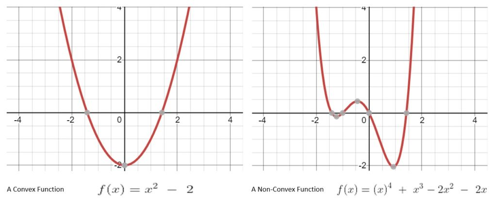
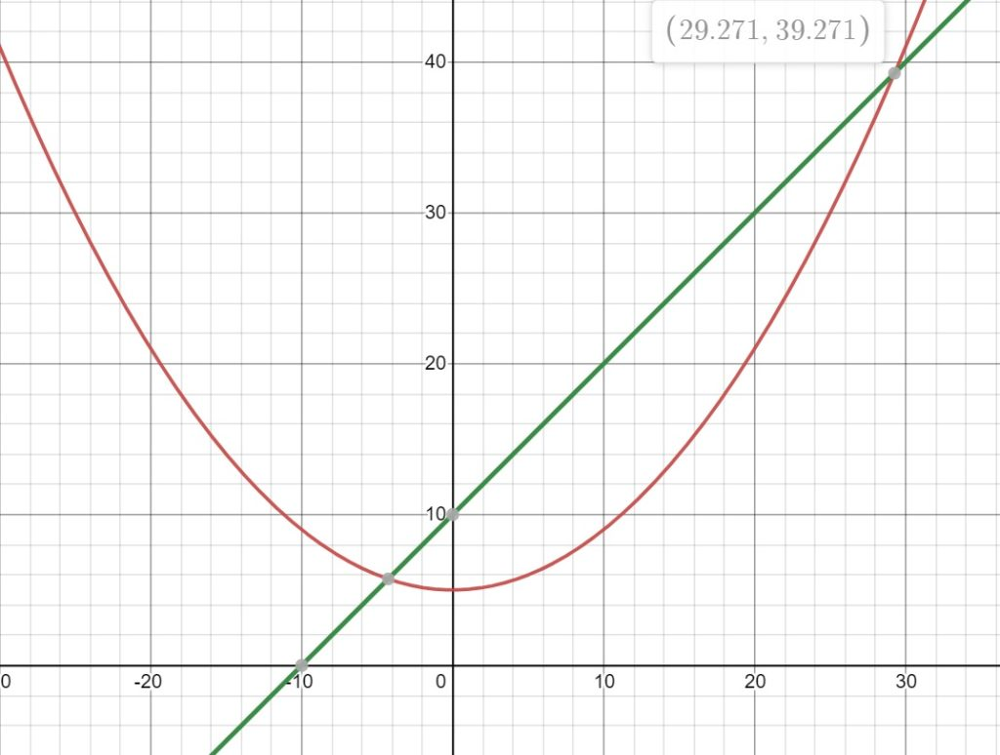
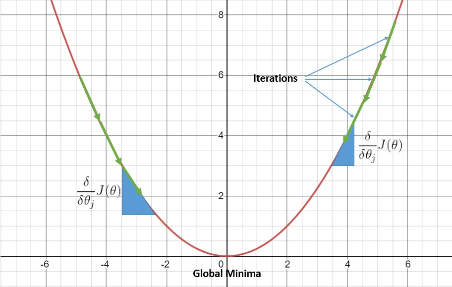

# 梯度下降算法背后的直觉

[算法](https://www.baeldung.com/cs/category/algorithms) [核心概念](https://www.baeldung.com/cs/category/core-concepts)

[优化](https://www.baeldung.com/cs/tag/optimization)

1. 简介

    在本教程中，我们将尝试建立梯度下降算法背后的一般直觉。通过了解梯度下降算法背后的数学原理，我们将理解为什么它能解决线性回归等问题。

    更重要的是，我们将了解为什么与其他解决此类问题的方法相比，梯度下降算法更为有效。

2. 优化

    优化是确定输入组合的一般过程，目的是在某些约束和条件下获得最佳输出。一些实际问题需要使用优化技术来解决，例如旅行推销员问题。

    这个问题的目标是在给出一系列目的地的情况下，为一个人找到最短、最有效的路线。

    也许使用简单的数学公式（如线性函数）更容易理解优化：

    \[P(x, y) = 4x + 3y \hspace{5 mm} | \hspace{5 mm} 2x + 4y \leq 220, 3x + 2y \leq 150, x \geq 0, y \geq 0\]

    这个函数被称为[线性规划](https://en.wikipedia.org/wiki/Linear_programming)中的目标函数。其原理是，它定义了在给定约束条件下需要最大化或最小化的某个量。还有其他涉及高阶函数的优化问题，如[二次编程](https://en.wikipedia.org/wiki/Quadratic_programming)。

    解决线性规划或二次规划等优化问题有多种方法，但必须了解这些函数的一个重要特征是它们都是凸函数。

    [凸函数](https://en.wikipedia.org/wiki/Convex_function)是指如果我们从$(x, f(x))$到$(y, f(y))$之间画一条直线，那么凸函数的图形就位于这条直线的下方。不具有这种性质的函数称为非凸函数：

    

    我们可以很直观地理解这一点在优化问题中的重要性。凸函数只能有一个全局最优解。这使得此类问题的求解相对容易得多。

    另一方面，一个非凸函数可能有多个局部最优解。这使得找到全局最优解变得异常困难。

3. 线性回归

    [线性回归](https://en.wikipedia.org/wiki/Linear_regression)是一种将线性方程拟合到观测数据集的统计技术。其目的是定义标量响应与一个或多个解释变量之间的线性关系。例如，我们可以尝试模拟雨量与温度、湿度和海拔等解释变量之间的关系。

    线性回归非常优雅，因为它的数学形式非常简单：

    $Y = a + bX$

    这里 Y 是标量响应，X 是解释变量。直线的斜率 b 和截距 a 是模型参数，我们打算从观察到的数据集中学习这些参数。

    那么，我们如何解决线性回归问题呢？我们需要将其转化为优化问题。最小二乘法是线性回归最广泛使用的方法之一。基本上，我们试图最小化线性模型的成本函数：

    \[J(a, b) = \frac{1}{2m} \sum_{i=1}^{m}(f_{(a,b)}(x^{i})-y^{i})^{2}\]

    在这里，我们试图最小化所有输入数据的估计值与实际值之间的总误差。我们的目标是找到一组模型参数 (a, b)，使成本函数值最小。

4. 求解成本函数

    线性最小二乘法中的代价函数是二次函数。因此，优化成本函数的问题是一个二次编程问题。有几种方法可以解决这个问题。我们可以先采用一些较简单的方法，如分析法、图形法甚至数值法。

    让我们来看看如何分析解决二次编程问题。首先，我们将利用一个简单的二次目标函数和一个线性约束条件：

    \[Max. f(x) = (\frac{x}{5})^{2} + 5 \hspace{5mm}|\hspace{5mm} f(x) < x + 10\]

    为了简单起见，我们使用的是具有单一决策变量的目标函数；但在实际应用中，决策变量的数量要多得多。按照分析方法，我们将重新排列目标函数和约束条件，得到一个二次方程：

    \[x^{2} - 25x - 125 = 0\]

    解这个一元二次方程非常简单。我们还可以通过图形直观地理解解法：

    

    然而，想象一下，如果我们有数百个而不是一个决策变量。这就意味着，如果不使用数值软件，我们就无法高效地解决这个问题。即使使用数值软件，每增加一个决策变量，解决这个问题所需的时间也会呈指数级增长。

    当然，还有其他几种解决二次编程问题的方法，如[内部点法](https://en.wikipedia.org/wiki/Interior-point_method)、[活动集法](https://en.wikipedia.org/wiki/Active-set_method)、[增量拉格朗日法](https://en.wikipedia.org/wiki/Augmented_Lagrangian_method)、[共轭梯度法](https://en.wikipedia.org/wiki/Conjugate_gradient_method)以及[简约算法](https://en.wikipedia.org/wiki/Simplex_algorithm)的扩展。在此，我们不再赘述。

    梯度下降法是解决此类问题的迭代方法之一。

5. 梯度下降法

    [梯度下降法](https://en.wikipedia.org/wiki/Gradient_descent)是一种迭代算法，用于找到使相应代价函数最小化的函数系数。这些系数就是我们需要学习的线性模型的参数。一开始，我们将所有系数都假设为一些小的随机值。这有助于我们用这些系数计算成本函数的值。

    下一步是调整这些系数，从而降低成本函数的值。为此，我们需要知道应该朝哪个方向调整系数值。在这里，成本函数关于系数的导数可以帮助我们：

    \[\\* \theta _{j} = \theta _{j} - \alpha \frac{\delta }{\delta \theta _{j}}J(\theta ) \\* \theta _{j} : J^{th} \hspace{2mm} Coefficient \hspace{5mm} \alpha : The \hspace{2mm} ledarning \hspace{2mm} rate \hspace{5mm} J: The \hspace{2mm} cost \hspace{2mm} function \\* \frac{\delta }{\delta \theta _{j}}J(\theta ): The \hspace{2mm} partial \hspace{2mm} derivative \hspace{2mm} of \hspace{2mm} the \hspace{2mm} cost \hspace{2mm} function \hspace{2mm} with \hspace{2mm} respect \hspace{2mm} to \hspace{2mm} the \hspace{2mm} J^{th} \hspace{2mm} coefficient\]

    基本上，偏导数是微积分中的一种工具，它能为我们提供成本函数在给定点上与系数相关的斜率。我们使用导数和学习率参数来更新系数，以控制变化率。

    我们重复这一过程，直到我们的系数达到最优值。这可能意味着成本函数的值变为零，或者更实际地说是接近零。这就为我们提供了一种直接但强大的优化技术，用于解决包含多个决策变量的线性回归问题。当然，我们必须有一个可微分的成本函数。

6. 梯度下降法为何有效？

    现在，我们已经探索了线性回归、其代价函数以及如何使用梯度下降算法来解决它。问题是，为什么梯度下降算法对线性最小二乘代价函数有效？其实，这背后的直觉并不复杂。我们已经看到了凸函数如何保证我们获得单一的全局最优解。

    基本上，最小二乘法的成本函数就是一个凸函数。这就保证了我们只有一个最优解。

    虽然随着问题空间的扩大，分析方法变得不切实际，但梯度下降的迭代方法却非常有效。在按正确方向更新系数的同时，我们一定能达到全局最小值：

    

    唯一需要注意的是选择合适的学习率参数。如果学习率过大，我们可能会因为步长过大而错过最优解；而如果学习率过小，我们可能需要更长的时间才能达到最优解。

    当然，梯度下降法也适用于非凸成本函数，但这可能会导致找到局部最优解，而不是全局最优解。这就使得在非凸模型中使用梯度下降算法颇具挑战性。

7. 结论

    本文探讨了优化问题和凸分析的基础知识。我们还讨论了线性回归问题以及如何求解其代价函数。

    最后，我们分析了为什么梯度下降算法比分析方法更适合解决此类问题。这有助于我们建立梯度下降算法背后的直觉。

[Intuition Behind Gradient Descent Algorithm](https://www.baeldung.com/cs/understanding-gradient-descent)
