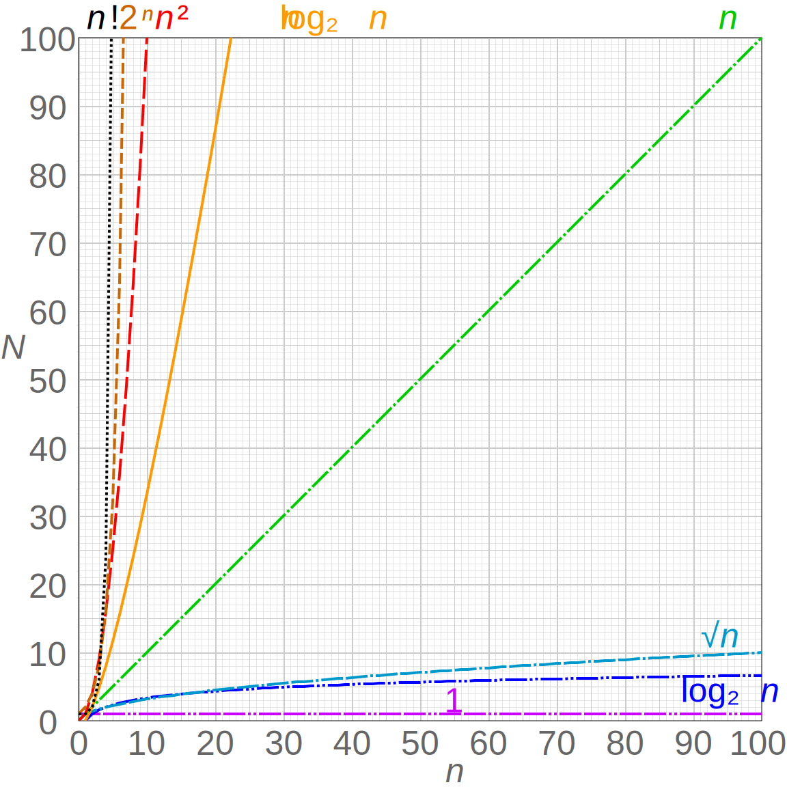

# 大O符号的实用示例

1. 概述

    在本教程中，我们将介绍大 O 符号的含义。然后，我们将回顾几个示例，研究其对运行时间的影响。

2. 大 O 符号的本意

    大 O 符号是评估算法性能的一种有效方法。对算法性能或算法复杂度的研究属于[算法分析](https://en.wikipedia.org/wiki/Analysis_of_algorithms)领域。这种方法计算的是解决指定问题所需的资源（如磁盘空间或时间）。在这里，我们主要关注时间，算法完成任务的速度越快，效率就越高。

    大 O 符号可以帮助我们分析输入大小对算法运行时间的影响。要理解大 O，就必须知道增长率。这指的是每种输入大小所需的时间。

    接下来，我们将研究一些算法并评估它们的时间复杂度。

3. 恒定时间算法 - O(1)

    首先，我们来看一个简单的算法，它将变量 n 初始化为 10000，然后打印出来：

    \[\begin{algorithmic}[H] \setcounter{algocf}{0} \SetAlgoLined \KwData{Initial state} \KwResult{Initialize a variable with a big number and print it.} n $\gets${10000}\; \textbf{print} n\; \caption{Initializing and printing a variable} \end{algorithmic}\]

    无论 n 的值是多少，这段代码的执行时间都是固定的，算法的时间复杂度为 O(1)。另外，我们也可以使用 for 循环打印 n 变量三次：

    \[\begin{algorithm}[H] \setcounter{algocf}{1} \SetAlgoLined \KwData{Initial state} \KwResult{Initialize a variable with a big number and print it thrice. } n $\gets$ 10000\; \For{i in range(1, 4)}{ \textbf{print} n; } \caption{Initilizing and printing a variable 3 times} \end{algorithm}\]

    上面的例子也是恒定时间。我们把恒定时间的算法称为 O(1)。无论输入大小为 n，运行时间都是平常的三倍。因此，O(2)、O(3) 甚至 O(1000) 都与 O(1) 相同。

    我们并不关心它需要运行多长时间，只关心它需要恒定的时间。

4. 对数时间算法 - O(log(n))

    从渐进的角度看，恒定时间算法是最快的。接下来是时间复杂度为对数的算法。不过，它们在可视化方面更具挑战性。

    对数时间算法的一个典型例子是[二进制搜索](https://en.wikipedia.org/wiki/Binary_search_algorithm)算法：

    \[\begin{algorithm}[H] \setcounter{algocf}{2} \SetAlgoLined \KwData{Sorted array A, and target value x} \KwResult{Index of x in A, or -1 if not found} low $\gets$ 0\; high $\gets$ len(A) - 1\; \While{low $\leq$ high}{ mid $\gets$ (low + high) / 2\; \If{A[mid] $<$ x}{ low $\gets$ mid + 1\; } \ElseIf{A[mid] $>$ x}{ high $\gets$ mid - 1\; } \Else{ \Return mid\; } } \Return  -1\; \caption{Binary Search} \end{algorithm}\]

    在二进制搜索中，输入是数组的大小，算法每次迭代都会将其分成两半，直到找到目标值为止，如果没有目标值，则返回-1。因此，运行时间与 log_2(n)函数成正比，其中 n 是数组中的元素个数。例如，当 n 为 8 时，while 循环将执行 log_2(8) = 3 次。

5. 线性时间算法 - O(n)

    接下来，我们来看看时间复杂度与其输入大小成正比的线性时间算法。
    例如，下面是一个枚举 n 个值的算法的伪代码，输入为 n：

    \[\begin{algorithm}[H]  \setcounter{algocf}{3} \SetAlgoLined \KwData{Input value n} \KwResult{Print numbers from 1 to n} \For{i in range(1, n + 1)}{ \textbf{print} i; }\caption{Number Counter} \end{algorithm}\]

    在这个例子中，迭代次数与输入大小 n 成正比。因此，该算法的时间复杂度为 O(n)。在表示时间复杂度时，我们不区分 0.1n 或 (1000n+1000)，因为两者的时间复杂度都是 O(n)，且增长与输入大小直接相关。

6. N 对数 N 时间算法 - O(n log n)

    N log N 算法的性能比线性时间复杂度算法差。这是因为它们的运行时间随着输入大小的增加而线性对数增加。例如，让我们来看看下面带有 for 循环的算法：

    \[\begin{algorithm}[H]  \setcounter{algocf}{4} \SetAlgoLined \KwData{Input value n} \KwResult{Print all pairs of numbers from 1 to n} \For{i in range(1, n + 1)}{ \For{j in range(1, log(n) + 1)}{ \textbf{print} (i, j); } } \caption{All Combinations of two numbers}\end{algorithm}\]

    在这个例子中，外循环运行了 n 次，内循环运行了 log(n) 次。由于循环是嵌套的，所以总次数为 $n * log(n)$，我们将算法的时间复杂度表示为 O(n*log(n))。另一个 N log N 时间算法的例子是[Quicksort算法](https://www.baeldung.com/cs/algorithm-quicksort)。

7. 多项式时间算法 - O(nm)

    接下来，我们将深入探讨多项式时间算法，包括复杂度为 $O(n^2)$、$O(n^3)$，以及更一般的 $O(n^m)$（其中 m 为整数）的算法。值得注意的是，与 N log N 算法相比，多项式算法的速度相对较慢。在多项式算法中，$O(n^2)$ 的效率最高，$O(n^3)$ 、$O(n^4)$ 等算法的效率依次较低。

    让我们来看一个使用 for 循环的二次方时间算法的简单例子：

    \[\begin{algorithm}[H]  \setcounter{algocf}{5} \SetAlgoLined \KwData{Input value n} \KwResult{Print all pairs of numbers from 1 to n} \For{i in range(1, n + 1)}{ \For{j in range(1, n + 1)}{ \textbf{print} (i, j); } } \caption{All Permutations of 2 numbers}\end{algorithm}\]

    在这个例子中，外循环运行了 n 次，而内循环运行了 n 次。由于循环是嵌套的，所以迭代的总次数是 $n^2$。

    复杂度为 $O(n^3)$ 的多项式时间算法的另一个例子如下：

    \[\begin{algorithm}[H]  \setcounter{algocf}{6} \SetAlgoLined \KwData{Input value n} \KwResult{Print all triplets of numbers from 1 to n} \For{i in range(1, n + 1)}{ \For{j in range(1, n + 1)}{ \For{k in range(1, n + 1)}{ \textbf{print} (i, j, k); } } } \caption{All Permutations of 3 numbers}\end{algorithm}\]

    这里，迭代的总数是 $n^3$。在这种情况下，有三个嵌套循环，每个循环运行 n 次。因此计算复杂度为 $O(n^3)$。

8. 指数时间算法 - $O(k^n)$

    让我们来分析输入与指数相关的算法，如 $O(2^n)$。它们的运行时间会随着输入大小的增长而大幅增加。例如，如果 n 等于 2，算法将运行 4 次；如果 n 等于 3，算法将运行 8 次。这种行为与对数时间算法形成鲜明对比，后者的运行时间会随着每增加一个输入而减少。此外，复杂度为 $O(3^n)$ 的算法每增加一个输入，运行时间就会增加两倍。一般来说，复杂度为 $O(k^n)$ 的算法每增加一个输入，运行时间就会增加 k 倍。

    让我们来看一个 $O(2^n)$ 时算法的简单例子：

    \[\begin{algorithm}[H] \setcounter{algocf}{7} \SetAlgoLined \KwData{Input value n} \KwResult{Print numbers from 1 to n in binary} \For{i in range(0, 2^{n})}{ \textbf{print} binary(i)\; } \caption{Decimal to Binary enumarator} \end{algorithm}\]

    在这个例子中，for 循环运行了 $2^n$ 次，打印了从 0 到 $(2^n) - 1$ 的每个二进制数。 指数时间算法的一个典型例子是[递归斐波那契序列](https://www.baeldung.com/cs/fibonacci-computational-complexity)。

9. 阶乘时间算法 - $O(n!)$

    最后，让我们来分析[阶乘](https://en.wikipedia.org/wiki/Factorial)运行时间的算法，这是我们最糟糕的情况。这类算法的运行时间与输入大小的阶乘成正比增长。一个著名的例子就是用暴力法解决[旅行推销员](https://www.baeldung.com/cs/tsp-dynamic-programming)问题。

    简而言之，旅行推销员问题就是找到一条最短的路线，这条路线能准确地访问给定列表中的每个城市一次，然后返回起始城市。不幸的是，对于一个包含 n 个城市的列表，有 n! 种可能的排列组合，因此蛮力法的运行复杂度为 O(n!)。

    虽然解释这个问题的解决方案不在本文的讨论范围之内，但我们可以演示一种简单的 O(n!) 算法，它可以在阶乘的每次迭代中打印出从 0 到 n!

    \[\begin{algorithm}[H]  \setcounter{algocf}{8} \SetAlgoLined \KwData{Integer n} \KwResult{Prints all numbers from 0 to each factorial of a number n} \For{i = 1 \KwTo factorial(n)}{ \textbf{print} i\; } \caption{Simulation of O(n!)}\end{algorithm}\]

    在这个例子中，递归调用的次数随输入大小的阶乘增长，因此运行时复杂度为 O(n!)。

10. 渐近函数

    大 O 符号属于[渐近函数](https://www.baeldung.com/cs/big-o-notation)的一种，我们用它来研究算法的性能。虽然大 O 符号不考虑小输入量算法的效率，但它主要关注算法在大输入量情况下的行为。

    此外，还有另外两种渐近函数来描述算法在极限时的性能：大 Θ 和大 Ω 符号。

    例如，大 O 符号定义了性能不差于一定速度（表示上限）的算法。相反，大 Ω 符号定义了性能不优于一定速度的算法，表示下限。最后，大 Θ 符号表示以恒定速度运行的算法，我们可以将其视为等价。

    大 O、大 Ω 和大 Θ 符号用于描述算法的性能，其中大 O 最常用。它们有助于理解输入大小对算法性能的影响，并可用于根据输入大小确定最佳算法。

11. 可视化不同的复杂性

    如果我们将所有时间复杂度与输入大小和时间复杂度绘制在一张[图](https://en.wikipedia.org/wiki/Time_complexity)上，就能更直观地展示它们：

    

    综上所述，我们可以体会到降低算法复杂度的必要性。

12. 结论

    在本文中，我们讨论了理解时间复杂性和使用大 O 符号分析算法性能的重要性。我们还研究了时间复杂度，如常量、对数、线性、线性对数、多项式、指数和阶乘时间算法。

    我们可以使用下面的小抄来探索典型数据结构的时间复杂性。
