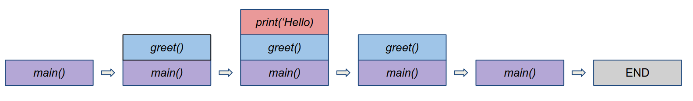

# 调用堆栈

1. 简介

    在本教程中，我们将了解调用堆栈机制。我们将了解它是如何工作的，它的目的是什么，以及著名的堆栈溢出错误是如何发生的。

    现在最流行的编程语言都是高级语言，程序员在使用这些语言时会遇到很多问题。然而，在大多数情况下，许多工作都是在"引擎盖"下进行的。虽然程序执行的实际细节会因编译器类型、操作系统和指令本身的不同而有所差异，但大多数程序都会操作一块内存，通常称为"调用栈"或简称"栈"。因此，我们至少应该对堆栈有一个高层次的了解。

2. 堆栈定义

    一般来说，堆栈是一种抽象的数据类型，用于以后进先出（LIFO）的方式添加和删除数据元素。打个比方，我们可以把堆栈想象成一摞书，我们只能从最上面取出或添加书本。在计算机科学术语中，向堆栈中添加元素也被称为 "push"，而从顶部移除元素则被称为 "pop"。

    最初，对添加和删除元素的限制可能听起来像是一个障碍，但正是它使得堆栈成为编程和计算机科学中处理嵌套序列时非常方便的工具。

3. 调用栈

    [调用栈](https://www.baeldung.com/java-stack-heap)主要用于组织多条指令并跟踪其执行情况。当我们的程序调用一个函数时，程序编译器、解释器或系统（取决于实现方式）要做的第一件事就是为函数预留一些内存块来完成必要的工作。这些内存块通常也被称为堆栈框架，通常至少包含以下几项内容：

    - 被调用函数传递给它的参数
    - 为局部变量预留的空间
    - 返回内存地址，用于指出函数结果的返回位置
    由于函数需要堆栈框架才能工作，因此必须考虑如何在执行过程中提供必要的访问。但如何组织内存才能处理好顺序指令呢？

4. 简单示例

    举例来说，我们来看看一个简单的程序，它的函数 main 包含另一个名为 greet 的函数，而这个函数本身会调用 print("Hello") 函数：

    

    系统会为每个函数预留内存，但我们一次只能运行一个函数，因此有人可能会问，计算机如何知道先运行哪个函数？

    不运行 greet 就不能运行 main，不运行 print 就不能运行 greet。这时，堆栈数据结构就派上用场了。当一个函数被调用时，它就会被激活，我们就会把它的帧推到调用栈的顶层。此外，每次调用一个新函数时，我们都会立即将其帧推到栈顶，使其成为活动帧。通过这种方式，我们可以确保每次只有一个函数处于活动状态，从而保证进程的线程安全。

    当一个函数执行完毕后，我们会弹出它的帧。由于栈帧包含一个返回地址，指向调用它的函数的栈帧，因此我们可以很容易地切换回父函数。这就是栈结构的魅力所在。

    下面这张图显示了在我们面前的这个简单程序中内存中的调用栈帧：

    

5. 堆栈溢出

    在我们的简单示例中，只有三个函数相互嵌套，但有时在编程中，嵌套会更多，因为我们倾向于抽象程序的逻辑。有时在运行过程中，调用栈会耗尽预留内存，从而导致错误。我们称这种错误为[堆栈溢出](https://www.baeldung.com/java-stack-overflow-error)。一般来说，这种类型的错误预示着资源调配出现了问题，而且由于发生在运行期间，所以很难弄清。

    堆栈溢出最常见的原因是过深或无限递归。在这种情况下，函数会多次调用自身，以至于存储单个栈帧所需的空间超过了栈的大小。

    下面是一个无限递归的例子，如果运行，肯定会失败：

    

6. 结论

    本文介绍了调用栈，解释了与之相关的术语，并探讨了调用栈在编程中的一般使用方法。

## 相关文章

- [x] [call-stack](https://www.baeldung.com/cs/call-stack)
