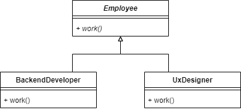
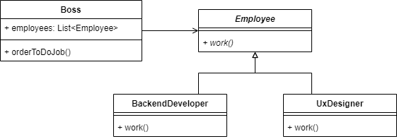
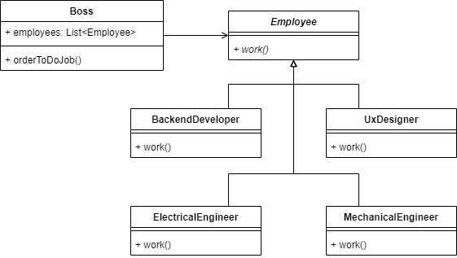

# 多态性的一般概念

原文：[The General Concept of Polymorphism](https://www.baeldung.com/cs/polymorphism)

1. 多态性简介

    词典将多态性定义为 "以多种不同形式出现的条件"。由于多态性出现在多个科学领域，因此这是一个笼统的定义。也许计算机定义对我们更有意义： "多态是编程语言的一种特性，它允许例程在不同时间使用不同类型的变量"。

    在本教程中，我们将探讨这句话的含义。但首先，我们应该了解我们是如何感知周围世界的。

2. 现实世界中的多态性

    我们的大脑会概括周围的事物。它寻找事物之间的相似之处，并将其归类。这些类别可以是一般性的，因此包含许多项目--例如动物。另一方面，它们也可能相当具体。例如，黑色三脚桌。

    我们称这种分类过程为分类。因此，这些类别被称为 "类"。

    进化使我们形成了这种行为，因为它能帮助我们更好、更快地做出决定。因此，我们有了更好的生存机会。想想史前人类可能面临的日常情况。如果他们看到一只剑齿虎，他们会跑或躲起来。如果他们看到一只兔子，他们不会这样做。他们并不是每一只兔子或剑齿虎都能见到，但他们见到了就能认出，因为他们见到了足够多的兔子或剑齿虎，从而建立了足够准确描述这些动物的分类。

    但是，相似的事物不仅仅具有相似的属性。此外，它们还有相似的行为。这就是多态性的强大之处。

    想想雇员。从雇主的角度来看，员工最重要的行为就是工作。每个雇主都知道如何做好自己的工作。至少在一个理想的世界里是这样，但让我们假设我们生活在一个理想的世界里。

    这意味着，每天早上，老板只需告诉员工开始工作。他们就会开始工作，不受老板的干扰。（是的，这是一个荒谬的假设，但我们要记住，这是一个理想的世界。他们自主地做自己该做的事。）

    如果他们不自主，情况会怎样？老板会这样四处巡视：

    - 你的职责是什么？
    - 我是后台开发人员。
    - 然后创建一个端点，执行批处理作业。任务完成后，将结果存储到数据库中，并向用户发送通知。

    然后他就会去找下一位员工：

    - 你的职责是什么？
    - 我是用户体验设计师。
    - 然后创建一个线框，重点关注可访问性。采用移动优先的方法。如果已经准备就绪，可以通过焦点小组进行一些研究。

    然后这样一直做下去。（我们知道这种情况是存在的。这就是所谓的微观管理。但幸运的是，在我们这个乌托邦式的小世界里，它并不存在）。

    对于大公司来说，第二种方法并不可行。这就是为什么他们要依靠员工来了解如何做好自己的工作。

3. 编程中的多态性

    在编程中，人们通常将多态性与面向对象范式联系在一起。由于面向对象是目前最流行的范式，我们也将讨论它。不过，请注意函数式和结构式编程也具有多态性，例如高阶函数或函数指针。

    让我们重温一下 OO 编程中雇员的例子。我们该如何建模呢？

    最简单的办法是有一个雇员超类和两个子类： BackendDeveloper 和 UxDesigner：

    

    我们可以看到，Employee 类只有一个抽象方法：work()。两个子类都以不同的方式实现该方法。

    有了这个方法，我们就可以创建一个 "Boss" 类，它可以轻松地命令员工完成工作：

    

4. 优势

    微观管理的存在是有原因的（即使它很糟糕）。有些老板是控制狂，喜欢颐指气使（双关语）。在编程中，我们喜欢采用不同的方法。

    当我们想要完全控制另一个类的行为时，我们必须了解它的一切。每一个小细节。这对于一两个外部类来说还可以应付，但超过这个范围，事情就会变得一团糟。此外，这样也很难用其他类来扩展系统。

    假设公司想扩大规模，生产硬件。这就意味着老板必须知道电气工程师、机械工程师和其他新角色是做什么的。（考虑到他甚至不知道现有员工在做什么，这就更具挑战性了。他只认为自己知道）。

    在编程中，这意味着我们必须在老板类中实现所有新角色的行为。这样做很快就会失控。

    相反，我们可以使用多态性。我们在新的电气工程师（ElectricalEngineer）和机械工程师（MechanicalEngineer）类中实现这些功能：

    

    之后，我们唯一要做的就是雇佣他们，并将他们添加到老板类的雇员列表中。

5. 结论

    在这篇短文中，我们了解了什么是多态性。有了这些知识，我们现在可以重新审视和解释我们的定义： "多态性是编程语言的一种特性，它允许例程在不同时间使用不同类型的变量。

    雇员类型的变量可以包含任何雇员的后代。我们唯一知道（和需要）的是，我们希望它们工作。因此，我们调用了它们的 work() 方法。我们并不清楚它们将如何工作，因为这将在运行时根据变量所包含的雇员类型来决定。但这对我们来说已经足够了，因为我们相信所有员工都知道如何完成他们的工作。
