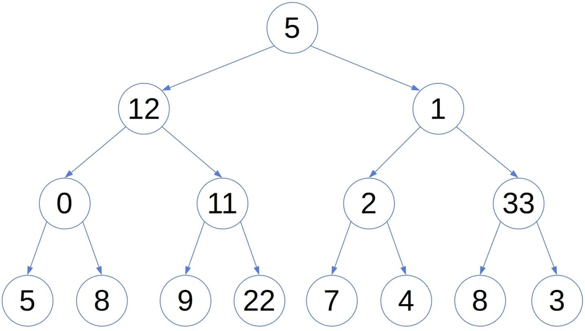
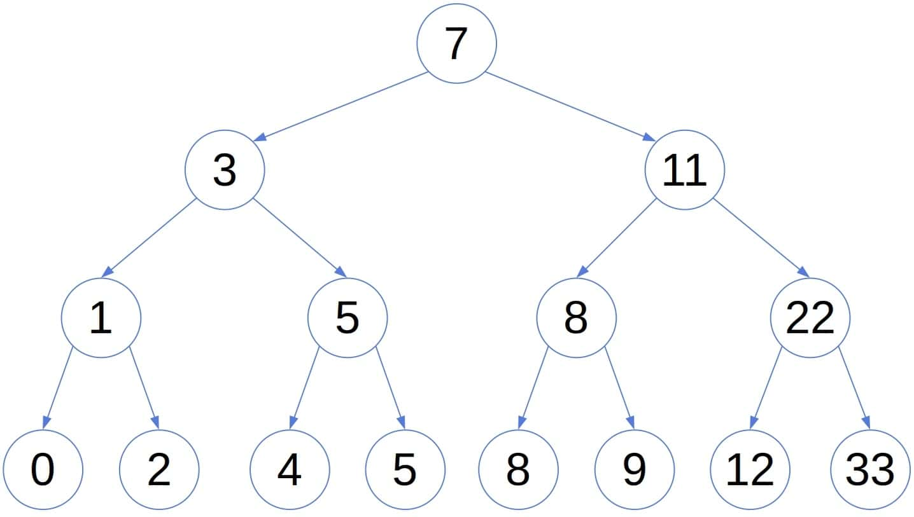
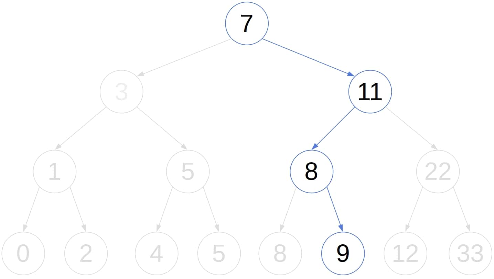
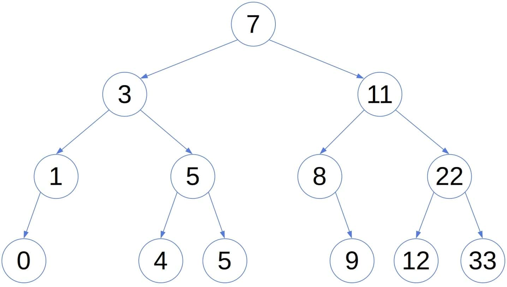
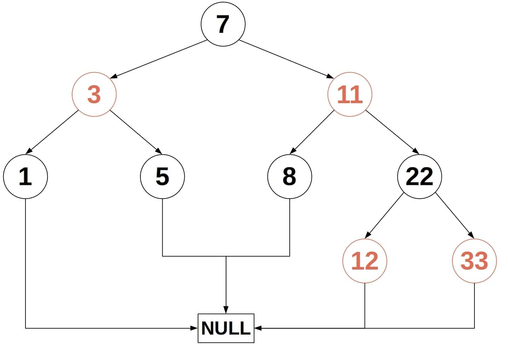
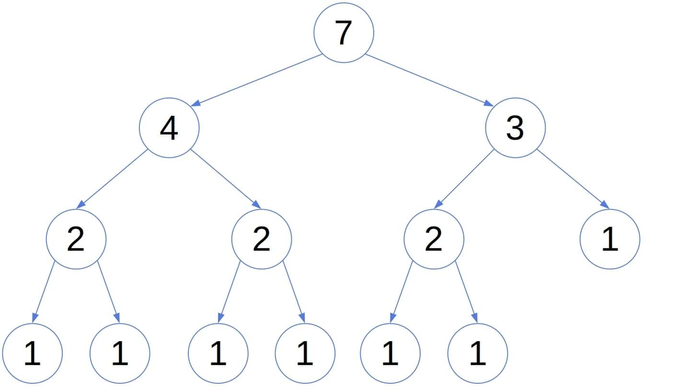

# [平衡的树木](https://www.baeldung.com/cs/balanced-trees)

[数据结构](README-zh.md) [树](https://www.baeldung.com/cs/category/graph-theory/trees)

[红黑树](https://www.baeldung.com/cs/tag/red-black-trees)

1. 简介

    在本教程中，我们将学习平衡二叉树。

    特别是，我们将了解为什么平衡二叉[树](https://www.baeldung.com/cs/tree-structures-differences)会派上用场，并探索平衡二叉树的三种类型。我们将讨论 AVL 树、红黑树和权重平衡树。每种类型都有自己的平衡定义。

2. 二叉树和二叉搜索树

    如果一棵树中的每个节点最多有两个子节点，我们就称它为二叉树。节点的左子树和子树构成节点的左子树。右子树的定义与此类似。

    虽然二叉树适合存储分层数据，但这种一般形式的二叉树并不能保证快速查找。让我们以在下面的树中查找数字 9 为例：

    

    无论我们访问哪个节点，我们都不知道下一步应该遍历左边还是右边的子树。这是因为树的层次结构并不遵循 $\leq$ 关系。

    因此，在最坏的情况下，搜索需要花费 $\boldsymbol{O(n)}$ 时间，其中 $\boldsymbol{n}$ 是树中的节点数。

    1. 二叉搜索树

        我们使用一种特殊的二叉树来解决这个问题，这种树被称为二叉搜索树（BST）。对于 BST 中的每个节点 $\boldsymbol{x}$，$\boldsymbol{x}$ 左侧子树中的所有节点都包含严格小于 $\boldsymbol{x}$ 的值。此外，在 $\boldsymbol{x}$ 的右子树中的所有节点都是 $\boldsymbol{\geq x}$。例如：

        

        树所保持的顺序允许我们在查找过程中对其进行修剪。假设我们在查找 y 时访问了节点 x < y，我们可以忽略 x 的左侧子树，只关注右侧子树，这样可以加快查找速度。这就是我们在上述搜索树中找到 9 的方法：

        

        然而，搜索的最坏情况复杂度仍然是 $\boldsymbol{O(n)}$。如果我们从一个排序数组中构建搜索树，就会出现这种情况，在这种情况下，搜索树的高度为 n，并退化为一个链表。由于插入和删除包括搜索，因此在最坏的情况下，在 BST 上通常执行的所有操作都是 $\boldsymbol{O(n)}$。因此，决定复杂度的是树的高度。这就是平衡树的用武之地。它们是一种特殊的二叉搜索树。

3. 平衡树

    平衡树是一种不仅能保持节点间顺序的搜索树。它还能控制高度，确保在插入或删除后保持 $\boldsymbol{O(\log n)}$ 的[高度](https://www.baeldung.com/cs/height-balanced-tree)。

    为此，平衡树必须在我们添加或删除节点后重新平衡。这会造成计算开销，并使插入和删除算法复杂化。不过，为了获得具有快速搜索、插入和删除操作的对数高度搜索树，我们愿意付出这样的代价。本文不涉及重新平衡算法。

    这种树有几种类型。它们要求所有节点都是平衡的，但平衡的概念因类型而异。

4. AVL 树

    在 [AVL](https://www.baeldung.com/java-avl-trees) 树中，如果一个节点的左右子树的高度最多相差 1，我们就称该节点为平衡节点。因此，如果一棵根为 x 的搜索树的所有节点都是 AVL 意义上的平衡节点，那么这棵树就是一棵 AVL 树（高度为 0 的空搜索树是微不足道的平衡树）：

    (1) \[\begin{equation*} AVL(x) \iff \left|height(x.left) - height(x.right)\right| \leq 1           \text{ and } AVL(x.left) \text{ and } AVL(x.right) \end{equation*}\]

    例如：

    

    平衡定义的一个结果是，在最坏的情况下，AVL 树的高度为 O(\log n)。

    1. 高度为对数的证明

        如果一棵 AVL 树的所有同级子树的高度相差 1，那么这棵树的平衡性最小。例如

        [一棵最小的 AVL 树](pic/A-Minimal-AVL-tree.jpg)

        这就是最差情况下的 AVL 树结构。在一棵最小平衡 AVL 树上添加一个节点，要么得到一棵非 AVL 树，要么平衡其中一个节点。删除节点也是如此。因此，这种 AVL 树是最小的：没有一棵高度相同的 AVL 树的节点数比它少。

        即使我们交换节点的左右子树，这棵树也会保持平衡。因此，我们假设左侧子树的节点更多。那么，如果 N(h) 是高度为 h 的最小 AVL 树的节点数，我们有

        \[N(h) = 1 + \underbrace{N(h-1)}_{\text{left sub-tree}} + \underbrace{N(h-2)}_{\text{right sub-tree}}\]

        根据我们的假设，$N(h-1) > N(h-2)$，所以

        \[N(h) > 1 + 2N(h-2) > 2N(h-2) > 4N(h-4) > 8N(h-6) > \ldots > 2^{\frac{h}{2}} N(0)\]

        高度为 0 的 AVL 结构只有一个节点，所以 N(0)=1 ，并且

        \[\begin{aligned} n &= N(h) > 2^{\frac{h}{2}} \\ \log_2 n &> \frac{h}{2} \\ h &< 2 \log_2 n \in O(\log n) \end{aligned}\]

        因此，在最不平衡的情况下，一棵 AVL 树的高度是 $\boldsymbol{O(\log n)}$ 。因此，搜索、插入和删除等操作的时间复杂度都是对数。

5. 红黑树

    红黑树（RBT）也会平衡兄弟子树的高度。但是，RBT 会区分两类节点：红色节点和黑色节点。红黑树确保从节点到其子叶的所有路径都经过相同数量的黑色节点。此外，从一个节点到其叶子（不包括该节点）的黑色节点数称为该节点的黑色高度。整个 RBT 的黑色高度就是其根的黑色高度。例如（为节省空间，将 NULL 叶子合并为一个节点）：

    

    根据定义，RBT 满足这些条件：

    - 每个节点都是黑色或红色。
    - 根是黑色的。
    - 每个空节点（NULL 或 NIL）都是黑色的。
    - 如果一个节点是红色的，那么它的两个子节点都是黑色的。
    - 对于每个节点 x，从 x（不包括它）到它的后代叶子的路径都包含相同数量的黑色节点。

    有些作者不要求树根是黑色的，因为我们可以在任何情况下重新绘制一棵树。

    RBT的属性确保：

    - 从树根到树叶的路径长度不会超过到另一片树叶路径长度的两倍、
    - 树的高度为 $O(\log n)$ 。

    1. 证明 Rbt 的高度是 $\boldsymbol{O(\log n)}$

        让 bh(x) 是 x 的黑高。我们将首先通过归纳法证明，根植于 $\boldsymbol{x}$ 的子树至少有 $\boldsymbol{2^{bh(x)} - 1}$ 个内部节点。

        基本情况是 bh(x) = 0，这意味着 x 是一个空节点，也就是一片叶子：

        \[2^{bh(NULL) } - 1 = 2^0 - 1 = 0\]

        所以，我们已经涵盖了基本情况。在归纳步骤中，我们关注 x 及其子节点。根据颜色的不同，它们的黑色高度等于 $bh(x)$ 或 $bh(x) -1$。根据假设，每个节点至少包含 $2^{bh(x) - 1} - 1$ 个节点。 因此，以 x 为根的整棵树至少包含这么多节点：

        \[2 \cdot \left(2^{bh(x) - 1} - 1\right) + 1 = 2^{bh(x)-1+1} -2 + 1 = 2^{bh(x)} - 1\]

        现在，假设 h 是根节点 x 的高度。由于红色节点只能有黑色子节点，因此从根节点到任何叶子节点之间至少有一半节点必须是黑色的。因此，根节点的黑色高度是 $\geq h/2$ 。

        利用内部节点的结果，我们可以得到

        \[\begin{aligned} n &\geq 2^{\frac{h}{2}} - 1 \\ n + 1 &\geq 2^{\frac{h}{2}} \\ 2^{\frac{h}{2}} &\leq n + 1 \\ h &\leq 2\log_2{n+1} \in O(\log n) \end{aligned}\]

        同样，我们可以得到高度随着节点数的对数增长。

6. 权重平衡树

    权重平衡树（[WBT](https://www.cambridge.org/core/books/advanced-data-structures/D56E2269D7CEE969A3B8105AD5B9254C)）并不平衡同胞子树的高度，而是平衡其中叶子的数量。因此，让 $x'$ 和 $x''$ 是 x 的子树，让 $leaves(x') \geq leaves(x''')$。我们说 x 是平衡的，如果

    \[\frac{leaves(x'')}{leaves(x')} \leq \beta \in (0, 1)\]

    我们还要求 x 的所有后代满足同样的条件。这等同于说，存在一个 $\boldsymbol{\alpha \in \left(0, 1\right)}$ 这样，对于树中的每个节点 $\boldsymbol{x}$，下面的条件都成立：

    \[\begin{aligned} leaves(x.left) &\geq \alpha \cdot leaves(x) \\ leaves(x.right) &\geq \alpha \cdot leaves(x) \end{aligned}\]

    要想知道为什么，让我们记住 $leaves(x') > leaves(x'')$，然后按照推导来做：

    \[\begin{aligned} leaves(x) &= leaves(x') + leaves(x'')  \\ &\leq 2\beta \cdot leaves(x'') \\ &\implies \\ leaves(x'') &\geq \frac{1}{2\beta} \cdot leaves(x) \end{aligned}\]

    所以，这就是 WBT x 的递归定义：

    (2)   \[\begin{equation*} WBT(x) \iff leaves(x.left) \geq leaves(x) \text{ and } leaves(x.right) \geq leaves(x) \text{ and } WBT(x.left) \text{ and } WBT(x.right) \end{equation*}\]

    下面是一个 $\alpha = 0.29$ 的 WBT 例子（叶子的数量写在每个节点内）：

    

    树的叶子数就是它的权重，因此得名。我们将证明 WBT 的高度也以\log n 为界。

    1. 证明权重平衡树的高度是 $\boldsymbol{O(\log n)}$

        假设 x 是高度为 h 的最小 WBT，让 L(h) 表示其中的叶子数。根据 WBT 的定义，我们可以看到 x 的一棵子树最多包含 1 - α 节点的叶子。另外，子树的高度最多为 h-1。所以，我们有：

        \[\begin{aligned} L(h-1) &\leq (1-\alpha) L(h) \\ L(h-2) & \leq (1-\alpha)^2 L(h) \\ &\ldots \\ L(0) &= 1 \leq (1-\alpha)^h L(h) \end{aligned}\]

        由于 $L(h) \leq n$，其中 n 是树中的节点数，所以我们有：

        \[\begin{aligned} (1 - \alpha)^h n &\geq 1 \\ n &\geq (1 - \alpha)^{-h} \\ (1-\alpha)^{-h} &\leq n \\ \left( \frac{1}{1-\alpha} \right)^{h} &\leq n \\ h &\leq \log_{\frac{1}{1-\alpha}}n \in O(\log n) \\ \end{aligned}\]

        所以，WBT 的高度也是节点数的对数。

        6.2. 字母的值

        如果我们使用的 $\alpha$ 值过大，重新平衡可能会变得不可能。它的值应该小于 $< 1 - \frac{1}{\sqrt{2}}$。

        如果我们准备使用复杂的自定义再平衡算法，我们可以使用任意小的 $\alpha$。然而，我们建议使用 $\alpha \in \left( \frac{2}{11}, 1 - \frac{1}{\sqrt{2}}\right)$ 。

7. 结论

    本文介绍了三种平衡树。它们是：AVL 树、红黑树和权重平衡树。使用不同的平衡概念，它们都能保证搜索、插入和删除的[时间复杂度](https://www.baeldung.com/cs/time-vs-space-complexity)为 $\boldsymbol{O(\log n)}$。

    然而，树在发生变化时必须重新平衡，使其高度保持节点数的对数。额外的工作使插入和删除算法变得复杂和缓慢。但是，由于操作的复杂度仍为 $O(\log n)$，因此这些开销是值得的。
