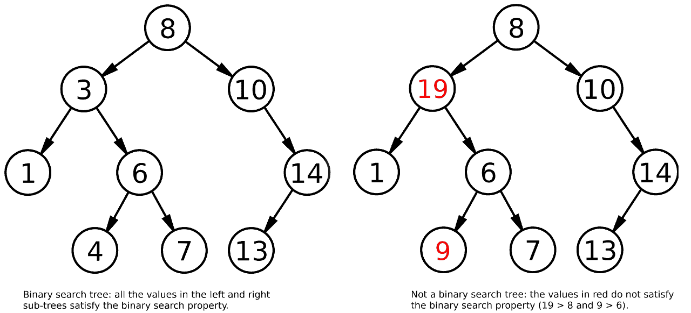

# 二叉搜索树快速指南

[数据结构](README-zh.md) [树](https://www.baeldung.com/cs/category/graph-theory/trees)

[二叉树](https://www.baeldung.com/cs/tag/binary-tree)

1. 概述

    在本教程中，我们将探讨二叉搜索树（BST）数据结构。

    首先，我们将概述 BST 的工作原理和使用时机，然后实现查找、插入和遍历等基本操作。

2. 二叉搜索树

    简单地说，二叉搜索树是一种数据结构，它允许快速插入、移除和查找项目，同时提供了一种按排序顺序遍历项目的有效方法。

    因此，当我们需要高效地访问或修改一个集合，同时保持其元素的顺序时，我们就会使用二叉搜索树。

    与简单的二叉树相比，二叉搜索树的基本特征是它满足二叉搜索属性。该属性规定，对于每个节点，其值必须小于右侧子树中的值，大于左侧子树中的值：

    

    因此，查找、插入和删除操作的复杂度为 $O(log\,n)$。原因在于，从树根到树叶遍历时，我们可以根据输入值大于或小于当前节点中的值，每一步丢弃一半的树。

    例如，如果我们想查看左边的树是否包含值 9，我们已经知道只需查看根节点的右边子树，因为 9 大于根节点的值 8。

    1. 查找

        在二叉查找树上进行查找时，要从根节点开始向下遍历树，并在每一步选择是向右还是向左继续查找。我们重复这个过程，直到找到我们的值或当前节点没有左右子节点。

        这是一个使用递归的实现：

        ```java
        algorithm lookup(tree, key):
            // INPUT
            //   tree = a binary search tree
            //   key = the key to look for
            // OUTPUT
            //   true if the key is found, false otherwise

            if key = tree.key:
                return true

            if key < tree.key:
                if not tree.hasLeftChild():
                    return false

                return lookup(tree.leftChild(), key)

            if key > tree.key:
                if not tree.hasRightChild():
                    return false

                return lookup(tree.rightChild(), key)
        ```

    2. 插入

        在树中插入元素时，我们首先需要找到正确的位置，因为树仍然必须满足二进制搜索属性。

        算法最终与查找操作非常相似，不同之处在于我们创建了一个新节点，而不是在当前节点没有子节点时返回 false：

        ```java
        algorithm insert(tree, key):
            // INPUT
            //   tree = a binary search tree
            //   key = the key to insert
            // OUTPUT
            //   a binary search tree with a new node for the key, 
            //   or the same input tree if the key already exists

            if key < tree.getKey():
                if tree.hasLeftChild():
                    insert(tree.getLeftChild(), key)
                else:
                    tree.setLeftChild(key)

            else if key > tree.getKey():
                if tree.hasRightChild():
                    insert(tree.getRightChild(), key)
                else:
                    tree.setRightChild(key)
        ```

    3. 遍历

        树是一种非线性数据结构，这意味着其元素的排序不是默认定义的。相反，我们可以通过使用不同的遍历算法，以不同的顺序访问树的元素。

        在 BST 中，以升序获取元素很容易实现，因为我们只需执行深度优先的无序遍历即可：

        ```java
        algorithm dfs(tree):
            // INPUT
            //   tree = a binary search tree
            // OUTPUT
            //   the function prints the tree's values in depth-first in-order

            if tree.hasLeftChild():
                dfs(tree.getLeftChild())

            print(tree.value)

            if tree.hasRightChild():
                dfs(tree.getRightChild())
        ```

        相反，如果我们想按降序访问元素，就必须使用反向无序遍历。为此，我们只需从右侧子树开始深度优先搜索。实际上，我们只需在 dfs 算法中反转对 rightChild 和 leftChild 的引用。

        这一操作的时间复杂度为 O(n)，因为树中有 n 个节点，而且每个节点只访问一次。

3. 结论

    在这篇短文中，我们探讨了二叉搜索树的基本工作原理，以及为什么二叉搜索树非常有用。

    我们还了解了如何查找和插入元素，以及如何使用深度优先按顺序遍历或反向按顺序遍历按升序或降序打印元素。
