# 二项式堆

[数据结构](README-zh.md)

[堆](https://www.baeldung.com/cs/tag/heap)

1. 简介

    在本教程中，我们将研究二叉堆。我们用它们来实现[优先队列](https://www.baeldung.com/cs/priority-queue)和[队列](https://www.baeldung.com/cs/types-of-queues)系统的离散事件[仿真](https://www.baeldung.com/cs/simulation-vs-emulation)。

2. 二叉树

    二叉堆基于二叉树。因此，我们首先简要介绍一下二叉树。

    1. 二叉树的定义

        形式上，我们可以递归地定义一棵阶数为 k 的二叉树 $B_k$：

        - 对于 k=0，$B_{0}$ 只包含根节点 R。
        - 当 k>0 时，$B_{k}$ 的根节点 R 的子节点有 $B_{0}, B_{1}, \ldots, B_{k-1}$。 因此，$B_k$ 包含根 R 和 k 个二叉子树。
        二叉树 $B_{k}$ 的根有 k 个子树（即它的阶为 k），其中第 $i^{th}$ 个子树（$i=1,2,\ldots,k$）又是一棵阶为 $k-i$ 的二叉树：

        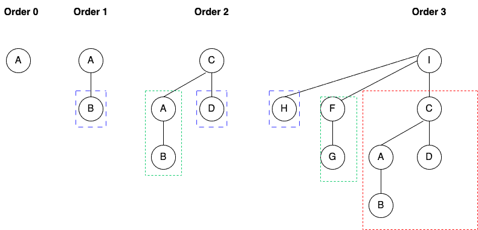

        正如我们所见，这是一个递归有序的数据结构。

        阶数为 k 的二叉树 T 有 $2^k$ 个节点，高度为 k。

3. 二叉堆

    我们将二叉树[堆](https://www.baeldung.com/cs/binary-tree-max-heapify)定义为满足最小堆属性的二叉树集合。

    这意味着每个节点的值都是其子树中值的最小值。

    此外，我们将二叉树的根节点连接到二叉树堆中，得到一个链表 $L_{H}$。

    1. 形式定义

        从形式上讲，二叉树堆 H 是二叉树 $B_k$ 的集合，其中：

        - H 中的每棵二叉树 $B_{k}$ 都具有最小堆属性（堆有序）。
        - 对于每个 $k=0,1,2,\ldots，H$ 最多包含一棵阶为 k 的二叉树。

        第一个属性告诉我们，树的最小元素都在链表中。第二个性质告诉我们，一个有 $\boldsymbol{n}$ 个节点的二叉树堆 $\boldsymbol{H}$ 有 $\lfloor \log n \rfloor + 1$ 棵二叉树。

    2. 实例

        让我们来看一个例子：

        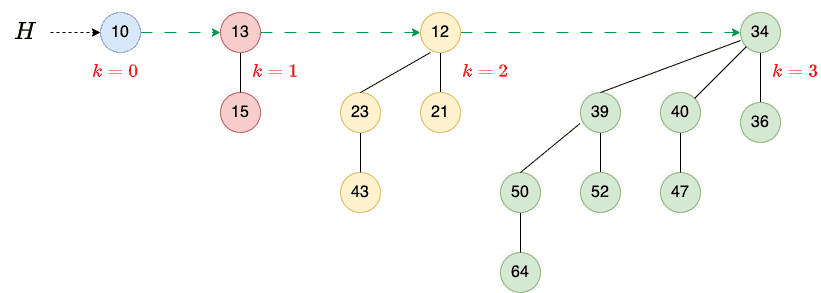

        这里，堆 H（15 个节点）由四棵二叉树组成：$B_{0}$（1 个节点）、$B_{1}$（2 个节点）、$B_{2}$（4 个节点）和 $B_{3}$（8 个节点）。

        每棵二叉树都是堆排序的，树的顺序是唯一的。我们还可以看到一个包含根节点的[链表](https://www.baeldung.com/cs/linked-list-data-structure)，该链表按节点的度数递增顺序排列。

4. 运算

    让我们来学习对二叉堆进行的基本操作：

    - 创建一个新的二叉堆
    - 查找最小键
    - 合并两个堆
    - 插入一个键

    二叉堆还有其他有趣的操作，例如删除节点、提取具有最小键的节点以及更改特定节点的键。不过，本教程不涉及这些操作。

    1. 节点数据结构

        我们可以用以下数据结构来表示二叉堆 H 中的每个节点 x：

        - 一个变量 KEY，用于存储节点的内容（键）
        - 一个指针 PARENT，用于保存与父节点的链接
        - 一个指针 CHILD，用于保存与最左边子节点的链接
        - 一个指针 SIBLING，表示最左边子节点的第一个右同级节点
        - 一个整数 DEGREE，用于存储其度数

        我们可以在不使用 PARENT 和 DEGREE 的情况下实现堆，但它们会使操作的算法更容易理解和制定。

        此外，我们将使用 HEAD 来指向堆 H 中最左边的二叉树。例如

        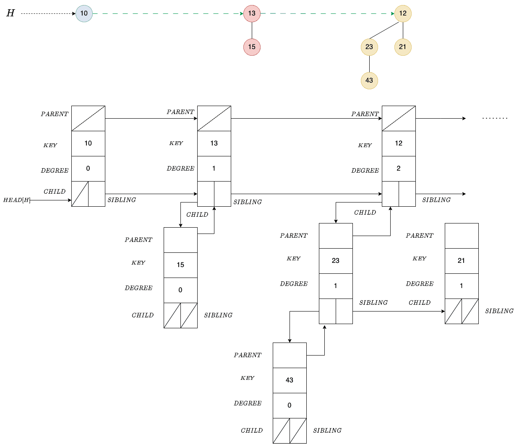

        根节点的父节点指针、子节点指针和叶节点指针都是空的。根的同胞指针指向下一棵树的根。

    2. 创建空堆

        要创建空堆，我们需要为头节点分配内存，并将指针设置为空值（在教科书中通常表示为 $\varnothing$、NIL 或 NULL）。

        就空间和时间而言，这是一个 $O(1)$ 运算。

    3. 查找最小密钥

        我们已经知道，二叉树在二叉堆 H 中的根包含树的最小键。

        由于树根在一个链表中，我们必须遍历链表才能找到最小值。

        这个操作的时间复杂度是 $O(\log n)$，其中 n 是二叉树堆 H 中节点的总数。

5. 合并两个堆

    假设 $H_1$ 和 $H_2$ 是两个二叉堆，分别有 $n_1$ 和 $n_2$ 个节点。

    1. 合并两个相同阶数的二叉树

        我们将使用一种辅助方法来合并两棵相同阶数的二叉树。合并两棵阶为 $\boldsymbol{k}$ 的树的结果是一棵阶为 $\boldsymbol{k+1}$ 的树：

        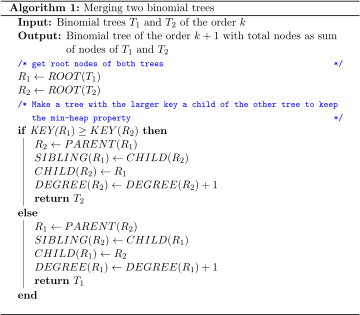

        我们首先比较根节点的键。为了保持最小堆属性，键值较小的根节点应该成为另一棵树根节点的父节点。

        由于我们在节点结构中使用固定数量的指针和变量，因此这一操作的[时间复杂度](https://www.baeldung.com/cs/time-vs-space-complexity)为 O(1)。

    2. 合并两个堆

        我们的想法是合并输入堆 $H_1$ 和 $H_2$ 的排序根列表，使其也排序。我们可以使用针对排序链表的 [MergeSort](https://www.baeldung.com/cs/merge-sort-top-down-vs-bottom-up) 来做到这一点。然后，我们遍历列表，合并具有相同度数的连续树根对，以确保生成的堆最多只有一棵特定顺序的树：

        

        列表 $L_H$ 按非递减顺序排序。对于任何可能的度数，列表中最多包含两个该度数的根。此外，任何两个具有相同度数的根在列表中都是相邻的。

        在每个 while 循环迭代中，我们都会检查相邻两个树根（`current` 和 `next`）的度数，如果相等，则合并它们的树。如果相等，我们会将合并后的树根存储在左邻树根的位置上。

        否则，我们会检查左边邻居的度数是否大于右边邻居。如果度序列包含 $k \rightarrow k \rightarrow k+1 \rightarrow k+1$ 的模式，就会出现这种情况：

        1. 我们合并前两个根，得到 $k+1 \rightarrow k+1 \rightarrow k+1$
        2. 然后，我们得到 $k+2 \rightarrow k+1$
        3. 为了保持顺序，我们切换根，得到 $k+1 \rightarrow k+2$

        如果不切换，在模式后的第一个度数是 k+2 时，我们就不能正确地合并树。因此，举例来说，如果我们不切换三元组中的前两位，我们就会得到 $k+2 \rightarrow k+1 \rightarrow k+2$，从而错过合并 k+1 树。

    3. 示例

        让我们通过一个例子来理解合并操作。我们有两个堆：

        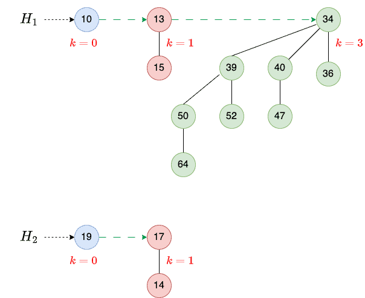

        我们首先查看 $H_1$ 和 $H_2$，找到阶数为 0 的二叉树，然后将它们合并，得到阶数为 1 的二叉树（第 1 步）。然后，我们合并阶数为 1 的树，得到阶数为 2 的树（第 2 步）。现在只有一棵阶数为 3 的树，所以我们把它添加到新的堆中：

        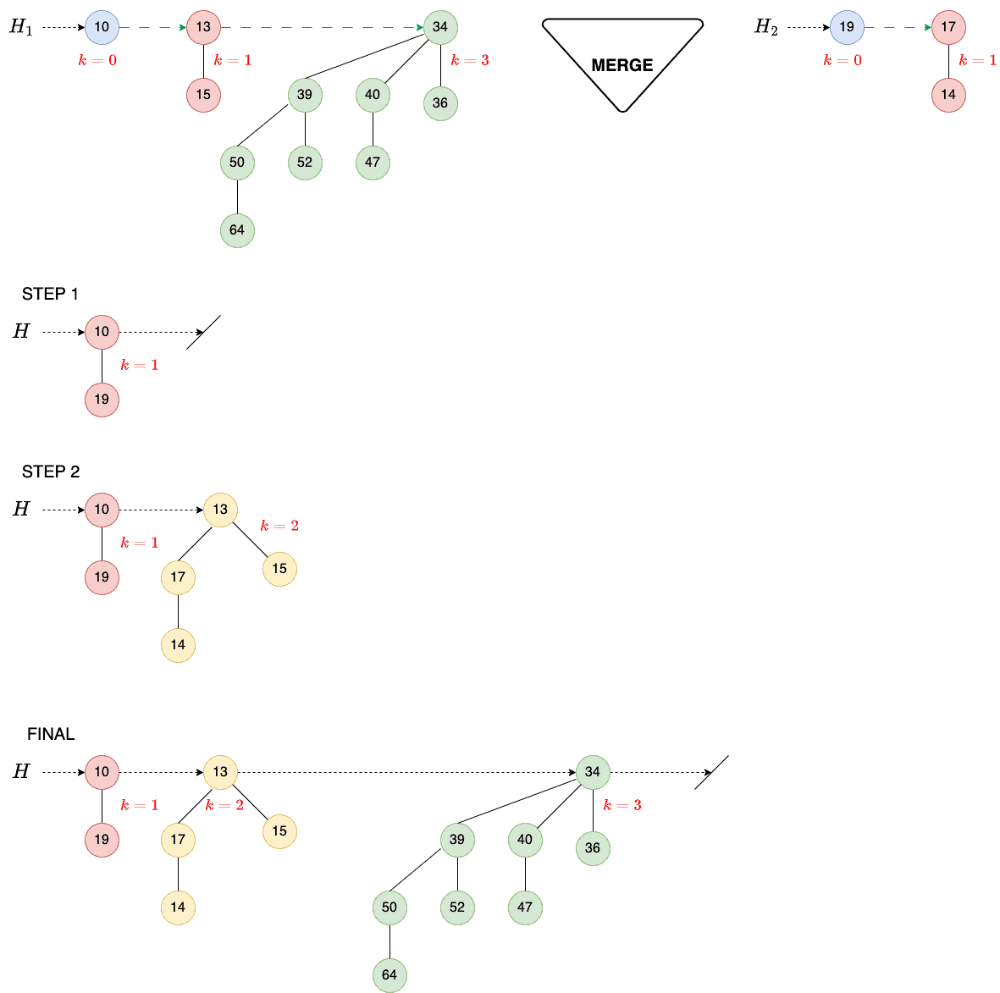

        这样，我们最终的堆 H 就包含了三棵阶数分别为 1、2 和 3 的树。

        5.4. 复杂性

        我们的堆 $H_1$ 和 $H_2$ 有 $n_1$ 和 $n_2$ 个节点。结果堆 $\boldsymbol{H}$ 有 $\boldsymbol{n_1+n_2}$ 个节点。

        现在，$H_1$ 最多包含 $\log_2 n_1 + 1$ 棵树，$H_2$ 最多包含 $\log_2 n_2 + 1$ 棵树，所以 H 最多包含 $\boldsymbol{\log_2 n_1 + \log_2 n_2 + 2}$ 棵树。

        合并排序列表需要 $O(\log n_1 + \log n_2)$ 时间。由于合并、切换和指针移动的次数不可能超过 $\log_2 n_1 + \log_2 n_2 + 1$，所以最坏情况下的时间复杂度是 $\boldsymbol{O(\log n_1 + \log n_2)=O(\log (n_1 + n_2)}$。

        右边的计算结果是对以下各项取对数得到的：

        \[(n_1 + n_2)^2 \geq n_1 \times n_2\]

6. 插入密钥

    要在 H 中插入一个新的密钥 z，我们首先初始化一个新节点（x），并将其密钥设为 z，然后创建一个以 x 为根的单节点二叉堆 $H_1$，并将其与 H 合并：

    

    最后，我们删除临时二叉堆 $H_1$，即释放其内存。

    1. 复杂性

        这个操作的时间和空间复杂度受合并两个堆的时间和空间复杂度的制约。

        对于插入操作，我们有 $n_1=n，n_2=1$。因此，其时间复杂度为 $O(\log n)$，空间复杂度为 O(n)。

    2. 示例

        我们先分配内存并创建节点 x：

        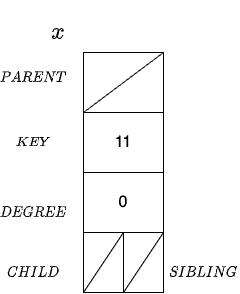

        然后，创建一个空堆 $H_1$，并将其头部设置为节点 x：

        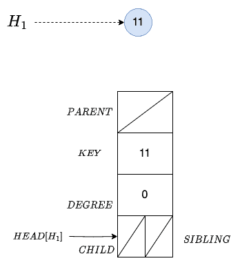

        因此，我们现在有两个堆：H 和 $H_1$：

        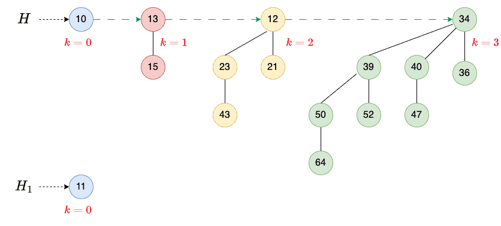

        然后，我们合并它们：

        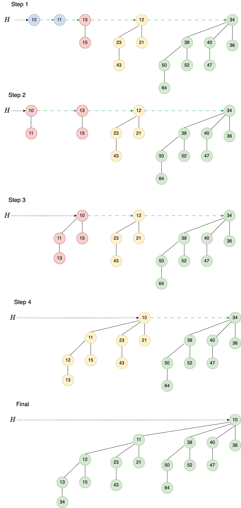

        结果是一个二叉堆，包含一棵阶数为 4 的二叉树。

7. 二叉堆与二叉树堆的对比

    高度为 $h=\log_2 n$ 的二叉堆是一棵二叉树，可以容纳不超过 n 的任意数量的元素：

    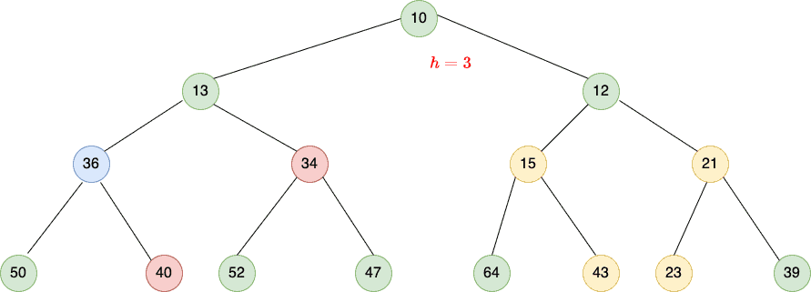

    另一方面，二叉树堆是更小的二叉树的集合，其中阶数为 k 的二叉树的元素数为 $2^k$。因此，我们不需要研究二叉树就能知道它的节点数。

    此外，两个二叉树堆 $H_1$ 有 $n_1$ 个节点，$H_2$ 有 $n_2$ 个节点，合并操作的复杂度为 $\boldsymbol{O(\log (n_1 + n_2)}$ 。这比节点数相同的二进制堆$(\boldsymbol{O(n_1 + n_2)})$要快。

    另一方面，在二进制堆中查找最小键是一个恒定时间操作，因为二进制堆的根总是包含最小键。相比之下，我们需要搜索二叉堆中的根列表才能找到最小值。

8. 结论

    在本文中，我们解释了二叉堆及其属性，并研究了可以在二叉堆上执行的操作。

    我们主要使用二叉堆来实现优先级队列。与二叉堆相比，我们合并二叉堆的效率更高，尽管在二叉堆中查找最小值的速度更快。
