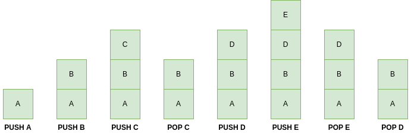
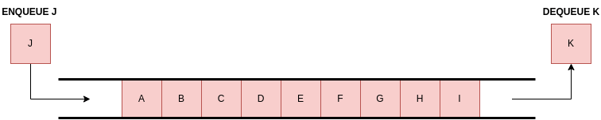

# 数据类型与数据结构的区别

[数据结构](README-zh.md)

1. 简介

    在本教程中，我们将讨论数据类型（最基本、最广泛使用的数据分类）和数据结构（数据类型的集合）。我们将主要讨论它们之间的区别，并介绍每种情况下最常见的实例。

2. 数据类型

    几乎所有编程语言都明确处理数据类型的概念，并包含几乎相同的基本数据类型。数据类型是数据的分类或分组。

    在编程过程中，特定的数据类型分配有助于编译器选择高效、适当的机器表示法。因此，数据类型的声明是开发人员和计算机之间交换的一种说明或指导，其中前者指示编译器绑定与声明的数据类型相对应的内存的特定部分。对数据进行这种分类有多种目的，包括相似性、效率或性能。

    1. 常见数据类型

        最常见的数据类型是整型（int）、浮点型（float）和字符型（char）。前两种分别对应不带分数和带分数的数值数据类型。字符数据类型对应固定长度的字符数据。此外，还存在数字和字符的序列，称为字符串 (str)。布尔 (bool) 是二进制数据类型，可以保存两个可能值中的一个： 0（假）和 1（真）。

3. 数据结构

    数据结构是一组数据类型，是一种特定的数据格式和集合，可以通过特定的操作集来管理、访问、处理、删除和存储数据。数据结构有各种简单或复杂的形式，都是为了特定目的而组织信息。数据结构在现实世界的大多数应用中都发挥着至关重要的作用。

    1. 常见数据结构

        最常见的数据结构是堆栈（[Stacks](https://www.baeldung.com/cs/common-data-structures)）和队列（[Queues](https://www.baeldung.com/cs/common-data-structures)），二者都代表容器对象，分别按照后进先出（[LIFO](https://www.baeldung.com/cs/common-data-structures)）和先进先出（[FIFO](https://www.baeldung.com/cs/common-data-structures)）原则插入和移除数据。

        堆栈和队列之间的不同逻辑如下图所示：

        
        

        此外，还有关联列表（[Linked Lists](https://www.baeldung.com/cs/common-data-structures)）和二叉树（[Binary Trees](https://www.baeldung.com/cs/common-data-structures)），前者由连接的节点组成，其中还包括一个具有某些特定属性的数据字段；后者说明了具有分层树结构的连接节点。

4. 数据类型与数据结构的区别

    数据类型和数据结构的主要区别：

    | 数据类型                         | 数据结构       |
    |------------------------------|------------|
    | 具有特定数据形式的单一变量                | 多种数据类型     |
    | Int、Float、Char、Strings、Bools | 堆栈、队列、树、列表 |
    | 无算法时间复杂度                     | 算法时间复杂度    |
    | 直接赋值                         | 输入数据的操作    |
    | 抽象编程                         | 具体编程       |

5. 总结

    在本文中，我们介绍了数据类型和数据结构，主要包括它们的定义及其基本区别。我们还讨论了数据类型和数据结构的基本示例。
