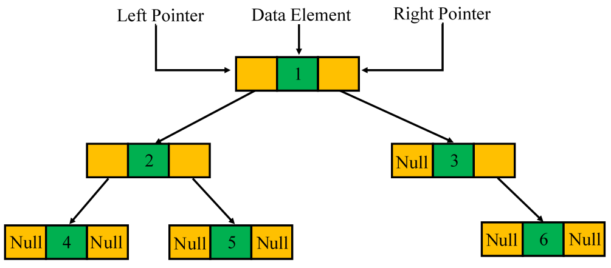
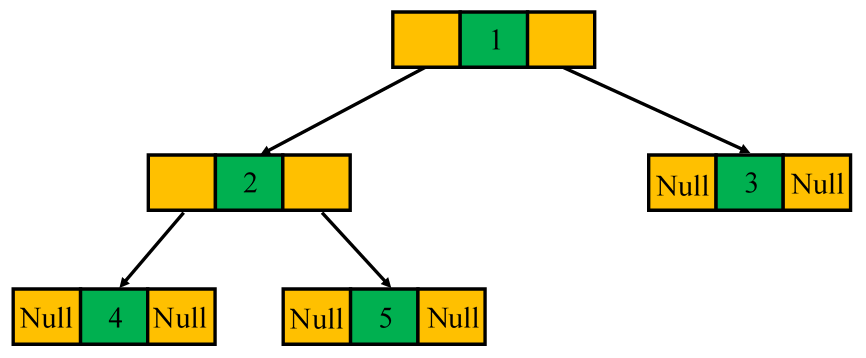
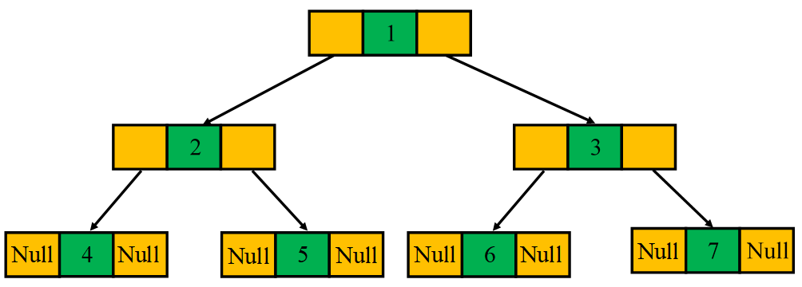
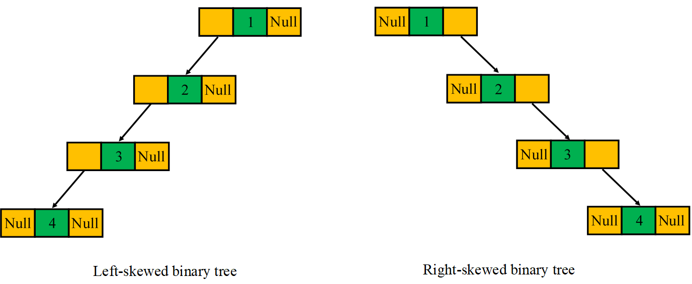
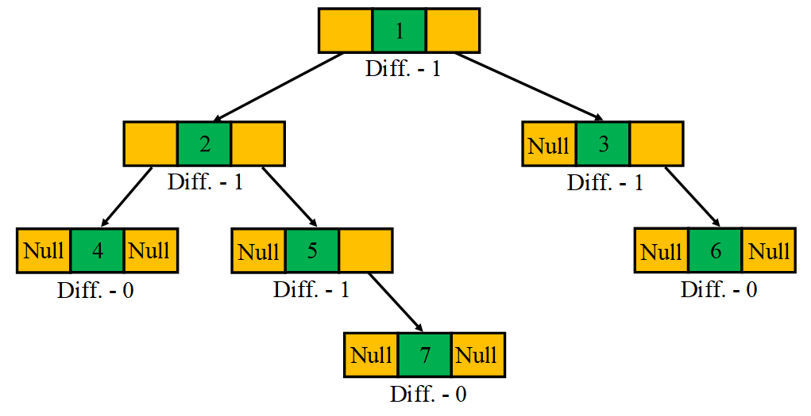

# 二叉树数据结构简介

[数据结构](https://www.baeldung.com/cs/category/data-structures) [树](https://www.baeldung.com/cs/category/graph-theory/trees)

[二叉树](https://www.baeldung.com/cs/tag/binary-tree)

1. 简介

    在本文中，我们将学习二叉树数据结构及其属性。接下来，我们将通过图解了解六种二叉树类型。

    最后，我们将探讨二叉树的不同应用。

2. 二叉树的定义

    二叉树是一种分层数据结构，其中每个节点最多有两个子节点。子节点被称为左子节点和右子节点。

    首先，我们来描述二叉树的链表表示法，其中每个节点有三个字段：

    - 用于存储左子节点地址的指针
    - 数据元素
    - 存储右子节点地址的指针

    让我们来看一个二叉树的例子：

    
3. 属性

    现在，让我们来关注二叉树的一些基本属性：

    - 如果根节点的层级为零，二叉树在层级 l 上最多可以有 $2^{l}$ 个节点。
    - 当二叉树的每个节点都有一个或两个子节点时，叶节点（没有子节点）的数量比有两个子节点的数量多一个。
    - 如果二叉树的高度为 h，且叶子节点的高度为 1，那么二叉树中最多存在 $(2^{h}-1)$ 个节点。
    - 如果二叉树中有 L 个叶节点，那么它至少有 $\lceil \log_2 L \rceil$，最多有 L+1 层。
    - 一棵有 n 个节点的二叉树有 $\log_{2}(n+1)$ 个最小层数或最小高度。
    - 有 n 个节点的二叉树的最小高度和最大高度分别是 $\lceil \log_{2}n \rceil$ 和 n。
    - 有 n 个节点的二叉树有 (n+1) 个空引用。

4. 二叉树的类型

    在本节中，我们将讨论六种二叉树类型，并通过图解对每种类型进行描述。

    1. 完全二叉树

        当二叉树的每个内部节点都有 0 个或 2 个子节点时，我们就称它为全二叉树：

        
    2. 完全二叉树

        完全二叉树是一种特殊的二叉树，其中所有叶节点都在同一层次，每个内部节点都有两个子节点：

        
    3. 完全二叉树

        当一棵二叉树的所有层级都被完全填满时，这棵树就被称为完全二叉树。唯一的例外可能是最底层，其中的节点必须尽可能向左倾斜：

        
    4. 退化树或病态树

        退化树或病态树(Degenerate or Pathological Tree)是二叉树的一种，其中每个内部节点都只有一个子节点，即左子节点或右子节点：

        
    5. 倾斜二叉树

        如果一棵二叉树的所有内部节点都只有一个子节点，且该树以左子节点或右子节点为主，那么这棵树就被称为倾斜二叉(Skewed Binary)树。具体来说，存在两种倾斜二叉树：左倾斜二叉树和右倾斜二叉树：

        
    6. 平衡二叉树

        平衡二叉树也是一种特殊的二叉树，其中每个节点的左右子树的高度差最多为 1：

        
5. 应用

    二叉树的概念还衍生出许多其他数据结构，如[二叉搜索树](https://www.baeldung.com/cs/binary-search-trees)、语法树、堆、哈希树、[红黑树](https://www.baeldung.com/cs/red-black-trees)、[二叉三叉树](https://www.baeldung.com/trie-java)、[AVL树](https://www.baeldung.com/java-avl-trees)、GGM 树、T 树和 Treap。

    二叉树在现实生活中的其他应用包括二叉空间分区、[堆排序](https://www.baeldung.com/java-heap-sort)、哈夫曼编码、虚拟内存管理和索引。

6. 结论

    在本文中，我们学习了二叉树数据结构及其基本属性。

    然后，我们结合示例讨论了六种二叉树类型。最后，我们列出了二叉树的各种应用。

[Introduction to the Binary Tree Data Structure](https://www.baeldung.com/cs/binary-tree-intro)
