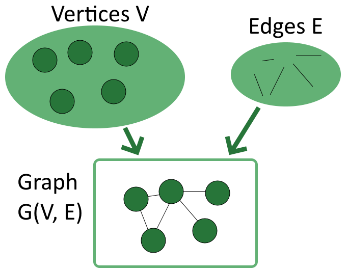
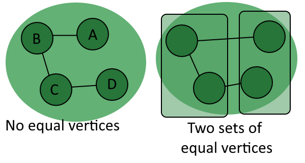
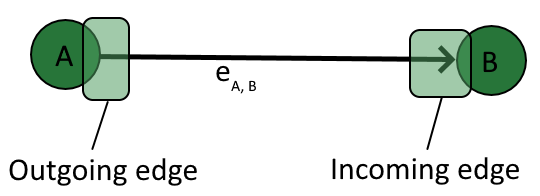
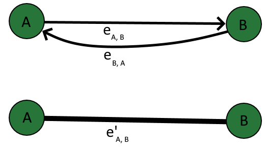
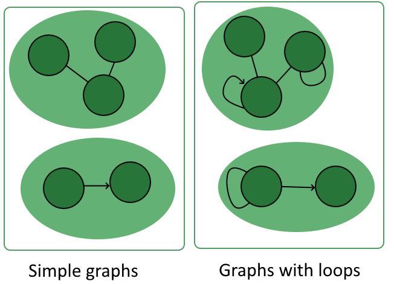
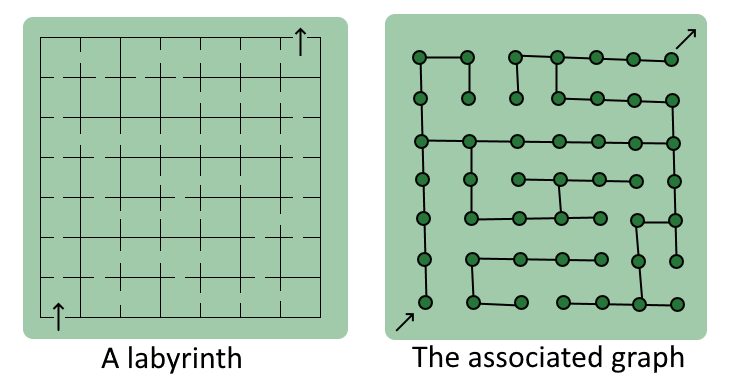
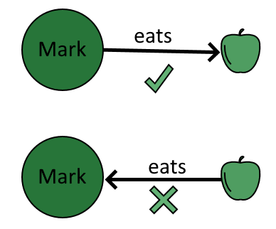
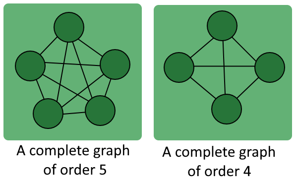
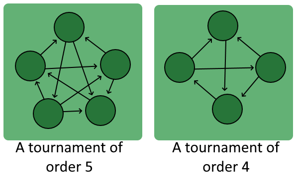
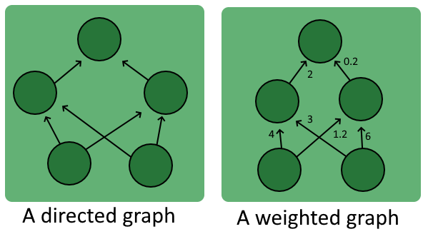

# [图论入门](https://www.baeldung.com/cs/graph-theory-intro)

[图论](https://www.baeldung.com/cs/category/graph-theory)

1. 概述

    在本教程中，我们将讨论计算机科学中最重要的[数据结构](https://www.baeldung.com/cs/common-data-structures)--[图](https://www.baeldung.com/java-graphs)。

    首先，我们将学习图论的基础知识，以熟悉其概念基础。然后，我们将学习机器学习应用中的图类型。

    在本教程结束时，我们将知道什么是图，存在哪些类型的图。我们还将知道图的基本组成部分有哪些特征。

2. 图论基础

    1. 图的定义

        图是由一组顶点和一组边组成的[结构](/core-concepts/data-structures/graph-theory/graphs-zh.md)。因此，为了得到一个图，我们需要定义两个集合的元素：顶点和边(vertices and edges)。

        顶点是图必须具备的基本单位，只有这样，图才能存在。习惯上，图必须至少有一个顶点，但这并没有真正的理论依据。顶点是数学上的抽象概念，对应于通过某种标准相互关联的对象。

        

        而边则是可选的，因为没有边的图仍然可以定义。边（如果存在）是图中任意两个顶点之间的链接或连接，包括顶点与自身的连接。边的概念是，如果存在边，就表明两个对象之间存在某种关系，即我们想象中的边的连接关系。

        我们通常用 $V = \{v_1, v_2, ... , v_n\}$ 表示顶点集合，用 $E = \{e_1, e_2, ... e_m\}$ 表示边的集合。我们可以把图 G 定义为模拟这两个集合之间关系的结构 $G(V,E)$。

        注意括号中两个集合的顺序很重要，因为按照惯例，我们总是先表示顶点，然后再表示边。因此，图 $H(X，Y)$ 是一种模拟顶点集 X 和边集 Y 之间关系的结构，而不是相反。

        在我们继续讨论之前，请简要说明一下术语：图是数学和网络理论的共同研究课题。两门学科使用的术语略有不同，但所指的概念总是相同的。在本文中，我们将使用数学术语，但如果有必要，我们可以使用[转换表](https://www.baeldung.com/cs/graphs-directed-vs-undirected-graph#1-graphs-or-networks)在两者之间进行转换。

    2. 顶点的一般属性

        下面我们将详细讨论顶点和边的特性。我们先从顶点开始。

        如前所述，图需要顶点，但不一定需要边。事实上，完全可以有完全由顶点组成的图 $G(V, \phi)$。与其他图没有连接的顶点，如空图的顶点，称为孤立顶点。

        我们也说孤立顶点的度 $\delta(v)$ 等于零。在这里，"度"表示一个顶点的[入射边数](https://www.baeldung.com/cs/graphs-incident-edge)。

        我们说不孤立的顶点具有正度，通常表示为 $\delta(v)>0$。 顶点的度可以是任何自然数。

        叶子这个名称表示一种特殊的顶点，它的度（$\delta(v) = 1$）。该术语与[层次树](https://www.baeldung.com/java-balanced-binary-tree#definitions)相同，同样涉及与一个且仅与一个其他顶点相连的顶点。

    3. 顶点的标签

        顶点也可以有与之相关的值。这些值可以是任何格式，没有特定限制。有关联值的顶点称为有标签顶点，无关联值的顶点称为无标签顶点。

        一般来说，我们可以完全根据两个未标记顶点的配对顶点来区分它们。而对有标签的顶点进行比较时，我们需要同时研究成对的顶点和分配给它们的值：

        

        关于顶点的最后一点说明涉及图中包含的顶点数量 $|V|$。这个数字具有特殊的重要性，我们称之为图的顺序。

    4. 边的一般属性

        现在我们可以研究边的特性。与顶点相比，边不可能孤立存在。这是因为图本身需要顶点才能存在，而边的存在与图有关。

        边可以连接图中的任意两个顶点。一条边所连接的两个顶点称为这条边的端点。根据定义，如果一条边存在，那么它就有两个端点。

        也存在边连接两个以上顶点的图，这些图被称为[超图](https://en.wikipedia.org/wiki/Hypergraph)。本教程并不重点讨论超图，但我们必须提及超图的存在，因为超图在知识图谱的[历史](https://www.sciencedirect.com/science/article/abs/pii/0004370277900145)和[当代发展](https://www.researchgate.net/profile/Bahare_Fatemi/publication/333600847_Knowledge_Hypergraphs_Extending_Knowledge_Graphs_Beyond_Binary_Relations/links/5cfa65a04585157d1599c8ff/Knowledge-Hypergraphs-Extending-Knowledge-Graphs-Beyond-Binary-Relations.pdf)中具有重要意义。

    5. 端点、方向、循环(Endpoints, Directions, Loops)

        我们可以根据一条边的两个端点是指向顶点还是远离顶点来进一步区分它们。我们把指向顶点的边称为入边，而把来自顶点的边称为出边：

        

        在上图中，连接一对（A,B）的边 $e_{A,B}$ 没有连接 B 和 A 的对应边 $e_{B,A}$。在这种情况下，我们说图 $G(\{A, B\},\{e_{A,B}\})$是一个[有向图](https://www.baeldung.com/cs/graphs-directed-vs-undirected-graph#1-definition-of-directed-graphs)，我们称边 $e_{A, B}$ 为弧(arc)。

        边也可以是无向的、连接两个顶点的，不管哪个顶点是该边的原点。这种类型的边称为线，由它连接的任何两个顶点（A, B）都可以双向穿越。我们可以这样来理解：A 和 B 之间的线 $e'$ 相当于一条弧 $e_{A, B}$ 加上一条弧 $e_{B,A}$：

        

        这种思维方式的优势在于它可以很好地转化为[图形的邻接矩阵](https://www.baeldung.com/cs/graphs#1-adjacency-matrix)。

        此外，一条边可以同时是同一顶点的入边和出边。在这种情况下，我们称之为循环边。

        循环是一种特殊的边，并不存在于所有的图中。我们称没有循环的图形为简单图形，以区别于其他图形：

        

        最后，我们还可以提到，图中边的数量 $|E|$ 是该图的一个特殊参数。我们称这个数为图的大小，它有一些特殊性质，我们稍后会看到。

    6. 图中的路径

        具有非空边集的图具有路径，路径由连接两个顶点的边序列组成。我们可以将与有向边序列相关的路径毫不奇怪地称为有向路径；而与无向边相关的路径则没有专门的名称。

        观察路径和图之间关系的一种方法是，想象每个图都是一个[迷宫](https://www.baeldung.com/java-solve-maze)，其每个顶点都是一个交点：

        

        在这个模型中，路径的起始顶点对应迷宫的入口，目标顶点对应出口。如果我们使用这个概念框架，就可以想象在迷宫中穿行并留下痕迹的情景，我们称之为路径。

        有一种特殊的路径，它能穿越图中的所有顶点，这就是[哈密顿路径](https://www.baeldung.com/jgrapht#5-hamiltonian-circuit)。哈密顿路径并不一定存在于所有图中。我们称包含哈密尔顿路径的图为可寻迹图，因为它有可能留下一条覆盖所有顶点的完整轨迹。

        最后，我们还可以提到，起始顶点和终止顶点重合的路径比较特殊，被称为[循环](https://www.baeldung.com/cs/cycles-undirected-graph#what-is-a-cycle)。[检测图中的循环](https://www.baeldung.com/java-graph-has-a-cycle)非常重要，因为寻找路径的算法最终可能会无限循环。

        最后要说明的是，为什么路径在计算机科学中尤为重要。这是因为有一些高效的算法方法，例如 [Dijkstra](https://www.baeldung.com/java-dijkstra) 算法和 [A*](https://www.baeldung.com/java-a-star-pathfinding)，可以让我们轻松找到最短路径。这反过来又使计算机能够解决流程优化、物流和搜索查询处理等问题。

3. 图的类型

    1. 空图

        我们之前提到过，只有当图形的顶点集不是空时，图形才会存在。然而，它们的边集也可能是空的。如果是这样，我们就说这个图是空的。

        空图$G(V, \phi)$ 的大小总是 $|E| = 0$。

    2. 有向图

        如上所述，有向图是指在两个顶点 A 和 B 之间至少有一条边 $e_{A, B}$，而这两条边在相反方向上没有连接相同顶点的对应边 $e_{B,A}$。

        有向图的特点是能很好地模拟现实世界中的关系，我们不能自由地互换主体和客体。一般来说，如果我们不能确定一个图应该是有向图还是无向图，那么这个图就是有向图：

        

        我们只能沿着有向图已有的有向边的方向遍历有向图。

        关于有向图，我们可以简单提一下，有一些通用的方法可以确定一个有向图是否包含[最大数量的可能边](https://www.baeldung.com/cs/graphs-max-number-of-edges)。这一点很重要，因为它与[有向图的熵](https://www.baeldung.com/cs/graphs-directed-vs-undirected-graph#3-graphs-and-entropy)有关。

    3. 无向图

        无向图是指顶点 (A, B) 之间存在任何边 $e_{A, B}$ 都意味着存在相应的边 $e_{B,A}$。

        无向图允许在由边连接的任意两个顶点之间进行遍历。有向图则不一定如此。

    4. 连接图和断开图

        我们还可以根据路径的特征来区分图形。例如，我们可以根据是否存在连接所有顶点对的路径，或者是否存在顶点对之间没有任何路径来进行区分。如果一个图的任意两个顶点之间至少有一条路径，我们就称该图为连通图。

        同样，如果至少有两个顶点相互分离，我们就称该图为断开图。

    5. 哈密顿连接图

        哈密顿连接图是指任意两个顶点之间都有哈密顿路径的图。请注意，连通图并不一定是哈密顿连通图。

        哈密顿连接图总是可寻迹图，但反之则不一定。

    6. 完整图

        如果一个图包含所有可能的顶点对之间的边，我们就说这个图是完整的。对于阶数为 $|V|$ 的完整图，其大小 $|E|$ 总是 $|E| = \frac{|V| \cdot (|V| - 1)}{2}$：

        

        所有具有相同阶数且无标记顶点的完整图都是等价的。

    7. 锦标赛

        锦标赛是一种只包含有向边的完整图：

        

        这一名称源于它在体育赛事的比赛构成中的频繁应用。

    8. 加权图

        我们将看到的最后一种图是加权图。加权图是一种图，其边有一个权重（即一个数值）：

        

        机器学习中常用的典型加权图是人工神经网络。我们可以将神经网络概念化为[有向加权图](https://www.baeldung.com/cs/ml-nonlinear-activation-functions#feed-forward-neural-networks)，其中每个顶点都有一个额外的[激活函数](/ai/ml/ml-nonlinear-activation-functions-zh.md)。

4. 结论

    在本教程中，我们学习了图论的概念基础。我们还熟悉了图、顶点、边和路径的定义。

    我们还学习了可能遇到的图的类型，以及它们在顶点、边和路径方面的可预测特征。
