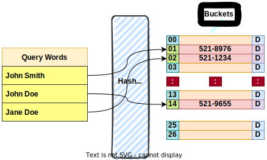
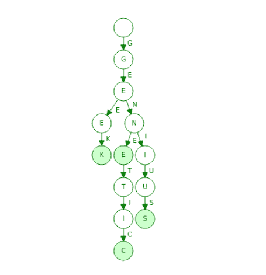
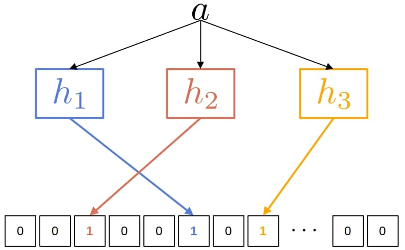

# [字典的最佳数据结构](https://www.baeldung.com/cs/language-dictionary-data-structure)

[数据结构](README-zh.md)

[自然语言处理](https://www.baeldung.com/cs/tag/nlp)

1. 简介

    在本教程中，我们将概述一些实现字典的方法。

2. 什么是字典？

    字典是与词义相关联的单词集合，可能还包括对其他词条的参考。传统的纸质字典不适合计算处理，因此数字字典应运而生，如今已广泛应用于各种自然语言处理（[NLP](https://www.baeldung.com/cs/networks-in-nlp)）应用程序中。

    我们使用的数据结构应支持我们打算如何使用词典。大多数情况下，我们查询字典时不会添加新词或删除新词。不过，我们也会考虑允许更改的情况。

    通常情况下，查询会检查字典中是否存在查询词。如果存在，查询应返回其定义。否则，查询应告知我们该词不在词典中。此外，我们还可能对范围查询或前缀查询感兴趣。我们将在本文中讨论所有这些情况。

3. 实现字典

    实现字典的方法有很多，其复杂性和性能也各不相同。

    1. 排序数组

        在这种方法中，我们将字典维护为一个由字符串组成的排序[数组](https://www.baeldung.com/java-arrays-guide)。每个[字符串](https://www.baeldung.com/java-string)都是单词及其定义的连接，并以特殊字符分隔。这样，通过对字符串进行排序，我们也就对单词进行了排序。这种方法的优点是易于理解和实现。如果我们使用[二进制搜索](https://www.baeldung.com/java-binary-search)来查找查询词，在最坏的情况下，查询将花费 $O(\log N)$时间，其中 N 是字典中的单词数。

        一个潜在的缺点是，如果我们要存储大量的单词，我们可能会耗尽主内存，因为数组会连续占用空间。由于我们需要保持数组排序，因此这种方法最适用于静态字典。在这种情况下，我们只需对数组排序一次，然后就可以进行搜索了。

        此外，虽然单次查询速度很快，但查询一个字典中的 M 个单词的[时间复杂度](https://www.baeldung.com/cs/time-vs-space-complexity)为 $O(M \log N)$。因此，从长远来看，这可能不是最好的方法。

    2. 哈希表

        [哈希表](https://www.baeldung.com/cs/hash-tables)能提供更快的查询。只要我们能把它们放进主内存，它们的平均查询时间就是 O(1)。如果我们有一个静态字典，并且有兴趣查询一个单词是否存在，那么[完美散列表](https://www.baeldung.com/cs/hashing)将是最佳选择。即使在最糟糕的情况下，它的查询时间也是不变的。

        下面是一个类似电话簿的小型字典及其元数据信息（用 "D" 表示），它使用哈希表来实现：

        

        对于动态字典，我们希望能够添加新词，因此可能需要调整表的大小。我们可以这样做，每次快满的时候就把它放大两倍。动态词典的一个缺点是可能出现[哈希](https://www.baeldung.com/java-password-hashing)碰撞。如果字数过多，其中一些字可能会被散列到同一个键上。因此，我们需要引入一种机制来避免碰撞。在最坏的情况下，这可能会使查询的复杂度变成线性（O(N)）。

        最后，散列表并不适合用于 "查找具有相同前缀或后缀的所有单词" 这样的查询。静态词典和动态词典都是如此。

    3. 三元组

        当单词可以分解成词目（如字符）并与其他单词共享前缀时，我们通常会使用 [trie](https://www.baeldung.com/cs/tries-prefix-trees) 这种数据结构。其缺点是在[标准实现](https://www.baeldung.com/trie-java)中，try 的内存效率有点低，但我们可以使用压缩变体，如 [Radix](https://en.wikipedia.org/wiki/Patricia_tree) 树、Succinct 树、有向无环字图 (DAWG) 等。

        与用于存储固定词集的哈希表相比，tries 占用的存储空间更少，但执行单词查询的速度更慢。另一个优点是它们不需要任何哈希函数。此外，它们自然也支持前缀查询。

        下面是我们用 trie 实现静态字典的一个例子：

        

        如图所示，该 trie 在字典中存储了 "geek"、"gene"、"genius" 和 "genetic" 四个单词。绿色阴影节点表示单词的末尾，可能包含指向相应定义的指针。

        将单词插入到我们的三角形中，就可以轻松创建静态词典。编译词典的复杂度为 $O(W*L)$，其中 W 是单词的数量，L 是单词的平均长度。字典建立后，就可以对前缀、后缀（通过[后缀树](https://www.baeldung.com/cs/generalized-suffix-trees)）或完整单词进行查询。查询包含 M 个字符的单词的复杂度为 O(M)。相比之下，哈希表最坏情况下的查询复杂度为 O(N)，其中 N 是表中的单词总数。

        如果我们需要动态字典，我们可以很容易地扩展我们的三元组。Tries 支持插入和删除操作，时间复杂度为 O(L)。完成更新后，结构就可以再次查询了。

    4. 布鲁姆过滤器

        布鲁姆过滤器（Bloom Filter，[BF](https://www.baeldung.com/cs/bloom-filter)）是一种空间效率高的概率数据结构。我们用它来有效检查字典中是否存在某个单词。假否定是不可能的：如果过滤器找不到一个词，它就不存在。我们为提高效率而付出的代价就是可能出现假阳性。简单地说，查询要么返回 "可能在词典中"，要么返回 "肯定不在词典中"。其他著名的 BF 变体包括阻塞式 Bloom 过滤器、Cuckoo 过滤器等。

        如果将 Bloom 过滤器用作字典，它不会存储字词。相反，它会跟踪它们的成员关系。因此，bloom 过滤器可以充当查找缓存。这与 hashmap 的理念相同，但更节省空间。

        下面是使用 3 个散列函数的 Bloom Filter 的样子：

        

        Bloom Filter 通常使用一个包含 m 个比特和 k 个独立[散列函数](https://softwareengineering.stackexchange.com/questions/49550/which-hashing-algorithm-is-best-for-uniqueness-and-speed)的数组。在上图中，我们正试图将单词 a 添加到我们的过滤器中。h1(a) $\bmod m$、$h2(a) \bmod m$ 和 $h3(a) \bmod m$ 位置上的比特都被设为 1。

        在查询 a 时，$h1(a) \bmod m$、$h2(a) \bmod m$ 和 $h3(a) \bmod m$ 所标记的索引处不应该有值为 0 的位。如果所有位都为 1，那么查询词可能在我们的字典中，也可能不在。

        BF 可以用作静态或动态词典，因为它们支持轻松插入，但不直接支持删除。我们可以在 BF 中存储的单词数量没有限制，但插入大量单词会导致 FP 率达到 100%，从而使过滤器失去作用。因此，我们最好能预先知道要在 BF 中存储的估计字数。

        当与哈希图搭配使用时，如果存在查询词的定义，BFs 就能轻松检索到。这看似与直觉相反，但 BF 可以作为底层哈希映射前的高效查找缓存。由于 BF 只需少量内存开销就能解析输入的查询词，因此我们可以过滤出[散列图](https://www.baeldung.com/java-hashmap)中不存在的词。因此，我们只有在确信定义可能存在时才会查询哈希映射。

4. 结论

    在本文中，我们讨论了如何实现自然语言的数字字典。

    至于采用哪种方式，则与任务密切相关。对于一组给定的单词，如果我们关心的是 "这个单词在其中吗？"，那么标准哈希表就是一种非常合理的方法。如果我们能接受关键字查找中的一些假阳性错误，我们可以使用 Bloom 过滤器。另一方面，尝试可以检查前缀或后缀，而不仅仅是一个完整的单词。
