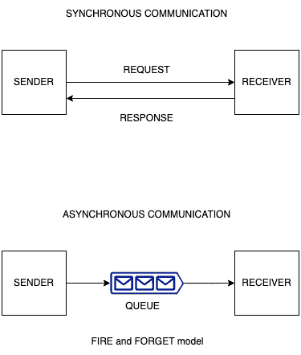
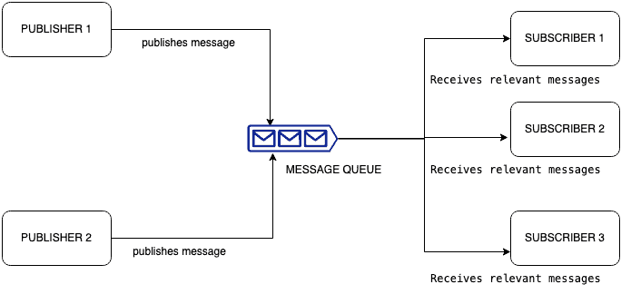

# [消息队列简介](https://www.baeldung.com/cs/message-queues)

[数据结构](README-zh.md) [网络](https://www.baeldung.com/cs/category/networking)

1. 简介

    在现实世界的应用程序中，对请求的响应并不总是即时的。我们通常认为应用程序会即时处理所有请求，或者在 REST API 中，我们通常认为会丢弃所有不成功的请求，但实际情况略有不同。我们通常可以稍后处理这些不成功的请求，也可以异步发送响应。

    在本教程中，我们将了解如何利用消息队列来实现这一点。

2. 异步通信和同步通信

    异步通信是一种不要求发送方和接收方同时处于活动状态的通信模式。它通常被称为 "点火即忘" 的通信模式。电子邮件就是异步通信的一个很好的例子。一个人可以选择即时阅读所有电子邮件，也可以将它们累积起来，稍后一次性阅读。同样，发件人也可以在发送电子邮件后继续处理其他任务，而不必期待立即得到回复。

    电话可以作为同步通信的一个例子，在电话中，发送方和接收方进行实时互动，要求双方同时在场并积极参与。

    下面的图表说明了异步通信和同步通信的区别：

    

3. 消息队列的定义

    我们首先要了解消息的含义。在现实世界的软件应用程序中，消息代表应用程序需要处理的信息。这些信息可以由另一个系统处理，也可以是实际的有效载荷，如触发另一个子系统处理的文件或元数据。队列有助于按顺序处理这些信息。消息队列就像一个缓冲器，按特定顺序接收消息，并按相同顺序将其转发给相关子系统或应用程序。

    信息队列将发送者和接收者分离开来，允许他们按照自己的节奏独立运行。消费者在准备好处理信息时从队列中检索信息。它们可以按照自己的节奏独立检索和处理信息，从而实现异步处理。

4. 消息队列的使用示例

    让我们通过一个例子来了解消息队列的使用场景。假设我们有一个需要输入数据的网络表单。我们可能需要将这些数据插入数据库，或将其输入另一个系统以实现营销自动化。

    这些任务如果同步进行，可能会妨碍用户体验，因为它们可能会增加一些延迟或进程缓慢。因此，我们可以将输入视为消息，并利用队列来根据我们的要求处理这些消息。同时，用户可以被重定向到另一个屏幕，显示预定义的确认信息。

5. 消息队列中的常用术语

    让我们来看看使用消息队列时的一些常用术语：

    1. 生产者

        生产者（也称发送者）生成并向消息队列发送消息。它创建并发布包含要由消费者处理的数据、请求或任务的消息。生产者的作用是将消息排入消息队列，而无需等待立即响应。生产者可以是软件应用程序、服务或任何生成和发送消息的组件。

    2. 消费者

        消费者也称为接收者，负责从消息队列中检索和处理消息。它根据信息内容执行必要的操作或行动。这可能涉及数据处理、执行任务、触发工作流或生成响应。消费者可以是独立的软件应用程序、服务或组件，旨在处理特定消息或执行特定操作。

    3. 主题

        在消息队列中，主题指的是一种可根据特定主题或主题对消息进行分类或分组的机制。用户可以根据自己对特定主题的兴趣，有选择地订阅和接收信息。主题允许生产者对信息进行分类和定位，同时允许消费者根据自己的特定兴趣选择性地消费信息，从而提高了信息队列的灵活性和效率。

    4. 消息代理

        在消息队列中，消息代理是一个中间组件，可促进生产者和消费者之间的消息交换。它充当消息队列系统中的中心枢纽或中介，负责接收来自生产者的消息，存储这些消息，并根据指定的路由和订阅规则将消息传递给相应的消费者。

6. 消息队列中的发布者-订阅者模式

    [发布者-订阅者](https://www.baeldung.com/pub-sub-vs-message-queues)模式（又称发布-订阅模式）是一种消息传递模式，可促进多个发布者和多个订阅者之间的通信。在这种模式中，发布者负责发布消息，而订阅者则根据自己的兴趣或订阅接收和消费消息。

    下面是一个发布者-订阅者模式的简化图示：

    

    在该图中，发布者 1 和发布者 2 生成信息并将其发布到信息队列。消息队列充当中间人，保留消息，直到订阅者使用它们。订阅者（订阅者 1、订阅者 2 和订阅者 3）订阅信息队列中感兴趣的特定主题或频道。然后，消息队列会根据每个订阅者的订阅情况向他们发送相关消息，确保他们只收到与其兴趣相符的消息。

    发布者-订阅者模式允许发布者和订阅者之间解耦。发布者不需要直接了解订阅者，而订阅者可以接收来自多个发布者的信息。它提供了一种灵活、可扩展的方法，以松散耦合的方式向相关方发布信息。

7. 使用消息队列的好处

    消息队列有助于解耦应用程序的各个部分。我们可以让一个部分接收来自用户的数据，让另一个部分处理这些数据。因此，我们可以从庞大的单体应用程序转向更小的、模块化的开发方法。通过将其分解成更小的模块，我们可以单独测试每个模块，而不必担心系统中的所有其他部分。

    解耦的另一个好处是，不同的团队可以并行处理系统的不同部分，大大缩短开发时间。我们还可以在不影响用户体验的情况下，允许某些处理在高流量时异步进行，从而提高可扩展性。

8. 结论

    总之，消息队列是在各种应用程序中进行高效、可靠通信的重要工具。在本教程中，我们了解了消息队列、消息队列中的常用术语、发布者-订阅者模型以及使用消息队列的一些好处。
